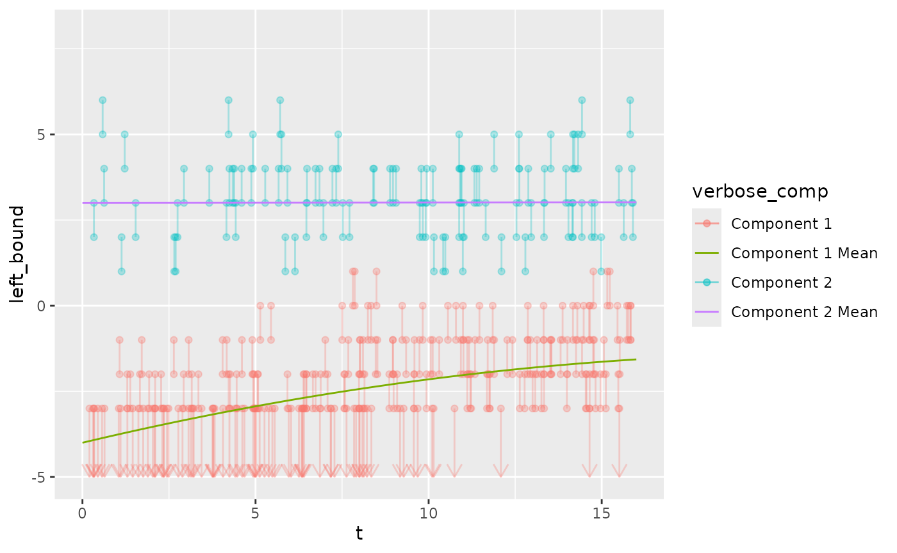
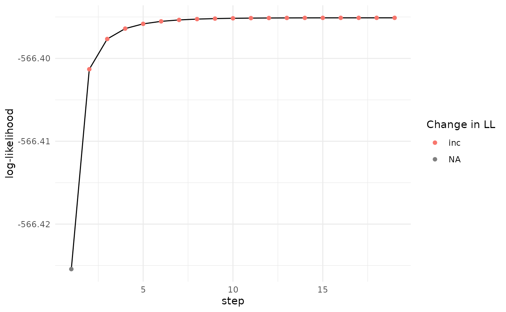
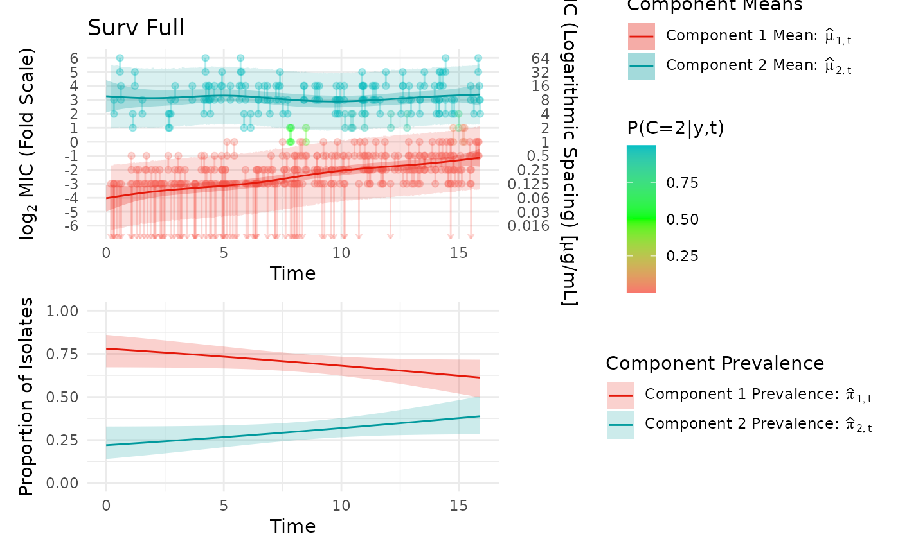
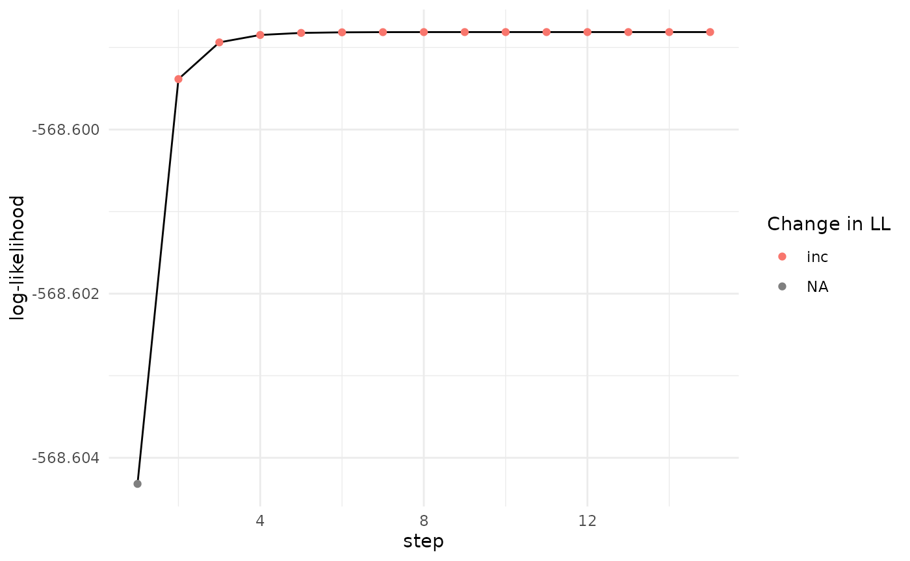
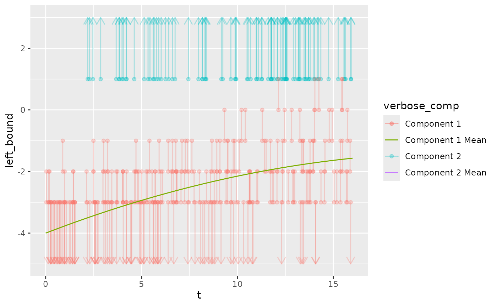
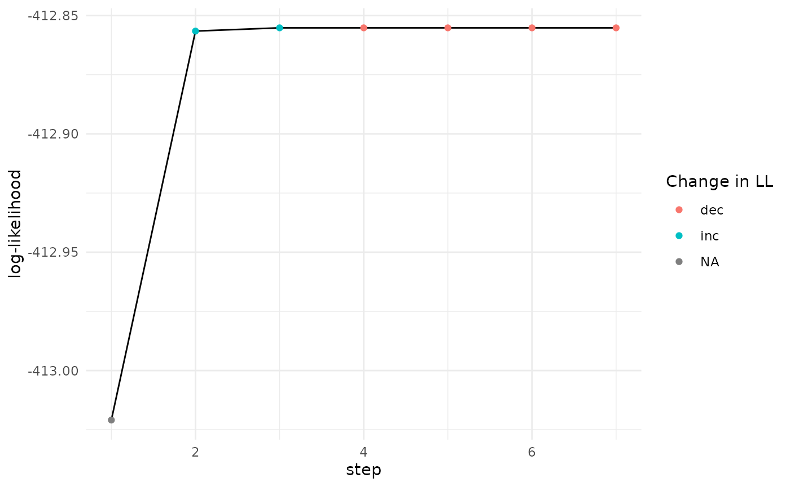
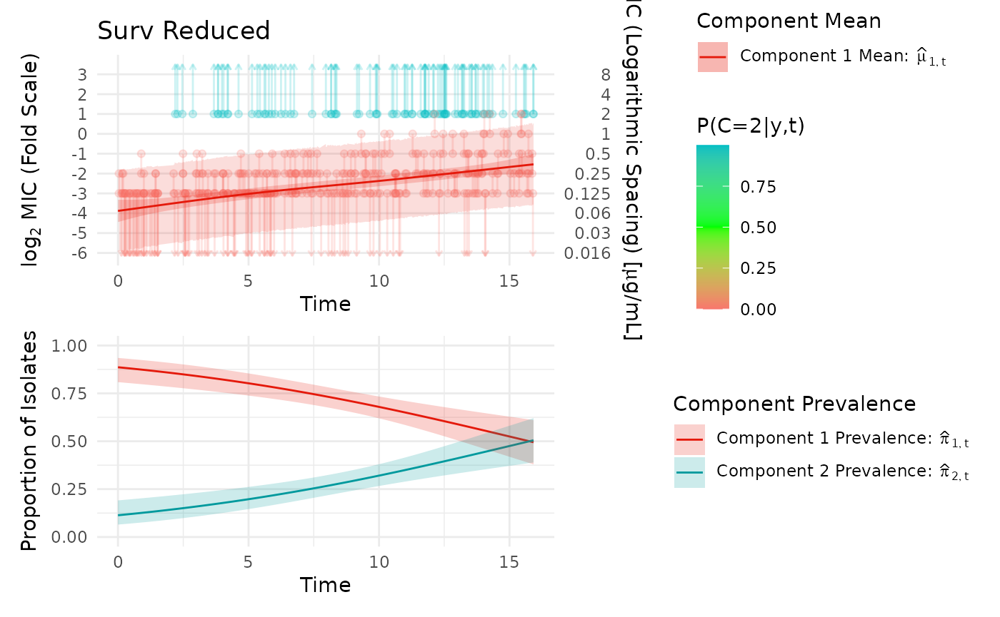
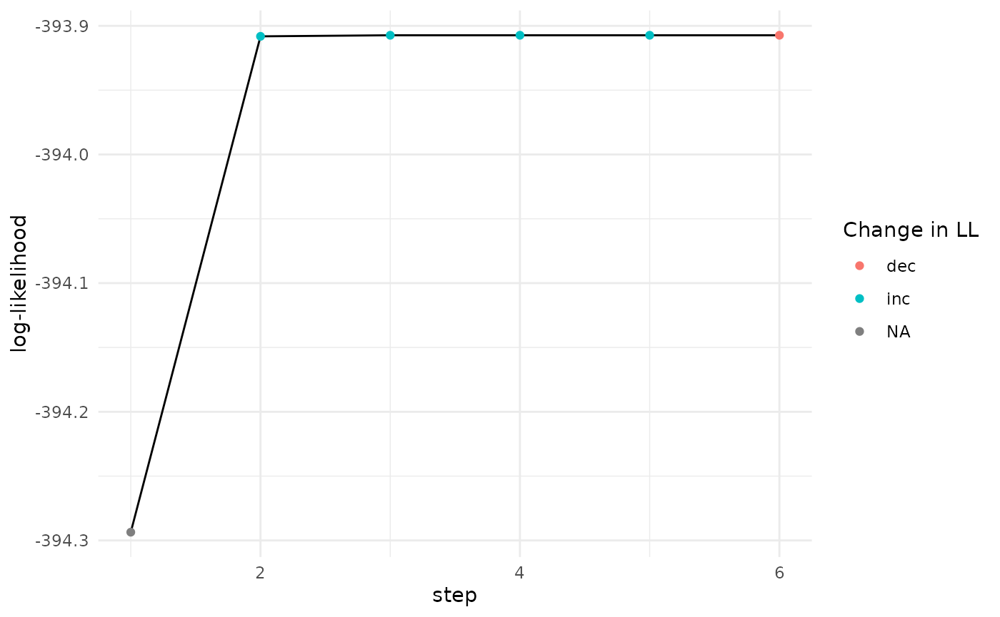
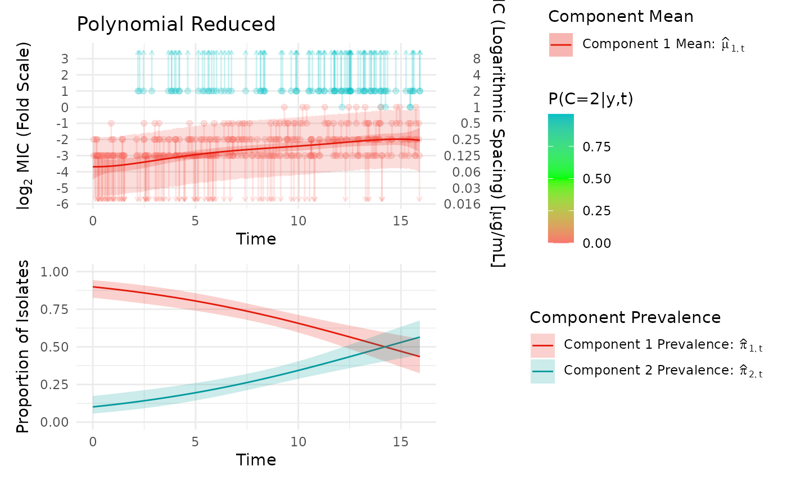

# Fit EM Options

``` r

library(mgcv)
#> Loading required package: nlme
#> This is mgcv 1.9-4. For overview type '?mgcv'.
library(dplyr)
#> 
#> Attaching package: 'dplyr'
#> The following object is masked from 'package:nlme':
#> 
#>     collapse
#> The following objects are masked from 'package:stats':
#> 
#>     filter, lag
#> The following objects are masked from 'package:base':
#> 
#>     intersect, setdiff, setequal, union
library(ggplot2)
library(ggnewscale)
library(survival)
library(patchwork)
library(purrr)
library(data.table)
#> 
#> Attaching package: 'data.table'
#> The following object is masked from 'package:purrr':
#> 
#>     transpose
#> The following objects are masked from 'package:dplyr':
#> 
#>     between, first, last
#> The following object is masked from 'package:base':
#> 
#>     %notin%
library(ggnewscale)
library(mic.sim)
```

``` r

set.seed(112)
n = 300
ncomp = 2
pi = function(t) {
  z <- 0.17 + 0.025 * t - 0.00045 * t^2
  #z <- (1+ exp(-m))^-1 #if exp(m) gets large, it won't add the 1 so we write like this
  tibble("1" = 1 - z, "2" = z)
}
`E[X|T,C]` = function(t, c)
{
  case_when(
    c == "1" ~ -4.0 + (0.24 * t) - (0.0055 * t^2),
    c == "2" ~ 3 + 0.001 * t,
    TRUE ~ NaN
  )
}
t_dist = function(n){runif(n, min = 0, max = 16)}
attr(t_dist, "min") = 0
attr(t_dist, "max") = 16
sd_vector = c("1" = 1, "2" = 1.05)
low_con = -3
high_con = 6
scale = "log"
example_data = simulate_mics(n = n, t_dist = t_dist, pi = pi, `E[X|T,C]` = `E[X|T,C]`, sd_vector = sd_vector, covariate_list = NULL, covariate_effect_vector = c(0), low_con = low_con, high_con = high_con, scale = "log") %>% suppressMessages()
```

``` r

example_data %>% 
  mutate(verbose_comp = case_when(
    comp == 1 ~ "Component 1",
    TRUE ~ "Component 2"
  )) %>% 
  ggplot() +
  geom_segment(aes(x = t, xend = t, y = left_bound, yend = right_bound, color = verbose_comp), data = (. %>% filter(left_bound != -Inf & right_bound != Inf)), alpha = 0.3) +
  geom_segment(aes(x = t, xend = t, y = right_bound, yend = left_bound, color = verbose_comp), data = (. %>% filter(left_bound == -Inf) %>% mutate(left_bound = low_con - 2)), arrow = arrow(length = unit(0.03, "npc")), alpha = 0.3) +
  geom_segment(aes(x = t, xend = t, y = left_bound, yend = right_bound, color = verbose_comp), data = (. %>% filter(right_bound == Inf) %>% mutate(right_bound = high_con + 2)), arrow = arrow(length = unit(0.03, "npc")), alpha = 0.3) +
  geom_point(aes(x = t, y = left_bound, color = verbose_comp), data = . %>% filter(left_bound != -Inf), alpha = 0.3) +
  geom_point(aes(x = t, y = right_bound, color = verbose_comp), data = . %>% filter(right_bound != Inf), alpha = 0.3) +
  geom_function(fun = function(t){`E[X|T,C]`(t, c = "1")}, aes(color = "Component 1 Mean")) +
  geom_function(fun = function(t){`E[X|T,C]`(t, c = "2")}, aes(color = "Component 2 Mean")) +
  xlim(attr(t_dist, "min") ,attr(t_dist, "max")) +
  ylim(low_con - 2, high_con + 2) %>% suppressWarnings()
#> Warning in geom_function(fun = function(t) {: All aesthetics have length 1, but the data has 300 rows.
#> ℹ Please consider using `annotate()` or provide this layer with data containing
#>   a single row.
#> Warning in geom_function(fun = function(t) {: All aesthetics have length 1, but the data has 300 rows.
#> ℹ Please consider using `annotate()` or provide this layer with data containing
#>   a single row.
```

    #> Warning: Calling `case_when()` with size 1 LHS inputs and size >1 RHS inputs was
    #> deprecated in dplyr 1.2.0.
    #> ℹ This `case_when()` statement can result in subtle silent bugs and is very inefficient.
    #> 
    #>   Please use a series of if statements instead:
    #> 
    #>   ```
    #>   # Previously
    #>   case_when(scalar_lhs1 ~ rhs1, scalar_lhs2 ~ rhs2, .default = default)
    #> 
    #>   # Now
    #>   if (scalar_lhs1) {
    #>     rhs1
    #>   } else if (scalar_lhs2) {
    #>     rhs2
    #>   } else {
    #>     default
    #>   }
    #>   ```
    #> This warning is displayed once per session.
    #> Call `lifecycle::last_lifecycle_warnings()` to see where this warning was
    #> generated.



``` r

out_1 = fit_EM(
  model = "pspline",
  approach = "full",
  visible_data = example_data,
  max_degree = 5,
  verbose = 1,
  initial_weighting = 9,
  scale = "log"
)
#> CV for degrees22; attempt1
#> fold 1
#> Stopped on combined LL and parameters
#> fold 2
#> Stopped on combined LL and parameters
#> fold 3
#> Stopped on combined LL and parameters
#> fold 4
#> Stopped on combined LL and parameters
#> fold 5
#> Stopped on combined LL and parameters
#> fold 6
#> Stopped on combined LL and parameters
#> fold 7
#> Stopped on combined LL and parameters
#> fold 8
#> Stopped on combined LL and parameters
#> fold 9
#> Stopped on combined LL and parameters
#> fold 10
#> Stopped on combined LL and parameters
#> CV for degrees33; attempt1
#> fold 1
#> Stopped on combined LL and parameters
#> fold 2
#> Stopped on combined LL and parameters
#> fold 3
#> Stopped on combined LL and parameters
#> fold 4
#> Stopped on combined LL and parameters
#> fold 5
#> Stopped on combined LL and parameters
#> fold 6
#> Stopped on combined LL and parameters
#> fold 7
#> Stopped on combined LL and parameters
#> fold 8
#> Stopped on combined LL and parameters
#> fold 9
#> Stopped on combined LL and parameters
#> fold 10
#> Stopped on combined LL and parameters
#> CV for degrees44; attempt1
#> fold 1
#> Stopped on combined LL and parameters
#> fold 2
#> Stopped on combined LL and parameters
#> fold 3
#> Stopped on combined LL and parameters
#> fold 4
#> Stopped on combined LL and parameters
#> fold 5
#> Stopped on combined LL and parameters
#> fold 6
#> Stopped on combined LL and parameters
#> fold 7
#> Stopped on combined LL and parameters
#> fold 8
#> Stopped on combined LL and parameters
#> fold 9
#> Stopped on combined LL and parameters
#> fold 10
#> Stopped on combined LL and parameters
#> CV for degrees55; attempt1
#> fold 1
#> Stopped on combined LL and parameters
#> fold 2
#> Stopped on combined LL and parameters
#> fold 3
#> Stopped on combined LL and parameters
#> fold 4
#> Stopped on combined LL and parameters
#> fold 5
#> Stopped on combined LL and parameters
#> fold 6
#> Stopped on combined LL and parameters
#> fold 7
#> Stopped on combined LL and parameters
#> fold 8
#> Stopped on combined LL and parameters
#> fold 9
#> Stopped on combined LL and parameters
#> fold 10
#> Stopped on combined LL and parameters
#> Stopped on combined LL and parameters

plot_likelihood(out_1$likelihood)
```



``` r

plot_fm(out_1, title = "Surv Full")
#> Scale for y is already present.
#> Adding another scale for y, which will replace the existing scale.
#> Scale for y is already present.
#> Adding another scale for y, which will replace the existing scale.
```



``` r

out_1$cv_results
#> # A tibble: 4 × 4
#>   degree_1 degree_2 log_likelihood total_repeats
#>      <int>    <int>          <dbl>         <dbl>
#> 1        4        4          -564.             0
#> 2        5        5          -574.             0
#> 3        3        3          -578.             0
#> 4        2        2          -598.             0
```

``` r

out_2 = fit_EM(
  model = "polynomial",
  approach = "full",
  visible_data = example_data,
  max_degree = 5,
  verbose = 0,
  initial_weighting = 3
)
#> CV for degrees11; attempt1
#> CV for degrees22; attempt1
#> CV for degrees33; attempt1
#> CV for degrees44; attempt1
#> CV for degrees55; attempt1

plot_likelihood(out_2$likelihood)
```



``` r

plot_fm(out_2, title = "Polynomial Full")
#> Scale for y is already present.
#> Adding another scale for y, which will replace the existing scale.
#> Scale for y is already present.
#> Adding another scale for y, which will replace the existing scale.
```


``` r

out_2$cv_results
#> # A tibble: 5 × 4
#>   degree_1 degree_2 log_likelihood total_repeats
#>      <int>    <int>          <dbl>         <dbl>
#> 1        2        2          -567.             0
#> 2        3        3          -575.             0
#> 3        4        4          -592.             0
#> 4        5        5          -595.             0
#> 5        1        1          -605.             0
```

``` r

n = 300
ncomp = 2
pi = function(t) {
  z <- 0.07 + 0.03 * t - 0.00045 * t^2
  #z <- (1+ exp(-m))^-1 #if exp(m) gets large, it won't add the 1 so we write like this
  tibble("1" = 1 - z, "2" = z)
}
`E[X|T,C]` = function(t, c)
{
  case_when(
    c == "1" ~ -4.0 + (0.24 * t) - (0.0055 * t^2),
    c == "2" ~ 3 + 0.001 * t,
    TRUE ~ NaN
  )
}
t_dist = function(n){runif(n, min = 0, max = 16)}
attr(t_dist, "min") = 0
attr(t_dist, "max") = 16
sd_vector = c("1" = 1, "2" = 1.05)
low_con = -3
high_con = 1
scale = "log"
example_data_cens = simulate_mics(n = n, t_dist = t_dist, pi = pi, `E[X|T,C]` = `E[X|T,C]`, sd_vector = sd_vector, covariate_list = NULL, covariate_effect_vector = c(0), low_con = low_con, high_con = high_con, scale = "log") %>% suppressMessages()
```

``` r

example_data_cens %>% 
  mutate(verbose_comp = case_when(
    comp == 1 ~ "Component 1",
    TRUE ~ "Component 2"
  )) %>% 
  ggplot() +
  geom_segment(aes(x = t, xend = t, y = left_bound, yend = right_bound, color = verbose_comp), data = (. %>% filter(left_bound != -Inf & right_bound != Inf)), alpha = 0.3) +
  geom_segment(aes(x = t, xend = t, y = right_bound, yend = left_bound, color = verbose_comp), data = (. %>% filter(left_bound == -Inf) %>% mutate(left_bound = low_con - 2)), arrow = arrow(length = unit(0.03, "npc")), alpha = 0.3) +
  geom_segment(aes(x = t, xend = t, y = left_bound, yend = right_bound, color = verbose_comp), data = (. %>% filter(right_bound == Inf) %>% mutate(right_bound = high_con + 2)), arrow = arrow(length = unit(0.03, "npc")), alpha = 0.3) +
  geom_point(aes(x = t, y = left_bound, color = verbose_comp), data = . %>% filter(left_bound != -Inf), alpha = 0.3) +
  geom_point(aes(x = t, y = right_bound, color = verbose_comp), data = . %>% filter(right_bound != Inf), alpha = 0.3) +
  geom_function(fun = function(t){`E[X|T,C]`(t, c = "1")}, aes(color = "Component 1 Mean")) +
  geom_function(fun = function(t){`E[X|T,C]`(t, c = "2")}, aes(color = "Component 2 Mean")) +
  xlim(attr(t_dist, "min") ,attr(t_dist, "max")) +
  ylim(low_con - 2, high_con + 2) %>% suppressWarnings()
#> Warning in geom_function(fun = function(t) {: All aesthetics have length 1, but the data has 300 rows.
#> ℹ Please consider using `annotate()` or provide this layer with data containing
#>   a single row.
#> Warning in geom_function(fun = function(t) {: All aesthetics have length 1, but the data has 300 rows.
#> ℹ Please consider using `annotate()` or provide this layer with data containing
#>   a single row.
#> Warning: Removed 100 rows containing missing values or values outside the scale range
#> (`geom_function()`).
#> `geom_function()`: Each group consists of only one observation.
#> ℹ Do you need to adjust the group aesthetic?
```



``` r

out_3 = fit_EM(
  model = "surv",
  approach = "reduced",
  visible_data = example_data_cens,
  fixed_side = "RC",
  extra_row = FALSE,
  max_degree = 5,
  verbose = 4,
  initial_weighting = 1
)
#> CV for degrees2; attempt1
#> fold 1
#> starting iteration number 1
#> 
#> Family: binomial 
#> Link function: logit 
#> 
#> Formula:
#> c == "2" ~ s(t)
#> 
#> Estimated degrees of freedom:
#> 1  total = 2 
#> 
#> ML score: 152.0742     
#> [[1]]
#> Call:
#> survreg(formula = mu_formula, data = ., weights = `P(C=c|y,t)`, 
#>     dist = "gaussian", control = survreg.control(maxiter = maxiter_survreg))
#> 
#>                           coef   se(coef) se2    Chisq DF   p      
#> (Intercept)               -4.498 0.5455   0.3814 67.97 1.00 1.7e-16
#> pspline(t, df = 2), linea  0.147 0.0191   0.0191 59.33 1.00 1.3e-14
#> pspline(t, df = 2), nonli                         0.64 1.07 4.5e-01
#> 
#> Scale= 1.05 
#> 
#> Iterations: 4 outer, 11 Newton-Raphson
#>      Theta= 0.926 
#> Degrees of freedom for terms= 0.5 2.1 1.0 
#> Likelihood ratio test=59.6  on 1.6 df, p=4e-14  n= 270 
#> 
#> attr(,"model")
#> [1] "surv"
#> attr(,"fixed_side")
#> [1] "RC"
#> -371.203919330868
#> starting iteration number 2
#> 
#> Family: binomial 
#> Link function: logit 
#> 
#> Formula:
#> c == "2" ~ s(t)
#> 
#> Estimated degrees of freedom:
#> 1  total = 2 
#> 
#> ML score: 152.5879     
#> [[1]]
#> Call:
#> survreg(formula = mu_formula, data = ., weights = `P(C=c|y,t)`, 
#>     dist = "gaussian", control = survreg.control(maxiter = maxiter_survreg))
#> 
#>                           coef   se(coef) se2    Chisq DF   p      
#> (Intercept)               -4.447 0.5289   0.3695 70.70 1.00 4.2e-17
#> pspline(t, df = 2), linea  0.145 0.0185   0.0185 61.48 1.00 4.5e-15
#> pspline(t, df = 2), nonli                         0.57 1.07 4.8e-01
#> 
#> Scale= 1.01 
#> 
#> Iterations: 4 outer, 11 Newton-Raphson
#>      Theta= 0.93 
#> Degrees of freedom for terms= 0.5 2.1 1.0 
#> Likelihood ratio test=61.3  on 1.6 df, p=2e-14  n= 270 
#> 
#> attr(,"model")
#> [1] "surv"
#> attr(,"fixed_side")
#> [1] "RC"
#> -371.068424224616
#> starting iteration number 3
#> 
#> Family: binomial 
#> Link function: logit 
#> 
#> Formula:
#> c == "2" ~ s(t)
#> 
#> Estimated degrees of freedom:
#> 1  total = 2 
#> 
#> ML score: 152.6139     
#> [[1]]
#> Call:
#> survreg(formula = mu_formula, data = ., weights = `P(C=c|y,t)`, 
#>     dist = "gaussian", control = survreg.control(maxiter = maxiter_survreg))
#> 
#>                           coef   se(coef) se2    Chisq DF   p      
#> (Intercept)               -4.442 0.5274   0.3685 70.95 1.00 3.7e-17
#> pspline(t, df = 2), linea  0.145 0.0184   0.0184 61.45 1.00 4.5e-15
#> pspline(t, df = 2), nonli                         0.57 1.07 4.8e-01
#> 
#> Scale= 1.01 
#> 
#> Iterations: 4 outer, 11 Newton-Raphson
#>      Theta= 0.931 
#> Degrees of freedom for terms= 0.5 2.1 1.0 
#> Likelihood ratio test=61.2  on 1.6 df, p=2e-14  n= 270 
#> 
#> attr(,"model")
#> [1] "surv"
#> attr(,"fixed_side")
#> [1] "RC"
#> -371.067177807687
#> starting iteration number 4
#> 
#> Family: binomial 
#> Link function: logit 
#> 
#> Formula:
#> c == "2" ~ s(t)
#> 
#> Estimated degrees of freedom:
#> 1  total = 2 
#> 
#> ML score: 152.6159     
#> [[1]]
#> Call:
#> survreg(formula = mu_formula, data = ., weights = `P(C=c|y,t)`, 
#>     dist = "gaussian", control = survreg.control(maxiter = maxiter_survreg))
#> 
#>                           coef   se(coef) se2    Chisq DF   p      
#> (Intercept)               -4.442 0.5272   0.3684 70.97 1.00 3.6e-17
#> pspline(t, df = 2), linea  0.144 0.0184   0.0184 61.45 1.00 4.6e-15
#> pspline(t, df = 2), nonli                         0.57 1.07 4.8e-01
#> 
#> Scale= 1.01 
#> 
#> Iterations: 4 outer, 11 Newton-Raphson
#>      Theta= 0.931 
#> Degrees of freedom for terms= 0.5 2.1 1.0 
#> Likelihood ratio test=61.2  on 1.6 df, p=2e-14  n= 270 
#> 
#> attr(,"model")
#> [1] "surv"
#> attr(,"fixed_side")
#> [1] "RC"
#> -371.067154539521
#> starting iteration number 5
#> 
#> Family: binomial 
#> Link function: logit 
#> 
#> Formula:
#> c == "2" ~ s(t)
#> 
#> Estimated degrees of freedom:
#> 1  total = 2 
#> 
#> ML score: 152.6161     
#> [[1]]
#> Call:
#> survreg(formula = mu_formula, data = ., weights = `P(C=c|y,t)`, 
#>     dist = "gaussian", control = survreg.control(maxiter = maxiter_survreg))
#> 
#>                           coef   se(coef) se2    Chisq DF   p      
#> (Intercept)               -4.442 0.5272   0.3684 70.97 1.00 3.6e-17
#> pspline(t, df = 2), linea  0.144 0.0184   0.0184 61.44 1.00 4.6e-15
#> pspline(t, df = 2), nonli                         0.57 1.07 4.8e-01
#> 
#> Scale= 1.01 
#> 
#> Iterations: 4 outer, 11 Newton-Raphson
#>      Theta= 0.931 
#> Degrees of freedom for terms= 0.5 2.1 1.0 
#> Likelihood ratio test=61.2  on 1.6 df, p=2e-14  n= 270 
#> 
#> attr(,"model")
#> [1] "surv"
#> attr(,"fixed_side")
#> [1] "RC"
#> -371.067153139176
#> starting iteration number 6
#> 
#> Family: binomial 
#> Link function: logit 
#> 
#> Formula:
#> c == "2" ~ s(t)
#> 
#> Estimated degrees of freedom:
#> 1  total = 2 
#> 
#> ML score: 152.6161     
#> [[1]]
#> Call:
#> survreg(formula = mu_formula, data = ., weights = `P(C=c|y,t)`, 
#>     dist = "gaussian", control = survreg.control(maxiter = maxiter_survreg))
#> 
#>                           coef   se(coef) se2    Chisq DF   p      
#> (Intercept)               -4.442 0.5272   0.3684 70.97 1.00 3.6e-17
#> pspline(t, df = 2), linea  0.144 0.0184   0.0184 61.44 1.00 4.6e-15
#> pspline(t, df = 2), nonli                         0.57 1.07 4.8e-01
#> 
#> Scale= 1.01 
#> 
#> Iterations: 4 outer, 11 Newton-Raphson
#>      Theta= 0.931 
#> Degrees of freedom for terms= 0.5 2.1 1.0 
#> Likelihood ratio test=61.2  on 1.6 df, p=2e-14  n= 270 
#> 
#> attr(,"model")
#> [1] "surv"
#> attr(,"fixed_side")
#> [1] "RC"
#> -371.067153025293
#> starting iteration number 7
#> 
#> Family: binomial 
#> Link function: logit 
#> 
#> Formula:
#> c == "2" ~ s(t)
#> 
#> Estimated degrees of freedom:
#> 1  total = 2 
#> 
#> ML score: 152.6161     
#> [[1]]
#> Call:
#> survreg(formula = mu_formula, data = ., weights = `P(C=c|y,t)`, 
#>     dist = "gaussian", control = survreg.control(maxiter = maxiter_survreg))
#> 
#>                           coef   se(coef) se2    Chisq DF   p      
#> (Intercept)               -4.442 0.5272   0.3684 70.97 1.00 3.6e-17
#> pspline(t, df = 2), linea  0.144 0.0184   0.0184 61.44 1.00 4.6e-15
#> pspline(t, df = 2), nonli                         0.57 1.07 4.8e-01
#> 
#> Scale= 1.01 
#> 
#> Iterations: 4 outer, 11 Newton-Raphson
#>      Theta= 0.931 
#> Degrees of freedom for terms= 0.5 2.1 1.0 
#> Likelihood ratio test=61.2  on 1.6 df, p=2e-14  n= 270 
#> 
#> attr(,"model")
#> [1] "surv"
#> attr(,"fixed_side")
#> [1] "RC"
#> -371.067153015766
#> Stopped on combined LL and parameters
#> fold 2
#> starting iteration number 1
#> 
#> Family: binomial 
#> Link function: logit 
#> 
#> Formula:
#> c == "2" ~ s(t)
#> 
#> Estimated degrees of freedom:
#> 1  total = 2 
#> 
#> ML score: 147.1136     
#> [[1]]
#> Call:
#> survreg(formula = mu_formula, data = ., weights = `P(C=c|y,t)`, 
#>     dist = "gaussian", control = survreg.control(maxiter = maxiter_survreg))
#> 
#>                           coef   se(coef) se2    Chisq DF   p      
#> (Intercept)               -4.394 0.5202   0.3639 71.36 1.00 3.0e-17
#> pspline(t, df = 2), linea  0.145 0.0186   0.0186 60.88 1.00 6.1e-15
#> pspline(t, df = 2), nonli                         0.42 1.07 5.5e-01
#> 
#> Scale= 1.04 
#> 
#> Iterations: 4 outer, 12 Newton-Raphson
#>      Theta= 0.928 
#> Degrees of freedom for terms= 0.5 2.1 1.0 
#> Likelihood ratio test=60.5  on 1.6 df, p=3e-14  n= 270 
#> 
#> attr(,"model")
#> [1] "surv"
#> attr(,"fixed_side")
#> [1] "RC"
#> -370.751164210344
#> starting iteration number 2
#> 
#> Family: binomial 
#> Link function: logit 
#> 
#> Formula:
#> c == "2" ~ s(t)
#> 
#> Estimated degrees of freedom:
#> 1  total = 2 
#> 
#> ML score: 147.6198     
#> [[1]]
#> Call:
#> survreg(formula = mu_formula, data = ., weights = `P(C=c|y,t)`, 
#>     dist = "gaussian", control = survreg.control(maxiter = maxiter_survreg))
#> 
#>                           coef   se(coef) se2   Chisq DF   p      
#> (Intercept)               -4.346 0.505    0.353 74.01 1.00 7.8e-18
#> pspline(t, df = 2), linea  0.143 0.018    0.018 62.71 1.00 2.4e-15
#> pspline(t, df = 2), nonli                        0.37 1.08 5.7e-01
#> 
#> Scale= 1 
#> 
#> Iterations: 4 outer, 12 Newton-Raphson
#>      Theta= 0.932 
#> Degrees of freedom for terms= 0.5 2.1 1.0 
#> Likelihood ratio test=61.9  on 1.6 df, p=1e-14  n= 270 
#> 
#> attr(,"model")
#> [1] "surv"
#> attr(,"fixed_side")
#> [1] "RC"
#> -370.623788776762
#> starting iteration number 3
#> 
#> Family: binomial 
#> Link function: logit 
#> 
#> Formula:
#> c == "2" ~ s(t)
#> 
#> Estimated degrees of freedom:
#> 1  total = 2 
#> 
#> ML score: 147.6431     
#> [[1]]
#> Call:
#> survreg(formula = mu_formula, data = ., weights = `P(C=c|y,t)`, 
#>     dist = "gaussian", control = survreg.control(maxiter = maxiter_survreg))
#> 
#>                           coef   se(coef) se2   Chisq DF   p      
#> (Intercept)               -4.342 0.504    0.352 74.25 1.00 6.9e-18
#> pspline(t, df = 2), linea  0.142 0.018    0.018 62.68 1.00 2.4e-15
#> pspline(t, df = 2), nonli                        0.37 1.08 5.7e-01
#> 
#> Scale= 0.998 
#> 
#> Iterations: 4 outer, 12 Newton-Raphson
#>      Theta= 0.933 
#> Degrees of freedom for terms= 0.5 2.1 1.0 
#> Likelihood ratio test=61.9  on 1.6 df, p=1e-14  n= 270 
#> 
#> attr(,"model")
#> [1] "surv"
#> attr(,"fixed_side")
#> [1] "RC"
#> -370.62243751498
#> starting iteration number 4
#> 
#> Family: binomial 
#> Link function: logit 
#> 
#> Formula:
#> c == "2" ~ s(t)
#> 
#> Estimated degrees of freedom:
#> 1  total = 2 
#> 
#> ML score: 147.6448     
#> [[1]]
#> Call:
#> survreg(formula = mu_formula, data = ., weights = `P(C=c|y,t)`, 
#>     dist = "gaussian", control = survreg.control(maxiter = maxiter_survreg))
#> 
#>                           coef   se(coef) se2   Chisq DF   p      
#> (Intercept)               -4.342 0.504    0.352 74.27 1.00 6.8e-18
#> pspline(t, df = 2), linea  0.142 0.018    0.018 62.68 1.00 2.4e-15
#> pspline(t, df = 2), nonli                        0.37 1.08 5.7e-01
#> 
#> Scale= 0.998 
#> 
#> Iterations: 4 outer, 12 Newton-Raphson
#>      Theta= 0.933 
#> Degrees of freedom for terms= 0.5 2.1 1.0 
#> Likelihood ratio test=61.9  on 1.6 df, p=1e-14  n= 270 
#> 
#> attr(,"model")
#> [1] "surv"
#> attr(,"fixed_side")
#> [1] "RC"
#> -370.622404700952
#> starting iteration number 5
#> 
#> Family: binomial 
#> Link function: logit 
#> 
#> Formula:
#> c == "2" ~ s(t)
#> 
#> Estimated degrees of freedom:
#> 1  total = 2 
#> 
#> ML score: 147.6449     
#> [[1]]
#> Call:
#> survreg(formula = mu_formula, data = ., weights = `P(C=c|y,t)`, 
#>     dist = "gaussian", control = survreg.control(maxiter = maxiter_survreg))
#> 
#>                           coef   se(coef) se2   Chisq DF   p      
#> (Intercept)               -4.342 0.504    0.352 74.27 1.00 6.8e-18
#> pspline(t, df = 2), linea  0.142 0.018    0.018 62.68 1.00 2.4e-15
#> pspline(t, df = 2), nonli                        0.37 1.08 5.7e-01
#> 
#> Scale= 0.998 
#> 
#> Iterations: 4 outer, 12 Newton-Raphson
#>      Theta= 0.933 
#> Degrees of freedom for terms= 0.5 2.1 1.0 
#> Likelihood ratio test=61.9  on 1.6 df, p=1e-14  n= 270 
#> 
#> attr(,"model")
#> [1] "surv"
#> attr(,"fixed_side")
#> [1] "RC"
#> -370.622402604696
#> starting iteration number 6
#> 
#> Family: binomial 
#> Link function: logit 
#> 
#> Formula:
#> c == "2" ~ s(t)
#> 
#> Estimated degrees of freedom:
#> 1  total = 2 
#> 
#> ML score: 147.645     
#> [[1]]
#> Call:
#> survreg(formula = mu_formula, data = ., weights = `P(C=c|y,t)`, 
#>     dist = "gaussian", control = survreg.control(maxiter = maxiter_survreg))
#> 
#>                           coef   se(coef) se2   Chisq DF   p      
#> (Intercept)               -4.342 0.504    0.352 74.27 1.00 6.8e-18
#> pspline(t, df = 2), linea  0.142 0.018    0.018 62.68 1.00 2.4e-15
#> pspline(t, df = 2), nonli                        0.37 1.08 5.7e-01
#> 
#> Scale= 0.998 
#> 
#> Iterations: 4 outer, 12 Newton-Raphson
#>      Theta= 0.933 
#> Degrees of freedom for terms= 0.5 2.1 1.0 
#> Likelihood ratio test=61.9  on 1.6 df, p=1e-14  n= 270 
#> 
#> attr(,"model")
#> [1] "surv"
#> attr(,"fixed_side")
#> [1] "RC"
#> -370.622402442355
#> starting iteration number 7
#> 
#> Family: binomial 
#> Link function: logit 
#> 
#> Formula:
#> c == "2" ~ s(t)
#> 
#> Estimated degrees of freedom:
#> 1  total = 2 
#> 
#> ML score: 147.645     
#> [[1]]
#> Call:
#> survreg(formula = mu_formula, data = ., weights = `P(C=c|y,t)`, 
#>     dist = "gaussian", control = survreg.control(maxiter = maxiter_survreg))
#> 
#>                           coef   se(coef) se2   Chisq DF   p      
#> (Intercept)               -4.342 0.504    0.352 74.27 1.00 6.8e-18
#> pspline(t, df = 2), linea  0.142 0.018    0.018 62.68 1.00 2.4e-15
#> pspline(t, df = 2), nonli                        0.37 1.08 5.7e-01
#> 
#> Scale= 0.998 
#> 
#> Iterations: 4 outer, 12 Newton-Raphson
#>      Theta= 0.933 
#> Degrees of freedom for terms= 0.5 2.1 1.0 
#> Likelihood ratio test=61.9  on 1.6 df, p=1e-14  n= 270 
#> 
#> attr(,"model")
#> [1] "surv"
#> attr(,"fixed_side")
#> [1] "RC"
#> -370.622402429559
#> Stopped on combined LL and parameters
#> fold 3
#> starting iteration number 1
#> 
#> Family: binomial 
#> Link function: logit 
#> 
#> Formula:
#> c == "2" ~ s(t)
#> 
#> Estimated degrees of freedom:
#> 1  total = 2 
#> 
#> ML score: 147.717     
#> [[1]]
#> Call:
#> survreg(formula = mu_formula, data = ., weights = `P(C=c|y,t)`, 
#>     dist = "gaussian", control = survreg.control(maxiter = maxiter_survreg))
#> 
#>                           coef   se(coef) se2   Chisq DF   p      
#> (Intercept)               -4.381 0.538    0.377 66.25 1.00 4.0e-16
#> pspline(t, df = 2), linea  0.146 0.019    0.019 58.91 1.00 1.7e-14
#> pspline(t, df = 2), nonli                        0.31 1.07 6.1e-01
#> 
#> Scale= 1.06 
#> 
#> Iterations: 4 outer, 12 Newton-Raphson
#>      Theta= 0.926 
#> Degrees of freedom for terms= 0.5 2.1 1.0 
#> Likelihood ratio test=58.4  on 1.6 df, p=8e-14  n= 270 
#> 
#> attr(,"model")
#> [1] "surv"
#> attr(,"fixed_side")
#> [1] "RC"
#> -375.313972561276
#> starting iteration number 2
#> 
#> Family: binomial 
#> Link function: logit 
#> 
#> Formula:
#> c == "2" ~ s(t)
#> 
#> Estimated degrees of freedom:
#> 1  total = 2 
#> 
#> ML score: 148.2186     
#> [[1]]
#> Call:
#> survreg(formula = mu_formula, data = ., weights = `P(C=c|y,t)`, 
#>     dist = "gaussian", control = survreg.control(maxiter = maxiter_survreg))
#> 
#>                           coef   se(coef) se2    Chisq DF   p      
#> (Intercept)               -4.340 0.5245   0.3671 68.46 1.00 1.3e-16
#> pspline(t, df = 2), linea  0.144 0.0185   0.0184 60.77 1.00 6.4e-15
#> pspline(t, df = 2), nonli                         0.27 1.07 6.3e-01
#> 
#> Scale= 1.03 
#> 
#> Iterations: 4 outer, 12 Newton-Raphson
#>      Theta= 0.929 
#> Degrees of freedom for terms= 0.5 2.1 1.0 
#> Likelihood ratio test=59.8  on 1.6 df, p=4e-14  n= 270 
#> 
#> attr(,"model")
#> [1] "surv"
#> attr(,"fixed_side")
#> [1] "RC"
#> -375.212825744657
#> starting iteration number 3
#> 
#> Family: binomial 
#> Link function: logit 
#> 
#> Formula:
#> c == "2" ~ s(t)
#> 
#> Estimated degrees of freedom:
#> 1  total = 2 
#> 
#> ML score: 148.2471     
#> [[1]]
#> Call:
#> survreg(formula = mu_formula, data = ., weights = `P(C=c|y,t)`, 
#>     dist = "gaussian", control = survreg.control(maxiter = maxiter_survreg))
#> 
#>                           coef   se(coef) se2    Chisq DF   p      
#> (Intercept)               -4.336 0.5232   0.3661 68.68 1.00 1.2e-16
#> pspline(t, df = 2), linea  0.143 0.0184   0.0184 60.73 1.00 6.5e-15
#> pspline(t, df = 2), nonli                         0.27 1.07 6.3e-01
#> 
#> Scale= 1.03 
#> 
#> Iterations: 4 outer, 12 Newton-Raphson
#>      Theta= 0.929 
#> Degrees of freedom for terms= 0.5 2.1 1.0 
#> Likelihood ratio test=59.8  on 1.6 df, p=4e-14  n= 270 
#> 
#> attr(,"model")
#> [1] "surv"
#> attr(,"fixed_side")
#> [1] "RC"
#> -375.211429493843
#> starting iteration number 4
#> 
#> Family: binomial 
#> Link function: logit 
#> 
#> Formula:
#> c == "2" ~ s(t)
#> 
#> Estimated degrees of freedom:
#> 1  total = 2 
#> 
#> ML score: 148.2497     
#> [[1]]
#> Call:
#> survreg(formula = mu_formula, data = ., weights = `P(C=c|y,t)`, 
#>     dist = "gaussian", control = survreg.control(maxiter = maxiter_survreg))
#> 
#>                           coef   se(coef) se2    Chisq DF   p      
#> (Intercept)               -4.335 0.5230   0.3660 68.70 1.00 1.1e-16
#> pspline(t, df = 2), linea  0.143 0.0184   0.0184 60.72 1.00 6.6e-15
#> pspline(t, df = 2), nonli                         0.27 1.07 6.3e-01
#> 
#> Scale= 1.03 
#> 
#> Iterations: 4 outer, 12 Newton-Raphson
#>      Theta= 0.93 
#> Degrees of freedom for terms= 0.5 2.1 1.0 
#> Likelihood ratio test=59.8  on 1.6 df, p=4e-14  n= 270 
#> 
#> attr(,"model")
#> [1] "surv"
#> attr(,"fixed_side")
#> [1] "RC"
#> -375.211391374565
#> starting iteration number 5
#> 
#> Family: binomial 
#> Link function: logit 
#> 
#> Formula:
#> c == "2" ~ s(t)
#> 
#> Estimated degrees of freedom:
#> 1  total = 2 
#> 
#> ML score: 148.2499     
#> [[1]]
#> Call:
#> survreg(formula = mu_formula, data = ., weights = `P(C=c|y,t)`, 
#>     dist = "gaussian", control = survreg.control(maxiter = maxiter_survreg))
#> 
#>                           coef   se(coef) se2    Chisq DF   p      
#> (Intercept)               -4.335 0.5230   0.3660 68.70 1.00 1.1e-16
#> pspline(t, df = 2), linea  0.143 0.0184   0.0184 60.72 1.00 6.6e-15
#> pspline(t, df = 2), nonli                         0.27 1.07 6.3e-01
#> 
#> Scale= 1.03 
#> 
#> Iterations: 4 outer, 12 Newton-Raphson
#>      Theta= 0.93 
#> Degrees of freedom for terms= 0.5 2.1 1.0 
#> Likelihood ratio test=59.8  on 1.6 df, p=4e-14  n= 270 
#> 
#> attr(,"model")
#> [1] "surv"
#> attr(,"fixed_side")
#> [1] "RC"
#> -375.21138866441
#> starting iteration number 6
#> 
#> Family: binomial 
#> Link function: logit 
#> 
#> Formula:
#> c == "2" ~ s(t)
#> 
#> Estimated degrees of freedom:
#> 1  total = 2 
#> 
#> ML score: 148.2499     
#> [[1]]
#> Call:
#> survreg(formula = mu_formula, data = ., weights = `P(C=c|y,t)`, 
#>     dist = "gaussian", control = survreg.control(maxiter = maxiter_survreg))
#> 
#>                           coef   se(coef) se2    Chisq DF   p      
#> (Intercept)               -4.335 0.5230   0.3660 68.70 1.00 1.1e-16
#> pspline(t, df = 2), linea  0.143 0.0184   0.0184 60.72 1.00 6.6e-15
#> pspline(t, df = 2), nonli                         0.27 1.07 6.3e-01
#> 
#> Scale= 1.03 
#> 
#> Iterations: 4 outer, 12 Newton-Raphson
#>      Theta= 0.93 
#> Degrees of freedom for terms= 0.5 2.1 1.0 
#> Likelihood ratio test=59.8  on 1.6 df, p=4e-14  n= 270 
#> 
#> attr(,"model")
#> [1] "surv"
#> attr(,"fixed_side")
#> [1] "RC"
#> -375.211388411771
#> starting iteration number 7
#> 
#> Family: binomial 
#> Link function: logit 
#> 
#> Formula:
#> c == "2" ~ s(t)
#> 
#> Estimated degrees of freedom:
#> 1  total = 2 
#> 
#> ML score: 148.2499     
#> [[1]]
#> Call:
#> survreg(formula = mu_formula, data = ., weights = `P(C=c|y,t)`, 
#>     dist = "gaussian", control = survreg.control(maxiter = maxiter_survreg))
#> 
#>                           coef   se(coef) se2    Chisq DF   p      
#> (Intercept)               -4.335 0.5230   0.3660 68.70 1.00 1.1e-16
#> pspline(t, df = 2), linea  0.143 0.0184   0.0184 60.72 1.00 6.6e-15
#> pspline(t, df = 2), nonli                         0.27 1.07 6.3e-01
#> 
#> Scale= 1.03 
#> 
#> Iterations: 4 outer, 12 Newton-Raphson
#>      Theta= 0.93 
#> Degrees of freedom for terms= 0.5 2.1 1.0 
#> Likelihood ratio test=59.8  on 1.6 df, p=4e-14  n= 270 
#> 
#> attr(,"model")
#> [1] "surv"
#> attr(,"fixed_side")
#> [1] "RC"
#> -375.21138838744
#> Stopped on combined LL and parameters
#> fold 4
#> starting iteration number 1
#> 
#> Family: binomial 
#> Link function: logit 
#> 
#> Formula:
#> c == "2" ~ s(t)
#> 
#> Estimated degrees of freedom:
#> 1  total = 2 
#> 
#> ML score: 152.196     
#> [[1]]
#> Call:
#> survreg(formula = mu_formula, data = ., weights = `P(C=c|y,t)`, 
#>     dist = "gaussian", control = survreg.control(maxiter = maxiter_survreg))
#> 
#>                           coef   se(coef) se2    Chisq DF   p      
#> (Intercept)               -4.475 0.5299   0.3709 71.32 1.00 3.0e-17
#> pspline(t, df = 2), linea  0.139 0.0188   0.0188 54.75 1.00 1.4e-13
#> pspline(t, df = 2), nonli                         0.78 1.07 4.0e-01
#> 
#> Scale= 1.03 
#> 
#> Iterations: 4 outer, 13 Newton-Raphson
#>      Theta= 0.928 
#> Degrees of freedom for terms= 0.5 2.1 1.0 
#> Likelihood ratio test=55.9  on 1.6 df, p=3e-13  n= 270 
#> 
#> attr(,"model")
#> [1] "surv"
#> attr(,"fixed_side")
#> [1] "RC"
#> -373.588248647355
#> starting iteration number 2
#> 
#> Family: binomial 
#> Link function: logit 
#> 
#> Formula:
#> c == "2" ~ s(t)
#> 
#> Estimated degrees of freedom:
#> 1  total = 2 
#> 
#> ML score: 152.726     
#> [[1]]
#> Call:
#> survreg(formula = mu_formula, data = ., weights = `P(C=c|y,t)`, 
#>     dist = "gaussian", control = survreg.control(maxiter = maxiter_survreg))
#> 
#>                           coef   se(coef) se2    Chisq DF   p      
#> (Intercept)               -4.421 0.5128   0.3588 74.33 1.00 6.6e-18
#> pspline(t, df = 2), linea  0.137 0.0182   0.0181 56.64 1.00 5.2e-14
#> pspline(t, df = 2), nonli                         0.71 1.08 4.3e-01
#> 
#> Scale= 0.99 
#> 
#> Iterations: 4 outer, 13 Newton-Raphson
#>      Theta= 0.932 
#> Degrees of freedom for terms= 0.5 2.1 1.0 
#> Likelihood ratio test=57.4  on 1.6 df, p=1e-13  n= 270 
#> 
#> attr(,"model")
#> [1] "surv"
#> attr(,"fixed_side")
#> [1] "RC"
#> -373.440013342995
#> starting iteration number 3
#> 
#> Family: binomial 
#> Link function: logit 
#> 
#> Formula:
#> c == "2" ~ s(t)
#> 
#> Estimated degrees of freedom:
#> 1  total = 2 
#> 
#> ML score: 152.7491     
#> [[1]]
#> Call:
#> survreg(formula = mu_formula, data = ., weights = `P(C=c|y,t)`, 
#>     dist = "gaussian", control = survreg.control(maxiter = maxiter_survreg))
#> 
#>                           coef   se(coef) se2    Chisq DF   p      
#> (Intercept)               -4.417 0.5115   0.3578 74.57 1.00 5.8e-18
#> pspline(t, df = 2), linea  0.136 0.0181   0.0181 56.60 1.00 5.3e-14
#> pspline(t, df = 2), nonli                         0.71 1.08 4.3e-01
#> 
#> Scale= 0.987 
#> 
#> Iterations: 4 outer, 13 Newton-Raphson
#>      Theta= 0.933 
#> Degrees of freedom for terms= 0.5 2.1 1.0 
#> Likelihood ratio test=57.3  on 1.6 df, p=1e-13  n= 270 
#> 
#> attr(,"model")
#> [1] "surv"
#> attr(,"fixed_side")
#> [1] "RC"
#> -373.438962731314
#> starting iteration number 4
#> 
#> Family: binomial 
#> Link function: logit 
#> 
#> Formula:
#> c == "2" ~ s(t)
#> 
#> Estimated degrees of freedom:
#> 1  total = 2 
#> 
#> ML score: 152.7506     
#> [[1]]
#> Call:
#> survreg(formula = mu_formula, data = ., weights = `P(C=c|y,t)`, 
#>     dist = "gaussian", control = survreg.control(maxiter = maxiter_survreg))
#> 
#>                           coef   se(coef) se2    Chisq DF   p      
#> (Intercept)               -4.417 0.5114   0.3578 74.59 1.00 5.8e-18
#> pspline(t, df = 2), linea  0.136 0.0181   0.0181 56.60 1.00 5.3e-14
#> pspline(t, df = 2), nonli                         0.71 1.08 4.3e-01
#> 
#> Scale= 0.987 
#> 
#> Iterations: 4 outer, 13 Newton-Raphson
#>      Theta= 0.933 
#> Degrees of freedom for terms= 0.5 2.1 1.0 
#> Likelihood ratio test=57.3  on 1.6 df, p=1e-13  n= 270 
#> 
#> attr(,"model")
#> [1] "surv"
#> attr(,"fixed_side")
#> [1] "RC"
#> -373.438949597074
#> starting iteration number 5
#> 
#> Family: binomial 
#> Link function: logit 
#> 
#> Formula:
#> c == "2" ~ s(t)
#> 
#> Estimated degrees of freedom:
#> 1  total = 2 
#> 
#> ML score: 152.7507     
#> [[1]]
#> Call:
#> survreg(formula = mu_formula, data = ., weights = `P(C=c|y,t)`, 
#>     dist = "gaussian", control = survreg.control(maxiter = maxiter_survreg))
#> 
#>                           coef   se(coef) se2    Chisq DF   p      
#> (Intercept)               -4.417 0.5114   0.3578 74.59 1.00 5.8e-18
#> pspline(t, df = 2), linea  0.136 0.0181   0.0181 56.60 1.00 5.3e-14
#> pspline(t, df = 2), nonli                         0.71 1.08 4.3e-01
#> 
#> Scale= 0.987 
#> 
#> Iterations: 4 outer, 13 Newton-Raphson
#>      Theta= 0.933 
#> Degrees of freedom for terms= 0.5 2.1 1.0 
#> Likelihood ratio test=57.3  on 1.6 df, p=1e-13  n= 270 
#> 
#> attr(,"model")
#> [1] "surv"
#> attr(,"fixed_side")
#> [1] "RC"
#> -373.438948963715
#> starting iteration number 6
#> 
#> Family: binomial 
#> Link function: logit 
#> 
#> Formula:
#> c == "2" ~ s(t)
#> 
#> Estimated degrees of freedom:
#> 1  total = 2 
#> 
#> ML score: 152.7507     
#> [[1]]
#> Call:
#> survreg(formula = mu_formula, data = ., weights = `P(C=c|y,t)`, 
#>     dist = "gaussian", control = survreg.control(maxiter = maxiter_survreg))
#> 
#>                           coef   se(coef) se2    Chisq DF   p      
#> (Intercept)               -4.417 0.5114   0.3578 74.59 1.00 5.8e-18
#> pspline(t, df = 2), linea  0.136 0.0181   0.0181 56.60 1.00 5.3e-14
#> pspline(t, df = 2), nonli                         0.71 1.08 4.3e-01
#> 
#> Scale= 0.987 
#> 
#> Iterations: 4 outer, 13 Newton-Raphson
#>      Theta= 0.933 
#> Degrees of freedom for terms= 0.5 2.1 1.0 
#> Likelihood ratio test=57.3  on 1.6 df, p=1e-13  n= 270 
#> 
#> attr(,"model")
#> [1] "surv"
#> attr(,"fixed_side")
#> [1] "RC"
#> -373.438948921056
#> starting iteration number 7
#> 
#> Family: binomial 
#> Link function: logit 
#> 
#> Formula:
#> c == "2" ~ s(t)
#> 
#> Estimated degrees of freedom:
#> 1  total = 2 
#> 
#> ML score: 152.7507     
#> [[1]]
#> Call:
#> survreg(formula = mu_formula, data = ., weights = `P(C=c|y,t)`, 
#>     dist = "gaussian", control = survreg.control(maxiter = maxiter_survreg))
#> 
#>                           coef   se(coef) se2    Chisq DF   p      
#> (Intercept)               -4.417 0.5114   0.3578 74.59 1.00 5.8e-18
#> pspline(t, df = 2), linea  0.136 0.0181   0.0181 56.60 1.00 5.3e-14
#> pspline(t, df = 2), nonli                         0.71 1.08 4.3e-01
#> 
#> Scale= 0.987 
#> 
#> Iterations: 4 outer, 13 Newton-Raphson
#>      Theta= 0.933 
#> Degrees of freedom for terms= 0.5 2.1 1.0 
#> Likelihood ratio test=57.3  on 1.6 df, p=1e-13  n= 270 
#> 
#> attr(,"model")
#> [1] "surv"
#> attr(,"fixed_side")
#> [1] "RC"
#> -373.438948918112
#> Stopped on combined LL and parameters
#> fold 5
#> starting iteration number 1
#> 
#> Family: binomial 
#> Link function: logit 
#> 
#> Formula:
#> c == "2" ~ s(t)
#> 
#> Estimated degrees of freedom:
#> 1  total = 2 
#> 
#> ML score: 153.1381     
#> [[1]]
#> Call:
#> survreg(formula = mu_formula, data = ., weights = `P(C=c|y,t)`, 
#>     dist = "gaussian", control = survreg.control(maxiter = maxiter_survreg))
#> 
#>                           coef   se(coef) se2   Chisq DF   p      
#> (Intercept)               -4.638 0.5644   0.397 67.51 1.00 2.1e-16
#> pspline(t, df = 2), linea  0.154 0.0201   0.020 59.09 1.00 1.5e-14
#> pspline(t, df = 2), nonli                        0.67 1.06 4.4e-01
#> 
#> Scale= 1.09 
#> 
#> Iterations: 4 outer, 12 Newton-Raphson
#>      Theta= 0.921 
#> Degrees of freedom for terms= 0.5 2.1 1.0 
#> Likelihood ratio test=60.6  on 1.6 df, p=3e-14  n= 270 
#> 
#> attr(,"model")
#> [1] "surv"
#> attr(,"fixed_side")
#> [1] "RC"
#> -372.676326423045
#> starting iteration number 2
#> 
#> Family: binomial 
#> Link function: logit 
#> 
#> Formula:
#> c == "2" ~ s(t)
#> 
#> Estimated degrees of freedom:
#> 1  total = 2 
#> 
#> ML score: 153.6209     
#> [[1]]
#> Call:
#> survreg(formula = mu_formula, data = ., weights = `P(C=c|y,t)`, 
#>     dist = "gaussian", control = survreg.control(maxiter = maxiter_survreg))
#> 
#>                           coef   se(coef) se2    Chisq DF   p      
#> (Intercept)               -4.588 0.5495   0.3861 69.72 1.00 6.8e-17
#> pspline(t, df = 2), linea  0.152 0.0195   0.0195 61.17 1.00 5.2e-15
#> pspline(t, df = 2), nonli                         0.58 1.07 4.7e-01
#> 
#> Scale= 1.05 
#> 
#> Iterations: 4 outer, 12 Newton-Raphson
#>      Theta= 0.925 
#> Degrees of freedom for terms= 0.5 2.1 1.0 
#> Likelihood ratio test=62.3  on 1.6 df, p=1e-14  n= 270 
#> 
#> attr(,"model")
#> [1] "surv"
#> attr(,"fixed_side")
#> [1] "RC"
#> -372.579740376405
#> starting iteration number 3
#> 
#> Family: binomial 
#> Link function: logit 
#> 
#> Formula:
#> c == "2" ~ s(t)
#> 
#> Estimated degrees of freedom:
#> 1  total = 2 
#> 
#> ML score: 153.6508     
#> [[1]]
#> Call:
#> survreg(formula = mu_formula, data = ., weights = `P(C=c|y,t)`, 
#>     dist = "gaussian", control = survreg.control(maxiter = maxiter_survreg))
#> 
#>                           coef   se(coef) se2    Chisq DF   p      
#> (Intercept)               -4.583 0.5478   0.3849 69.98 1.00 6.0e-17
#> pspline(t, df = 2), linea  0.152 0.0194   0.0194 61.14 1.00 5.3e-15
#> pspline(t, df = 2), nonli                         0.59 1.07 4.7e-01
#> 
#> Scale= 1.05 
#> 
#> Iterations: 4 outer, 12 Newton-Raphson
#>      Theta= 0.925 
#> Degrees of freedom for terms= 0.5 2.1 1.0 
#> Likelihood ratio test=62.3  on 1.6 df, p=1e-14  n= 270 
#> 
#> attr(,"model")
#> [1] "surv"
#> attr(,"fixed_side")
#> [1] "RC"
#> -372.578111263307
#> starting iteration number 4
#> 
#> Family: binomial 
#> Link function: logit 
#> 
#> Formula:
#> c == "2" ~ s(t)
#> 
#> Estimated degrees of freedom:
#> 1  total = 2 
#> 
#> ML score: 153.6538     
#> [[1]]
#> Call:
#> survreg(formula = mu_formula, data = ., weights = `P(C=c|y,t)`, 
#>     dist = "gaussian", control = survreg.control(maxiter = maxiter_survreg))
#> 
#>                           coef   se(coef) se2    Chisq DF   p      
#> (Intercept)               -4.582 0.5476   0.3848 70.00 1.00 5.9e-17
#> pspline(t, df = 2), linea  0.152 0.0194   0.0194 61.13 1.00 5.3e-15
#> pspline(t, df = 2), nonli                         0.59 1.07 4.7e-01
#> 
#> Scale= 1.05 
#> 
#> Iterations: 4 outer, 12 Newton-Raphson
#>      Theta= 0.925 
#> Degrees of freedom for terms= 0.5 2.1 1.0 
#> Likelihood ratio test=62.2  on 1.6 df, p=1e-14  n= 270 
#> 
#> attr(,"model")
#> [1] "surv"
#> attr(,"fixed_side")
#> [1] "RC"
#> -372.578058046929
#> starting iteration number 5
#> 
#> Family: binomial 
#> Link function: logit 
#> 
#> Formula:
#> c == "2" ~ s(t)
#> 
#> Estimated degrees of freedom:
#> 1  total = 2 
#> 
#> ML score: 153.6541     
#> [[1]]
#> Call:
#> survreg(formula = mu_formula, data = ., weights = `P(C=c|y,t)`, 
#>     dist = "gaussian", control = survreg.control(maxiter = maxiter_survreg))
#> 
#>                           coef   se(coef) se2    Chisq DF   p      
#> (Intercept)               -4.582 0.5476   0.3848 70.01 1.00 5.9e-17
#> pspline(t, df = 2), linea  0.152 0.0194   0.0194 61.13 1.00 5.3e-15
#> pspline(t, df = 2), nonli                         0.59 1.07 4.7e-01
#> 
#> Scale= 1.05 
#> 
#> Iterations: 4 outer, 12 Newton-Raphson
#>      Theta= 0.925 
#> Degrees of freedom for terms= 0.5 2.1 1.0 
#> Likelihood ratio test=62.2  on 1.6 df, p=1e-14  n= 270 
#> 
#> attr(,"model")
#> [1] "surv"
#> attr(,"fixed_side")
#> [1] "RC"
#> -372.578053784595
#> starting iteration number 6
#> 
#> Family: binomial 
#> Link function: logit 
#> 
#> Formula:
#> c == "2" ~ s(t)
#> 
#> Estimated degrees of freedom:
#> 1  total = 2 
#> 
#> ML score: 153.6541     
#> [[1]]
#> Call:
#> survreg(formula = mu_formula, data = ., weights = `P(C=c|y,t)`, 
#>     dist = "gaussian", control = survreg.control(maxiter = maxiter_survreg))
#> 
#>                           coef   se(coef) se2    Chisq DF   p      
#> (Intercept)               -4.582 0.5476   0.3848 70.01 1.00 5.9e-17
#> pspline(t, df = 2), linea  0.152 0.0194   0.0194 61.13 1.00 5.3e-15
#> pspline(t, df = 2), nonli                         0.59 1.07 4.7e-01
#> 
#> Scale= 1.05 
#> 
#> Iterations: 4 outer, 12 Newton-Raphson
#>      Theta= 0.925 
#> Degrees of freedom for terms= 0.5 2.1 1.0 
#> Likelihood ratio test=62.2  on 1.6 df, p=1e-14  n= 270 
#> 
#> attr(,"model")
#> [1] "surv"
#> attr(,"fixed_side")
#> [1] "RC"
#> -372.578053330522
#> starting iteration number 7
#> 
#> Family: binomial 
#> Link function: logit 
#> 
#> Formula:
#> c == "2" ~ s(t)
#> 
#> Estimated degrees of freedom:
#> 1  total = 2 
#> 
#> ML score: 153.6541     
#> [[1]]
#> Call:
#> survreg(formula = mu_formula, data = ., weights = `P(C=c|y,t)`, 
#>     dist = "gaussian", control = survreg.control(maxiter = maxiter_survreg))
#> 
#>                           coef   se(coef) se2    Chisq DF   p      
#> (Intercept)               -4.582 0.5476   0.3848 70.01 1.00 5.9e-17
#> pspline(t, df = 2), linea  0.152 0.0194   0.0194 61.13 1.00 5.3e-15
#> pspline(t, df = 2), nonli                         0.59 1.07 4.7e-01
#> 
#> Scale= 1.05 
#> 
#> Iterations: 4 outer, 12 Newton-Raphson
#>      Theta= 0.925 
#> Degrees of freedom for terms= 0.5 2.1 1.0 
#> Likelihood ratio test=62.2  on 1.6 df, p=1e-14  n= 270 
#> 
#> attr(,"model")
#> [1] "surv"
#> attr(,"fixed_side")
#> [1] "RC"
#> -372.578053280244
#> Stopped on combined LL and parameters
#> fold 6
#> starting iteration number 1
#> 
#> Family: binomial 
#> Link function: logit 
#> 
#> Formula:
#> c == "2" ~ s(t)
#> 
#> Estimated degrees of freedom:
#> 1  total = 2 
#> 
#> ML score: 151.4883     
#> [[1]]
#> Call:
#> survreg(formula = mu_formula, data = ., weights = `P(C=c|y,t)`, 
#>     dist = "gaussian", control = survreg.control(maxiter = maxiter_survreg))
#> 
#>                           coef  se(coef) se2   Chisq DF   p      
#> (Intercept)               -4.24 0.548    0.382 59.90 1.00 1.0e-14
#> pspline(t, df = 2), linea  0.14 0.019    0.019 54.21 1.00 1.8e-13
#> pspline(t, df = 2), nonli                       0.13 1.07 7.5e-01
#> 
#> Scale= 1.07 
#> 
#> Iterations: 4 outer, 11 Newton-Raphson
#>      Theta= 0.924 
#> Degrees of freedom for terms= 0.5 2.1 1.0 
#> Likelihood ratio test=53.1  on 1.6 df, p=1e-12  n= 270 
#> 
#> attr(,"model")
#> [1] "surv"
#> attr(,"fixed_side")
#> [1] "RC"
#> -377.57801360526
#> starting iteration number 2
#> 
#> Family: binomial 
#> Link function: logit 
#> 
#> Formula:
#> c == "2" ~ s(t)
#> 
#> Estimated degrees of freedom:
#> 1  total = 2 
#> 
#> ML score: 151.9897     
#> [[1]]
#> Call:
#> survreg(formula = mu_formula, data = ., weights = `P(C=c|y,t)`, 
#>     dist = "gaussian", control = survreg.control(maxiter = maxiter_survreg))
#> 
#>                           coef   se(coef) se2    Chisq DF   p      
#> (Intercept)               -4.200 0.5332   0.3715 62.06 1.00 3.3e-15
#> pspline(t, df = 2), linea  0.138 0.0185   0.0185 56.08 1.00 7.0e-14
#> pspline(t, df = 2), nonli                         0.13 1.07 7.5e-01
#> 
#> Scale= 1.04 
#> 
#> Iterations: 4 outer, 11 Newton-Raphson
#>      Theta= 0.928 
#> Degrees of freedom for terms= 0.5 2.1 1.0 
#> Likelihood ratio test=54.6  on 1.6 df, p=5e-13  n= 270 
#> 
#> attr(,"model")
#> [1] "surv"
#> attr(,"fixed_side")
#> [1] "RC"
#> -377.460179325068
#> starting iteration number 3
#> 
#> Family: binomial 
#> Link function: logit 
#> 
#> Formula:
#> c == "2" ~ s(t)
#> 
#> Estimated degrees of freedom:
#> 1  total = 2 
#> 
#> ML score: 152.0191     
#> [[1]]
#> Call:
#> survreg(formula = mu_formula, data = ., weights = `P(C=c|y,t)`, 
#>     dist = "gaussian", control = survreg.control(maxiter = maxiter_survreg))
#> 
#>                           coef   se(coef) se2    Chisq DF   p      
#> (Intercept)               -4.196 0.5317   0.3704 62.28 1.00 3.0e-15
#> pspline(t, df = 2), linea  0.138 0.0184   0.0184 56.04 1.00 7.1e-14
#> pspline(t, df = 2), nonli                         0.13 1.07 7.5e-01
#> 
#> Scale= 1.04 
#> 
#> Iterations: 4 outer, 11 Newton-Raphson
#>      Theta= 0.928 
#> Degrees of freedom for terms= 0.5 2.1 1.0 
#> Likelihood ratio test=54.6  on 1.6 df, p=6e-13  n= 270 
#> 
#> attr(,"model")
#> [1] "surv"
#> attr(,"fixed_side")
#> [1] "RC"
#> -377.45883748882
#> starting iteration number 4
#> 
#> Family: binomial 
#> Link function: logit 
#> 
#> Formula:
#> c == "2" ~ s(t)
#> 
#> Estimated degrees of freedom:
#> 1  total = 2 
#> 
#> ML score: 152.0217     
#> [[1]]
#> Call:
#> survreg(formula = mu_formula, data = ., weights = `P(C=c|y,t)`, 
#>     dist = "gaussian", control = survreg.control(maxiter = maxiter_survreg))
#> 
#>                           coef   se(coef) se2    Chisq DF   p      
#> (Intercept)               -4.196 0.5316   0.3703 62.30 1.00 2.9e-15
#> pspline(t, df = 2), linea  0.138 0.0184   0.0184 56.03 1.00 7.1e-14
#> pspline(t, df = 2), nonli                         0.13 1.07 7.5e-01
#> 
#> Scale= 1.04 
#> 
#> Iterations: 4 outer, 11 Newton-Raphson
#>      Theta= 0.928 
#> Degrees of freedom for terms= 0.5 2.1 1.0 
#> Likelihood ratio test=54.6  on 1.6 df, p=6e-13  n= 270 
#> 
#> attr(,"model")
#> [1] "surv"
#> attr(,"fixed_side")
#> [1] "RC"
#> -377.45882519917
#> starting iteration number 5
#> 
#> Family: binomial 
#> Link function: logit 
#> 
#> Formula:
#> c == "2" ~ s(t)
#> 
#> Estimated degrees of freedom:
#> 1  total = 2 
#> 
#> ML score: 152.022     
#> [[1]]
#> Call:
#> survreg(formula = mu_formula, data = ., weights = `P(C=c|y,t)`, 
#>     dist = "gaussian", control = survreg.control(maxiter = maxiter_survreg))
#> 
#>                           coef   se(coef) se2    Chisq DF   p      
#> (Intercept)               -4.196 0.5316   0.3703 62.30 1.00 2.9e-15
#> pspline(t, df = 2), linea  0.138 0.0184   0.0184 56.03 1.00 7.1e-14
#> pspline(t, df = 2), nonli                         0.13 1.07 7.5e-01
#> 
#> Scale= 1.04 
#> 
#> Iterations: 4 outer, 11 Newton-Raphson
#>      Theta= 0.928 
#> Degrees of freedom for terms= 0.5 2.1 1.0 
#> Likelihood ratio test=54.6  on 1.6 df, p=6e-13  n= 270 
#> 
#> attr(,"model")
#> [1] "surv"
#> attr(,"fixed_side")
#> [1] "RC"
#> -377.458825176862
#> starting iteration number 6
#> 
#> Family: binomial 
#> Link function: logit 
#> 
#> Formula:
#> c == "2" ~ s(t)
#> 
#> Estimated degrees of freedom:
#> 1  total = 2 
#> 
#> ML score: 152.022     
#> [[1]]
#> Call:
#> survreg(formula = mu_formula, data = ., weights = `P(C=c|y,t)`, 
#>     dist = "gaussian", control = survreg.control(maxiter = maxiter_survreg))
#> 
#>                           coef   se(coef) se2    Chisq DF   p      
#> (Intercept)               -4.196 0.5316   0.3703 62.30 1.00 2.9e-15
#> pspline(t, df = 2), linea  0.138 0.0184   0.0184 56.03 1.00 7.1e-14
#> pspline(t, df = 2), nonli                         0.13 1.07 7.5e-01
#> 
#> Scale= 1.04 
#> 
#> Iterations: 4 outer, 11 Newton-Raphson
#>      Theta= 0.928 
#> Degrees of freedom for terms= 0.5 2.1 1.0 
#> Likelihood ratio test=54.6  on 1.6 df, p=6e-13  n= 270 
#> 
#> attr(,"model")
#> [1] "surv"
#> attr(,"fixed_side")
#> [1] "RC"
#> -377.458825185853
#> Warning in EM_algorithm_reduced(fixed_side = fixed_side, extra_row = extra_row,
#> : Log Likelihood decreased
#> starting iteration number 7
#> 
#> Family: binomial 
#> Link function: logit 
#> 
#> Formula:
#> c == "2" ~ s(t)
#> 
#> Estimated degrees of freedom:
#> 1  total = 2 
#> 
#> ML score: 152.022     
#> [[1]]
#> Call:
#> survreg(formula = mu_formula, data = ., weights = `P(C=c|y,t)`, 
#>     dist = "gaussian", control = survreg.control(maxiter = maxiter_survreg))
#> 
#>                           coef   se(coef) se2    Chisq DF   p      
#> (Intercept)               -4.196 0.5316   0.3703 62.30 1.00 2.9e-15
#> pspline(t, df = 2), linea  0.138 0.0184   0.0184 56.03 1.00 7.1e-14
#> pspline(t, df = 2), nonli                         0.13 1.07 7.5e-01
#> 
#> Scale= 1.04 
#> 
#> Iterations: 4 outer, 11 Newton-Raphson
#>      Theta= 0.928 
#> Degrees of freedom for terms= 0.5 2.1 1.0 
#> Likelihood ratio test=54.6  on 1.6 df, p=6e-13  n= 270 
#> 
#> attr(,"model")
#> [1] "surv"
#> attr(,"fixed_side")
#> [1] "RC"
#> -377.458825186827
#> Warning in EM_algorithm_reduced(fixed_side = fixed_side, extra_row = extra_row,
#> : Log Likelihood decreased
#> Stopped on combined LL and parameters
#> fold 7
#> starting iteration number 1
#> 
#> Family: binomial 
#> Link function: logit 
#> 
#> Formula:
#> c == "2" ~ s(t)
#> 
#> Estimated degrees of freedom:
#> 1  total = 2 
#> 
#> ML score: 153.2808     
#> [[1]]
#> Call:
#> survreg(formula = mu_formula, data = ., weights = `P(C=c|y,t)`, 
#>     dist = "gaussian", control = survreg.control(maxiter = maxiter_survreg))
#> 
#>                           coef   se(coef) se2   Chisq DF   p      
#> (Intercept)               -4.423 0.5295   0.373 69.79 1.00 6.6e-17
#> pspline(t, df = 2), linea  0.145 0.0191   0.019 58.03 1.00 2.6e-14
#> pspline(t, df = 2), nonli                        0.37 1.07 5.7e-01
#> 
#> Scale= 1.05 
#> 
#> Iterations: 4 outer, 12 Newton-Raphson
#>      Theta= 0.926 
#> Degrees of freedom for terms= 0.5 2.1 1.0 
#> Likelihood ratio test=58.4  on 1.6 df, p=8e-14  n= 270 
#> 
#> attr(,"model")
#> [1] "surv"
#> attr(,"fixed_side")
#> [1] "RC"
#> -371.648688990492
#> starting iteration number 2
#> 
#> Family: binomial 
#> Link function: logit 
#> 
#> Formula:
#> c == "2" ~ s(t)
#> 
#> Estimated degrees of freedom:
#> 1  total = 2 
#> 
#> ML score: 153.7995     
#> [[1]]
#> Call:
#> survreg(formula = mu_formula, data = ., weights = `P(C=c|y,t)`, 
#>     dist = "gaussian", control = survreg.control(maxiter = maxiter_survreg))
#> 
#>                           coef   se(coef) se2    Chisq DF   p      
#> (Intercept)               -4.368 0.5125   0.3612 72.63 1.00 1.6e-17
#> pspline(t, df = 2), linea  0.143 0.0184   0.0184 60.20 1.00 8.6e-15
#> pspline(t, df = 2), nonli                         0.34 1.08 5.9e-01
#> 
#> Scale= 1.01 
#> 
#> Iterations: 4 outer, 13 Newton-Raphson
#>      Theta= 0.931 
#> Degrees of freedom for terms= 0.5 2.1 1.0 
#> Likelihood ratio test=60.1  on 1.6 df, p=4e-14  n= 270 
#> 
#> attr(,"model")
#> [1] "surv"
#> attr(,"fixed_side")
#> [1] "RC"
#> -371.495934877085
#> starting iteration number 3
#> 
#> Family: binomial 
#> Link function: logit 
#> 
#> Formula:
#> c == "2" ~ s(t)
#> 
#> Estimated degrees of freedom:
#> 1  total = 2 
#> 
#> ML score: 153.8246     
#> [[1]]
#> Call:
#> survreg(formula = mu_formula, data = ., weights = `P(C=c|y,t)`, 
#>     dist = "gaussian", control = survreg.control(maxiter = maxiter_survreg))
#> 
#>                           coef   se(coef) se2    Chisq DF   p      
#> (Intercept)               -4.363 0.5111   0.3602 72.89 1.00 1.4e-17
#> pspline(t, df = 2), linea  0.142 0.0184   0.0183 60.17 1.00 8.7e-15
#> pspline(t, df = 2), nonli                         0.34 1.08 5.9e-01
#> 
#> Scale= 1.01 
#> 
#> Iterations: 4 outer, 13 Newton-Raphson
#>      Theta= 0.931 
#> Degrees of freedom for terms= 0.5 2.1 1.0 
#> Likelihood ratio test=60.1  on 1.6 df, p=4e-14  n= 270 
#> 
#> attr(,"model")
#> [1] "surv"
#> attr(,"fixed_side")
#> [1] "RC"
#> -371.494396314487
#> starting iteration number 4
#> 
#> Family: binomial 
#> Link function: logit 
#> 
#> Formula:
#> c == "2" ~ s(t)
#> 
#> Estimated degrees of freedom:
#> 1  total = 2 
#> 
#> ML score: 153.8265     
#> [[1]]
#> Call:
#> survreg(formula = mu_formula, data = ., weights = `P(C=c|y,t)`, 
#>     dist = "gaussian", control = survreg.control(maxiter = maxiter_survreg))
#> 
#>                           coef   se(coef) se2    Chisq DF   p      
#> (Intercept)               -4.363 0.5110   0.3601 72.91 1.00 1.4e-17
#> pspline(t, df = 2), linea  0.142 0.0183   0.0183 60.16 1.00 8.7e-15
#> pspline(t, df = 2), nonli                         0.34 1.08 5.9e-01
#> 
#> Scale= 1.01 
#> 
#> Iterations: 4 outer, 13 Newton-Raphson
#>      Theta= 0.931 
#> Degrees of freedom for terms= 0.5 2.1 1.0 
#> Likelihood ratio test=60.1  on 1.6 df, p=4e-14  n= 270 
#> 
#> attr(,"model")
#> [1] "surv"
#> attr(,"fixed_side")
#> [1] "RC"
#> -371.494375934319
#> starting iteration number 5
#> 
#> Family: binomial 
#> Link function: logit 
#> 
#> Formula:
#> c == "2" ~ s(t)
#> 
#> Estimated degrees of freedom:
#> 1  total = 2 
#> 
#> ML score: 153.8266     
#> [[1]]
#> Call:
#> survreg(formula = mu_formula, data = ., weights = `P(C=c|y,t)`, 
#>     dist = "gaussian", control = survreg.control(maxiter = maxiter_survreg))
#> 
#>                           coef   se(coef) se2    Chisq DF   p      
#> (Intercept)               -4.363 0.5110   0.3601 72.92 1.00 1.4e-17
#> pspline(t, df = 2), linea  0.142 0.0183   0.0183 60.16 1.00 8.7e-15
#> pspline(t, df = 2), nonli                         0.34 1.08 5.9e-01
#> 
#> Scale= 1.01 
#> 
#> Iterations: 4 outer, 13 Newton-Raphson
#>      Theta= 0.931 
#> Degrees of freedom for terms= 0.5 2.1 1.0 
#> Likelihood ratio test=60.1  on 1.6 df, p=4e-14  n= 270 
#> 
#> attr(,"model")
#> [1] "surv"
#> attr(,"fixed_side")
#> [1] "RC"
#> -371.494375050294
#> starting iteration number 6
#> 
#> Family: binomial 
#> Link function: logit 
#> 
#> Formula:
#> c == "2" ~ s(t)
#> 
#> Estimated degrees of freedom:
#> 1  total = 2 
#> 
#> ML score: 153.8266     
#> [[1]]
#> Call:
#> survreg(formula = mu_formula, data = ., weights = `P(C=c|y,t)`, 
#>     dist = "gaussian", control = survreg.control(maxiter = maxiter_survreg))
#> 
#>                           coef   se(coef) se2    Chisq DF   p      
#> (Intercept)               -4.363 0.5110   0.3601 72.92 1.00 1.4e-17
#> pspline(t, df = 2), linea  0.142 0.0183   0.0183 60.16 1.00 8.7e-15
#> pspline(t, df = 2), nonli                         0.34 1.08 5.9e-01
#> 
#> Scale= 1.01 
#> 
#> Iterations: 4 outer, 13 Newton-Raphson
#>      Theta= 0.931 
#> Degrees of freedom for terms= 0.5 2.1 1.0 
#> Likelihood ratio test=60.1  on 1.6 df, p=4e-14  n= 270 
#> 
#> attr(,"model")
#> [1] "surv"
#> attr(,"fixed_side")
#> [1] "RC"
#> -371.494374984716
#> starting iteration number 7
#> 
#> Family: binomial 
#> Link function: logit 
#> 
#> Formula:
#> c == "2" ~ s(t)
#> 
#> Estimated degrees of freedom:
#> 1  total = 2 
#> 
#> ML score: 153.8266     
#> [[1]]
#> Call:
#> survreg(formula = mu_formula, data = ., weights = `P(C=c|y,t)`, 
#>     dist = "gaussian", control = survreg.control(maxiter = maxiter_survreg))
#> 
#>                           coef   se(coef) se2    Chisq DF   p      
#> (Intercept)               -4.363 0.5110   0.3601 72.92 1.00 1.4e-17
#> pspline(t, df = 2), linea  0.142 0.0183   0.0183 60.16 1.00 8.7e-15
#> pspline(t, df = 2), nonli                         0.34 1.08 5.9e-01
#> 
#> Scale= 1.01 
#> 
#> Iterations: 4 outer, 13 Newton-Raphson
#>      Theta= 0.931 
#> Degrees of freedom for terms= 0.5 2.1 1.0 
#> Likelihood ratio test=60.1  on 1.6 df, p=4e-14  n= 270 
#> 
#> attr(,"model")
#> [1] "surv"
#> attr(,"fixed_side")
#> [1] "RC"
#> -371.494374979501
#> Stopped on combined LL and parameters
#> fold 8
#> starting iteration number 1
#> 
#> Family: binomial 
#> Link function: logit 
#> 
#> Formula:
#> c == "2" ~ s(t)
#> 
#> Estimated degrees of freedom:
#> 1  total = 2 
#> 
#> ML score: 151.5939     
#> [[1]]
#> Call:
#> survreg(formula = mu_formula, data = ., weights = `P(C=c|y,t)`, 
#>     dist = "gaussian", control = survreg.control(maxiter = maxiter_survreg))
#> 
#>                           coef   se(coef) se2    Chisq DF   p      
#> (Intercept)               -4.255 0.5319   0.3710 64.00 1.00 1.2e-15
#> pspline(t, df = 2), linea  0.153 0.0189   0.0189 65.33 1.00 6.3e-16
#> pspline(t, df = 2), nonli                         0.18 1.07 7.0e-01
#> 
#> Scale= 1.02 
#> 
#> Iterations: 4 outer, 11 Newton-Raphson
#>      Theta= 0.927 
#> Degrees of freedom for terms= 0.5 2.1 1.0 
#> Likelihood ratio test=63  on 1.6 df, p=8e-15  n= 270 
#> 
#> attr(,"model")
#> [1] "surv"
#> attr(,"fixed_side")
#> [1] "RC"
#> -369.204747222841
#> starting iteration number 2
#> 
#> Family: binomial 
#> Link function: logit 
#> 
#> Formula:
#> c == "2" ~ s(t)
#> 
#> Estimated degrees of freedom:
#> 1  total = 2 
#> 
#> ML score: 152.0916     
#> [[1]]
#> Call:
#> survreg(formula = mu_formula, data = ., weights = `P(C=c|y,t)`, 
#>     dist = "gaussian", control = survreg.control(maxiter = maxiter_survreg))
#> 
#>                           coef   se(coef) se2    Chisq DF   p      
#> (Intercept)               -4.204 0.5150   0.3590 66.65 1.00 3.2e-16
#> pspline(t, df = 2), linea  0.151 0.0183   0.0183 67.80 1.00 1.8e-16
#> pspline(t, df = 2), nonli                         0.23 1.07 6.6e-01
#> 
#> Scale= 0.987 
#> 
#> Iterations: 4 outer, 11 Newton-Raphson
#>      Theta= 0.931 
#> Degrees of freedom for terms= 0.5 2.1 1.0 
#> Likelihood ratio test=64.9  on 1.6 df, p=3e-15  n= 270 
#> 
#> attr(,"model")
#> [1] "surv"
#> attr(,"fixed_side")
#> [1] "RC"
#> -369.041018242702
#> starting iteration number 3
#> 
#> Family: binomial 
#> Link function: logit 
#> 
#> Formula:
#> c == "2" ~ s(t)
#> 
#> Estimated degrees of freedom:
#> 1  total = 2 
#> 
#> ML score: 152.1097     
#> [[1]]
#> Call:
#> survreg(formula = mu_formula, data = ., weights = `P(C=c|y,t)`, 
#>     dist = "gaussian", control = survreg.control(maxiter = maxiter_survreg))
#> 
#>                           coef  se(coef) se2    Chisq DF   p      
#> (Intercept)               -4.20 0.5135   0.3580 66.90 1.00 2.9e-16
#> pspline(t, df = 2), linea  0.15 0.0182   0.0182 67.75 1.00 1.9e-16
#> pspline(t, df = 2), nonli                        0.23 1.07 6.6e-01
#> 
#> Scale= 0.984 
#> 
#> Iterations: 4 outer, 11 Newton-Raphson
#>      Theta= 0.931 
#> Degrees of freedom for terms= 0.5 2.1 1.0 
#> Likelihood ratio test=64.9  on 1.6 df, p=3e-15  n= 270 
#> 
#> attr(,"model")
#> [1] "surv"
#> attr(,"fixed_side")
#> [1] "RC"
#> -369.039675101263
#> starting iteration number 4
#> 
#> Family: binomial 
#> Link function: logit 
#> 
#> Formula:
#> c == "2" ~ s(t)
#> 
#> Estimated degrees of freedom:
#> 1  total = 2 
#> 
#> ML score: 152.1109     
#> [[1]]
#> Call:
#> survreg(formula = mu_formula, data = ., weights = `P(C=c|y,t)`, 
#>     dist = "gaussian", control = survreg.control(maxiter = maxiter_survreg))
#> 
#>                           coef  se(coef) se2    Chisq DF   p      
#> (Intercept)               -4.20 0.5134   0.3579 66.92 1.00 2.8e-16
#> pspline(t, df = 2), linea  0.15 0.0182   0.0182 67.74 1.00 1.9e-16
#> pspline(t, df = 2), nonli                        0.23 1.07 6.6e-01
#> 
#> Scale= 0.984 
#> 
#> Iterations: 4 outer, 11 Newton-Raphson
#>      Theta= 0.931 
#> Degrees of freedom for terms= 0.5 2.1 1.0 
#> Likelihood ratio test=64.9  on 1.6 df, p=3e-15  n= 270 
#> 
#> attr(,"model")
#> [1] "surv"
#> attr(,"fixed_side")
#> [1] "RC"
#> -369.039694285391
#> Warning in EM_algorithm_reduced(fixed_side = fixed_side, extra_row = extra_row,
#> : Log Likelihood decreased
#> starting iteration number 5
#> 
#> Family: binomial 
#> Link function: logit 
#> 
#> Formula:
#> c == "2" ~ s(t)
#> 
#> Estimated degrees of freedom:
#> 1  total = 2 
#> 
#> ML score: 152.1111     
#> [[1]]
#> Call:
#> survreg(formula = mu_formula, data = ., weights = `P(C=c|y,t)`, 
#>     dist = "gaussian", control = survreg.control(maxiter = maxiter_survreg))
#> 
#>                           coef  se(coef) se2    Chisq DF   p      
#> (Intercept)               -4.20 0.5134   0.3579 66.92 1.00 2.8e-16
#> pspline(t, df = 2), linea  0.15 0.0182   0.0182 67.74 1.00 1.9e-16
#> pspline(t, df = 2), nonli                        0.23 1.07 6.6e-01
#> 
#> Scale= 0.984 
#> 
#> Iterations: 4 outer, 11 Newton-Raphson
#>      Theta= 0.931 
#> Degrees of freedom for terms= 0.5 2.1 1.0 
#> Likelihood ratio test=64.9  on 1.6 df, p=3e-15  n= 270 
#> 
#> attr(,"model")
#> [1] "surv"
#> attr(,"fixed_side")
#> [1] "RC"
#> -369.039697111829
#> Warning in EM_algorithm_reduced(fixed_side = fixed_side, extra_row = extra_row,
#> : Log Likelihood decreased
#> starting iteration number 6
#> 
#> Family: binomial 
#> Link function: logit 
#> 
#> Formula:
#> c == "2" ~ s(t)
#> 
#> Estimated degrees of freedom:
#> 1  total = 2 
#> 
#> ML score: 152.1111     
#> [[1]]
#> Call:
#> survreg(formula = mu_formula, data = ., weights = `P(C=c|y,t)`, 
#>     dist = "gaussian", control = survreg.control(maxiter = maxiter_survreg))
#> 
#>                           coef  se(coef) se2    Chisq DF   p      
#> (Intercept)               -4.20 0.5134   0.3579 66.92 1.00 2.8e-16
#> pspline(t, df = 2), linea  0.15 0.0182   0.0182 67.74 1.00 1.9e-16
#> pspline(t, df = 2), nonli                        0.23 1.07 6.6e-01
#> 
#> Scale= 0.984 
#> 
#> Iterations: 4 outer, 11 Newton-Raphson
#>      Theta= 0.931 
#> Degrees of freedom for terms= 0.5 2.1 1.0 
#> Likelihood ratio test=64.9  on 1.6 df, p=3e-15  n= 270 
#> 
#> attr(,"model")
#> [1] "surv"
#> attr(,"fixed_side")
#> [1] "RC"
#> -369.039697364944
#> Warning in EM_algorithm_reduced(fixed_side = fixed_side, extra_row = extra_row,
#> : Log Likelihood decreased
#> starting iteration number 7
#> 
#> Family: binomial 
#> Link function: logit 
#> 
#> Formula:
#> c == "2" ~ s(t)
#> 
#> Estimated degrees of freedom:
#> 1  total = 2 
#> 
#> ML score: 152.1111     
#> [[1]]
#> Call:
#> survreg(formula = mu_formula, data = ., weights = `P(C=c|y,t)`, 
#>     dist = "gaussian", control = survreg.control(maxiter = maxiter_survreg))
#> 
#>                           coef  se(coef) se2    Chisq DF   p      
#> (Intercept)               -4.20 0.5134   0.3579 66.92 1.00 2.8e-16
#> pspline(t, df = 2), linea  0.15 0.0182   0.0182 67.74 1.00 1.9e-16
#> pspline(t, df = 2), nonli                        0.23 1.07 6.6e-01
#> 
#> Scale= 0.984 
#> 
#> Iterations: 4 outer, 11 Newton-Raphson
#>      Theta= 0.931 
#> Degrees of freedom for terms= 0.5 2.1 1.0 
#> Likelihood ratio test=64.9  on 1.6 df, p=3e-15  n= 270 
#> 
#> attr(,"model")
#> [1] "surv"
#> attr(,"fixed_side")
#> [1] "RC"
#> -369.03969738679
#> Warning in EM_algorithm_reduced(fixed_side = fixed_side, extra_row = extra_row,
#> : Log Likelihood decreased
#> Stopped on combined LL and parameters
#> fold 9
#> starting iteration number 1
#> 
#> Family: binomial 
#> Link function: logit 
#> 
#> Formula:
#> c == "2" ~ s(t)
#> 
#> Estimated degrees of freedom:
#> 1  total = 2 
#> 
#> ML score: 150.964     
#> [[1]]
#> Call:
#> survreg(formula = mu_formula, data = ., weights = `P(C=c|y,t)`, 
#>     dist = "gaussian", control = survreg.control(maxiter = maxiter_survreg))
#> 
#>                           coef   se(coef) se2    Chisq DF   p      
#> (Intercept)               -4.509 0.5371   0.3808 70.5  1.00 4.7e-17
#> pspline(t, df = 2), linea  0.159 0.0192   0.0192 68.3  1.00 1.4e-16
#> pspline(t, df = 2), nonli                         0.3  1.07 6.1e-01
#> 
#> Scale= 1.04 
#> 
#> Iterations: 4 outer, 13 Newton-Raphson
#>      Theta= 0.927 
#> Degrees of freedom for terms= 0.5 2.1 1.0 
#> Likelihood ratio test=68  on 1.6 df, p=7e-16  n= 270 
#> 
#> attr(,"model")
#> [1] "surv"
#> attr(,"fixed_side")
#> [1] "RC"
#> -365.636472708819
#> starting iteration number 2
#> 
#> Family: binomial 
#> Link function: logit 
#> 
#> Formula:
#> c == "2" ~ s(t)
#> 
#> Estimated degrees of freedom:
#> 1  total = 2 
#> 
#> ML score: 151.49     
#> [[1]]
#> Call:
#> survreg(formula = mu_formula, data = ., weights = `P(C=c|y,t)`, 
#>     dist = "gaussian", control = survreg.control(maxiter = maxiter_survreg))
#> 
#>                           coef   se(coef) se2    Chisq DF   p      
#> (Intercept)               -4.451 0.5199   0.3685 73.29 1.00 1.1e-17
#> pspline(t, df = 2), linea  0.157 0.0186   0.0185 71.19 1.00 3.2e-17
#> pspline(t, df = 2), nonli                         0.31 1.07 6.0e-01
#> 
#> Scale= 1 
#> 
#> Iterations: 4 outer, 13 Newton-Raphson
#>      Theta= 0.931 
#> Degrees of freedom for terms= 0.5 2.1 1.0 
#> Likelihood ratio test=70.2  on 1.6 df, p=2e-16  n= 270 
#> 
#> attr(,"model")
#> [1] "surv"
#> attr(,"fixed_side")
#> [1] "RC"
#> -365.478942245885
#> starting iteration number 3
#> 
#> Family: binomial 
#> Link function: logit 
#> 
#> Formula:
#> c == "2" ~ s(t)
#> 
#> Estimated degrees of freedom:
#> 1  total = 2 
#> 
#> ML score: 151.5131     
#> [[1]]
#> Call:
#> survreg(formula = mu_formula, data = ., weights = `P(C=c|y,t)`, 
#>     dist = "gaussian", control = survreg.control(maxiter = maxiter_survreg))
#> 
#>                           coef   se(coef) se2    Chisq DF   p      
#> (Intercept)               -4.446 0.5184   0.3674 73.55 1.00 9.8e-18
#> pspline(t, df = 2), linea  0.156 0.0185   0.0185 71.14 1.00 3.3e-17
#> pspline(t, df = 2), nonli                         0.32 1.07 6.0e-01
#> 
#> Scale= 0.998 
#> 
#> Iterations: 4 outer, 13 Newton-Raphson
#>      Theta= 0.931 
#> Degrees of freedom for terms= 0.5 2.1 1.0 
#> Likelihood ratio test=70.1  on 1.6 df, p=2e-16  n= 270 
#> 
#> attr(,"model")
#> [1] "surv"
#> attr(,"fixed_side")
#> [1] "RC"
#> -365.477670622199
#> starting iteration number 4
#> 
#> Family: binomial 
#> Link function: logit 
#> 
#> Formula:
#> c == "2" ~ s(t)
#> 
#> Estimated degrees of freedom:
#> 1  total = 2 
#> 
#> ML score: 151.5149     
#> [[1]]
#> Call:
#> survreg(formula = mu_formula, data = ., weights = `P(C=c|y,t)`, 
#>     dist = "gaussian", control = survreg.control(maxiter = maxiter_survreg))
#> 
#>                           coef   se(coef) se2    Chisq DF   p      
#> (Intercept)               -4.446 0.5183   0.3673 73.57 1.00 9.7e-18
#> pspline(t, df = 2), linea  0.156 0.0185   0.0185 71.13 1.00 3.3e-17
#> pspline(t, df = 2), nonli                         0.32 1.07 6.0e-01
#> 
#> Scale= 0.997 
#> 
#> Iterations: 4 outer, 13 Newton-Raphson
#>      Theta= 0.931 
#> Degrees of freedom for terms= 0.5 2.1 1.0 
#> Likelihood ratio test=70.1  on 1.6 df, p=2e-16  n= 270 
#> 
#> attr(,"model")
#> [1] "surv"
#> attr(,"fixed_side")
#> [1] "RC"
#> -365.477707084329
#> Warning in EM_algorithm_reduced(fixed_side = fixed_side, extra_row = extra_row,
#> : Log Likelihood decreased
#> starting iteration number 5
#> 
#> Family: binomial 
#> Link function: logit 
#> 
#> Formula:
#> c == "2" ~ s(t)
#> 
#> Estimated degrees of freedom:
#> 1  total = 2 
#> 
#> ML score: 151.5151     
#> [[1]]
#> Call:
#> survreg(formula = mu_formula, data = ., weights = `P(C=c|y,t)`, 
#>     dist = "gaussian", control = survreg.control(maxiter = maxiter_survreg))
#> 
#>                           coef   se(coef) se2    Chisq DF   p      
#> (Intercept)               -4.446 0.5183   0.3673 73.57 1.00 9.7e-18
#> pspline(t, df = 2), linea  0.156 0.0185   0.0185 71.13 1.00 3.3e-17
#> pspline(t, df = 2), nonli                         0.32 1.07 6.0e-01
#> 
#> Scale= 0.997 
#> 
#> Iterations: 4 outer, 13 Newton-Raphson
#>      Theta= 0.931 
#> Degrees of freedom for terms= 0.5 2.1 1.0 
#> Likelihood ratio test=70.1  on 1.6 df, p=2e-16  n= 270 
#> 
#> attr(,"model")
#> [1] "surv"
#> attr(,"fixed_side")
#> [1] "RC"
#> -365.477711692944
#> Warning in EM_algorithm_reduced(fixed_side = fixed_side, extra_row = extra_row,
#> : Log Likelihood decreased
#> starting iteration number 6
#> 
#> Family: binomial 
#> Link function: logit 
#> 
#> Formula:
#> c == "2" ~ s(t)
#> 
#> Estimated degrees of freedom:
#> 1  total = 2 
#> 
#> ML score: 151.5151     
#> [[1]]
#> Call:
#> survreg(formula = mu_formula, data = ., weights = `P(C=c|y,t)`, 
#>     dist = "gaussian", control = survreg.control(maxiter = maxiter_survreg))
#> 
#>                           coef   se(coef) se2    Chisq DF   p      
#> (Intercept)               -4.446 0.5183   0.3673 73.57 1.00 9.7e-18
#> pspline(t, df = 2), linea  0.156 0.0185   0.0185 71.13 1.00 3.3e-17
#> pspline(t, df = 2), nonli                         0.32 1.07 6.0e-01
#> 
#> Scale= 0.997 
#> 
#> Iterations: 4 outer, 13 Newton-Raphson
#>      Theta= 0.931 
#> Degrees of freedom for terms= 0.5 2.1 1.0 
#> Likelihood ratio test=70.1  on 1.6 df, p=2e-16  n= 270 
#> 
#> attr(,"model")
#> [1] "surv"
#> attr(,"fixed_side")
#> [1] "RC"
#> -365.477712110909
#> Warning in EM_algorithm_reduced(fixed_side = fixed_side, extra_row = extra_row,
#> : Log Likelihood decreased
#> starting iteration number 7
#> 
#> Family: binomial 
#> Link function: logit 
#> 
#> Formula:
#> c == "2" ~ s(t)
#> 
#> Estimated degrees of freedom:
#> 1  total = 2 
#> 
#> ML score: 151.5151     
#> [[1]]
#> Call:
#> survreg(formula = mu_formula, data = ., weights = `P(C=c|y,t)`, 
#>     dist = "gaussian", control = survreg.control(maxiter = maxiter_survreg))
#> 
#>                           coef   se(coef) se2    Chisq DF   p      
#> (Intercept)               -4.446 0.5183   0.3673 73.57 1.00 9.7e-18
#> pspline(t, df = 2), linea  0.156 0.0185   0.0185 71.13 1.00 3.3e-17
#> pspline(t, df = 2), nonli                         0.32 1.07 6.0e-01
#> 
#> Scale= 0.997 
#> 
#> Iterations: 4 outer, 13 Newton-Raphson
#>      Theta= 0.931 
#> Degrees of freedom for terms= 0.5 2.1 1.0 
#> Likelihood ratio test=70.1  on 1.6 df, p=2e-16  n= 270 
#> 
#> attr(,"model")
#> [1] "surv"
#> attr(,"fixed_side")
#> [1] "RC"
#> -365.477712147775
#> Warning in EM_algorithm_reduced(fixed_side = fixed_side, extra_row = extra_row,
#> : Log Likelihood decreased
#> Stopped on combined LL and parameters
#> fold 10
#> starting iteration number 1
#> 
#> Family: binomial 
#> Link function: logit 
#> 
#> Formula:
#> c == "2" ~ s(t)
#> 
#> Estimated degrees of freedom:
#> 1  total = 2 
#> 
#> ML score: 150.6165     
#> [[1]]
#> Call:
#> survreg(formula = mu_formula, data = ., weights = `P(C=c|y,t)`, 
#>     dist = "gaussian", control = survreg.control(maxiter = maxiter_survreg))
#> 
#>                           coef   se(coef) se2    Chisq DF   p      
#> (Intercept)               -4.338 0.531    0.3718 66.83 1.00 3.0e-16
#> pspline(t, df = 2), linea  0.143 0.019    0.0189 56.74 1.00 5.0e-14
#> pspline(t, df = 2), nonli                         0.25 1.07 6.4e-01
#> 
#> Scale= 1.05 
#> 
#> Iterations: 4 outer, 11 Newton-Raphson
#>      Theta= 0.927 
#> Degrees of freedom for terms= 0.5 2.1 1.0 
#> Likelihood ratio test=55.8  on 1.6 df, p=3e-13  n= 270 
#> 
#> attr(,"model")
#> [1] "surv"
#> attr(,"fixed_side")
#> [1] "RC"
#> -369.454934702149
#> starting iteration number 2
#> 
#> Family: binomial 
#> Link function: logit 
#> 
#> Formula:
#> c == "2" ~ s(t)
#> 
#> Estimated degrees of freedom:
#> 1  total = 2 
#> 
#> ML score: 151.109     
#> [[1]]
#> Call:
#> survreg(formula = mu_formula, data = ., weights = `P(C=c|y,t)`, 
#>     dist = "gaussian", control = survreg.control(maxiter = maxiter_survreg))
#> 
#>                           coef  se(coef) se2    Chisq DF   p      
#> (Intercept)               -4.29 0.5140   0.3600 69.64 1.00 7.1e-17
#> pspline(t, df = 2), linea  0.14 0.0183   0.0183 58.62 1.00 1.9e-14
#> pspline(t, df = 2), nonli                        0.23 1.07 6.6e-01
#> 
#> Scale= 1.01 
#> 
#> Iterations: 4 outer, 11 Newton-Raphson
#>      Theta= 0.931 
#> Degrees of freedom for terms= 0.5 2.1 1.0 
#> Likelihood ratio test=57.3  on 1.6 df, p=1e-13  n= 270 
#> 
#> attr(,"model")
#> [1] "surv"
#> attr(,"fixed_side")
#> [1] "RC"
#> -369.307602889817
#> starting iteration number 3
#> 
#> Family: binomial 
#> Link function: logit 
#> 
#> Formula:
#> c == "2" ~ s(t)
#> 
#> Estimated degrees of freedom:
#> 1  total = 2 
#> 
#> ML score: 151.1301     
#> [[1]]
#> Call:
#> survreg(formula = mu_formula, data = ., weights = `P(C=c|y,t)`, 
#>     dist = "gaussian", control = survreg.control(maxiter = maxiter_survreg))
#> 
#>                           coef  se(coef) se2    Chisq DF   p      
#> (Intercept)               -4.28 0.5125   0.3589 69.89 1.00 6.3e-17
#> pspline(t, df = 2), linea  0.14 0.0183   0.0183 58.58 1.00 2.0e-14
#> pspline(t, df = 2), nonli                        0.23 1.07 6.6e-01
#> 
#> Scale= 1.01 
#> 
#> Iterations: 4 outer, 11 Newton-Raphson
#>      Theta= 0.931 
#> Degrees of freedom for terms= 0.5 2.1 1.0 
#> Likelihood ratio test=57.3  on 1.6 df, p=1e-13  n= 270 
#> 
#> attr(,"model")
#> [1] "surv"
#> attr(,"fixed_side")
#> [1] "RC"
#> -369.305914866911
#> starting iteration number 4
#> 
#> Family: binomial 
#> Link function: logit 
#> 
#> Formula:
#> c == "2" ~ s(t)
#> 
#> Estimated degrees of freedom:
#> 1  total = 2 
#> 
#> ML score: 151.1316     
#> [[1]]
#> Call:
#> survreg(formula = mu_formula, data = ., weights = `P(C=c|y,t)`, 
#>     dist = "gaussian", control = survreg.control(maxiter = maxiter_survreg))
#> 
#>                           coef  se(coef) se2    Chisq DF   p      
#> (Intercept)               -4.28 0.5124   0.3589 69.92 1.00 6.2e-17
#> pspline(t, df = 2), linea  0.14 0.0183   0.0182 58.58 1.00 2.0e-14
#> pspline(t, df = 2), nonli                        0.23 1.07 6.6e-01
#> 
#> Scale= 1.01 
#> 
#> Iterations: 4 outer, 11 Newton-Raphson
#>      Theta= 0.931 
#> Degrees of freedom for terms= 0.5 2.1 1.0 
#> Likelihood ratio test=57.2  on 1.6 df, p=1e-13  n= 270 
#> 
#> attr(,"model")
#> [1] "surv"
#> attr(,"fixed_side")
#> [1] "RC"
#> -369.305885030278
#> starting iteration number 5
#> 
#> Family: binomial 
#> Link function: logit 
#> 
#> Formula:
#> c == "2" ~ s(t)
#> 
#> Estimated degrees of freedom:
#> 1  total = 2 
#> 
#> ML score: 151.1317     
#> [[1]]
#> Call:
#> survreg(formula = mu_formula, data = ., weights = `P(C=c|y,t)`, 
#>     dist = "gaussian", control = survreg.control(maxiter = maxiter_survreg))
#> 
#>                           coef  se(coef) se2    Chisq DF   p      
#> (Intercept)               -4.28 0.5124   0.3588 69.92 1.00 6.2e-17
#> pspline(t, df = 2), linea  0.14 0.0183   0.0182 58.58 1.00 2.0e-14
#> pspline(t, df = 2), nonli                        0.23 1.07 6.6e-01
#> 
#> Scale= 1.01 
#> 
#> Iterations: 4 outer, 11 Newton-Raphson
#>      Theta= 0.931 
#> Degrees of freedom for terms= 0.5 2.1 1.0 
#> Likelihood ratio test=57.2  on 1.6 df, p=1e-13  n= 270 
#> 
#> attr(,"model")
#> [1] "surv"
#> attr(,"fixed_side")
#> [1] "RC"
#> -369.305883299593
#> starting iteration number 6
#> 
#> Family: binomial 
#> Link function: logit 
#> 
#> Formula:
#> c == "2" ~ s(t)
#> 
#> Estimated degrees of freedom:
#> 1  total = 2 
#> 
#> ML score: 151.1318     
#> [[1]]
#> Call:
#> survreg(formula = mu_formula, data = ., weights = `P(C=c|y,t)`, 
#>     dist = "gaussian", control = survreg.control(maxiter = maxiter_survreg))
#> 
#>                           coef  se(coef) se2    Chisq DF   p      
#> (Intercept)               -4.28 0.5124   0.3588 69.92 1.00 6.2e-17
#> pspline(t, df = 2), linea  0.14 0.0183   0.0182 58.58 1.00 2.0e-14
#> pspline(t, df = 2), nonli                        0.23 1.07 6.6e-01
#> 
#> Scale= 1.01 
#> 
#> Iterations: 4 outer, 11 Newton-Raphson
#>      Theta= 0.931 
#> Degrees of freedom for terms= 0.5 2.1 1.0 
#> Likelihood ratio test=57.2  on 1.6 df, p=1e-13  n= 270 
#> 
#> attr(,"model")
#> [1] "surv"
#> attr(,"fixed_side")
#> [1] "RC"
#> -369.305883160934
#> starting iteration number 7
#> 
#> Family: binomial 
#> Link function: logit 
#> 
#> Formula:
#> c == "2" ~ s(t)
#> 
#> Estimated degrees of freedom:
#> 1  total = 2 
#> 
#> ML score: 151.1318     
#> [[1]]
#> Call:
#> survreg(formula = mu_formula, data = ., weights = `P(C=c|y,t)`, 
#>     dist = "gaussian", control = survreg.control(maxiter = maxiter_survreg))
#> 
#>                           coef  se(coef) se2    Chisq DF   p      
#> (Intercept)               -4.28 0.5124   0.3588 69.92 1.00 6.2e-17
#> pspline(t, df = 2), linea  0.14 0.0183   0.0182 58.58 1.00 2.0e-14
#> pspline(t, df = 2), nonli                        0.23 1.07 6.6e-01
#> 
#> Scale= 1.01 
#> 
#> Iterations: 4 outer, 11 Newton-Raphson
#>      Theta= 0.931 
#> Degrees of freedom for terms= 0.5 2.1 1.0 
#> Likelihood ratio test=57.2  on 1.6 df, p=1e-13  n= 270 
#> 
#> attr(,"model")
#> [1] "surv"
#> attr(,"fixed_side")
#> [1] "RC"
#> -369.305883149439
#> Stopped on combined LL and parameters
#> CV for degrees3; attempt1
#> fold 1
#> starting iteration number 1
#> 
#> Family: binomial 
#> Link function: logit 
#> 
#> Formula:
#> c == "2" ~ s(t)
#> 
#> Estimated degrees of freedom:
#> 1  total = 2 
#> 
#> ML score: 151.675     
#> [[1]]
#> Call:
#> survreg(formula = mu_formula, data = ., weights = `P(C=c|y,t)`, 
#>     dist = "gaussian", control = survreg.control(maxiter = maxiter_survreg))
#> 
#>                           coef   se(coef) se2    Chisq DF   p      
#> (Intercept)               -4.338 0.5872   0.4189 54.57 1.00 1.5e-13
#> pspline(t, df = 3), linea  0.139 0.0184   0.0183 57.54 1.00 3.3e-14
#> pspline(t, df = 3), nonli                         1.25 2.06 5.5e-01
#> 
#> Scale= 1.01 
#> 
#> Iterations: 5 outer, 15 Newton-Raphson
#>      Theta= 0.918 
#> Degrees of freedom for terms= 0.5 3.1 1.0 
#> Likelihood ratio test=59.5  on 2.6 df, p=4e-13  n= 270 
#> 
#> attr(,"model")
#> [1] "surv"
#> attr(,"fixed_side")
#> [1] "RC"
#> -371.446941987959
#> starting iteration number 2
#> 
#> Family: binomial 
#> Link function: logit 
#> 
#> Formula:
#> c == "2" ~ s(t)
#> 
#> Estimated degrees of freedom:
#> 1  total = 2 
#> 
#> ML score: 152.223     
#> [[1]]
#> Call:
#> survreg(formula = mu_formula, data = ., weights = `P(C=c|y,t)`, 
#>     dist = "gaussian", control = survreg.control(maxiter = maxiter_survreg))
#> 
#>                           coef   se(coef) se2    Chisq DF   p      
#> (Intercept)               -4.276 0.5663   0.4037 57.00 1.00 4.4e-14
#> pspline(t, df = 3), linea  0.137 0.0177   0.0177 59.72 1.00 1.1e-14
#> pspline(t, df = 3), nonli                         1.14 2.07 5.8e-01
#> 
#> Scale= 0.974 
#> 
#> Iterations: 5 outer, 15 Newton-Raphson
#>      Theta= 0.923 
#> Degrees of freedom for terms= 0.5 3.1 1.0 
#> Likelihood ratio test=61.1  on 2.6 df, p=2e-13  n= 270 
#> 
#> attr(,"model")
#> [1] "surv"
#> attr(,"fixed_side")
#> [1] "RC"
#> -371.278580183607
#> starting iteration number 3
#> 
#> Family: binomial 
#> Link function: logit 
#> 
#> Formula:
#> c == "2" ~ s(t)
#> 
#> Estimated degrees of freedom:
#> 1  total = 2 
#> 
#> ML score: 152.2448     
#> [[1]]
#> Call:
#> survreg(formula = mu_formula, data = ., weights = `P(C=c|y,t)`, 
#>     dist = "gaussian", control = survreg.control(maxiter = maxiter_survreg))
#> 
#>                           coef   se(coef) se2    Chisq DF   p      
#> (Intercept)               -4.272 0.5650   0.4027 57.18 1.00 4.0e-14
#> pspline(t, df = 3), linea  0.136 0.0176   0.0176 59.70 1.00 1.1e-14
#> pspline(t, df = 3), nonli                         1.15 2.07 5.8e-01
#> 
#> Scale= 0.971 
#> 
#> Iterations: 5 outer, 15 Newton-Raphson
#>      Theta= 0.923 
#> Degrees of freedom for terms= 0.5 3.1 1.0 
#> Likelihood ratio test=61.1  on 2.6 df, p=2e-13  n= 270 
#> 
#> attr(,"model")
#> [1] "surv"
#> attr(,"fixed_side")
#> [1] "RC"
#> -371.278015115318
#> starting iteration number 4
#> 
#> Family: binomial 
#> Link function: logit 
#> 
#> Formula:
#> c == "2" ~ s(t)
#> 
#> Estimated degrees of freedom:
#> 1  total = 2 
#> 
#> ML score: 152.246     
#> [[1]]
#> Call:
#> survreg(formula = mu_formula, data = ., weights = `P(C=c|y,t)`, 
#>     dist = "gaussian", control = survreg.control(maxiter = maxiter_survreg))
#> 
#>                           coef   se(coef) se2    Chisq DF   p      
#> (Intercept)               -4.272 0.5649   0.4027 57.19 1.00 4.0e-14
#> pspline(t, df = 3), linea  0.136 0.0176   0.0176 59.70 1.00 1.1e-14
#> pspline(t, df = 3), nonli                         1.15 2.07 5.8e-01
#> 
#> Scale= 0.971 
#> 
#> Iterations: 5 outer, 15 Newton-Raphson
#>      Theta= 0.923 
#> Degrees of freedom for terms= 0.5 3.1 1.0 
#> Likelihood ratio test=61.1  on 2.6 df, p=2e-13  n= 270 
#> 
#> attr(,"model")
#> [1] "surv"
#> attr(,"fixed_side")
#> [1] "RC"
#> -371.278046588003
#> Warning in EM_algorithm_reduced(fixed_side = fixed_side, extra_row = extra_row,
#> : Log Likelihood decreased
#> starting iteration number 5
#> 
#> Family: binomial 
#> Link function: logit 
#> 
#> Formula:
#> c == "2" ~ s(t)
#> 
#> Estimated degrees of freedom:
#> 1  total = 2 
#> 
#> ML score: 152.2461     
#> [[1]]
#> Call:
#> survreg(formula = mu_formula, data = ., weights = `P(C=c|y,t)`, 
#>     dist = "gaussian", control = survreg.control(maxiter = maxiter_survreg))
#> 
#>                           coef   se(coef) se2    Chisq DF   p      
#> (Intercept)               -4.272 0.5649   0.4027 57.19 1.00 4.0e-14
#> pspline(t, df = 3), linea  0.136 0.0176   0.0176 59.70 1.00 1.1e-14
#> pspline(t, df = 3), nonli                         1.15 2.07 5.8e-01
#> 
#> Scale= 0.971 
#> 
#> Iterations: 5 outer, 15 Newton-Raphson
#>      Theta= 0.923 
#> Degrees of freedom for terms= 0.5 3.1 1.0 
#> Likelihood ratio test=61.1  on 2.6 df, p=2e-13  n= 270 
#> 
#> attr(,"model")
#> [1] "surv"
#> attr(,"fixed_side")
#> [1] "RC"
#> -371.27804890818
#> Warning in EM_algorithm_reduced(fixed_side = fixed_side, extra_row = extra_row,
#> : Log Likelihood decreased
#> starting iteration number 6
#> 
#> Family: binomial 
#> Link function: logit 
#> 
#> Formula:
#> c == "2" ~ s(t)
#> 
#> Estimated degrees of freedom:
#> 1  total = 2 
#> 
#> ML score: 152.2461     
#> [[1]]
#> Call:
#> survreg(formula = mu_formula, data = ., weights = `P(C=c|y,t)`, 
#>     dist = "gaussian", control = survreg.control(maxiter = maxiter_survreg))
#> 
#>                           coef   se(coef) se2    Chisq DF   p      
#> (Intercept)               -4.272 0.5649   0.4027 57.19 1.00 4.0e-14
#> pspline(t, df = 3), linea  0.136 0.0176   0.0176 59.70 1.00 1.1e-14
#> pspline(t, df = 3), nonli                         1.15 2.07 5.8e-01
#> 
#> Scale= 0.971 
#> 
#> Iterations: 5 outer, 15 Newton-Raphson
#>      Theta= 0.923 
#> Degrees of freedom for terms= 0.5 3.1 1.0 
#> Likelihood ratio test=61.1  on 2.6 df, p=2e-13  n= 270 
#> 
#> attr(,"model")
#> [1] "surv"
#> attr(,"fixed_side")
#> [1] "RC"
#> -371.278049052416
#> Warning in EM_algorithm_reduced(fixed_side = fixed_side, extra_row = extra_row,
#> : Log Likelihood decreased
#> Stopped on combined LL and parameters
#> fold 2
#> starting iteration number 1
#> 
#> Family: binomial 
#> Link function: logit 
#> 
#> Formula:
#> c == "2" ~ s(t)
#> 
#> Estimated degrees of freedom:
#> 1  total = 2 
#> 
#> ML score: 149.6768     
#> [[1]]
#> Call:
#> survreg(formula = mu_formula, data = ., weights = `P(C=c|y,t)`, 
#>     dist = "gaussian", control = survreg.control(maxiter = maxiter_survreg))
#> 
#>                           coef   se(coef) se2    Chisq DF   p      
#> (Intercept)               -4.289 0.6240   0.4467 47.25 1.00 6.3e-12
#> pspline(t, df = 3), linea  0.145 0.0193   0.0193 56.48 1.00 5.7e-14
#> pspline(t, df = 3), nonli                         0.29 2.06 8.7e-01
#> 
#> Scale= 1.07 
#> 
#> Iterations: 5 outer, 14 Newton-Raphson
#>      Theta= 0.911 
#> Degrees of freedom for terms= 0.5 3.1 1.0 
#> Likelihood ratio test=56.1  on 2.6 df, p=2e-12  n= 270 
#> 
#> attr(,"model")
#> [1] "surv"
#> attr(,"fixed_side")
#> [1] "RC"
#> -377.185610414706
#> starting iteration number 2
#> 
#> Family: binomial 
#> Link function: logit 
#> 
#> Formula:
#> c == "2" ~ s(t)
#> 
#> Estimated degrees of freedom:
#> 1  total = 2 
#> 
#> ML score: 150.1967     
#> [[1]]
#> Call:
#> survreg(formula = mu_formula, data = ., weights = `P(C=c|y,t)`, 
#>     dist = "gaussian", control = survreg.control(maxiter = maxiter_survreg))
#> 
#>                           coef   se(coef) se2    Chisq DF   p      
#> (Intercept)               -4.243 0.6067   0.4342 48.92 1.00 2.7e-12
#> pspline(t, df = 3), linea  0.143 0.0187   0.0187 58.52 1.00 2.0e-14
#> pspline(t, df = 3), nonli                         0.24 2.06 8.9e-01
#> 
#> Scale= 1.03 
#> 
#> Iterations: 5 outer, 13 Newton-Raphson
#>      Theta= 0.915 
#> Degrees of freedom for terms= 0.5 3.1 1.0 
#> Likelihood ratio test=57.7  on 2.6 df, p=9e-13  n= 270 
#> 
#> attr(,"model")
#> [1] "surv"
#> attr(,"fixed_side")
#> [1] "RC"
#> -377.079582635942
#> starting iteration number 3
#> 
#> Family: binomial 
#> Link function: logit 
#> 
#> Formula:
#> c == "2" ~ s(t)
#> 
#> Estimated degrees of freedom:
#> 1  total = 2 
#> 
#> ML score: 150.2281     
#> [[1]]
#> Call:
#> survreg(formula = mu_formula, data = ., weights = `P(C=c|y,t)`, 
#>     dist = "gaussian", control = survreg.control(maxiter = maxiter_survreg))
#> 
#>                           coef   se(coef) se2    Chisq DF   p      
#> (Intercept)               -4.240 0.6052   0.4331 49.09 1.00 2.4e-12
#> pspline(t, df = 3), linea  0.143 0.0187   0.0187 58.49 1.00 2.0e-14
#> pspline(t, df = 3), nonli                         0.24 2.06 8.9e-01
#> 
#> Scale= 1.03 
#> 
#> Iterations: 5 outer, 13 Newton-Raphson
#>      Theta= 0.916 
#> Degrees of freedom for terms= 0.5 3.1 1.0 
#> Likelihood ratio test=57.7  on 2.6 df, p=9e-13  n= 270 
#> 
#> attr(,"model")
#> [1] "surv"
#> attr(,"fixed_side")
#> [1] "RC"
#> -377.07883300211
#> starting iteration number 4
#> 
#> Family: binomial 
#> Link function: logit 
#> 
#> Formula:
#> c == "2" ~ s(t)
#> 
#> Estimated degrees of freedom:
#> 1  total = 2 
#> 
#> ML score: 150.2309     
#> [[1]]
#> Call:
#> survreg(formula = mu_formula, data = ., weights = `P(C=c|y,t)`, 
#>     dist = "gaussian", control = survreg.control(maxiter = maxiter_survreg))
#> 
#>                           coef   se(coef) se2    Chisq DF   p      
#> (Intercept)               -4.240 0.6050   0.4330 49.10 1.00 2.4e-12
#> pspline(t, df = 3), linea  0.143 0.0187   0.0187 58.48 1.00 2.1e-14
#> pspline(t, df = 3), nonli                         0.24 2.06 8.9e-01
#> 
#> Scale= 1.03 
#> 
#> Iterations: 5 outer, 13 Newton-Raphson
#>      Theta= 0.916 
#> Degrees of freedom for terms= 0.5 3.1 1.0 
#> Likelihood ratio test=57.7  on 2.6 df, p=9e-13  n= 270 
#> 
#> attr(,"model")
#> [1] "surv"
#> attr(,"fixed_side")
#> [1] "RC"
#> -377.078859899782
#> Warning in EM_algorithm_reduced(fixed_side = fixed_side, extra_row = extra_row,
#> : Log Likelihood decreased
#> starting iteration number 5
#> 
#> Family: binomial 
#> Link function: logit 
#> 
#> Formula:
#> c == "2" ~ s(t)
#> 
#> Estimated degrees of freedom:
#> 1  total = 2 
#> 
#> ML score: 150.2312     
#> [[1]]
#> Call:
#> survreg(formula = mu_formula, data = ., weights = `P(C=c|y,t)`, 
#>     dist = "gaussian", control = survreg.control(maxiter = maxiter_survreg))
#> 
#>                           coef   se(coef) se2    Chisq DF   p      
#> (Intercept)               -4.240 0.6050   0.4330 49.10 1.00 2.4e-12
#> pspline(t, df = 3), linea  0.143 0.0187   0.0187 58.48 1.00 2.1e-14
#> pspline(t, df = 3), nonli                         0.24 2.06 8.9e-01
#> 
#> Scale= 1.03 
#> 
#> Iterations: 5 outer, 13 Newton-Raphson
#>      Theta= 0.916 
#> Degrees of freedom for terms= 0.5 3.1 1.0 
#> Likelihood ratio test=57.7  on 2.6 df, p=9e-13  n= 270 
#> 
#> attr(,"model")
#> [1] "surv"
#> attr(,"fixed_side")
#> [1] "RC"
#> -377.07886334933
#> Warning in EM_algorithm_reduced(fixed_side = fixed_side, extra_row = extra_row,
#> : Log Likelihood decreased
#> starting iteration number 6
#> 
#> Family: binomial 
#> Link function: logit 
#> 
#> Formula:
#> c == "2" ~ s(t)
#> 
#> Estimated degrees of freedom:
#> 1  total = 2 
#> 
#> ML score: 150.2312     
#> [[1]]
#> Call:
#> survreg(formula = mu_formula, data = ., weights = `P(C=c|y,t)`, 
#>     dist = "gaussian", control = survreg.control(maxiter = maxiter_survreg))
#> 
#>                           coef   se(coef) se2    Chisq DF   p      
#> (Intercept)               -4.240 0.6050   0.4330 49.10 1.00 2.4e-12
#> pspline(t, df = 3), linea  0.143 0.0187   0.0187 58.48 1.00 2.1e-14
#> pspline(t, df = 3), nonli                         0.24 2.06 8.9e-01
#> 
#> Scale= 1.03 
#> 
#> Iterations: 5 outer, 13 Newton-Raphson
#>      Theta= 0.916 
#> Degrees of freedom for terms= 0.5 3.1 1.0 
#> Likelihood ratio test=57.7  on 2.6 df, p=9e-13  n= 270 
#> 
#> attr(,"model")
#> [1] "surv"
#> attr(,"fixed_side")
#> [1] "RC"
#> -377.078863684226
#> Warning in EM_algorithm_reduced(fixed_side = fixed_side, extra_row = extra_row,
#> : Log Likelihood decreased
#> starting iteration number 7
#> 
#> Family: binomial 
#> Link function: logit 
#> 
#> Formula:
#> c == "2" ~ s(t)
#> 
#> Estimated degrees of freedom:
#> 1  total = 2 
#> 
#> ML score: 150.2312     
#> [[1]]
#> Call:
#> survreg(formula = mu_formula, data = ., weights = `P(C=c|y,t)`, 
#>     dist = "gaussian", control = survreg.control(maxiter = maxiter_survreg))
#> 
#>                           coef   se(coef) se2    Chisq DF   p      
#> (Intercept)               -4.240 0.6050   0.4330 49.10 1.00 2.4e-12
#> pspline(t, df = 3), linea  0.143 0.0187   0.0187 58.48 1.00 2.1e-14
#> pspline(t, df = 3), nonli                         0.24 2.06 8.9e-01
#> 
#> Scale= 1.03 
#> 
#> Iterations: 5 outer, 13 Newton-Raphson
#>      Theta= 0.916 
#> Degrees of freedom for terms= 0.5 3.1 1.0 
#> Likelihood ratio test=57.7  on 2.6 df, p=9e-13  n= 270 
#> 
#> attr(,"model")
#> [1] "surv"
#> attr(,"fixed_side")
#> [1] "RC"
#> -377.078863716041
#> Warning in EM_algorithm_reduced(fixed_side = fixed_side, extra_row = extra_row,
#> : Log Likelihood decreased
#> Stopped on combined LL and parameters
#> fold 3
#> starting iteration number 1
#> 
#> Family: binomial 
#> Link function: logit 
#> 
#> Formula:
#> c == "2" ~ s(t)
#> 
#> Estimated degrees of freedom:
#> 1  total = 2 
#> 
#> ML score: 156.4247     
#> [[1]]
#> Call:
#> survreg(formula = mu_formula, data = ., weights = `P(C=c|y,t)`, 
#>     dist = "gaussian", control = survreg.control(maxiter = maxiter_survreg))
#> 
#>                           coef   se(coef) se2    Chisq DF   p      
#> (Intercept)               -4.337 0.6211   0.4412 48.76 1.00 2.9e-12
#> pspline(t, df = 3), linea  0.132 0.0187   0.0187 49.96 1.00 1.6e-12
#> pspline(t, df = 3), nonli                         1.25 2.06 5.5e-01
#> 
#> Scale= 1.02 
#> 
#> Iterations: 5 outer, 15 Newton-Raphson
#>      Theta= 0.915 
#> Degrees of freedom for terms= 0.5 3.1 1.0 
#> Likelihood ratio test=50.7  on 2.6 df, p=3e-11  n= 270 
#> 
#> attr(,"model")
#> [1] "surv"
#> attr(,"fixed_side")
#> [1] "RC"
#> -373.407181322131
#> starting iteration number 2
#> 
#> Family: binomial 
#> Link function: logit 
#> 
#> Formula:
#> c == "2" ~ s(t)
#> 
#> Estimated degrees of freedom:
#> 1  total = 2 
#> 
#> ML score: 156.9631     
#> [[1]]
#> Call:
#> survreg(formula = mu_formula, data = ., weights = `P(C=c|y,t)`, 
#>     dist = "gaussian", control = survreg.control(maxiter = maxiter_survreg))
#> 
#>                           coef   se(coef) se2    Chisq DF   p      
#> (Intercept)               -4.273 0.5959   0.4231 51.41 1.00 7.5e-13
#> pspline(t, df = 3), linea  0.129 0.0179   0.0179 52.14 1.00 5.2e-13
#> pspline(t, df = 3), nonli                         1.33 2.07 5.3e-01
#> 
#> Scale= 0.971 
#> 
#> Iterations: 5 outer, 15 Newton-Raphson
#>      Theta= 0.921 
#> Degrees of freedom for terms= 0.5 3.1 1.0 
#> Likelihood ratio test=52.5  on 2.6 df, p=1e-11  n= 270 
#> 
#> attr(,"model")
#> [1] "surv"
#> attr(,"fixed_side")
#> [1] "RC"
#> -373.186377110337
#> starting iteration number 3
#> 
#> Family: binomial 
#> Link function: logit 
#> 
#> Formula:
#> c == "2" ~ s(t)
#> 
#> Estimated degrees of freedom:
#> 1  total = 2 
#> 
#> ML score: 156.9811     
#> [[1]]
#> Call:
#> survreg(formula = mu_formula, data = ., weights = `P(C=c|y,t)`, 
#>     dist = "gaussian", control = survreg.control(maxiter = maxiter_survreg))
#> 
#>                           coef   se(coef) se2    Chisq DF   p      
#> (Intercept)               -4.269 0.5944   0.4220 51.59 1.00 6.8e-13
#> pspline(t, df = 3), linea  0.129 0.0179   0.0179 52.10 1.00 5.3e-13
#> pspline(t, df = 3), nonli                         1.34 2.07 5.3e-01
#> 
#> Scale= 0.969 
#> 
#> Iterations: 5 outer, 15 Newton-Raphson
#>      Theta= 0.921 
#> Degrees of freedom for terms= 0.5 3.1 1.0 
#> Likelihood ratio test=52.4  on 2.6 df, p=1e-11  n= 270 
#> 
#> attr(,"model")
#> [1] "surv"
#> attr(,"fixed_side")
#> [1] "RC"
#> -373.185747932801
#> starting iteration number 4
#> 
#> Family: binomial 
#> Link function: logit 
#> 
#> Formula:
#> c == "2" ~ s(t)
#> 
#> Estimated degrees of freedom:
#> 1  total = 2 
#> 
#> ML score: 156.982     
#> [[1]]
#> Call:
#> survreg(formula = mu_formula, data = ., weights = `P(C=c|y,t)`, 
#>     dist = "gaussian", control = survreg.control(maxiter = maxiter_survreg))
#> 
#>                           coef   se(coef) se2    Chisq DF   p      
#> (Intercept)               -4.269 0.5943   0.4219 51.60 1.00 6.8e-13
#> pspline(t, df = 3), linea  0.129 0.0179   0.0179 52.10 1.00 5.3e-13
#> pspline(t, df = 3), nonli                         1.34 2.07 5.3e-01
#> 
#> Scale= 0.968 
#> 
#> Iterations: 5 outer, 15 Newton-Raphson
#>      Theta= 0.921 
#> Degrees of freedom for terms= 0.5 3.1 1.0 
#> Likelihood ratio test=52.4  on 2.6 df, p=1e-11  n= 270 
#> 
#> attr(,"model")
#> [1] "surv"
#> attr(,"fixed_side")
#> [1] "RC"
#> -373.185789915729
#> Warning in EM_algorithm_reduced(fixed_side = fixed_side, extra_row = extra_row,
#> : Log Likelihood decreased
#> starting iteration number 5
#> 
#> Family: binomial 
#> Link function: logit 
#> 
#> Formula:
#> c == "2" ~ s(t)
#> 
#> Estimated degrees of freedom:
#> 1  total = 2 
#> 
#> ML score: 156.982     
#> [[1]]
#> Call:
#> survreg(formula = mu_formula, data = ., weights = `P(C=c|y,t)`, 
#>     dist = "gaussian", control = survreg.control(maxiter = maxiter_survreg))
#> 
#>                           coef   se(coef) se2    Chisq DF   p      
#> (Intercept)               -4.269 0.5943   0.4219 51.60 1.00 6.8e-13
#> pspline(t, df = 3), linea  0.129 0.0179   0.0179 52.10 1.00 5.3e-13
#> pspline(t, df = 3), nonli                         1.34 2.07 5.3e-01
#> 
#> Scale= 0.968 
#> 
#> Iterations: 5 outer, 15 Newton-Raphson
#>      Theta= 0.921 
#> Degrees of freedom for terms= 0.5 3.1 1.0 
#> Likelihood ratio test=52.4  on 2.6 df, p=1e-11  n= 270 
#> 
#> attr(,"model")
#> [1] "surv"
#> attr(,"fixed_side")
#> [1] "RC"
#> -373.185792716737
#> Warning in EM_algorithm_reduced(fixed_side = fixed_side, extra_row = extra_row,
#> : Log Likelihood decreased
#> starting iteration number 6
#> 
#> Family: binomial 
#> Link function: logit 
#> 
#> Formula:
#> c == "2" ~ s(t)
#> 
#> Estimated degrees of freedom:
#> 1  total = 2 
#> 
#> ML score: 156.982     
#> [[1]]
#> Call:
#> survreg(formula = mu_formula, data = ., weights = `P(C=c|y,t)`, 
#>     dist = "gaussian", control = survreg.control(maxiter = maxiter_survreg))
#> 
#>                           coef   se(coef) se2    Chisq DF   p      
#> (Intercept)               -4.269 0.5943   0.4219 51.60 1.00 6.8e-13
#> pspline(t, df = 3), linea  0.129 0.0179   0.0179 52.10 1.00 5.3e-13
#> pspline(t, df = 3), nonli                         1.34 2.07 5.3e-01
#> 
#> Scale= 0.968 
#> 
#> Iterations: 5 outer, 15 Newton-Raphson
#>      Theta= 0.921 
#> Degrees of freedom for terms= 0.5 3.1 1.0 
#> Likelihood ratio test=52.4  on 2.6 df, p=1e-11  n= 270 
#> 
#> attr(,"model")
#> [1] "surv"
#> attr(,"fixed_side")
#> [1] "RC"
#> -373.18579287658
#> Warning in EM_algorithm_reduced(fixed_side = fixed_side, extra_row = extra_row,
#> : Log Likelihood decreased
#> Stopped on combined LL and parameters
#> fold 4
#> starting iteration number 1
#> 
#> Family: binomial 
#> Link function: logit 
#> 
#> Formula:
#> c == "2" ~ s(t)
#> 
#> Estimated degrees of freedom:
#> 1.98  total = 2.98 
#> 
#> ML score: 147.7216     
#> [[1]]
#> Call:
#> survreg(formula = mu_formula, data = ., weights = `P(C=c|y,t)`, 
#>     dist = "gaussian", control = survreg.control(maxiter = maxiter_survreg))
#> 
#>                           coef   se(coef) se2    Chisq DF   p      
#> (Intercept)               -4.174 0.5764   0.4070 52.44 1.00 4.4e-13
#> pspline(t, df = 3), linea  0.141 0.0182   0.0182 60.19 1.00 8.6e-15
#> pspline(t, df = 3), nonli                         0.44 2.06 8.2e-01
#> 
#> Scale= 1.01 
#> 
#> Iterations: 5 outer, 15 Newton-Raphson
#>      Theta= 0.918 
#> Degrees of freedom for terms= 0.5 3.1 1.0 
#> Likelihood ratio test=59.7  on 2.6 df, p=3e-13  n= 270 
#> 
#> attr(,"model")
#> [1] "surv"
#> attr(,"fixed_side")
#> [1] "RC"
#> -361.772107594357
#> starting iteration number 2
#> 
#> Family: binomial 
#> Link function: logit 
#> 
#> Formula:
#> c == "2" ~ s(t)
#> 
#> Estimated degrees of freedom:
#> 3.57  total = 4.57 
#> 
#> ML score: 148.1829     
#> [[1]]
#> Call:
#> survreg(formula = mu_formula, data = ., weights = `P(C=c|y,t)`, 
#>     dist = "gaussian", control = survreg.control(maxiter = maxiter_survreg))
#> 
#>                           coef   se(coef) se2    Chisq DF   p      
#> (Intercept)               -4.116 0.5550   0.3916 55.01 1.00 1.2e-13
#> pspline(t, df = 3), linea  0.138 0.0175   0.0175 62.32 1.00 2.9e-15
#> pspline(t, df = 3), nonli                         0.43 2.07 8.2e-01
#> 
#> Scale= 0.967 
#> 
#> Iterations: 5 outer, 15 Newton-Raphson
#>      Theta= 0.923 
#> Degrees of freedom for terms= 0.5 3.1 1.0 
#> Likelihood ratio test=61.3  on 2.6 df, p=1e-13  n= 270 
#> 
#> attr(,"model")
#> [1] "surv"
#> attr(,"fixed_side")
#> [1] "RC"
#> -357.972696120369
#> starting iteration number 3
#> 
#> Family: binomial 
#> Link function: logit 
#> 
#> Formula:
#> c == "2" ~ s(t)
#> 
#> Estimated degrees of freedom:
#> 3.59  total = 4.59 
#> 
#> ML score: 148.1929     
#> [[1]]
#> Call:
#> survreg(formula = mu_formula, data = ., weights = `P(C=c|y,t)`, 
#>     dist = "gaussian", control = survreg.control(maxiter = maxiter_survreg))
#> 
#>                           coef   se(coef) se2    Chisq DF   p      
#> (Intercept)               -4.114 0.5537   0.3907 55.19 1.00 1.1e-13
#> pspline(t, df = 3), linea  0.138 0.0174   0.0174 62.32 1.00 2.9e-15
#> pspline(t, df = 3), nonli                         0.43 2.07 8.2e-01
#> 
#> Scale= 0.964 
#> 
#> Iterations: 5 outer, 15 Newton-Raphson
#>      Theta= 0.923 
#> Degrees of freedom for terms= 0.5 3.1 1.0 
#> Likelihood ratio test=61.3  on 2.6 df, p=1e-13  n= 270 
#> 
#> attr(,"model")
#> [1] "surv"
#> attr(,"fixed_side")
#> [1] "RC"
#> -357.94165993789
#> starting iteration number 4
#> 
#> Family: binomial 
#> Link function: logit 
#> 
#> Formula:
#> c == "2" ~ s(t)
#> 
#> Estimated degrees of freedom:
#> 3.59  total = 4.59 
#> 
#> ML score: 148.194     
#> [[1]]
#> Call:
#> survreg(formula = mu_formula, data = ., weights = `P(C=c|y,t)`, 
#>     dist = "gaussian", control = survreg.control(maxiter = maxiter_survreg))
#> 
#>                           coef   se(coef) se2    Chisq DF   p      
#> (Intercept)               -4.113 0.5537   0.3907 55.20 1.00 1.1e-13
#> pspline(t, df = 3), linea  0.138 0.0174   0.0174 62.32 1.00 2.9e-15
#> pspline(t, df = 3), nonli                         0.43 2.07 8.2e-01
#> 
#> Scale= 0.964 
#> 
#> Iterations: 5 outer, 15 Newton-Raphson
#>      Theta= 0.923 
#> Degrees of freedom for terms= 0.5 3.1 1.0 
#> Likelihood ratio test=61.2  on 2.6 df, p=1e-13  n= 270 
#> 
#> attr(,"model")
#> [1] "surv"
#> attr(,"fixed_side")
#> [1] "RC"
#> -357.941869025449
#> Warning in EM_algorithm_reduced(fixed_side = fixed_side, extra_row = extra_row,
#> : Log Likelihood decreased
#> starting iteration number 5
#> 
#> Family: binomial 
#> Link function: logit 
#> 
#> Formula:
#> c == "2" ~ s(t)
#> 
#> Estimated degrees of freedom:
#> 3.59  total = 4.59 
#> 
#> ML score: 148.1941     
#> [[1]]
#> Call:
#> survreg(formula = mu_formula, data = ., weights = `P(C=c|y,t)`, 
#>     dist = "gaussian", control = survreg.control(maxiter = maxiter_survreg))
#> 
#>                           coef   se(coef) se2    Chisq DF   p      
#> (Intercept)               -4.113 0.5537   0.3907 55.20 1.00 1.1e-13
#> pspline(t, df = 3), linea  0.138 0.0174   0.0174 62.32 1.00 2.9e-15
#> pspline(t, df = 3), nonli                         0.43 2.07 8.2e-01
#> 
#> Scale= 0.964 
#> 
#> Iterations: 5 outer, 15 Newton-Raphson
#>      Theta= 0.923 
#> Degrees of freedom for terms= 0.5 3.1 1.0 
#> Likelihood ratio test=61.2  on 2.6 df, p=1e-13  n= 270 
#> 
#> attr(,"model")
#> [1] "surv"
#> attr(,"fixed_side")
#> [1] "RC"
#> -357.941934158481
#> Warning in EM_algorithm_reduced(fixed_side = fixed_side, extra_row = extra_row,
#> : Log Likelihood decreased
#> starting iteration number 6
#> 
#> Family: binomial 
#> Link function: logit 
#> 
#> Formula:
#> c == "2" ~ s(t)
#> 
#> Estimated degrees of freedom:
#> 3.59  total = 4.59 
#> 
#> ML score: 148.1941     
#> [[1]]
#> Call:
#> survreg(formula = mu_formula, data = ., weights = `P(C=c|y,t)`, 
#>     dist = "gaussian", control = survreg.control(maxiter = maxiter_survreg))
#> 
#>                           coef   se(coef) se2    Chisq DF   p      
#> (Intercept)               -4.113 0.5537   0.3907 55.20 1.00 1.1e-13
#> pspline(t, df = 3), linea  0.138 0.0174   0.0174 62.31 1.00 2.9e-15
#> pspline(t, df = 3), nonli                         0.43 2.07 8.2e-01
#> 
#> Scale= 0.964 
#> 
#> Iterations: 5 outer, 15 Newton-Raphson
#>      Theta= 0.923 
#> Degrees of freedom for terms= 0.5 3.1 1.0 
#> Likelihood ratio test=61.2  on 2.6 df, p=1e-13  n= 270 
#> 
#> attr(,"model")
#> [1] "surv"
#> attr(,"fixed_side")
#> [1] "RC"
#> -357.941939807052
#> Warning in EM_algorithm_reduced(fixed_side = fixed_side, extra_row = extra_row,
#> : Log Likelihood decreased
#> starting iteration number 7
#> 
#> Family: binomial 
#> Link function: logit 
#> 
#> Formula:
#> c == "2" ~ s(t)
#> 
#> Estimated degrees of freedom:
#> 3.59  total = 4.59 
#> 
#> ML score: 148.1941     
#> [[1]]
#> Call:
#> survreg(formula = mu_formula, data = ., weights = `P(C=c|y,t)`, 
#>     dist = "gaussian", control = survreg.control(maxiter = maxiter_survreg))
#> 
#>                           coef   se(coef) se2    Chisq DF   p      
#> (Intercept)               -4.113 0.5537   0.3907 55.20 1.00 1.1e-13
#> pspline(t, df = 3), linea  0.138 0.0174   0.0174 62.31 1.00 2.9e-15
#> pspline(t, df = 3), nonli                         0.43 2.07 8.2e-01
#> 
#> Scale= 0.964 
#> 
#> Iterations: 5 outer, 15 Newton-Raphson
#>      Theta= 0.923 
#> Degrees of freedom for terms= 0.5 3.1 1.0 
#> Likelihood ratio test=61.2  on 2.6 df, p=1e-13  n= 270 
#> 
#> attr(,"model")
#> [1] "surv"
#> attr(,"fixed_side")
#> [1] "RC"
#> -357.941940225714
#> Warning in EM_algorithm_reduced(fixed_side = fixed_side, extra_row = extra_row,
#> : Log Likelihood decreased
#> Stopped on combined LL and parameters
#> fold 5
#> starting iteration number 1
#> 
#> Family: binomial 
#> Link function: logit 
#> 
#> Formula:
#> c == "2" ~ s(t)
#> 
#> Estimated degrees of freedom:
#> 1  total = 2 
#> 
#> ML score: 151.3013     
#> [[1]]
#> Call:
#> survreg(formula = mu_formula, data = ., weights = `P(C=c|y,t)`, 
#>     dist = "gaussian", control = survreg.control(maxiter = maxiter_survreg))
#> 
#>                           coef   se(coef) se2    Chisq DF   p      
#> (Intercept)               -4.238 0.5895   0.4169 51.7  1.00 6.5e-13
#> pspline(t, df = 3), linea  0.141 0.0186   0.0186 57.3  1.00 3.8e-14
#> pspline(t, df = 3), nonli                         0.6  2.06 7.6e-01
#> 
#> Scale= 1.04 
#> 
#> Iterations: 5 outer, 13 Newton-Raphson
#>      Theta= 0.914 
#> Degrees of freedom for terms= 0.5 3.1 1.0 
#> Likelihood ratio test=57  on 2.6 df, p=1e-12  n= 270 
#> 
#> attr(,"model")
#> [1] "surv"
#> attr(,"fixed_side")
#> [1] "RC"
#> -372.467224605964
#> starting iteration number 2
#> 
#> Family: binomial 
#> Link function: logit 
#> 
#> Formula:
#> c == "2" ~ s(t)
#> 
#> Estimated degrees of freedom:
#> 1  total = 2 
#> 
#> ML score: 151.8498     
#> [[1]]
#> Call:
#> survreg(formula = mu_formula, data = ., weights = `P(C=c|y,t)`, 
#>     dist = "gaussian", control = survreg.control(maxiter = maxiter_survreg))
#> 
#>                           coef   se(coef) se2    Chisq DF   p      
#> (Intercept)               -4.183 0.5692   0.4023 54.00 1.00 2.0e-13
#> pspline(t, df = 3), linea  0.139 0.0179   0.0179 59.61 1.00 1.2e-14
#> pspline(t, df = 3), nonli                         0.62 2.06 7.5e-01
#> 
#> Scale= 0.998 
#> 
#> Iterations: 5 outer, 13 Newton-Raphson
#>      Theta= 0.919 
#> Degrees of freedom for terms= 0.5 3.1 1.0 
#> Likelihood ratio test=58.9  on 2.6 df, p=5e-13  n= 270 
#> 
#> attr(,"model")
#> [1] "surv"
#> attr(,"fixed_side")
#> [1] "RC"
#> -372.298575060626
#> starting iteration number 3
#> 
#> Family: binomial 
#> Link function: logit 
#> 
#> Formula:
#> c == "2" ~ s(t)
#> 
#> Estimated degrees of freedom:
#> 1  total = 2 
#> 
#> ML score: 151.8747     
#> [[1]]
#> Call:
#> survreg(formula = mu_formula, data = ., weights = `P(C=c|y,t)`, 
#>     dist = "gaussian", control = survreg.control(maxiter = maxiter_survreg))
#> 
#>                           coef   se(coef) se2    Chisq DF   p      
#> (Intercept)               -4.179 0.5677   0.4012 54.19 1.00 1.8e-13
#> pspline(t, df = 3), linea  0.138 0.0179   0.0179 59.58 1.00 1.2e-14
#> pspline(t, df = 3), nonli                         0.62 2.07 7.5e-01
#> 
#> Scale= 0.995 
#> 
#> Iterations: 5 outer, 13 Newton-Raphson
#>      Theta= 0.92 
#> Degrees of freedom for terms= 0.5 3.1 1.0 
#> Likelihood ratio test=58.8  on 2.6 df, p=5e-13  n= 270 
#> 
#> attr(,"model")
#> [1] "surv"
#> attr(,"fixed_side")
#> [1] "RC"
#> -372.29705713551
#> starting iteration number 4
#> 
#> Family: binomial 
#> Link function: logit 
#> 
#> Formula:
#> c == "2" ~ s(t)
#> 
#> Estimated degrees of freedom:
#> 1  total = 2 
#> 
#> ML score: 151.8763     
#> [[1]]
#> Call:
#> survreg(formula = mu_formula, data = ., weights = `P(C=c|y,t)`, 
#>     dist = "gaussian", control = survreg.control(maxiter = maxiter_survreg))
#> 
#>                           coef   se(coef) se2    Chisq DF   p      
#> (Intercept)               -4.179 0.5676   0.4011 54.20 1.00 1.8e-13
#> pspline(t, df = 3), linea  0.138 0.0179   0.0179 59.57 1.00 1.2e-14
#> pspline(t, df = 3), nonli                         0.62 2.07 7.5e-01
#> 
#> Scale= 0.995 
#> 
#> Iterations: 5 outer, 13 Newton-Raphson
#>      Theta= 0.92 
#> Degrees of freedom for terms= 0.5 3.1 1.0 
#> Likelihood ratio test=58.8  on 2.6 df, p=5e-13  n= 270 
#> 
#> attr(,"model")
#> [1] "surv"
#> attr(,"fixed_side")
#> [1] "RC"
#> -372.297047884737
#> starting iteration number 5
#> 
#> Family: binomial 
#> Link function: logit 
#> 
#> Formula:
#> c == "2" ~ s(t)
#> 
#> Estimated degrees of freedom:
#> 1  total = 2 
#> 
#> ML score: 151.8764     
#> [[1]]
#> Call:
#> survreg(formula = mu_formula, data = ., weights = `P(C=c|y,t)`, 
#>     dist = "gaussian", control = survreg.control(maxiter = maxiter_survreg))
#> 
#>                           coef   se(coef) se2    Chisq DF   p      
#> (Intercept)               -4.179 0.5676   0.4011 54.20 1.00 1.8e-13
#> pspline(t, df = 3), linea  0.138 0.0179   0.0179 59.57 1.00 1.2e-14
#> pspline(t, df = 3), nonli                         0.62 2.07 7.5e-01
#> 
#> Scale= 0.995 
#> 
#> Iterations: 5 outer, 13 Newton-Raphson
#>      Theta= 0.92 
#> Degrees of freedom for terms= 0.5 3.1 1.0 
#> Likelihood ratio test=58.8  on 2.6 df, p=5e-13  n= 270 
#> 
#> attr(,"model")
#> [1] "surv"
#> attr(,"fixed_side")
#> [1] "RC"
#> -372.297048170915
#> Warning in EM_algorithm_reduced(fixed_side = fixed_side, extra_row = extra_row,
#> : Log Likelihood decreased
#> starting iteration number 6
#> 
#> Family: binomial 
#> Link function: logit 
#> 
#> Formula:
#> c == "2" ~ s(t)
#> 
#> Estimated degrees of freedom:
#> 1  total = 2 
#> 
#> ML score: 151.8764     
#> [[1]]
#> Call:
#> survreg(formula = mu_formula, data = ., weights = `P(C=c|y,t)`, 
#>     dist = "gaussian", control = survreg.control(maxiter = maxiter_survreg))
#> 
#>                           coef   se(coef) se2    Chisq DF   p      
#> (Intercept)               -4.179 0.5676   0.4011 54.20 1.00 1.8e-13
#> pspline(t, df = 3), linea  0.138 0.0179   0.0179 59.57 1.00 1.2e-14
#> pspline(t, df = 3), nonli                         0.62 2.07 7.5e-01
#> 
#> Scale= 0.995 
#> 
#> Iterations: 5 outer, 13 Newton-Raphson
#>      Theta= 0.92 
#> Degrees of freedom for terms= 0.5 3.1 1.0 
#> Likelihood ratio test=58.8  on 2.6 df, p=5e-13  n= 270 
#> 
#> attr(,"model")
#> [1] "surv"
#> attr(,"fixed_side")
#> [1] "RC"
#> -372.297048202503
#> Warning in EM_algorithm_reduced(fixed_side = fixed_side, extra_row = extra_row,
#> : Log Likelihood decreased
#> starting iteration number 7
#> 
#> Family: binomial 
#> Link function: logit 
#> 
#> Formula:
#> c == "2" ~ s(t)
#> 
#> Estimated degrees of freedom:
#> 1  total = 2 
#> 
#> ML score: 151.8764     
#> [[1]]
#> Call:
#> survreg(formula = mu_formula, data = ., weights = `P(C=c|y,t)`, 
#>     dist = "gaussian", control = survreg.control(maxiter = maxiter_survreg))
#> 
#>                           coef   se(coef) se2    Chisq DF   p      
#> (Intercept)               -4.179 0.5676   0.4011 54.20 1.00 1.8e-13
#> pspline(t, df = 3), linea  0.138 0.0179   0.0179 59.57 1.00 1.2e-14
#> pspline(t, df = 3), nonli                         0.62 2.07 7.5e-01
#> 
#> Scale= 0.995 
#> 
#> Iterations: 5 outer, 13 Newton-Raphson
#>      Theta= 0.92 
#> Degrees of freedom for terms= 0.5 3.1 1.0 
#> Likelihood ratio test=58.8  on 2.6 df, p=5e-13  n= 270 
#> 
#> attr(,"model")
#> [1] "surv"
#> attr(,"fixed_side")
#> [1] "RC"
#> -372.297048204914
#> Warning in EM_algorithm_reduced(fixed_side = fixed_side, extra_row = extra_row,
#> : Log Likelihood decreased
#> Stopped on combined LL and parameters
#> fold 6
#> starting iteration number 1
#> 
#> Family: binomial 
#> Link function: logit 
#> 
#> Formula:
#> c == "2" ~ s(t)
#> 
#> Estimated degrees of freedom:
#> 1.73  total = 2.73 
#> 
#> ML score: 154.4079     
#> [[1]]
#> Call:
#> survreg(formula = mu_formula, data = ., weights = `P(C=c|y,t)`, 
#>     dist = "gaussian", control = survreg.control(maxiter = maxiter_survreg))
#> 
#>                           coef   se(coef) se2    Chisq DF   p      
#> (Intercept)               -4.183 0.6137   0.4336 46.5  1.00 9.4e-12
#> pspline(t, df = 3), linea  0.143 0.0191   0.0191 55.8  1.00 8.0e-14
#> pspline(t, df = 3), nonli                         0.3  2.06 8.7e-01
#> 
#> Scale= 1.06 
#> 
#> Iterations: 5 outer, 13 Newton-Raphson
#>      Theta= 0.909 
#> Degrees of freedom for terms= 0.5 3.1 1.0 
#> Likelihood ratio test=54.7  on 2.6 df, p=4e-12  n= 270 
#> 
#> attr(,"model")
#> [1] "surv"
#> attr(,"fixed_side")
#> [1] "RC"
#> -370.157031035786
#> starting iteration number 2
#> 
#> Family: binomial 
#> Link function: logit 
#> 
#> Formula:
#> c == "2" ~ s(t)
#> 
#> Estimated degrees of freedom:
#> 1.78  total = 2.78 
#> 
#> ML score: 154.8816     
#> [[1]]
#> Call:
#> survreg(formula = mu_formula, data = ., weights = `P(C=c|y,t)`, 
#>     dist = "gaussian", control = survreg.control(maxiter = maxiter_survreg))
#> 
#>                           coef   se(coef) se2    Chisq DF   p      
#> (Intercept)               -4.129 0.5930   0.4186 48.48 1.00 3.3e-12
#> pspline(t, df = 3), linea  0.141 0.0185   0.0185 58.17 1.00 2.4e-14
#> pspline(t, df = 3), nonli                         0.32 2.06 8.6e-01
#> 
#> Scale= 1.02 
#> 
#> Iterations: 5 outer, 14 Newton-Raphson
#>      Theta= 0.914 
#> Degrees of freedom for terms= 0.5 3.1 1.0 
#> Likelihood ratio test=56.6  on 2.6 df, p=1e-12  n= 270 
#> 
#> attr(,"model")
#> [1] "surv"
#> attr(,"fixed_side")
#> [1] "RC"
#> -369.888010801738
#> starting iteration number 3
#> 
#> Family: binomial 
#> Link function: logit 
#> 
#> Formula:
#> c == "2" ~ s(t)
#> 
#> Estimated degrees of freedom:
#> 1.78  total = 2.78 
#> 
#> ML score: 154.9067     
#> [[1]]
#> Call:
#> survreg(formula = mu_formula, data = ., weights = `P(C=c|y,t)`, 
#>     dist = "gaussian", control = survreg.control(maxiter = maxiter_survreg))
#> 
#>                           coef  se(coef) se2    Chisq DF   p      
#> (Intercept)               -4.12 0.5912   0.4174 48.67 1.00 3.0e-12
#> pspline(t, df = 3), linea  0.14 0.0184   0.0184 58.12 1.00 2.5e-14
#> pspline(t, df = 3), nonli                        0.32 2.06 8.6e-01
#> 
#> Scale= 1.02 
#> 
#> Iterations: 5 outer, 14 Newton-Raphson
#>      Theta= 0.915 
#> Degrees of freedom for terms= 0.5 3.1 1.0 
#> Likelihood ratio test=56.5  on 2.6 df, p=2e-12  n= 270 
#> 
#> attr(,"model")
#> [1] "surv"
#> attr(,"fixed_side")
#> [1] "RC"
#> -369.894850421614
#> Warning in EM_algorithm_reduced(fixed_side = fixed_side, extra_row = extra_row,
#> : Log Likelihood decreased
#> starting iteration number 4
#> 
#> Family: binomial 
#> Link function: logit 
#> 
#> Formula:
#> c == "2" ~ s(t)
#> 
#> Estimated degrees of freedom:
#> 1.78  total = 2.78 
#> 
#> ML score: 154.9089     
#> [[1]]
#> Call:
#> survreg(formula = mu_formula, data = ., weights = `P(C=c|y,t)`, 
#>     dist = "gaussian", control = survreg.control(maxiter = maxiter_survreg))
#> 
#>                           coef  se(coef) se2    Chisq DF   p      
#> (Intercept)               -4.12 0.5911   0.4172 48.69 1.00 3.0e-12
#> pspline(t, df = 3), linea  0.14 0.0184   0.0184 58.11 1.00 2.5e-14
#> pspline(t, df = 3), nonli                        0.32 2.06 8.6e-01
#> 
#> Scale= 1.02 
#> 
#> Iterations: 5 outer, 14 Newton-Raphson
#>      Theta= 0.915 
#> Degrees of freedom for terms= 0.5 3.1 1.0 
#> Likelihood ratio test=56.5  on 2.6 df, p=2e-12  n= 270 
#> 
#> attr(,"model")
#> [1] "surv"
#> attr(,"fixed_side")
#> [1] "RC"
#> -369.896420816547
#> Warning in EM_algorithm_reduced(fixed_side = fixed_side, extra_row = extra_row,
#> : Log Likelihood decreased
#> starting iteration number 5
#> 
#> Family: binomial 
#> Link function: logit 
#> 
#> Formula:
#> c == "2" ~ s(t)
#> 
#> Estimated degrees of freedom:
#> 1.78  total = 2.78 
#> 
#> ML score: 154.9091     
#> [[1]]
#> Call:
#> survreg(formula = mu_formula, data = ., weights = `P(C=c|y,t)`, 
#>     dist = "gaussian", control = survreg.control(maxiter = maxiter_survreg))
#> 
#>                           coef  se(coef) se2    Chisq DF   p      
#> (Intercept)               -4.12 0.5911   0.4172 48.69 1.00 3.0e-12
#> pspline(t, df = 3), linea  0.14 0.0184   0.0184 58.11 1.00 2.5e-14
#> pspline(t, df = 3), nonli                        0.32 2.06 8.6e-01
#> 
#> Scale= 1.02 
#> 
#> Iterations: 5 outer, 14 Newton-Raphson
#>      Theta= 0.915 
#> Degrees of freedom for terms= 0.5 3.1 1.0 
#> Likelihood ratio test=56.5  on 2.6 df, p=2e-12  n= 270 
#> 
#> attr(,"model")
#> [1] "surv"
#> attr(,"fixed_side")
#> [1] "RC"
#> -369.896591376917
#> Warning in EM_algorithm_reduced(fixed_side = fixed_side, extra_row = extra_row,
#> : Log Likelihood decreased
#> starting iteration number 6
#> 
#> Family: binomial 
#> Link function: logit 
#> 
#> Formula:
#> c == "2" ~ s(t)
#> 
#> Estimated degrees of freedom:
#> 1.78  total = 2.78 
#> 
#> ML score: 154.9091     
#> [[1]]
#> Call:
#> survreg(formula = mu_formula, data = ., weights = `P(C=c|y,t)`, 
#>     dist = "gaussian", control = survreg.control(maxiter = maxiter_survreg))
#> 
#>                           coef  se(coef) se2    Chisq DF   p      
#> (Intercept)               -4.12 0.5911   0.4172 48.69 1.00 3.0e-12
#> pspline(t, df = 3), linea  0.14 0.0184   0.0184 58.11 1.00 2.5e-14
#> pspline(t, df = 3), nonli                        0.32 2.06 8.6e-01
#> 
#> Scale= 1.02 
#> 
#> Iterations: 5 outer, 14 Newton-Raphson
#>      Theta= 0.915 
#> Degrees of freedom for terms= 0.5 3.1 1.0 
#> Likelihood ratio test=56.5  on 2.6 df, p=2e-12  n= 270 
#> 
#> attr(,"model")
#> [1] "surv"
#> attr(,"fixed_side")
#> [1] "RC"
#> -369.896607997989
#> Warning in EM_algorithm_reduced(fixed_side = fixed_side, extra_row = extra_row,
#> : Log Likelihood decreased
#> starting iteration number 7
#> 
#> Family: binomial 
#> Link function: logit 
#> 
#> Formula:
#> c == "2" ~ s(t)
#> 
#> Estimated degrees of freedom:
#> 1.78  total = 2.78 
#> 
#> ML score: 154.9091     
#> [[1]]
#> Call:
#> survreg(formula = mu_formula, data = ., weights = `P(C=c|y,t)`, 
#>     dist = "gaussian", control = survreg.control(maxiter = maxiter_survreg))
#> 
#>                           coef  se(coef) se2    Chisq DF   p      
#> (Intercept)               -4.12 0.5911   0.4172 48.69 1.00 3.0e-12
#> pspline(t, df = 3), linea  0.14 0.0184   0.0184 58.11 1.00 2.5e-14
#> pspline(t, df = 3), nonli                        0.32 2.06 8.6e-01
#> 
#> Scale= 1.02 
#> 
#> Iterations: 5 outer, 14 Newton-Raphson
#>      Theta= 0.915 
#> Degrees of freedom for terms= 0.5 3.1 1.0 
#> Likelihood ratio test=56.5  on 2.6 df, p=2e-12  n= 270 
#> 
#> attr(,"model")
#> [1] "surv"
#> attr(,"fixed_side")
#> [1] "RC"
#> -369.896609576175
#> Warning in EM_algorithm_reduced(fixed_side = fixed_side, extra_row = extra_row,
#> : Log Likelihood decreased
#> Stopped on combined LL and parameters
#> fold 7
#> starting iteration number 1
#> 
#> Family: binomial 
#> Link function: logit 
#> 
#> Formula:
#> c == "2" ~ s(t)
#> 
#> Estimated degrees of freedom:
#> 1  total = 2 
#> 
#> ML score: 149.9624     
#> [[1]]
#> Call:
#> survreg(formula = mu_formula, data = ., weights = `P(C=c|y,t)`, 
#>     dist = "gaussian", control = survreg.control(maxiter = maxiter_survreg))
#> 
#>                           coef   se(coef) se2    Chisq DF   p      
#> (Intercept)               -4.284 0.6140   0.4391 48.68 1.00 3.0e-12
#> pspline(t, df = 3), linea  0.148 0.0187   0.0187 62.68 1.00 2.4e-15
#> pspline(t, df = 3), nonli                         0.38 2.06 8.4e-01
#> 
#> Scale= 1.04 
#> 
#> Iterations: 5 outer, 14 Newton-Raphson
#>      Theta= 0.914 
#> Degrees of freedom for terms= 0.5 3.1 1.0 
#> Likelihood ratio test=62  on 2.6 df, p=1e-13  n= 270 
#> 
#> attr(,"model")
#> [1] "surv"
#> attr(,"fixed_side")
#> [1] "RC"
#> -373.424904892417
#> starting iteration number 2
#> 
#> Family: binomial 
#> Link function: logit 
#> 
#> Formula:
#> c == "2" ~ s(t)
#> 
#> Estimated degrees of freedom:
#> 1  total = 2 
#> 
#> ML score: 150.4772     
#> [[1]]
#> Call:
#> survreg(formula = mu_formula, data = ., weights = `P(C=c|y,t)`, 
#>     dist = "gaussian", control = survreg.control(maxiter = maxiter_survreg))
#> 
#>                           coef   se(coef) se2    Chisq DF   p      
#> (Intercept)               -4.234 0.5955   0.4258 50.55 1.00 1.2e-12
#> pspline(t, df = 3), linea  0.146 0.0181   0.0181 64.88 1.00 7.9e-16
#> pspline(t, df = 3), nonli                         0.31 2.06 8.7e-01
#> 
#> Scale= 1 
#> 
#> Iterations: 5 outer, 14 Newton-Raphson
#>      Theta= 0.919 
#> Degrees of freedom for terms= 0.5 3.1 1.0 
#> Likelihood ratio test=63.6  on 2.6 df, p=5e-14  n= 270 
#> 
#> attr(,"model")
#> [1] "surv"
#> attr(,"fixed_side")
#> [1] "RC"
#> -373.298103561567
#> starting iteration number 3
#> 
#> Family: binomial 
#> Link function: logit 
#> 
#> Formula:
#> c == "2" ~ s(t)
#> 
#> Estimated degrees of freedom:
#> 1  total = 2 
#> 
#> ML score: 150.5039     
#> [[1]]
#> Call:
#> survreg(formula = mu_formula, data = ., weights = `P(C=c|y,t)`, 
#>     dist = "gaussian", control = survreg.control(maxiter = maxiter_survreg))
#> 
#>                           coef   se(coef) se2    Chisq DF   p      
#> (Intercept)               -4.231 0.5940   0.4246 50.73 1.00 1.1e-12
#> pspline(t, df = 3), linea  0.146 0.0181   0.0181 64.86 1.00 8.0e-16
#> pspline(t, df = 3), nonli                         0.31 2.06 8.7e-01
#> 
#> Scale= 1 
#> 
#> Iterations: 5 outer, 14 Newton-Raphson
#>      Theta= 0.919 
#> Degrees of freedom for terms= 0.5 3.1 1.0 
#> Likelihood ratio test=63.6  on 2.6 df, p=5e-14  n= 270 
#> 
#> attr(,"model")
#> [1] "surv"
#> attr(,"fixed_side")
#> [1] "RC"
#> -373.297248250514
#> starting iteration number 4
#> 
#> Family: binomial 
#> Link function: logit 
#> 
#> Formula:
#> c == "2" ~ s(t)
#> 
#> Estimated degrees of freedom:
#> 1  total = 2 
#> 
#> ML score: 150.506     
#> [[1]]
#> Call:
#> survreg(formula = mu_formula, data = ., weights = `P(C=c|y,t)`, 
#>     dist = "gaussian", control = survreg.control(maxiter = maxiter_survreg))
#> 
#>                           coef   se(coef) se2    Chisq DF   p      
#> (Intercept)               -4.230 0.5939   0.4245 50.75 1.00 1.1e-12
#> pspline(t, df = 3), linea  0.146 0.0181   0.0181 64.86 1.00 8.0e-16
#> pspline(t, df = 3), nonli                         0.31 2.06 8.7e-01
#> 
#> Scale= 1 
#> 
#> Iterations: 5 outer, 14 Newton-Raphson
#>      Theta= 0.919 
#> Degrees of freedom for terms= 0.5 3.1 1.0 
#> Likelihood ratio test=63.6  on 2.6 df, p=5e-14  n= 270 
#> 
#> attr(,"model")
#> [1] "surv"
#> attr(,"fixed_side")
#> [1] "RC"
#> -373.297533119177
#> Warning in EM_algorithm_reduced(fixed_side = fixed_side, extra_row = extra_row,
#> : Log Likelihood decreased
#> starting iteration number 5
#> 
#> Family: binomial 
#> Link function: logit 
#> 
#> Formula:
#> c == "2" ~ s(t)
#> 
#> Estimated degrees of freedom:
#> 1  total = 2 
#> 
#> ML score: 150.5062     
#> [[1]]
#> Call:
#> survreg(formula = mu_formula, data = ., weights = `P(C=c|y,t)`, 
#>     dist = "gaussian", control = survreg.control(maxiter = maxiter_survreg))
#> 
#>                           coef   se(coef) se2    Chisq DF   p      
#> (Intercept)               -4.230 0.5938   0.4245 50.75 1.00 1.1e-12
#> pspline(t, df = 3), linea  0.146 0.0181   0.0181 64.86 1.00 8.0e-16
#> pspline(t, df = 3), nonli                         0.31 2.06 8.7e-01
#> 
#> Scale= 1 
#> 
#> Iterations: 5 outer, 14 Newton-Raphson
#>      Theta= 0.919 
#> Degrees of freedom for terms= 0.5 3.1 1.0 
#> Likelihood ratio test=63.6  on 2.6 df, p=5e-14  n= 270 
#> 
#> attr(,"model")
#> [1] "surv"
#> attr(,"fixed_side")
#> [1] "RC"
#> -373.297535730476
#> Warning in EM_algorithm_reduced(fixed_side = fixed_side, extra_row = extra_row,
#> : Log Likelihood decreased
#> starting iteration number 6
#> 
#> Family: binomial 
#> Link function: logit 
#> 
#> Formula:
#> c == "2" ~ s(t)
#> 
#> Estimated degrees of freedom:
#> 1  total = 2 
#> 
#> ML score: 150.5062     
#> [[1]]
#> Call:
#> survreg(formula = mu_formula, data = ., weights = `P(C=c|y,t)`, 
#>     dist = "gaussian", control = survreg.control(maxiter = maxiter_survreg))
#> 
#>                           coef   se(coef) se2    Chisq DF   p      
#> (Intercept)               -4.230 0.5938   0.4245 50.75 1.00 1.1e-12
#> pspline(t, df = 3), linea  0.146 0.0181   0.0181 64.86 1.00 8.0e-16
#> pspline(t, df = 3), nonli                         0.31 2.06 8.7e-01
#> 
#> Scale= 1 
#> 
#> Iterations: 5 outer, 14 Newton-Raphson
#>      Theta= 0.919 
#> Degrees of freedom for terms= 0.5 3.1 1.0 
#> Likelihood ratio test=63.6  on 2.6 df, p=5e-14  n= 270 
#> 
#> attr(,"model")
#> [1] "surv"
#> attr(,"fixed_side")
#> [1] "RC"
#> -373.297535954194
#> Warning in EM_algorithm_reduced(fixed_side = fixed_side, extra_row = extra_row,
#> : Log Likelihood decreased
#> starting iteration number 7
#> 
#> Family: binomial 
#> Link function: logit 
#> 
#> Formula:
#> c == "2" ~ s(t)
#> 
#> Estimated degrees of freedom:
#> 1  total = 2 
#> 
#> ML score: 150.5062     
#> [[1]]
#> Call:
#> survreg(formula = mu_formula, data = ., weights = `P(C=c|y,t)`, 
#>     dist = "gaussian", control = survreg.control(maxiter = maxiter_survreg))
#> 
#>                           coef   se(coef) se2    Chisq DF   p      
#> (Intercept)               -4.230 0.5938   0.4245 50.75 1.00 1.1e-12
#> pspline(t, df = 3), linea  0.146 0.0181   0.0181 64.86 1.00 8.0e-16
#> pspline(t, df = 3), nonli                         0.31 2.06 8.7e-01
#> 
#> Scale= 1 
#> 
#> Iterations: 5 outer, 14 Newton-Raphson
#>      Theta= 0.919 
#> Degrees of freedom for terms= 0.5 3.1 1.0 
#> Likelihood ratio test=63.6  on 2.6 df, p=5e-14  n= 270 
#> 
#> attr(,"model")
#> [1] "surv"
#> attr(,"fixed_side")
#> [1] "RC"
#> -373.297535973012
#> Warning in EM_algorithm_reduced(fixed_side = fixed_side, extra_row = extra_row,
#> : Log Likelihood decreased
#> Stopped on combined LL and parameters
#> fold 8
#> starting iteration number 1
#> 
#> Family: binomial 
#> Link function: logit 
#> 
#> Formula:
#> c == "2" ~ s(t)
#> 
#> Estimated degrees of freedom:
#> 1  total = 2 
#> 
#> ML score: 156.4085     
#> [[1]]
#> Call:
#> survreg(formula = mu_formula, data = ., weights = `P(C=c|y,t)`, 
#>     dist = "gaussian", control = survreg.control(maxiter = maxiter_survreg))
#> 
#>                           coef  se(coef) se2    Chisq DF   p      
#> (Intercept)               -4.47 0.6264   0.4466 50.86 1.00 9.9e-13
#> pspline(t, df = 3), linea  0.15 0.0198   0.0197 57.86 1.00 2.8e-14
#> pspline(t, df = 3), nonli                        0.91 2.05 6.5e-01
#> 
#> Scale= 1.06 
#> 
#> Iterations: 5 outer, 13 Newton-Raphson
#>      Theta= 0.908 
#> Degrees of freedom for terms= 0.5 3.1 1.0 
#> Likelihood ratio test=59.8  on 2.6 df, p=3e-13  n= 270 
#> 
#> attr(,"model")
#> [1] "surv"
#> attr(,"fixed_side")
#> [1] "RC"
#> -374.709154597054
#> starting iteration number 2
#> 
#> Family: binomial 
#> Link function: logit 
#> 
#> Formula:
#> c == "2" ~ s(t)
#> 
#> Estimated degrees of freedom:
#> 1  total = 2 
#> 
#> ML score: 156.916     
#> [[1]]
#> Call:
#> survreg(formula = mu_formula, data = ., weights = `P(C=c|y,t)`, 
#>     dist = "gaussian", control = survreg.control(maxiter = maxiter_survreg))
#> 
#>                           coef   se(coef) se2    Chisq DF   p      
#> (Intercept)               -4.407 0.6065   0.4322 52.8  1.00 3.7e-13
#> pspline(t, df = 3), linea  0.148 0.0191   0.0191 60.2  1.00 8.5e-15
#> pspline(t, df = 3), nonli                         0.8  2.06 6.9e-01
#> 
#> Scale= 1.03 
#> 
#> Iterations: 5 outer, 13 Newton-Raphson
#>      Theta= 0.913 
#> Degrees of freedom for terms= 0.5 3.1 1.0 
#> Likelihood ratio test=61.6  on 2.6 df, p=1e-13  n= 270 
#> 
#> attr(,"model")
#> [1] "surv"
#> attr(,"fixed_side")
#> [1] "RC"
#> -374.570761062143
#> starting iteration number 3
#> 
#> Family: binomial 
#> Link function: logit 
#> 
#> Formula:
#> c == "2" ~ s(t)
#> 
#> Estimated degrees of freedom:
#> 1  total = 2 
#> 
#> ML score: 156.9455     
#> [[1]]
#> Call:
#> survreg(formula = mu_formula, data = ., weights = `P(C=c|y,t)`, 
#>     dist = "gaussian", control = survreg.control(maxiter = maxiter_survreg))
#> 
#>                           coef   se(coef) se2   Chisq DF   p      
#> (Intercept)               -4.402 0.6046   0.431 53.0  1.00 3.3e-13
#> pspline(t, df = 3), linea  0.148 0.0191   0.019 60.2  1.00 8.6e-15
#> pspline(t, df = 3), nonli                        0.8  2.06 6.8e-01
#> 
#> Scale= 1.02 
#> 
#> Iterations: 5 outer, 13 Newton-Raphson
#>      Theta= 0.914 
#> Degrees of freedom for terms= 0.5 3.1 1.0 
#> Likelihood ratio test=61.5  on 2.6 df, p=1e-13  n= 270 
#> 
#> attr(,"model")
#> [1] "surv"
#> attr(,"fixed_side")
#> [1] "RC"
#> -374.568919513505
#> starting iteration number 4
#> 
#> Family: binomial 
#> Link function: logit 
#> 
#> Formula:
#> c == "2" ~ s(t)
#> 
#> Estimated degrees of freedom:
#> 1  total = 2 
#> 
#> ML score: 156.9481     
#> [[1]]
#> Call:
#> survreg(formula = mu_formula, data = ., weights = `P(C=c|y,t)`, 
#>     dist = "gaussian", control = survreg.control(maxiter = maxiter_survreg))
#> 
#>                           coef   se(coef) se2   Chisq DF   p      
#> (Intercept)               -4.402 0.604    0.431 53.0  1.00 3.3e-13
#> pspline(t, df = 3), linea  0.148 0.019    0.019 60.2  1.00 8.6e-15
#> pspline(t, df = 3), nonli                        0.8  2.06 6.8e-01
#> 
#> Scale= 1.02 
#> 
#> Iterations: 5 outer, 13 Newton-Raphson
#>      Theta= 0.914 
#> Degrees of freedom for terms= 0.5 3.1 1.0 
#> Likelihood ratio test=61.5  on 2.6 df, p=1e-13  n= 270 
#> 
#> attr(,"model")
#> [1] "surv"
#> attr(,"fixed_side")
#> [1] "RC"
#> -374.568882316153
#> starting iteration number 5
#> 
#> Family: binomial 
#> Link function: logit 
#> 
#> Formula:
#> c == "2" ~ s(t)
#> 
#> Estimated degrees of freedom:
#> 1  total = 2 
#> 
#> ML score: 156.9483     
#> [[1]]
#> Call:
#> survreg(formula = mu_formula, data = ., weights = `P(C=c|y,t)`, 
#>     dist = "gaussian", control = survreg.control(maxiter = maxiter_survreg))
#> 
#>                           coef   se(coef) se2   Chisq DF   p      
#> (Intercept)               -4.402 0.604    0.431 53.0  1.00 3.3e-13
#> pspline(t, df = 3), linea  0.148 0.019    0.019 60.2  1.00 8.6e-15
#> pspline(t, df = 3), nonli                        0.8  2.06 6.8e-01
#> 
#> Scale= 1.02 
#> 
#> Iterations: 5 outer, 13 Newton-Raphson
#>      Theta= 0.914 
#> Degrees of freedom for terms= 0.5 3.1 1.0 
#> Likelihood ratio test=61.5  on 2.6 df, p=1e-13  n= 270 
#> 
#> attr(,"model")
#> [1] "surv"
#> attr(,"fixed_side")
#> [1] "RC"
#> -374.568880262827
#> starting iteration number 6
#> 
#> Family: binomial 
#> Link function: logit 
#> 
#> Formula:
#> c == "2" ~ s(t)
#> 
#> Estimated degrees of freedom:
#> 1  total = 2 
#> 
#> ML score: 156.9483     
#> [[1]]
#> Call:
#> survreg(formula = mu_formula, data = ., weights = `P(C=c|y,t)`, 
#>     dist = "gaussian", control = survreg.control(maxiter = maxiter_survreg))
#> 
#>                           coef   se(coef) se2   Chisq DF   p      
#> (Intercept)               -4.402 0.604    0.431 53.0  1.00 3.3e-13
#> pspline(t, df = 3), linea  0.148 0.019    0.019 60.2  1.00 8.6e-15
#> pspline(t, df = 3), nonli                        0.8  2.06 6.8e-01
#> 
#> Scale= 1.02 
#> 
#> Iterations: 5 outer, 13 Newton-Raphson
#>      Theta= 0.914 
#> Degrees of freedom for terms= 0.5 3.1 1.0 
#> Likelihood ratio test=61.5  on 2.6 df, p=1e-13  n= 270 
#> 
#> attr(,"model")
#> [1] "surv"
#> attr(,"fixed_side")
#> [1] "RC"
#> -374.56888008599
#> starting iteration number 7
#> 
#> Family: binomial 
#> Link function: logit 
#> 
#> Formula:
#> c == "2" ~ s(t)
#> 
#> Estimated degrees of freedom:
#> 1  total = 2 
#> 
#> ML score: 156.9483     
#> [[1]]
#> Call:
#> survreg(formula = mu_formula, data = ., weights = `P(C=c|y,t)`, 
#>     dist = "gaussian", control = survreg.control(maxiter = maxiter_survreg))
#> 
#>                           coef   se(coef) se2   Chisq DF   p      
#> (Intercept)               -4.402 0.604    0.431 53.0  1.00 3.3e-13
#> pspline(t, df = 3), linea  0.148 0.019    0.019 60.2  1.00 8.6e-15
#> pspline(t, df = 3), nonli                        0.8  2.06 6.8e-01
#> 
#> Scale= 1.02 
#> 
#> Iterations: 5 outer, 13 Newton-Raphson
#>      Theta= 0.914 
#> Degrees of freedom for terms= 0.5 3.1 1.0 
#> Likelihood ratio test=61.5  on 2.6 df, p=1e-13  n= 270 
#> 
#> attr(,"model")
#> [1] "surv"
#> attr(,"fixed_side")
#> [1] "RC"
#> -374.568880069646
#> Stopped on combined LL and parameters
#> fold 9
#> starting iteration number 1
#> 
#> Family: binomial 
#> Link function: logit 
#> 
#> Formula:
#> c == "2" ~ s(t)
#> 
#> Estimated degrees of freedom:
#> 1  total = 2 
#> 
#> ML score: 151.8179     
#> [[1]]
#> Call:
#> survreg(formula = mu_formula, data = ., weights = `P(C=c|y,t)`, 
#>     dist = "gaussian", control = survreg.control(maxiter = maxiter_survreg))
#> 
#>                           coef  se(coef) se2    Chisq DF   p      
#> (Intercept)               -4.24 0.6114   0.4295 48.19 1.00 3.9e-12
#> pspline(t, df = 3), linea  0.14 0.0194   0.0194 51.97 1.00 5.6e-13
#> pspline(t, df = 3), nonli                        0.43 2.05 8.2e-01
#> 
#> Scale= 1.05 
#> 
#> Iterations: 5 outer, 13 Newton-Raphson
#>      Theta= 0.907 
#> Degrees of freedom for terms= 0.5 3.1 1.0 
#> Likelihood ratio test=52.7  on 2.5 df, p=1e-11  n= 270 
#> 
#> attr(,"model")
#> [1] "surv"
#> attr(,"fixed_side")
#> [1] "RC"
#> -368.899554777136
#> starting iteration number 2
#> 
#> Family: binomial 
#> Link function: logit 
#> 
#> Formula:
#> c == "2" ~ s(t)
#> 
#> Estimated degrees of freedom:
#> 1  total = 2 
#> 
#> ML score: 152.3164     
#> [[1]]
#> Call:
#> survreg(formula = mu_formula, data = ., weights = `P(C=c|y,t)`, 
#>     dist = "gaussian", control = survreg.control(maxiter = maxiter_survreg))
#> 
#>                           coef   se(coef) se2    Chisq DF   p      
#> (Intercept)               -4.184 0.5897   0.4139 50.35 1.00 1.3e-12
#> pspline(t, df = 3), linea  0.137 0.0187   0.0187 53.67 1.00 2.4e-13
#> pspline(t, df = 3), nonli                         0.37 2.06 8.4e-01
#> 
#> Scale= 1.01 
#> 
#> Iterations: 5 outer, 13 Newton-Raphson
#>      Theta= 0.913 
#> Degrees of freedom for terms= 0.5 3.1 1.0 
#> Likelihood ratio test=54  on 2.6 df, p=5e-12  n= 270 
#> 
#> attr(,"model")
#> [1] "surv"
#> attr(,"fixed_side")
#> [1] "RC"
#> -368.728848872894
#> starting iteration number 3
#> 
#> Family: binomial 
#> Link function: logit 
#> 
#> Formula:
#> c == "2" ~ s(t)
#> 
#> Estimated degrees of freedom:
#> 1  total = 2 
#> 
#> ML score: 152.3366     
#> [[1]]
#> Call:
#> survreg(formula = mu_formula, data = ., weights = `P(C=c|y,t)`, 
#>     dist = "gaussian", control = survreg.control(maxiter = maxiter_survreg))
#> 
#>                           coef   se(coef) se2    Chisq DF   p      
#> (Intercept)               -4.181 0.5880   0.4127 50.54 1.00 1.2e-12
#> pspline(t, df = 3), linea  0.136 0.0186   0.0186 53.63 1.00 2.4e-13
#> pspline(t, df = 3), nonli                         0.38 2.06 8.4e-01
#> 
#> Scale= 1.01 
#> 
#> Iterations: 5 outer, 13 Newton-Raphson
#>      Theta= 0.913 
#> Degrees of freedom for terms= 0.5 3.1 1.0 
#> Likelihood ratio test=53.9  on 2.6 df, p=5e-12  n= 270 
#> 
#> attr(,"model")
#> [1] "surv"
#> attr(,"fixed_side")
#> [1] "RC"
#> -368.727226428356
#> starting iteration number 4
#> 
#> Family: binomial 
#> Link function: logit 
#> 
#> Formula:
#> c == "2" ~ s(t)
#> 
#> Estimated degrees of freedom:
#> 1  total = 2 
#> 
#> ML score: 152.338     
#> [[1]]
#> Call:
#> survreg(formula = mu_formula, data = ., weights = `P(C=c|y,t)`, 
#>     dist = "gaussian", control = survreg.control(maxiter = maxiter_survreg))
#> 
#>                           coef   se(coef) se2    Chisq DF   p      
#> (Intercept)               -4.180 0.5879   0.4126 50.56 1.00 1.2e-12
#> pspline(t, df = 3), linea  0.136 0.0186   0.0186 53.63 1.00 2.4e-13
#> pspline(t, df = 3), nonli                         0.38 2.06 8.4e-01
#> 
#> Scale= 1.01 
#> 
#> Iterations: 5 outer, 13 Newton-Raphson
#>      Theta= 0.913 
#> Degrees of freedom for terms= 0.5 3.1 1.0 
#> Likelihood ratio test=53.9  on 2.6 df, p=5e-12  n= 270 
#> 
#> attr(,"model")
#> [1] "surv"
#> attr(,"fixed_side")
#> [1] "RC"
#> -368.727200689001
#> starting iteration number 5
#> 
#> Family: binomial 
#> Link function: logit 
#> 
#> Formula:
#> c == "2" ~ s(t)
#> 
#> Estimated degrees of freedom:
#> 1  total = 2 
#> 
#> ML score: 152.338     
#> [[1]]
#> Call:
#> survreg(formula = mu_formula, data = ., weights = `P(C=c|y,t)`, 
#>     dist = "gaussian", control = survreg.control(maxiter = maxiter_survreg))
#> 
#>                           coef   se(coef) se2    Chisq DF   p      
#> (Intercept)               -4.180 0.5879   0.4126 50.56 1.00 1.2e-12
#> pspline(t, df = 3), linea  0.136 0.0186   0.0186 53.63 1.00 2.4e-13
#> pspline(t, df = 3), nonli                         0.38 2.06 8.4e-01
#> 
#> Scale= 1.01 
#> 
#> Iterations: 5 outer, 13 Newton-Raphson
#>      Theta= 0.913 
#> Degrees of freedom for terms= 0.5 3.1 1.0 
#> Likelihood ratio test=53.9  on 2.6 df, p=5e-12  n= 270 
#> 
#> attr(,"model")
#> [1] "surv"
#> attr(,"fixed_side")
#> [1] "RC"
#> -368.727199446156
#> starting iteration number 6
#> 
#> Family: binomial 
#> Link function: logit 
#> 
#> Formula:
#> c == "2" ~ s(t)
#> 
#> Estimated degrees of freedom:
#> 1  total = 2 
#> 
#> ML score: 152.3381     
#> [[1]]
#> Call:
#> survreg(formula = mu_formula, data = ., weights = `P(C=c|y,t)`, 
#>     dist = "gaussian", control = survreg.control(maxiter = maxiter_survreg))
#> 
#>                           coef   se(coef) se2    Chisq DF   p      
#> (Intercept)               -4.180 0.5879   0.4126 50.56 1.00 1.2e-12
#> pspline(t, df = 3), linea  0.136 0.0186   0.0186 53.63 1.00 2.4e-13
#> pspline(t, df = 3), nonli                         0.38 2.06 8.4e-01
#> 
#> Scale= 1.01 
#> 
#> Iterations: 5 outer, 13 Newton-Raphson
#>      Theta= 0.913 
#> Degrees of freedom for terms= 0.5 3.1 1.0 
#> Likelihood ratio test=53.9  on 2.6 df, p=5e-12  n= 270 
#> 
#> attr(,"model")
#> [1] "surv"
#> attr(,"fixed_side")
#> [1] "RC"
#> -368.727199359723
#> starting iteration number 7
#> 
#> Family: binomial 
#> Link function: logit 
#> 
#> Formula:
#> c == "2" ~ s(t)
#> 
#> Estimated degrees of freedom:
#> 1  total = 2 
#> 
#> ML score: 152.3381     
#> [[1]]
#> Call:
#> survreg(formula = mu_formula, data = ., weights = `P(C=c|y,t)`, 
#>     dist = "gaussian", control = survreg.control(maxiter = maxiter_survreg))
#> 
#>                           coef   se(coef) se2    Chisq DF   p      
#> (Intercept)               -4.180 0.5879   0.4126 50.56 1.00 1.2e-12
#> pspline(t, df = 3), linea  0.136 0.0186   0.0186 53.63 1.00 2.4e-13
#> pspline(t, df = 3), nonli                         0.38 2.06 8.4e-01
#> 
#> Scale= 1.01 
#> 
#> Iterations: 5 outer, 13 Newton-Raphson
#>      Theta= 0.913 
#> Degrees of freedom for terms= 0.5 3.1 1.0 
#> Likelihood ratio test=53.9  on 2.6 df, p=5e-12  n= 270 
#> 
#> attr(,"model")
#> [1] "surv"
#> attr(,"fixed_side")
#> [1] "RC"
#> -368.727199353409
#> Stopped on combined LL and parameters
#> fold 10
#> starting iteration number 1
#> 
#> Family: binomial 
#> Link function: logit 
#> 
#> Formula:
#> c == "2" ~ s(t)
#> 
#> Estimated degrees of freedom:
#> 1  total = 2 
#> 
#> ML score: 153.2514     
#> [[1]]
#> Call:
#> survreg(formula = mu_formula, data = ., weights = `P(C=c|y,t)`, 
#>     dist = "gaussian", control = survreg.control(maxiter = maxiter_survreg))
#> 
#>                           coef   se(coef) se2    Chisq DF   p      
#> (Intercept)               -4.048 0.5959   0.4206 46.15 1.00 1.1e-11
#> pspline(t, df = 3), linea  0.134 0.0183   0.0183 53.47 1.00 2.6e-13
#> pspline(t, df = 3), nonli                         0.42 2.06 8.2e-01
#> 
#> Scale= 1.01 
#> 
#> Iterations: 5 outer, 15 Newton-Raphson
#>      Theta= 0.917 
#> Degrees of freedom for terms= 0.5 3.1 1.0 
#> Likelihood ratio test=53.1  on 2.6 df, p=8e-12  n= 270 
#> 
#> attr(,"model")
#> [1] "surv"
#> attr(,"fixed_side")
#> [1] "RC"
#> -376.99661190392
#> starting iteration number 2
#> 
#> Family: binomial 
#> Link function: logit 
#> 
#> Formula:
#> c == "2" ~ s(t)
#> 
#> Estimated degrees of freedom:
#> 1  total = 2 
#> 
#> ML score: 153.7975     
#> [[1]]
#> Call:
#> survreg(formula = mu_formula, data = ., weights = `P(C=c|y,t)`, 
#>     dist = "gaussian", control = survreg.control(maxiter = maxiter_survreg))
#> 
#>                           coef   se(coef) se2    Chisq DF   p      
#> (Intercept)               -3.999 0.5755   0.4060 48.28 1.00 3.7e-12
#> pspline(t, df = 3), linea  0.132 0.0177   0.0177 55.49 1.00 9.4e-14
#> pspline(t, df = 3), nonli                         0.36 2.07 8.5e-01
#> 
#> Scale= 0.975 
#> 
#> Iterations: 5 outer, 15 Newton-Raphson
#>      Theta= 0.922 
#> Degrees of freedom for terms= 0.5 3.1 1.0 
#> Likelihood ratio test=54.6  on 2.6 df, p=4e-12  n= 270 
#> 
#> attr(,"model")
#> [1] "surv"
#> attr(,"fixed_side")
#> [1] "RC"
#> -376.827765062965
#> starting iteration number 3
#> 
#> Family: binomial 
#> Link function: logit 
#> 
#> Formula:
#> c == "2" ~ s(t)
#> 
#> Estimated degrees of freedom:
#> 1  total = 2 
#> 
#> ML score: 153.8207     
#> [[1]]
#> Call:
#> survreg(formula = mu_formula, data = ., weights = `P(C=c|y,t)`, 
#>     dist = "gaussian", control = survreg.control(maxiter = maxiter_survreg))
#> 
#>                           coef   se(coef) se2    Chisq DF   p      
#> (Intercept)               -3.996 0.5741   0.4050 48.44 1.00 3.4e-12
#> pspline(t, df = 3), linea  0.131 0.0176   0.0176 55.46 1.00 9.5e-14
#> pspline(t, df = 3), nonli                         0.36 2.07 8.5e-01
#> 
#> Scale= 0.972 
#> 
#> Iterations: 5 outer, 15 Newton-Raphson
#>      Theta= 0.922 
#> Degrees of freedom for terms= 0.5 3.1 1.0 
#> Likelihood ratio test=54.6  on 2.6 df, p=4e-12  n= 270 
#> 
#> attr(,"model")
#> [1] "surv"
#> attr(,"fixed_side")
#> [1] "RC"
#> -376.827308914369
#> starting iteration number 4
#> 
#> Family: binomial 
#> Link function: logit 
#> 
#> Formula:
#> c == "2" ~ s(t)
#> 
#> Estimated degrees of freedom:
#> 1  total = 2 
#> 
#> ML score: 153.822     
#> [[1]]
#> Call:
#> survreg(formula = mu_formula, data = ., weights = `P(C=c|y,t)`, 
#>     dist = "gaussian", control = survreg.control(maxiter = maxiter_survreg))
#> 
#>                           coef   se(coef) se2    Chisq DF   p      
#> (Intercept)               -3.995 0.5740   0.4049 48.45 1.00 3.4e-12
#> pspline(t, df = 3), linea  0.131 0.0176   0.0176 55.46 1.00 9.5e-14
#> pspline(t, df = 3), nonli                         0.36 2.07 8.5e-01
#> 
#> Scale= 0.972 
#> 
#> Iterations: 5 outer, 15 Newton-Raphson
#>      Theta= 0.923 
#> Degrees of freedom for terms= 0.5 3.1 1.0 
#> Likelihood ratio test=54.6  on 2.6 df, p=4e-12  n= 270 
#> 
#> attr(,"model")
#> [1] "surv"
#> attr(,"fixed_side")
#> [1] "RC"
#> -376.827332213498
#> Warning in EM_algorithm_reduced(fixed_side = fixed_side, extra_row = extra_row,
#> : Log Likelihood decreased
#> starting iteration number 5
#> 
#> Family: binomial 
#> Link function: logit 
#> 
#> Formula:
#> c == "2" ~ s(t)
#> 
#> Estimated degrees of freedom:
#> 1  total = 2 
#> 
#> ML score: 153.8221     
#> [[1]]
#> Call:
#> survreg(formula = mu_formula, data = ., weights = `P(C=c|y,t)`, 
#>     dist = "gaussian", control = survreg.control(maxiter = maxiter_survreg))
#> 
#>                           coef   se(coef) se2    Chisq DF   p      
#> (Intercept)               -3.995 0.5740   0.4049 48.45 1.00 3.4e-12
#> pspline(t, df = 3), linea  0.131 0.0176   0.0176 55.46 1.00 9.5e-14
#> pspline(t, df = 3), nonli                         0.36 2.07 8.5e-01
#> 
#> Scale= 0.972 
#> 
#> Iterations: 5 outer, 15 Newton-Raphson
#>      Theta= 0.923 
#> Degrees of freedom for terms= 0.5 3.1 1.0 
#> Likelihood ratio test=54.6  on 2.6 df, p=4e-12  n= 270 
#> 
#> attr(,"model")
#> [1] "surv"
#> attr(,"fixed_side")
#> [1] "RC"
#> -376.8273338256
#> Warning in EM_algorithm_reduced(fixed_side = fixed_side, extra_row = extra_row,
#> : Log Likelihood decreased
#> starting iteration number 6
#> 
#> Family: binomial 
#> Link function: logit 
#> 
#> Formula:
#> c == "2" ~ s(t)
#> 
#> Estimated degrees of freedom:
#> 1  total = 2 
#> 
#> ML score: 153.8221     
#> [[1]]
#> Call:
#> survreg(formula = mu_formula, data = ., weights = `P(C=c|y,t)`, 
#>     dist = "gaussian", control = survreg.control(maxiter = maxiter_survreg))
#> 
#>                           coef   se(coef) se2    Chisq DF   p      
#> (Intercept)               -3.995 0.5740   0.4049 48.45 1.00 3.4e-12
#> pspline(t, df = 3), linea  0.131 0.0176   0.0176 55.46 1.00 9.5e-14
#> pspline(t, df = 3), nonli                         0.36 2.07 8.5e-01
#> 
#> Scale= 0.972 
#> 
#> Iterations: 5 outer, 15 Newton-Raphson
#>      Theta= 0.923 
#> Degrees of freedom for terms= 0.5 3.1 1.0 
#> Likelihood ratio test=54.6  on 2.6 df, p=4e-12  n= 270 
#> 
#> attr(,"model")
#> [1] "surv"
#> attr(,"fixed_side")
#> [1] "RC"
#> -376.827333927935
#> Warning in EM_algorithm_reduced(fixed_side = fixed_side, extra_row = extra_row,
#> : Log Likelihood decreased
#> Stopped on combined LL and parameters
#> CV for degrees4; attempt1
#> fold 1
#> starting iteration number 1
#> 
#> Family: binomial 
#> Link function: logit 
#> 
#> Formula:
#> c == "2" ~ s(t)
#> 
#> Estimated degrees of freedom:
#> 1  total = 2 
#> 
#> ML score: 153.8556     
#> [[1]]
#> Call:
#> survreg(formula = mu_formula, data = ., weights = `P(C=c|y,t)`, 
#>     dist = "gaussian", control = survreg.control(maxiter = maxiter_survreg))
#> 
#>                           coef   se(coef) se2   Chisq DF   p      
#> (Intercept)               -4.070 0.753    0.518 29.18 1.00 6.6e-08
#> pspline(t, df = 4), linea  0.146 0.020    0.020 53.24 1.00 3.0e-13
#> pspline(t, df = 4), nonli                        0.19 3.05 9.8e-01
#> 
#> Scale= 1.08 
#> 
#> Iterations: 5 outer, 13 Newton-Raphson
#>      Theta= 0.846 
#> Degrees of freedom for terms= 0.5 4.0 1.0 
#> Likelihood ratio test=52.3  on 3.5 df, p=6e-11  n= 270 
#> 
#> attr(,"model")
#> [1] "surv"
#> attr(,"fixed_side")
#> [1] "RC"
#> -374.119159069567
#> starting iteration number 2
#> 
#> Family: binomial 
#> Link function: logit 
#> 
#> Formula:
#> c == "2" ~ s(t)
#> 
#> Estimated degrees of freedom:
#> 1  total = 2 
#> 
#> ML score: 154.3426     
#> [[1]]
#> Call:
#> survreg(formula = mu_formula, data = ., weights = `P(C=c|y,t)`, 
#>     dist = "gaussian", control = survreg.control(maxiter = maxiter_survreg))
#> 
#>                           coef   se(coef) se2    Chisq DF   p      
#> (Intercept)               -4.018 0.7304   0.5018 30.26 1.00 3.8e-08
#> pspline(t, df = 4), linea  0.144 0.0194   0.0194 55.25 1.00 1.1e-13
#> pspline(t, df = 4), nonli                         0.18 3.05 9.8e-01
#> 
#> Scale= 1.05 
#> 
#> Iterations: 5 outer, 13 Newton-Raphson
#>      Theta= 0.854 
#> Degrees of freedom for terms= 0.5 4.1 1.0 
#> Likelihood ratio test=53.9  on 3.5 df, p=3e-11  n= 270 
#> 
#> attr(,"model")
#> [1] "surv"
#> attr(,"fixed_side")
#> [1] "RC"
#> -373.989497898543
#> starting iteration number 3
#> 
#> Family: binomial 
#> Link function: logit 
#> 
#> Formula:
#> c == "2" ~ s(t)
#> 
#> Estimated degrees of freedom:
#> 1  total = 2 
#> 
#> ML score: 154.3667     
#> [[1]]
#> Call:
#> survreg(formula = mu_formula, data = ., weights = `P(C=c|y,t)`, 
#>     dist = "gaussian", control = survreg.control(maxiter = maxiter_survreg))
#> 
#>                           coef   se(coef) se2    Chisq DF   p      
#> (Intercept)               -4.014 0.7282   0.5002 30.39 1.00 3.5e-08
#> pspline(t, df = 4), linea  0.144 0.0193   0.0193 55.19 1.00 1.1e-13
#> pspline(t, df = 4), nonli                         0.18 3.06 9.8e-01
#> 
#> Scale= 1.04 
#> 
#> Iterations: 5 outer, 13 Newton-Raphson
#>      Theta= 0.855 
#> Degrees of freedom for terms= 0.5 4.1 1.0 
#> Likelihood ratio test=53.8  on 3.5 df, p=3e-11  n= 270 
#> 
#> attr(,"model")
#> [1] "surv"
#> attr(,"fixed_side")
#> [1] "RC"
#> -373.988097071865
#> starting iteration number 4
#> 
#> Family: binomial 
#> Link function: logit 
#> 
#> Formula:
#> c == "2" ~ s(t)
#> 
#> Estimated degrees of freedom:
#> 1  total = 2 
#> 
#> ML score: 154.3688     
#> [[1]]
#> Call:
#> survreg(formula = mu_formula, data = ., weights = `P(C=c|y,t)`, 
#>     dist = "gaussian", control = survreg.control(maxiter = maxiter_survreg))
#> 
#>                           coef   se(coef) se2    Chisq DF   p      
#> (Intercept)               -4.014 0.7280   0.5001 30.40 1.00 3.5e-08
#> pspline(t, df = 4), linea  0.144 0.0193   0.0193 55.18 1.00 1.1e-13
#> pspline(t, df = 4), nonli                         0.18 3.06 9.8e-01
#> 
#> Scale= 1.04 
#> 
#> Iterations: 5 outer, 13 Newton-Raphson
#>      Theta= 0.855 
#> Degrees of freedom for terms= 0.5 4.1 1.0 
#> Likelihood ratio test=53.8  on 3.5 df, p=3e-11  n= 270 
#> 
#> attr(,"model")
#> [1] "surv"
#> attr(,"fixed_side")
#> [1] "RC"
#> -373.988096566202
#> starting iteration number 5
#> 
#> Family: binomial 
#> Link function: logit 
#> 
#> Formula:
#> c == "2" ~ s(t)
#> 
#> Estimated degrees of freedom:
#> 1  total = 2 
#> 
#> ML score: 154.369     
#> [[1]]
#> Call:
#> survreg(formula = mu_formula, data = ., weights = `P(C=c|y,t)`, 
#>     dist = "gaussian", control = survreg.control(maxiter = maxiter_survreg))
#> 
#>                           coef   se(coef) se2    Chisq DF   p      
#> (Intercept)               -4.014 0.7280   0.5000 30.40 1.00 3.5e-08
#> pspline(t, df = 4), linea  0.144 0.0193   0.0193 55.18 1.00 1.1e-13
#> pspline(t, df = 4), nonli                         0.18 3.06 9.8e-01
#> 
#> Scale= 1.04 
#> 
#> Iterations: 5 outer, 13 Newton-Raphson
#>      Theta= 0.855 
#> Degrees of freedom for terms= 0.5 4.1 1.0 
#> Likelihood ratio test=53.8  on 3.5 df, p=3e-11  n= 270 
#> 
#> attr(,"model")
#> [1] "surv"
#> attr(,"fixed_side")
#> [1] "RC"
#> -373.988098106077
#> Warning in EM_algorithm_reduced(fixed_side = fixed_side, extra_row = extra_row,
#> : Log Likelihood decreased
#> starting iteration number 6
#> 
#> Family: binomial 
#> Link function: logit 
#> 
#> Formula:
#> c == "2" ~ s(t)
#> 
#> Estimated degrees of freedom:
#> 1  total = 2 
#> 
#> ML score: 154.369     
#> [[1]]
#> Call:
#> survreg(formula = mu_formula, data = ., weights = `P(C=c|y,t)`, 
#>     dist = "gaussian", control = survreg.control(maxiter = maxiter_survreg))
#> 
#>                           coef   se(coef) se2    Chisq DF   p      
#> (Intercept)               -4.014 0.7280   0.5000 30.40 1.00 3.5e-08
#> pspline(t, df = 4), linea  0.144 0.0193   0.0193 55.18 1.00 1.1e-13
#> pspline(t, df = 4), nonli                         0.18 3.06 9.8e-01
#> 
#> Scale= 1.04 
#> 
#> Iterations: 5 outer, 13 Newton-Raphson
#>      Theta= 0.855 
#> Degrees of freedom for terms= 0.5 4.1 1.0 
#> Likelihood ratio test=53.8  on 3.5 df, p=3e-11  n= 270 
#> 
#> attr(,"model")
#> [1] "surv"
#> attr(,"fixed_side")
#> [1] "RC"
#> -373.988098282631
#> Warning in EM_algorithm_reduced(fixed_side = fixed_side, extra_row = extra_row,
#> : Log Likelihood decreased
#> starting iteration number 7
#> 
#> Family: binomial 
#> Link function: logit 
#> 
#> Formula:
#> c == "2" ~ s(t)
#> 
#> Estimated degrees of freedom:
#> 1  total = 2 
#> 
#> ML score: 154.369     
#> [[1]]
#> Call:
#> survreg(formula = mu_formula, data = ., weights = `P(C=c|y,t)`, 
#>     dist = "gaussian", control = survreg.control(maxiter = maxiter_survreg))
#> 
#>                           coef   se(coef) se2    Chisq DF   p      
#> (Intercept)               -4.014 0.7280   0.5000 30.40 1.00 3.5e-08
#> pspline(t, df = 4), linea  0.144 0.0193   0.0193 55.18 1.00 1.1e-13
#> pspline(t, df = 4), nonli                         0.18 3.06 9.8e-01
#> 
#> Scale= 1.04 
#> 
#> Iterations: 5 outer, 13 Newton-Raphson
#>      Theta= 0.855 
#> Degrees of freedom for terms= 0.5 4.1 1.0 
#> Likelihood ratio test=53.8  on 3.5 df, p=3e-11  n= 270 
#> 
#> attr(,"model")
#> [1] "surv"
#> attr(,"fixed_side")
#> [1] "RC"
#> -373.988098301135
#> Warning in EM_algorithm_reduced(fixed_side = fixed_side, extra_row = extra_row,
#> : Log Likelihood decreased
#> Stopped on combined LL and parameters
#> fold 2
#> starting iteration number 1
#> 
#> Family: binomial 
#> Link function: logit 
#> 
#> Formula:
#> c == "2" ~ s(t)
#> 
#> Estimated degrees of freedom:
#> 1.9  total = 2.9 
#> 
#> ML score: 152.065     
#> [[1]]
#> Call:
#> survreg(formula = mu_formula, data = ., weights = `P(C=c|y,t)`, 
#>     dist = "gaussian", control = survreg.control(maxiter = maxiter_survreg))
#> 
#>                           coef  se(coef) se2    Chisq DF   p      
#> (Intercept)               -4.19 0.6958   0.4791 36.28 1.00 1.7e-09
#> pspline(t, df = 4), linea  0.15 0.0182   0.0182 67.53 1.00 2.1e-16
#> pspline(t, df = 4), nonli                        0.98 3.06 8.1e-01
#> 
#> Scale= 1.02 
#> 
#> Iterations: 5 outer, 13 Newton-Raphson
#>      Theta= 0.864 
#> Degrees of freedom for terms= 0.5 4.1 1.0 
#> Likelihood ratio test=67.3  on 3.5 df, p=4e-14  n= 270 
#> 
#> attr(,"model")
#> [1] "surv"
#> attr(,"fixed_side")
#> [1] "RC"
#> -368.941396912358
#> starting iteration number 2
#> 
#> Family: binomial 
#> Link function: logit 
#> 
#> Formula:
#> c == "2" ~ s(t)
#> 
#> Estimated degrees of freedom:
#> 1.96  total = 2.96 
#> 
#> ML score: 152.535     
#> [[1]]
#> Call:
#> survreg(formula = mu_formula, data = ., weights = `P(C=c|y,t)`, 
#>     dist = "gaussian", control = survreg.control(maxiter = maxiter_survreg))
#> 
#>                           coef   se(coef) se2    Chisq DF   p      
#> (Intercept)               -4.137 0.6738   0.4635 37.69 1.00 8.3e-10
#> pspline(t, df = 4), linea  0.148 0.0176   0.0176 70.26 1.00 5.2e-17
#> pspline(t, df = 4), nonli                         0.91 3.07 8.3e-01
#> 
#> Scale= 0.98 
#> 
#> Iterations: 5 outer, 13 Newton-Raphson
#>      Theta= 0.871 
#> Degrees of freedom for terms= 0.5 4.1 1.0 
#> Likelihood ratio test=69.3  on 3.5 df, p=2e-14  n= 270 
#> 
#> attr(,"model")
#> [1] "surv"
#> attr(,"fixed_side")
#> [1] "RC"
#> -368.653428005296
#> starting iteration number 3
#> 
#> Family: binomial 
#> Link function: logit 
#> 
#> Formula:
#> c == "2" ~ s(t)
#> 
#> Estimated degrees of freedom:
#> 1.96  total = 2.96 
#> 
#> ML score: 152.5599     
#> [[1]]
#> Call:
#> survreg(formula = mu_formula, data = ., weights = `P(C=c|y,t)`, 
#>     dist = "gaussian", control = survreg.control(maxiter = maxiter_survreg))
#> 
#>                           coef   se(coef) se2    Chisq DF   p      
#> (Intercept)               -4.133 0.6720   0.4622 37.82 1.00 7.7e-10
#> pspline(t, df = 4), linea  0.147 0.0176   0.0176 70.22 1.00 5.3e-17
#> pspline(t, df = 4), nonli                         0.92 3.07 8.3e-01
#> 
#> Scale= 0.977 
#> 
#> Iterations: 5 outer, 13 Newton-Raphson
#>      Theta= 0.872 
#> Degrees of freedom for terms= 0.5 4.1 1.0 
#> Likelihood ratio test=69.3  on 3.5 df, p=2e-14  n= 270 
#> 
#> attr(,"model")
#> [1] "surv"
#> attr(,"fixed_side")
#> [1] "RC"
#> -368.661444840662
#> Warning in EM_algorithm_reduced(fixed_side = fixed_side, extra_row = extra_row,
#> : Log Likelihood decreased
#> starting iteration number 4
#> 
#> Family: binomial 
#> Link function: logit 
#> 
#> Formula:
#> c == "2" ~ s(t)
#> 
#> Estimated degrees of freedom:
#> 1.96  total = 2.96 
#> 
#> ML score: 152.5621     
#> [[1]]
#> Call:
#> survreg(formula = mu_formula, data = ., weights = `P(C=c|y,t)`, 
#>     dist = "gaussian", control = survreg.control(maxiter = maxiter_survreg))
#> 
#>                           coef   se(coef) se2    Chisq DF   p      
#> (Intercept)               -4.133 0.6718   0.4621 37.84 1.00 7.7e-10
#> pspline(t, df = 4), linea  0.147 0.0176   0.0176 70.21 1.00 5.3e-17
#> pspline(t, df = 4), nonli                         0.92 3.07 8.3e-01
#> 
#> Scale= 0.977 
#> 
#> Iterations: 5 outer, 13 Newton-Raphson
#>      Theta= 0.872 
#> Degrees of freedom for terms= 0.5 4.1 1.0 
#> Likelihood ratio test=69.3  on 3.5 df, p=2e-14  n= 270 
#> 
#> attr(,"model")
#> [1] "surv"
#> attr(,"fixed_side")
#> [1] "RC"
#> -368.663192915707
#> Warning in EM_algorithm_reduced(fixed_side = fixed_side, extra_row = extra_row,
#> : Log Likelihood decreased
#> starting iteration number 5
#> 
#> Family: binomial 
#> Link function: logit 
#> 
#> Formula:
#> c == "2" ~ s(t)
#> 
#> Estimated degrees of freedom:
#> 1.96  total = 2.96 
#> 
#> ML score: 152.5622     
#> [[1]]
#> Call:
#> survreg(formula = mu_formula, data = ., weights = `P(C=c|y,t)`, 
#>     dist = "gaussian", control = survreg.control(maxiter = maxiter_survreg))
#> 
#>                           coef   se(coef) se2    Chisq DF   p      
#> (Intercept)               -4.133 0.6718   0.4621 37.84 1.00 7.7e-10
#> pspline(t, df = 4), linea  0.147 0.0176   0.0176 70.21 1.00 5.3e-17
#> pspline(t, df = 4), nonli                         0.92 3.07 8.3e-01
#> 
#> Scale= 0.977 
#> 
#> Iterations: 5 outer, 13 Newton-Raphson
#>      Theta= 0.872 
#> Degrees of freedom for terms= 0.5 4.1 1.0 
#> Likelihood ratio test=69.3  on 3.5 df, p=2e-14  n= 270 
#> 
#> attr(,"model")
#> [1] "surv"
#> attr(,"fixed_side")
#> [1] "RC"
#> -368.663384768962
#> Warning in EM_algorithm_reduced(fixed_side = fixed_side, extra_row = extra_row,
#> : Log Likelihood decreased
#> starting iteration number 6
#> 
#> Family: binomial 
#> Link function: logit 
#> 
#> Formula:
#> c == "2" ~ s(t)
#> 
#> Estimated degrees of freedom:
#> 1.96  total = 2.96 
#> 
#> ML score: 152.5623     
#> [[1]]
#> Call:
#> survreg(formula = mu_formula, data = ., weights = `P(C=c|y,t)`, 
#>     dist = "gaussian", control = survreg.control(maxiter = maxiter_survreg))
#> 
#>                           coef   se(coef) se2    Chisq DF   p      
#> (Intercept)               -4.133 0.6718   0.4621 37.84 1.00 7.7e-10
#> pspline(t, df = 4), linea  0.147 0.0176   0.0176 70.21 1.00 5.3e-17
#> pspline(t, df = 4), nonli                         0.92 3.07 8.3e-01
#> 
#> Scale= 0.977 
#> 
#> Iterations: 5 outer, 13 Newton-Raphson
#>      Theta= 0.872 
#> Degrees of freedom for terms= 0.5 4.1 1.0 
#> Likelihood ratio test=69.3  on 3.5 df, p=2e-14  n= 270 
#> 
#> attr(,"model")
#> [1] "surv"
#> attr(,"fixed_side")
#> [1] "RC"
#> -368.66340347579
#> Warning in EM_algorithm_reduced(fixed_side = fixed_side, extra_row = extra_row,
#> : Log Likelihood decreased
#> starting iteration number 7
#> 
#> Family: binomial 
#> Link function: logit 
#> 
#> Formula:
#> c == "2" ~ s(t)
#> 
#> Estimated degrees of freedom:
#> 1.96  total = 2.96 
#> 
#> ML score: 152.5623     
#> [[1]]
#> Call:
#> survreg(formula = mu_formula, data = ., weights = `P(C=c|y,t)`, 
#>     dist = "gaussian", control = survreg.control(maxiter = maxiter_survreg))
#> 
#>                           coef   se(coef) se2    Chisq DF   p      
#> (Intercept)               -4.133 0.6718   0.4621 37.84 1.00 7.7e-10
#> pspline(t, df = 4), linea  0.147 0.0176   0.0176 70.21 1.00 5.3e-17
#> pspline(t, df = 4), nonli                         0.92 3.07 8.3e-01
#> 
#> Scale= 0.977 
#> 
#> Iterations: 5 outer, 13 Newton-Raphson
#>      Theta= 0.872 
#> Degrees of freedom for terms= 0.5 4.1 1.0 
#> Likelihood ratio test=69.3  on 3.5 df, p=2e-14  n= 270 
#> 
#> attr(,"model")
#> [1] "surv"
#> attr(,"fixed_side")
#> [1] "RC"
#> -368.66340523649
#> Warning in EM_algorithm_reduced(fixed_side = fixed_side, extra_row = extra_row,
#> : Log Likelihood decreased
#> Stopped on combined LL and parameters
#> fold 3
#> starting iteration number 1
#> 
#> Family: binomial 
#> Link function: logit 
#> 
#> Formula:
#> c == "2" ~ s(t)
#> 
#> Estimated degrees of freedom:
#> 1  total = 2 
#> 
#> ML score: 152.8435     
#> [[1]]
#> Call:
#> survreg(formula = mu_formula, data = ., weights = `P(C=c|y,t)`, 
#>     dist = "gaussian", control = survreg.control(maxiter = maxiter_survreg))
#> 
#>                           coef   se(coef) se2    Chisq DF   p      
#> (Intercept)               -4.129 0.7339   0.5077 31.65 1.00 1.8e-08
#> pspline(t, df = 4), linea  0.136 0.0194   0.0194 49.42 1.00 2.1e-12
#> pspline(t, df = 4), nonli                         0.56 3.05 9.1e-01
#> 
#> Scale= 1.07 
#> 
#> Iterations: 5 outer, 14 Newton-Raphson
#>      Theta= 0.852 
#> Degrees of freedom for terms= 0.5 4.1 1.0 
#> Likelihood ratio test=50.2  on 3.5 df, p=2e-10  n= 270 
#> 
#> attr(,"model")
#> [1] "surv"
#> attr(,"fixed_side")
#> [1] "RC"
#> -369.564016003741
#> starting iteration number 2
#> 
#> Family: binomial 
#> Link function: logit 
#> 
#> Formula:
#> c == "2" ~ s(t)
#> 
#> Estimated degrees of freedom:
#> 1  total = 2 
#> 
#> ML score: 153.3531     
#> [[1]]
#> Call:
#> survreg(formula = mu_formula, data = ., weights = `P(C=c|y,t)`, 
#>     dist = "gaussian", control = survreg.control(maxiter = maxiter_survreg))
#> 
#>                           coef   se(coef) se2    Chisq DF   p      
#> (Intercept)               -4.071 0.7076   0.4890 33.11 1.00 8.7e-09
#> pspline(t, df = 4), linea  0.134 0.0187   0.0187 51.16 1.00 8.5e-13
#> pspline(t, df = 4), nonli                         0.55 3.06 9.1e-01
#> 
#> Scale= 1.03 
#> 
#> Iterations: 5 outer, 14 Newton-Raphson
#>      Theta= 0.861 
#> Degrees of freedom for terms= 0.5 4.1 1.0 
#> Likelihood ratio test=51.6  on 3.5 df, p=9e-11  n= 270 
#> 
#> attr(,"model")
#> [1] "surv"
#> attr(,"fixed_side")
#> [1] "RC"
#> -369.390936309176
#> starting iteration number 3
#> 
#> Family: binomial 
#> Link function: logit 
#> 
#> Formula:
#> c == "2" ~ s(t)
#> 
#> Estimated degrees of freedom:
#> 1  total = 2 
#> 
#> ML score: 153.3749     
#> [[1]]
#> Call:
#> survreg(formula = mu_formula, data = ., weights = `P(C=c|y,t)`, 
#>     dist = "gaussian", control = survreg.control(maxiter = maxiter_survreg))
#> 
#>                           coef   se(coef) se2    Chisq DF   p      
#> (Intercept)               -4.067 0.7055   0.4875 33.24 1.00 8.2e-09
#> pspline(t, df = 4), linea  0.133 0.0186   0.0186 51.12 1.00 8.7e-13
#> pspline(t, df = 4), nonli                         0.56 3.06 9.1e-01
#> 
#> Scale= 1.02 
#> 
#> Iterations: 5 outer, 14 Newton-Raphson
#>      Theta= 0.861 
#> Degrees of freedom for terms= 0.5 4.1 1.0 
#> Likelihood ratio test=51.5  on 3.5 df, p=9e-11  n= 270 
#> 
#> attr(,"model")
#> [1] "surv"
#> attr(,"fixed_side")
#> [1] "RC"
#> -369.389714740967
#> starting iteration number 4
#> 
#> Family: binomial 
#> Link function: logit 
#> 
#> Formula:
#> c == "2" ~ s(t)
#> 
#> Estimated degrees of freedom:
#> 1  total = 2 
#> 
#> ML score: 153.3764     
#> [[1]]
#> Call:
#> survreg(formula = mu_formula, data = ., weights = `P(C=c|y,t)`, 
#>     dist = "gaussian", control = survreg.control(maxiter = maxiter_survreg))
#> 
#>                           coef   se(coef) se2    Chisq DF   p      
#> (Intercept)               -4.067 0.7053   0.4874 33.25 1.00 8.1e-09
#> pspline(t, df = 4), linea  0.133 0.0186   0.0186 51.12 1.00 8.7e-13
#> pspline(t, df = 4), nonli                         0.56 3.06 9.1e-01
#> 
#> Scale= 1.02 
#> 
#> Iterations: 5 outer, 14 Newton-Raphson
#>      Theta= 0.861 
#> Degrees of freedom for terms= 0.5 4.1 1.0 
#> Likelihood ratio test=51.5  on 3.5 df, p=9e-11  n= 270 
#> 
#> attr(,"model")
#> [1] "surv"
#> attr(,"fixed_side")
#> [1] "RC"
#> -369.389721413181
#> Warning in EM_algorithm_reduced(fixed_side = fixed_side, extra_row = extra_row,
#> : Log Likelihood decreased
#> starting iteration number 5
#> 
#> Family: binomial 
#> Link function: logit 
#> 
#> Formula:
#> c == "2" ~ s(t)
#> 
#> Estimated degrees of freedom:
#> 1  total = 2 
#> 
#> ML score: 153.3765     
#> [[1]]
#> Call:
#> survreg(formula = mu_formula, data = ., weights = `P(C=c|y,t)`, 
#>     dist = "gaussian", control = survreg.control(maxiter = maxiter_survreg))
#> 
#>                           coef   se(coef) se2    Chisq DF   p      
#> (Intercept)               -4.067 0.7053   0.4874 33.25 1.00 8.1e-09
#> pspline(t, df = 4), linea  0.133 0.0186   0.0186 51.12 1.00 8.7e-13
#> pspline(t, df = 4), nonli                         0.56 3.06 9.1e-01
#> 
#> Scale= 1.02 
#> 
#> Iterations: 5 outer, 14 Newton-Raphson
#>      Theta= 0.861 
#> Degrees of freedom for terms= 0.5 4.1 1.0 
#> Likelihood ratio test=51.5  on 3.5 df, p=9e-11  n= 270 
#> 
#> attr(,"model")
#> [1] "surv"
#> attr(,"fixed_side")
#> [1] "RC"
#> -369.38972263183
#> Warning in EM_algorithm_reduced(fixed_side = fixed_side, extra_row = extra_row,
#> : Log Likelihood decreased
#> starting iteration number 6
#> 
#> Family: binomial 
#> Link function: logit 
#> 
#> Formula:
#> c == "2" ~ s(t)
#> 
#> Estimated degrees of freedom:
#> 1  total = 2 
#> 
#> ML score: 153.3765     
#> [[1]]
#> Call:
#> survreg(formula = mu_formula, data = ., weights = `P(C=c|y,t)`, 
#>     dist = "gaussian", control = survreg.control(maxiter = maxiter_survreg))
#> 
#>                           coef   se(coef) se2    Chisq DF   p      
#> (Intercept)               -4.067 0.7053   0.4874 33.25 1.00 8.1e-09
#> pspline(t, df = 4), linea  0.133 0.0186   0.0186 51.12 1.00 8.7e-13
#> pspline(t, df = 4), nonli                         0.56 3.06 9.1e-01
#> 
#> Scale= 1.02 
#> 
#> Iterations: 5 outer, 14 Newton-Raphson
#>      Theta= 0.861 
#> Degrees of freedom for terms= 0.5 4.1 1.0 
#> Likelihood ratio test=51.5  on 3.5 df, p=9e-11  n= 270 
#> 
#> attr(,"model")
#> [1] "surv"
#> attr(,"fixed_side")
#> [1] "RC"
#> -369.389722729698
#> Warning in EM_algorithm_reduced(fixed_side = fixed_side, extra_row = extra_row,
#> : Log Likelihood decreased
#> starting iteration number 7
#> 
#> Family: binomial 
#> Link function: logit 
#> 
#> Formula:
#> c == "2" ~ s(t)
#> 
#> Estimated degrees of freedom:
#> 1  total = 2 
#> 
#> ML score: 153.3765     
#> [[1]]
#> Call:
#> survreg(formula = mu_formula, data = ., weights = `P(C=c|y,t)`, 
#>     dist = "gaussian", control = survreg.control(maxiter = maxiter_survreg))
#> 
#>                           coef   se(coef) se2    Chisq DF   p      
#> (Intercept)               -4.067 0.7053   0.4874 33.25 1.00 8.1e-09
#> pspline(t, df = 4), linea  0.133 0.0186   0.0186 51.12 1.00 8.7e-13
#> pspline(t, df = 4), nonli                         0.56 3.06 9.1e-01
#> 
#> Scale= 1.02 
#> 
#> Iterations: 5 outer, 14 Newton-Raphson
#>      Theta= 0.861 
#> Degrees of freedom for terms= 0.5 4.1 1.0 
#> Likelihood ratio test=51.5  on 3.5 df, p=9e-11  n= 270 
#> 
#> attr(,"model")
#> [1] "surv"
#> attr(,"fixed_side")
#> [1] "RC"
#> -369.389722737103
#> Warning in EM_algorithm_reduced(fixed_side = fixed_side, extra_row = extra_row,
#> : Log Likelihood decreased
#> Stopped on combined LL and parameters
#> fold 4
#> starting iteration number 1
#> 
#> Family: binomial 
#> Link function: logit 
#> 
#> Formula:
#> c == "2" ~ s(t)
#> 
#> Estimated degrees of freedom:
#> 1  total = 2 
#> 
#> ML score: 148.2419     
#> [[1]]
#> Call:
#> survreg(formula = mu_formula, data = ., weights = `P(C=c|y,t)`, 
#>     dist = "gaussian", control = survreg.control(maxiter = maxiter_survreg))
#> 
#>                           coef   se(coef) se2    Chisq DF   p      
#> (Intercept)               -4.196 0.7395   0.5110 32.19 1.00 1.4e-08
#> pspline(t, df = 4), linea  0.145 0.0197   0.0197 54.71 1.00 1.4e-13
#> pspline(t, df = 4), nonli                         0.46 3.05 9.3e-01
#> 
#> Scale= 1.08 
#> 
#> Iterations: 5 outer, 13 Newton-Raphson
#>      Theta= 0.848 
#> Degrees of freedom for terms= 0.5 4.1 1.0 
#> Likelihood ratio test=54.7  on 3.5 df, p=2e-11  n= 270 
#> 
#> attr(,"model")
#> [1] "surv"
#> attr(,"fixed_side")
#> [1] "RC"
#> -367.418749022349
#> starting iteration number 2
#> 
#> Family: binomial 
#> Link function: logit 
#> 
#> Formula:
#> c == "2" ~ s(t)
#> 
#> Estimated degrees of freedom:
#> 1  total = 2 
#> 
#> ML score: 148.7063     
#> [[1]]
#> Call:
#> survreg(formula = mu_formula, data = ., weights = `P(C=c|y,t)`, 
#>     dist = "gaussian", control = survreg.control(maxiter = maxiter_survreg))
#> 
#>                           coef   se(coef) se2   Chisq DF   p      
#> (Intercept)               -4.146 0.7172   0.495 33.42 1.00 7.4e-09
#> pspline(t, df = 4), linea  0.143 0.0191   0.019 56.30 1.00 6.2e-14
#> pspline(t, df = 4), nonli                        0.49 3.06 9.3e-01
#> 
#> Scale= 1.05 
#> 
#> Iterations: 5 outer, 13 Newton-Raphson
#>      Theta= 0.856 
#> Degrees of freedom for terms= 0.5 4.1 1.0 
#> Likelihood ratio test=55.9  on 3.5 df, p=1e-11  n= 270 
#> 
#> attr(,"model")
#> [1] "surv"
#> attr(,"fixed_side")
#> [1] "RC"
#> -367.290391798135
#> starting iteration number 3
#> 
#> Family: binomial 
#> Link function: logit 
#> 
#> Formula:
#> c == "2" ~ s(t)
#> 
#> Estimated degrees of freedom:
#> 1  total = 2 
#> 
#> ML score: 148.7255     
#> [[1]]
#> Call:
#> survreg(formula = mu_formula, data = ., weights = `P(C=c|y,t)`, 
#>     dist = "gaussian", control = survreg.control(maxiter = maxiter_survreg))
#> 
#>                           coef   se(coef) se2   Chisq DF   p      
#> (Intercept)               -4.142 0.715    0.494 33.55 1.00 6.9e-09
#> pspline(t, df = 4), linea  0.143 0.019    0.019 56.25 1.00 6.4e-14
#> pspline(t, df = 4), nonli                        0.49 3.06 9.3e-01
#> 
#> Scale= 1.04 
#> 
#> Iterations: 5 outer, 13 Newton-Raphson
#>      Theta= 0.857 
#> Degrees of freedom for terms= 0.5 4.1 1.0 
#> Likelihood ratio test=55.9  on 3.5 df, p=1e-11  n= 270 
#> 
#> attr(,"model")
#> [1] "surv"
#> attr(,"fixed_side")
#> [1] "RC"
#> -367.288838698968
#> starting iteration number 4
#> 
#> Family: binomial 
#> Link function: logit 
#> 
#> Formula:
#> c == "2" ~ s(t)
#> 
#> Estimated degrees of freedom:
#> 1  total = 2 
#> 
#> ML score: 148.727     
#> [[1]]
#> Call:
#> survreg(formula = mu_formula, data = ., weights = `P(C=c|y,t)`, 
#>     dist = "gaussian", control = survreg.control(maxiter = maxiter_survreg))
#> 
#>                           coef   se(coef) se2   Chisq DF   p      
#> (Intercept)               -4.142 0.715    0.494 33.57 1.00 6.9e-09
#> pspline(t, df = 4), linea  0.142 0.019    0.019 56.24 1.00 6.4e-14
#> pspline(t, df = 4), nonli                        0.49 3.06 9.3e-01
#> 
#> Scale= 1.04 
#> 
#> Iterations: 5 outer, 13 Newton-Raphson
#>      Theta= 0.857 
#> Degrees of freedom for terms= 0.5 4.1 1.0 
#> Likelihood ratio test=55.9  on 3.5 df, p=1e-11  n= 270 
#> 
#> attr(,"model")
#> [1] "surv"
#> attr(,"fixed_side")
#> [1] "RC"
#> -367.288823210382
#> starting iteration number 5
#> 
#> Family: binomial 
#> Link function: logit 
#> 
#> Formula:
#> c == "2" ~ s(t)
#> 
#> Estimated degrees of freedom:
#> 1  total = 2 
#> 
#> ML score: 148.7271     
#> [[1]]
#> Call:
#> survreg(formula = mu_formula, data = ., weights = `P(C=c|y,t)`, 
#>     dist = "gaussian", control = survreg.control(maxiter = maxiter_survreg))
#> 
#>                           coef   se(coef) se2   Chisq DF   p      
#> (Intercept)               -4.142 0.715    0.494 33.57 1.00 6.9e-09
#> pspline(t, df = 4), linea  0.142 0.019    0.019 56.24 1.00 6.4e-14
#> pspline(t, df = 4), nonli                        0.49 3.06 9.3e-01
#> 
#> Scale= 1.04 
#> 
#> Iterations: 5 outer, 13 Newton-Raphson
#>      Theta= 0.857 
#> Degrees of freedom for terms= 0.5 4.1 1.0 
#> Likelihood ratio test=55.9  on 3.5 df, p=1e-11  n= 270 
#> 
#> attr(,"model")
#> [1] "surv"
#> attr(,"fixed_side")
#> [1] "RC"
#> -367.288823256845
#> Warning in EM_algorithm_reduced(fixed_side = fixed_side, extra_row = extra_row,
#> : Log Likelihood decreased
#> starting iteration number 6
#> 
#> Family: binomial 
#> Link function: logit 
#> 
#> Formula:
#> c == "2" ~ s(t)
#> 
#> Estimated degrees of freedom:
#> 1  total = 2 
#> 
#> ML score: 148.7271     
#> [[1]]
#> Call:
#> survreg(formula = mu_formula, data = ., weights = `P(C=c|y,t)`, 
#>     dist = "gaussian", control = survreg.control(maxiter = maxiter_survreg))
#> 
#>                           coef   se(coef) se2   Chisq DF   p      
#> (Intercept)               -4.142 0.715    0.494 33.57 1.00 6.9e-09
#> pspline(t, df = 4), linea  0.142 0.019    0.019 56.24 1.00 6.4e-14
#> pspline(t, df = 4), nonli                        0.49 3.06 9.3e-01
#> 
#> Scale= 1.04 
#> 
#> Iterations: 5 outer, 13 Newton-Raphson
#>      Theta= 0.857 
#> Degrees of freedom for terms= 0.5 4.1 1.0 
#> Likelihood ratio test=55.9  on 3.5 df, p=1e-11  n= 270 
#> 
#> attr(,"model")
#> [1] "surv"
#> attr(,"fixed_side")
#> [1] "RC"
#> -367.288823281892
#> Warning in EM_algorithm_reduced(fixed_side = fixed_side, extra_row = extra_row,
#> : Log Likelihood decreased
#> starting iteration number 7
#> 
#> Family: binomial 
#> Link function: logit 
#> 
#> Formula:
#> c == "2" ~ s(t)
#> 
#> Estimated degrees of freedom:
#> 1  total = 2 
#> 
#> ML score: 148.7271     
#> [[1]]
#> Call:
#> survreg(formula = mu_formula, data = ., weights = `P(C=c|y,t)`, 
#>     dist = "gaussian", control = survreg.control(maxiter = maxiter_survreg))
#> 
#>                           coef   se(coef) se2   Chisq DF   p      
#> (Intercept)               -4.142 0.715    0.494 33.57 1.00 6.9e-09
#> pspline(t, df = 4), linea  0.142 0.019    0.019 56.24 1.00 6.4e-14
#> pspline(t, df = 4), nonli                        0.49 3.06 9.3e-01
#> 
#> Scale= 1.04 
#> 
#> Iterations: 5 outer, 13 Newton-Raphson
#>      Theta= 0.857 
#> Degrees of freedom for terms= 0.5 4.1 1.0 
#> Likelihood ratio test=55.9  on 3.5 df, p=1e-11  n= 270 
#> 
#> attr(,"model")
#> [1] "surv"
#> attr(,"fixed_side")
#> [1] "RC"
#> -367.288823284667
#> Warning in EM_algorithm_reduced(fixed_side = fixed_side, extra_row = extra_row,
#> : Log Likelihood decreased
#> Stopped on combined LL and parameters
#> fold 5
#> starting iteration number 1
#> 
#> Family: binomial 
#> Link function: logit 
#> 
#> Formula:
#> c == "2" ~ s(t)
#> 
#> Estimated degrees of freedom:
#> 1  total = 2 
#> 
#> ML score: 151.6149     
#> [[1]]
#> Call:
#> survreg(formula = mu_formula, data = ., weights = `P(C=c|y,t)`, 
#>     dist = "gaussian", control = survreg.control(maxiter = maxiter_survreg))
#> 
#>                           coef   se(coef) se2    Chisq DF   p      
#> (Intercept)               -4.415 0.7319   0.5088 36.39 1.00 1.6e-09
#> pspline(t, df = 4), linea  0.141 0.0194   0.0194 52.37 1.00 4.6e-13
#> pspline(t, df = 4), nonli                         1.13 3.06 7.8e-01
#> 
#> Scale= 1.06 
#> 
#> Iterations: 5 outer, 13 Newton-Raphson
#>      Theta= 0.853 
#> Degrees of freedom for terms= 0.5 4.1 1.0 
#> Likelihood ratio test=55  on 3.5 df, p=2e-11  n= 270 
#> 
#> attr(,"model")
#> [1] "surv"
#> attr(,"fixed_side")
#> [1] "RC"
#> -370.587191531739
#> starting iteration number 2
#> 
#> Family: binomial 
#> Link function: logit 
#> 
#> Formula:
#> c == "2" ~ s(t)
#> 
#> Estimated degrees of freedom:
#> 1  total = 2 
#> 
#> ML score: 152.1418     
#> [[1]]
#> Call:
#> survreg(formula = mu_formula, data = ., weights = `P(C=c|y,t)`, 
#>     dist = "gaussian", control = survreg.control(maxiter = maxiter_survreg))
#> 
#>                           coef   se(coef) se2    Chisq DF   p      
#> (Intercept)               -4.351 0.7074   0.4915 37.82 1.00 7.7e-10
#> pspline(t, df = 4), linea  0.138 0.0188   0.0188 54.26 1.00 1.8e-13
#> pspline(t, df = 4), nonli                         1.01 3.06 8.1e-01
#> 
#> Scale= 1.02 
#> 
#> Iterations: 5 outer, 13 Newton-Raphson
#>      Theta= 0.861 
#> Degrees of freedom for terms= 0.5 4.1 1.0 
#> Likelihood ratio test=56.4  on 3.5 df, p=8e-12  n= 270 
#> 
#> attr(,"model")
#> [1] "surv"
#> attr(,"fixed_side")
#> [1] "RC"
#> -370.440931815366
#> starting iteration number 3
#> 
#> Family: binomial 
#> Link function: logit 
#> 
#> Formula:
#> c == "2" ~ s(t)
#> 
#> Estimated degrees of freedom:
#> 1  total = 2 
#> 
#> ML score: 152.1686     
#> [[1]]
#> Call:
#> survreg(formula = mu_formula, data = ., weights = `P(C=c|y,t)`, 
#>     dist = "gaussian", control = survreg.control(maxiter = maxiter_survreg))
#> 
#>                           coef   se(coef) se2    Chisq DF   p      
#> (Intercept)               -4.346 0.7054   0.4900 37.96 1.00 7.2e-10
#> pspline(t, df = 4), linea  0.138 0.0187   0.0187 54.22 1.00 1.8e-13
#> pspline(t, df = 4), nonli                         1.01 3.06 8.1e-01
#> 
#> Scale= 1.02 
#> 
#> Iterations: 5 outer, 13 Newton-Raphson
#>      Theta= 0.862 
#> Degrees of freedom for terms= 0.5 4.1 1.0 
#> Likelihood ratio test=56.4  on 3.5 df, p=8e-12  n= 270 
#> 
#> attr(,"model")
#> [1] "surv"
#> attr(,"fixed_side")
#> [1] "RC"
#> -370.440023302386
#> starting iteration number 4
#> 
#> Family: binomial 
#> Link function: logit 
#> 
#> Formula:
#> c == "2" ~ s(t)
#> 
#> Estimated degrees of freedom:
#> 1  total = 2 
#> 
#> ML score: 152.1706     
#> [[1]]
#> Call:
#> survreg(formula = mu_formula, data = ., weights = `P(C=c|y,t)`, 
#>     dist = "gaussian", control = survreg.control(maxiter = maxiter_survreg))
#> 
#>                           coef   se(coef) se2    Chisq DF   p      
#> (Intercept)               -4.346 0.7053   0.4899 37.97 1.00 7.2e-10
#> pspline(t, df = 4), linea  0.138 0.0187   0.0187 54.22 1.00 1.8e-13
#> pspline(t, df = 4), nonli                         1.01 3.06 8.1e-01
#> 
#> Scale= 1.02 
#> 
#> Iterations: 5 outer, 13 Newton-Raphson
#>      Theta= 0.862 
#> Degrees of freedom for terms= 0.5 4.1 1.0 
#> Likelihood ratio test=56.4  on 3.5 df, p=8e-12  n= 270 
#> 
#> attr(,"model")
#> [1] "surv"
#> attr(,"fixed_side")
#> [1] "RC"
#> -370.44004215734
#> Warning in EM_algorithm_reduced(fixed_side = fixed_side, extra_row = extra_row,
#> : Log Likelihood decreased
#> starting iteration number 5
#> 
#> Family: binomial 
#> Link function: logit 
#> 
#> Formula:
#> c == "2" ~ s(t)
#> 
#> Estimated degrees of freedom:
#> 1  total = 2 
#> 
#> ML score: 152.1708     
#> [[1]]
#> Call:
#> survreg(formula = mu_formula, data = ., weights = `P(C=c|y,t)`, 
#>     dist = "gaussian", control = survreg.control(maxiter = maxiter_survreg))
#> 
#>                           coef   se(coef) se2    Chisq DF   p      
#> (Intercept)               -4.346 0.7052   0.4899 37.98 1.00 7.2e-10
#> pspline(t, df = 4), linea  0.138 0.0187   0.0187 54.22 1.00 1.8e-13
#> pspline(t, df = 4), nonli                         1.01 3.06 8.1e-01
#> 
#> Scale= 1.02 
#> 
#> Iterations: 5 outer, 13 Newton-Raphson
#>      Theta= 0.862 
#> Degrees of freedom for terms= 0.5 4.1 1.0 
#> Likelihood ratio test=56.4  on 3.5 df, p=8e-12  n= 270 
#> 
#> attr(,"model")
#> [1] "surv"
#> attr(,"fixed_side")
#> [1] "RC"
#> -370.440044231339
#> Warning in EM_algorithm_reduced(fixed_side = fixed_side, extra_row = extra_row,
#> : Log Likelihood decreased
#> starting iteration number 6
#> 
#> Family: binomial 
#> Link function: logit 
#> 
#> Formula:
#> c == "2" ~ s(t)
#> 
#> Estimated degrees of freedom:
#> 1  total = 2 
#> 
#> ML score: 152.1708     
#> [[1]]
#> Call:
#> survreg(formula = mu_formula, data = ., weights = `P(C=c|y,t)`, 
#>     dist = "gaussian", control = survreg.control(maxiter = maxiter_survreg))
#> 
#>                           coef   se(coef) se2    Chisq DF   p      
#> (Intercept)               -4.346 0.7052   0.4899 37.98 1.00 7.2e-10
#> pspline(t, df = 4), linea  0.138 0.0187   0.0187 54.22 1.00 1.8e-13
#> pspline(t, df = 4), nonli                         1.01 3.06 8.1e-01
#> 
#> Scale= 1.02 
#> 
#> Iterations: 5 outer, 13 Newton-Raphson
#>      Theta= 0.862 
#> Degrees of freedom for terms= 0.5 4.1 1.0 
#> Likelihood ratio test=56.4  on 3.5 df, p=8e-12  n= 270 
#> 
#> attr(,"model")
#> [1] "surv"
#> attr(,"fixed_side")
#> [1] "RC"
#> -370.440044399638
#> Warning in EM_algorithm_reduced(fixed_side = fixed_side, extra_row = extra_row,
#> : Log Likelihood decreased
#> starting iteration number 7
#> 
#> Family: binomial 
#> Link function: logit 
#> 
#> Formula:
#> c == "2" ~ s(t)
#> 
#> Estimated degrees of freedom:
#> 1  total = 2 
#> 
#> ML score: 152.1708     
#> [[1]]
#> Call:
#> survreg(formula = mu_formula, data = ., weights = `P(C=c|y,t)`, 
#>     dist = "gaussian", control = survreg.control(maxiter = maxiter_survreg))
#> 
#>                           coef   se(coef) se2    Chisq DF   p      
#> (Intercept)               -4.346 0.7052   0.4899 37.98 1.00 7.2e-10
#> pspline(t, df = 4), linea  0.138 0.0187   0.0187 54.22 1.00 1.8e-13
#> pspline(t, df = 4), nonli                         1.01 3.06 8.1e-01
#> 
#> Scale= 1.02 
#> 
#> Iterations: 5 outer, 13 Newton-Raphson
#>      Theta= 0.862 
#> Degrees of freedom for terms= 0.5 4.1 1.0 
#> Likelihood ratio test=56.4  on 3.5 df, p=8e-12  n= 270 
#> 
#> attr(,"model")
#> [1] "surv"
#> attr(,"fixed_side")
#> [1] "RC"
#> -370.440044413064
#> Warning in EM_algorithm_reduced(fixed_side = fixed_side, extra_row = extra_row,
#> : Log Likelihood decreased
#> Stopped on combined LL and parameters
#> fold 6
#> starting iteration number 1
#> 
#> Family: binomial 
#> Link function: logit 
#> 
#> Formula:
#> c == "2" ~ s(t)
#> 
#> Estimated degrees of freedom:
#> 1  total = 2 
#> 
#> ML score: 151.7326     
#> [[1]]
#> Call:
#> survreg(formula = mu_formula, data = ., weights = `P(C=c|y,t)`, 
#>     dist = "gaussian", control = survreg.control(maxiter = maxiter_survreg))
#> 
#>                           coef   se(coef) se2    Chisq DF   p      
#> (Intercept)               -4.038 0.7180   0.4958 31.62 1.00 1.9e-08
#> pspline(t, df = 4), linea  0.136 0.0187   0.0187 53.20 1.00 3.0e-13
#> pspline(t, df = 4), nonli                         0.26 3.06 9.7e-01
#> 
#> Scale= 1.04 
#> 
#> Iterations: 5 outer, 13 Newton-Raphson
#>      Theta= 0.859 
#> Degrees of freedom for terms= 0.5 4.1 1.0 
#> Likelihood ratio test=53  on 3.5 df, p=4e-11  n= 270 
#> 
#> attr(,"model")
#> [1] "surv"
#> attr(,"fixed_side")
#> [1] "RC"
#> -370.523327497032
#> starting iteration number 2
#> 
#> Family: binomial 
#> Link function: logit 
#> 
#> Formula:
#> c == "2" ~ s(t)
#> 
#> Estimated degrees of freedom:
#> 1  total = 2 
#> 
#> ML score: 152.2644     
#> [[1]]
#> Call:
#> survreg(formula = mu_formula, data = ., weights = `P(C=c|y,t)`, 
#>     dist = "gaussian", control = survreg.control(maxiter = maxiter_survreg))
#> 
#>                           coef   se(coef) se2   Chisq DF   p      
#> (Intercept)               -3.982 0.692    0.477 33.11 1.00 8.7e-09
#> pspline(t, df = 4), linea  0.134 0.018    0.018 55.15 1.00 1.1e-13
#> pspline(t, df = 4), nonli                        0.25 3.07 9.7e-01
#> 
#> Scale= 0.998 
#> 
#> Iterations: 5 outer, 13 Newton-Raphson
#>      Theta= 0.867 
#> Degrees of freedom for terms= 0.5 4.1 1.0 
#> Likelihood ratio test=54.5  on 3.5 df, p=2e-11  n= 270 
#> 
#> attr(,"model")
#> [1] "surv"
#> attr(,"fixed_side")
#> [1] "RC"
#> -370.342032262329
#> starting iteration number 3
#> 
#> Family: binomial 
#> Link function: logit 
#> 
#> Formula:
#> c == "2" ~ s(t)
#> 
#> Estimated degrees of freedom:
#> 1  total = 2 
#> 
#> ML score: 152.2859     
#> [[1]]
#> Call:
#> survreg(formula = mu_formula, data = ., weights = `P(C=c|y,t)`, 
#>     dist = "gaussian", control = survreg.control(maxiter = maxiter_survreg))
#> 
#>                           coef   se(coef) se2    Chisq DF   p      
#> (Intercept)               -3.978 0.690    0.4762 33.23 1.00 8.2e-09
#> pspline(t, df = 4), linea  0.133 0.018    0.0179 55.12 1.00 1.1e-13
#> pspline(t, df = 4), nonli                         0.25 3.07 9.7e-01
#> 
#> Scale= 0.995 
#> 
#> Iterations: 5 outer, 13 Newton-Raphson
#>      Theta= 0.868 
#> Degrees of freedom for terms= 0.5 4.1 1.0 
#> Likelihood ratio test=54.5  on 3.5 df, p=2e-11  n= 270 
#> 
#> attr(,"model")
#> [1] "surv"
#> attr(,"fixed_side")
#> [1] "RC"
#> -370.34107838509
#> starting iteration number 4
#> 
#> Family: binomial 
#> Link function: logit 
#> 
#> Formula:
#> c == "2" ~ s(t)
#> 
#> Estimated degrees of freedom:
#> 1  total = 2 
#> 
#> ML score: 152.2872     
#> [[1]]
#> Call:
#> survreg(formula = mu_formula, data = ., weights = `P(C=c|y,t)`, 
#>     dist = "gaussian", control = survreg.control(maxiter = maxiter_survreg))
#> 
#>                           coef   se(coef) se2    Chisq DF   p      
#> (Intercept)               -3.978 0.6901   0.4761 33.23 1.00 8.2e-09
#> pspline(t, df = 4), linea  0.133 0.0179   0.0179 55.11 1.00 1.1e-13
#> pspline(t, df = 4), nonli                         0.25 3.07 9.7e-01
#> 
#> Scale= 0.995 
#> 
#> Iterations: 5 outer, 13 Newton-Raphson
#>      Theta= 0.868 
#> Degrees of freedom for terms= 0.5 4.1 1.0 
#> Likelihood ratio test=54.5  on 3.5 df, p=2e-11  n= 270 
#> 
#> attr(,"model")
#> [1] "surv"
#> attr(,"fixed_side")
#> [1] "RC"
#> -370.341080999235
#> Warning in EM_algorithm_reduced(fixed_side = fixed_side, extra_row = extra_row,
#> : Log Likelihood decreased
#> starting iteration number 5
#> 
#> Family: binomial 
#> Link function: logit 
#> 
#> Formula:
#> c == "2" ~ s(t)
#> 
#> Estimated degrees of freedom:
#> 1  total = 2 
#> 
#> ML score: 152.2873     
#> [[1]]
#> Call:
#> survreg(formula = mu_formula, data = ., weights = `P(C=c|y,t)`, 
#>     dist = "gaussian", control = survreg.control(maxiter = maxiter_survreg))
#> 
#>                           coef   se(coef) se2    Chisq DF   p      
#> (Intercept)               -3.978 0.6901   0.4761 33.23 1.00 8.2e-09
#> pspline(t, df = 4), linea  0.133 0.0179   0.0179 55.11 1.00 1.1e-13
#> pspline(t, df = 4), nonli                         0.25 3.07 9.7e-01
#> 
#> Scale= 0.995 
#> 
#> Iterations: 5 outer, 13 Newton-Raphson
#>      Theta= 0.868 
#> Degrees of freedom for terms= 0.5 4.1 1.0 
#> Likelihood ratio test=54.5  on 3.5 df, p=2e-11  n= 270 
#> 
#> attr(,"model")
#> [1] "surv"
#> attr(,"fixed_side")
#> [1] "RC"
#> -370.341081411346
#> Warning in EM_algorithm_reduced(fixed_side = fixed_side, extra_row = extra_row,
#> : Log Likelihood decreased
#> starting iteration number 6
#> 
#> Family: binomial 
#> Link function: logit 
#> 
#> Formula:
#> c == "2" ~ s(t)
#> 
#> Estimated degrees of freedom:
#> 1  total = 2 
#> 
#> ML score: 152.2873     
#> [[1]]
#> Call:
#> survreg(formula = mu_formula, data = ., weights = `P(C=c|y,t)`, 
#>     dist = "gaussian", control = survreg.control(maxiter = maxiter_survreg))
#> 
#>                           coef   se(coef) se2    Chisq DF   p      
#> (Intercept)               -3.978 0.6901   0.4761 33.23 1.00 8.2e-09
#> pspline(t, df = 4), linea  0.133 0.0179   0.0179 55.11 1.00 1.1e-13
#> pspline(t, df = 4), nonli                         0.25 3.07 9.7e-01
#> 
#> Scale= 0.995 
#> 
#> Iterations: 5 outer, 13 Newton-Raphson
#>      Theta= 0.868 
#> Degrees of freedom for terms= 0.5 4.1 1.0 
#> Likelihood ratio test=54.5  on 3.5 df, p=2e-11  n= 270 
#> 
#> attr(,"model")
#> [1] "surv"
#> attr(,"fixed_side")
#> [1] "RC"
#> -370.341081438563
#> Warning in EM_algorithm_reduced(fixed_side = fixed_side, extra_row = extra_row,
#> : Log Likelihood decreased
#> starting iteration number 7
#> 
#> Family: binomial 
#> Link function: logit 
#> 
#> Formula:
#> c == "2" ~ s(t)
#> 
#> Estimated degrees of freedom:
#> 1  total = 2 
#> 
#> ML score: 152.2873     
#> [[1]]
#> Call:
#> survreg(formula = mu_formula, data = ., weights = `P(C=c|y,t)`, 
#>     dist = "gaussian", control = survreg.control(maxiter = maxiter_survreg))
#> 
#>                           coef   se(coef) se2    Chisq DF   p      
#> (Intercept)               -3.978 0.6901   0.4761 33.23 1.00 8.2e-09
#> pspline(t, df = 4), linea  0.133 0.0179   0.0179 55.11 1.00 1.1e-13
#> pspline(t, df = 4), nonli                         0.25 3.07 9.7e-01
#> 
#> Scale= 0.995 
#> 
#> Iterations: 5 outer, 13 Newton-Raphson
#>      Theta= 0.868 
#> Degrees of freedom for terms= 0.5 4.1 1.0 
#> Likelihood ratio test=54.5  on 3.5 df, p=2e-11  n= 270 
#> 
#> attr(,"model")
#> [1] "surv"
#> attr(,"fixed_side")
#> [1] "RC"
#> -370.341081440342
#> Warning in EM_algorithm_reduced(fixed_side = fixed_side, extra_row = extra_row,
#> : Log Likelihood decreased
#> Stopped on combined LL and parameters
#> fold 7
#> starting iteration number 1
#> 
#> Family: binomial 
#> Link function: logit 
#> 
#> Formula:
#> c == "2" ~ s(t)
#> 
#> Estimated degrees of freedom:
#> 1  total = 2 
#> 
#> ML score: 150.1941     
#> [[1]]
#> Call:
#> survreg(formula = mu_formula, data = ., weights = `P(C=c|y,t)`, 
#>     dist = "gaussian", control = survreg.control(maxiter = maxiter_survreg))
#> 
#>                           coef   se(coef) se2    Chisq DF   p      
#> (Intercept)               -4.390 0.7623   0.5288 33.17 1.00 8.4e-09
#> pspline(t, df = 4), linea  0.153 0.0193   0.0193 62.33 1.00 2.9e-15
#> pspline(t, df = 4), nonli                         0.74 3.06 8.7e-01
#> 
#> Scale= 1.06 
#> 
#> Iterations: 5 outer, 13 Newton-Raphson
#>      Theta= 0.855 
#> Degrees of freedom for terms= 0.5 4.1 1.0 
#> Likelihood ratio test=64.5  on 3.5 df, p=2e-13  n= 270 
#> 
#> attr(,"model")
#> [1] "surv"
#> attr(,"fixed_side")
#> [1] "RC"
#> -371.87176741761
#> starting iteration number 2
#> 
#> Family: binomial 
#> Link function: logit 
#> 
#> Formula:
#> c == "2" ~ s(t)
#> 
#> Estimated degrees of freedom:
#> 1  total = 2 
#> 
#> ML score: 150.6945     
#> [[1]]
#> Call:
#> survreg(formula = mu_formula, data = ., weights = `P(C=c|y,t)`, 
#>     dist = "gaussian", control = survreg.control(maxiter = maxiter_survreg))
#> 
#>                           coef   se(coef) se2    Chisq DF   p      
#> (Intercept)               -4.334 0.7405   0.5134 34.26 1.00 4.8e-09
#> pspline(t, df = 4), linea  0.151 0.0188   0.0188 64.43 1.00 1.0e-15
#> pspline(t, df = 4), nonli                         0.62 3.06 9.0e-01
#> 
#> Scale= 1.02 
#> 
#> Iterations: 5 outer, 13 Newton-Raphson
#>      Theta= 0.861 
#> Degrees of freedom for terms= 0.5 4.1 1.0 
#> Likelihood ratio test=66.1  on 3.5 df, p=7e-14  n= 270 
#> 
#> attr(,"model")
#> [1] "surv"
#> attr(,"fixed_side")
#> [1] "RC"
#> -371.758486494623
#> starting iteration number 3
#> 
#> Family: binomial 
#> Link function: logit 
#> 
#> Formula:
#> c == "2" ~ s(t)
#> 
#> Estimated degrees of freedom:
#> 1  total = 2 
#> 
#> ML score: 150.7249     
#> [[1]]
#> Call:
#> survreg(formula = mu_formula, data = ., weights = `P(C=c|y,t)`, 
#>     dist = "gaussian", control = survreg.control(maxiter = maxiter_survreg))
#> 
#>                           coef  se(coef) se2    Chisq DF   p      
#> (Intercept)               -4.33 0.7385   0.5119 34.38 1.00 4.5e-09
#> pspline(t, df = 4), linea  0.15 0.0187   0.0187 64.41 1.00 1.0e-15
#> pspline(t, df = 4), nonli                        0.62 3.06 9.0e-01
#> 
#> Scale= 1.02 
#> 
#> Iterations: 5 outer, 13 Newton-Raphson
#>      Theta= 0.862 
#> Degrees of freedom for terms= 0.5 4.1 1.0 
#> Likelihood ratio test=66  on 3.5 df, p=7e-14  n= 270 
#> 
#> attr(,"model")
#> [1] "surv"
#> attr(,"fixed_side")
#> [1] "RC"
#> -371.757781798387
#> starting iteration number 4
#> 
#> Family: binomial 
#> Link function: logit 
#> 
#> Formula:
#> c == "2" ~ s(t)
#> 
#> Estimated degrees of freedom:
#> 1  total = 2 
#> 
#> ML score: 150.7277     
#> [[1]]
#> Call:
#> survreg(formula = mu_formula, data = ., weights = `P(C=c|y,t)`, 
#>     dist = "gaussian", control = survreg.control(maxiter = maxiter_survreg))
#> 
#>                           coef  se(coef) se2    Chisq DF   p      
#> (Intercept)               -4.33 0.7383   0.5118 34.39 1.00 4.5e-09
#> pspline(t, df = 4), linea  0.15 0.0187   0.0187 64.41 1.00 1.0e-15
#> pspline(t, df = 4), nonli                        0.62 3.06 9.0e-01
#> 
#> Scale= 1.02 
#> 
#> Iterations: 5 outer, 13 Newton-Raphson
#>      Theta= 0.862 
#> Degrees of freedom for terms= 0.5 4.1 1.0 
#> Likelihood ratio test=66  on 3.5 df, p=7e-14  n= 270 
#> 
#> attr(,"model")
#> [1] "surv"
#> attr(,"fixed_side")
#> [1] "RC"
#> -371.75782624921
#> Warning in EM_algorithm_reduced(fixed_side = fixed_side, extra_row = extra_row,
#> : Log Likelihood decreased
#> starting iteration number 5
#> 
#> Family: binomial 
#> Link function: logit 
#> 
#> Formula:
#> c == "2" ~ s(t)
#> 
#> Estimated degrees of freedom:
#> 1  total = 2 
#> 
#> ML score: 150.7279     
#> [[1]]
#> Call:
#> survreg(formula = mu_formula, data = ., weights = `P(C=c|y,t)`, 
#>     dist = "gaussian", control = survreg.control(maxiter = maxiter_survreg))
#> 
#>                           coef  se(coef) se2    Chisq DF   p      
#> (Intercept)               -4.33 0.7382   0.5118 34.39 1.00 4.5e-09
#> pspline(t, df = 4), linea  0.15 0.0187   0.0187 64.41 1.00 1.0e-15
#> pspline(t, df = 4), nonli                        0.62 3.06 9.0e-01
#> 
#> Scale= 1.02 
#> 
#> Iterations: 5 outer, 13 Newton-Raphson
#>      Theta= 0.862 
#> Degrees of freedom for terms= 0.5 4.1 1.0 
#> Likelihood ratio test=66  on 3.5 df, p=7e-14  n= 270 
#> 
#> attr(,"model")
#> [1] "surv"
#> attr(,"fixed_side")
#> [1] "RC"
#> -371.757831483453
#> Warning in EM_algorithm_reduced(fixed_side = fixed_side, extra_row = extra_row,
#> : Log Likelihood decreased
#> starting iteration number 6
#> 
#> Family: binomial 
#> Link function: logit 
#> 
#> Formula:
#> c == "2" ~ s(t)
#> 
#> Estimated degrees of freedom:
#> 1  total = 2 
#> 
#> ML score: 150.7279     
#> [[1]]
#> Call:
#> survreg(formula = mu_formula, data = ., weights = `P(C=c|y,t)`, 
#>     dist = "gaussian", control = survreg.control(maxiter = maxiter_survreg))
#> 
#>                           coef  se(coef) se2    Chisq DF   p      
#> (Intercept)               -4.33 0.7382   0.5118 34.39 1.00 4.5e-09
#> pspline(t, df = 4), linea  0.15 0.0187   0.0187 64.41 1.00 1.0e-15
#> pspline(t, df = 4), nonli                        0.62 3.06 9.0e-01
#> 
#> Scale= 1.02 
#> 
#> Iterations: 5 outer, 13 Newton-Raphson
#>      Theta= 0.862 
#> Degrees of freedom for terms= 0.5 4.1 1.0 
#> Likelihood ratio test=66  on 3.5 df, p=7e-14  n= 270 
#> 
#> attr(,"model")
#> [1] "surv"
#> attr(,"fixed_side")
#> [1] "RC"
#> -371.757831990887
#> Warning in EM_algorithm_reduced(fixed_side = fixed_side, extra_row = extra_row,
#> : Log Likelihood decreased
#> starting iteration number 7
#> 
#> Family: binomial 
#> Link function: logit 
#> 
#> Formula:
#> c == "2" ~ s(t)
#> 
#> Estimated degrees of freedom:
#> 1  total = 2 
#> 
#> ML score: 150.7279     
#> [[1]]
#> Call:
#> survreg(formula = mu_formula, data = ., weights = `P(C=c|y,t)`, 
#>     dist = "gaussian", control = survreg.control(maxiter = maxiter_survreg))
#> 
#>                           coef  se(coef) se2    Chisq DF   p      
#> (Intercept)               -4.33 0.7382   0.5118 34.39 1.00 4.5e-09
#> pspline(t, df = 4), linea  0.15 0.0187   0.0187 64.41 1.00 1.0e-15
#> pspline(t, df = 4), nonli                        0.62 3.06 9.0e-01
#> 
#> Scale= 1.02 
#> 
#> Iterations: 5 outer, 13 Newton-Raphson
#>      Theta= 0.862 
#> Degrees of freedom for terms= 0.5 4.1 1.0 
#> Likelihood ratio test=66  on 3.5 df, p=7e-14  n= 270 
#> 
#> attr(,"model")
#> [1] "surv"
#> attr(,"fixed_side")
#> [1] "RC"
#> -371.757832039379
#> Warning in EM_algorithm_reduced(fixed_side = fixed_side, extra_row = extra_row,
#> : Log Likelihood decreased
#> Stopped on combined LL and parameters
#> fold 8
#> starting iteration number 1
#> 
#> Family: binomial 
#> Link function: logit 
#> 
#> Formula:
#> c == "2" ~ s(t)
#> 
#> Estimated degrees of freedom:
#> 1  total = 2 
#> 
#> ML score: 153.5358     
#> [[1]]
#> Call:
#> survreg(formula = mu_formula, data = ., weights = `P(C=c|y,t)`, 
#>     dist = "gaussian", control = survreg.control(maxiter = maxiter_survreg))
#> 
#>                           coef   se(coef) se2    Chisq DF   p      
#> (Intercept)               -4.125 0.7252   0.4991 32.36 1.00 1.3e-08
#> pspline(t, df = 4), linea  0.149 0.0188   0.0188 62.52 1.00 2.6e-15
#> pspline(t, df = 4), nonli                         0.87 3.06 8.4e-01
#> 
#> Scale= 1.05 
#> 
#> Iterations: 5 outer, 13 Newton-Raphson
#>      Theta= 0.856 
#> Degrees of freedom for terms= 0.5 4.1 1.0 
#> Likelihood ratio test=61.8  on 3.5 df, p=6e-13  n= 270 
#> 
#> attr(,"model")
#> [1] "surv"
#> attr(,"fixed_side")
#> [1] "RC"
#> -370.033030502528
#> starting iteration number 2
#> 
#> Family: binomial 
#> Link function: logit 
#> 
#> Formula:
#> c == "2" ~ s(t)
#> 
#> Estimated degrees of freedom:
#> 1  total = 2 
#> 
#> ML score: 154.0491     
#> [[1]]
#> Call:
#> survreg(formula = mu_formula, data = ., weights = `P(C=c|y,t)`, 
#>     dist = "gaussian", control = survreg.control(maxiter = maxiter_survreg))
#> 
#>                           coef   se(coef) se2    Chisq DF   p      
#> (Intercept)               -4.068 0.7008   0.4820 33.7  1.00 6.5e-09
#> pspline(t, df = 4), linea  0.147 0.0182   0.0182 65.2  1.00 6.7e-16
#> pspline(t, df = 4), nonli                         1.0  3.06 8.1e-01
#> 
#> Scale= 1.01 
#> 
#> Iterations: 5 outer, 13 Newton-Raphson
#>      Theta= 0.864 
#> Degrees of freedom for terms= 0.5 4.1 1.0 
#> Likelihood ratio test=63.9  on 3.5 df, p=2e-13  n= 270 
#> 
#> attr(,"model")
#> [1] "surv"
#> attr(,"fixed_side")
#> [1] "RC"
#> -369.877591094981
#> starting iteration number 3
#> 
#> Family: binomial 
#> Link function: logit 
#> 
#> Formula:
#> c == "2" ~ s(t)
#> 
#> Estimated degrees of freedom:
#> 1  total = 2 
#> 
#> ML score: 154.071     
#> [[1]]
#> Call:
#> survreg(formula = mu_formula, data = ., weights = `P(C=c|y,t)`, 
#>     dist = "gaussian", control = survreg.control(maxiter = maxiter_survreg))
#> 
#>                           coef   se(coef) se2    Chisq DF   p      
#> (Intercept)               -4.064 0.6988   0.4806 33.8  1.00 6.0e-09
#> pspline(t, df = 4), linea  0.146 0.0181   0.0181 65.2  1.00 6.9e-16
#> pspline(t, df = 4), nonli                         1.0  3.06 8.1e-01
#> 
#> Scale= 1 
#> 
#> Iterations: 5 outer, 13 Newton-Raphson
#>      Theta= 0.864 
#> Degrees of freedom for terms= 0.5 4.1 1.0 
#> Likelihood ratio test=63.8  on 3.5 df, p=2e-13  n= 270 
#> 
#> attr(,"model")
#> [1] "surv"
#> attr(,"fixed_side")
#> [1] "RC"
#> -369.876494123931
#> starting iteration number 4
#> 
#> Family: binomial 
#> Link function: logit 
#> 
#> Formula:
#> c == "2" ~ s(t)
#> 
#> Estimated degrees of freedom:
#> 1  total = 2 
#> 
#> ML score: 154.0727     
#> [[1]]
#> Call:
#> survreg(formula = mu_formula, data = ., weights = `P(C=c|y,t)`, 
#>     dist = "gaussian", control = survreg.control(maxiter = maxiter_survreg))
#> 
#>                           coef   se(coef) se2    Chisq DF   p      
#> (Intercept)               -4.064 0.6986   0.4804 33.8  1.00 6.0e-09
#> pspline(t, df = 4), linea  0.146 0.0181   0.0181 65.1  1.00 7.0e-16
#> pspline(t, df = 4), nonli                         1.0  3.06 8.1e-01
#> 
#> Scale= 1 
#> 
#> Iterations: 5 outer, 13 Newton-Raphson
#>      Theta= 0.864 
#> Degrees of freedom for terms= 0.5 4.1 1.0 
#> Likelihood ratio test=63.8  on 3.5 df, p=2e-13  n= 270 
#> 
#> attr(,"model")
#> [1] "surv"
#> attr(,"fixed_side")
#> [1] "RC"
#> -369.876545283633
#> Warning in EM_algorithm_reduced(fixed_side = fixed_side, extra_row = extra_row,
#> : Log Likelihood decreased
#> starting iteration number 5
#> 
#> Family: binomial 
#> Link function: logit 
#> 
#> Formula:
#> c == "2" ~ s(t)
#> 
#> Estimated degrees of freedom:
#> 1  total = 2 
#> 
#> ML score: 154.0728     
#> [[1]]
#> Call:
#> survreg(formula = mu_formula, data = ., weights = `P(C=c|y,t)`, 
#>     dist = "gaussian", control = survreg.control(maxiter = maxiter_survreg))
#> 
#>                           coef   se(coef) se2    Chisq DF   p      
#> (Intercept)               -4.064 0.6986   0.4804 33.8  1.00 6.0e-09
#> pspline(t, df = 4), linea  0.146 0.0181   0.0181 65.1  1.00 7.0e-16
#> pspline(t, df = 4), nonli                         1.0  3.06 8.1e-01
#> 
#> Scale= 1 
#> 
#> Iterations: 5 outer, 13 Newton-Raphson
#>      Theta= 0.864 
#> Degrees of freedom for terms= 0.5 4.1 1.0 
#> Likelihood ratio test=63.8  on 3.5 df, p=2e-13  n= 270 
#> 
#> attr(,"model")
#> [1] "surv"
#> attr(,"fixed_side")
#> [1] "RC"
#> -369.876552125496
#> Warning in EM_algorithm_reduced(fixed_side = fixed_side, extra_row = extra_row,
#> : Log Likelihood decreased
#> starting iteration number 6
#> 
#> Family: binomial 
#> Link function: logit 
#> 
#> Formula:
#> c == "2" ~ s(t)
#> 
#> Estimated degrees of freedom:
#> 1  total = 2 
#> 
#> ML score: 154.0728     
#> [[1]]
#> Call:
#> survreg(formula = mu_formula, data = ., weights = `P(C=c|y,t)`, 
#>     dist = "gaussian", control = survreg.control(maxiter = maxiter_survreg))
#> 
#>                           coef   se(coef) se2    Chisq DF   p      
#> (Intercept)               -4.064 0.6986   0.4804 33.8  1.00 6.0e-09
#> pspline(t, df = 4), linea  0.146 0.0181   0.0181 65.1  1.00 7.0e-16
#> pspline(t, df = 4), nonli                         1.0  3.06 8.1e-01
#> 
#> Scale= 1 
#> 
#> Iterations: 5 outer, 13 Newton-Raphson
#>      Theta= 0.864 
#> Degrees of freedom for terms= 0.5 4.1 1.0 
#> Likelihood ratio test=63.8  on 3.5 df, p=2e-13  n= 270 
#> 
#> attr(,"model")
#> [1] "surv"
#> attr(,"fixed_side")
#> [1] "RC"
#> -369.876552802902
#> Warning in EM_algorithm_reduced(fixed_side = fixed_side, extra_row = extra_row,
#> : Log Likelihood decreased
#> starting iteration number 7
#> 
#> Family: binomial 
#> Link function: logit 
#> 
#> Formula:
#> c == "2" ~ s(t)
#> 
#> Estimated degrees of freedom:
#> 1  total = 2 
#> 
#> ML score: 154.0728     
#> [[1]]
#> Call:
#> survreg(formula = mu_formula, data = ., weights = `P(C=c|y,t)`, 
#>     dist = "gaussian", control = survreg.control(maxiter = maxiter_survreg))
#> 
#>                           coef   se(coef) se2    Chisq DF   p      
#> (Intercept)               -4.064 0.6986   0.4804 33.8  1.00 6.0e-09
#> pspline(t, df = 4), linea  0.146 0.0181   0.0181 65.1  1.00 7.0e-16
#> pspline(t, df = 4), nonli                         1.0  3.06 8.1e-01
#> 
#> Scale= 1 
#> 
#> Iterations: 5 outer, 13 Newton-Raphson
#>      Theta= 0.864 
#> Degrees of freedom for terms= 0.5 4.1 1.0 
#> Likelihood ratio test=63.8  on 3.5 df, p=2e-13  n= 270 
#> 
#> attr(,"model")
#> [1] "surv"
#> attr(,"fixed_side")
#> [1] "RC"
#> -369.876552867207
#> Warning in EM_algorithm_reduced(fixed_side = fixed_side, extra_row = extra_row,
#> : Log Likelihood decreased
#> Stopped on combined LL and parameters
#> fold 9
#> starting iteration number 1
#> 
#> Family: binomial 
#> Link function: logit 
#> 
#> Formula:
#> c == "2" ~ s(t)
#> 
#> Estimated degrees of freedom:
#> 1  total = 2 
#> 
#> ML score: 155.4569     
#> [[1]]
#> Call:
#> survreg(formula = mu_formula, data = ., weights = `P(C=c|y,t)`, 
#>     dist = "gaussian", control = survreg.control(maxiter = maxiter_survreg))
#> 
#>                           coef   se(coef) se2    Chisq DF   p      
#> (Intercept)               -4.339 0.7060   0.4881 37.76 1.00 8.0e-10
#> pspline(t, df = 4), linea  0.135 0.0185   0.0185 53.16 1.00 3.1e-13
#> pspline(t, df = 4), nonli                         1.56 3.06 6.8e-01
#> 
#> Scale= 1.01 
#> 
#> Iterations: 5 outer, 14 Newton-Raphson
#>      Theta= 0.863 
#> Degrees of freedom for terms= 0.5 4.1 1.0 
#> Likelihood ratio test=56  on 3.5 df, p=1e-11  n= 270 
#> 
#> attr(,"model")
#> [1] "surv"
#> attr(,"fixed_side")
#> [1] "RC"
#> -362.726429032258
#> starting iteration number 2
#> 
#> Family: binomial 
#> Link function: logit 
#> 
#> Formula:
#> c == "2" ~ s(t)
#> 
#> Estimated degrees of freedom:
#> 1  total = 2 
#> 
#> ML score: 155.9903     
#> [[1]]
#> Call:
#> survreg(formula = mu_formula, data = ., weights = `P(C=c|y,t)`, 
#>     dist = "gaussian", control = survreg.control(maxiter = maxiter_survreg))
#> 
#>                           coef   se(coef) se2    Chisq DF   p      
#> (Intercept)               -4.260 0.6741   0.4655 39.9  1.00 2.6e-10
#> pspline(t, df = 4), linea  0.132 0.0177   0.0176 55.5  1.00 9.5e-14
#> pspline(t, df = 4), nonli                         1.4  3.07 7.2e-01
#> 
#> Scale= 0.955 
#> 
#> Iterations: 5 outer, 15 Newton-Raphson
#>      Theta= 0.874 
#> Degrees of freedom for terms= 0.5 4.1 1.0 
#> Likelihood ratio test=57.7  on 3.5 df, p=4e-12  n= 270 
#> 
#> attr(,"model")
#> [1] "surv"
#> attr(,"fixed_side")
#> [1] "RC"
#> -362.476478777332
#> starting iteration number 3
#> 
#> Family: binomial 
#> Link function: logit 
#> 
#> Formula:
#> c == "2" ~ s(t)
#> 
#> Estimated degrees of freedom:
#> 1  total = 2 
#> 
#> ML score: 156.0056     
#> [[1]]
#> Call:
#> survreg(formula = mu_formula, data = ., weights = `P(C=c|y,t)`, 
#>     dist = "gaussian", control = survreg.control(maxiter = maxiter_survreg))
#> 
#>                           coef   se(coef) se2    Chisq DF   p      
#> (Intercept)               -4.256 0.6724   0.4643 40.1  1.00 2.5e-10
#> pspline(t, df = 4), linea  0.131 0.0176   0.0176 55.5  1.00 9.6e-14
#> pspline(t, df = 4), nonli                         1.4  3.07 7.2e-01
#> 
#> Scale= 0.953 
#> 
#> Iterations: 5 outer, 15 Newton-Raphson
#>      Theta= 0.874 
#> Degrees of freedom for terms= 0.5 4.1 1.0 
#> Likelihood ratio test=57.7  on 3.5 df, p=4e-12  n= 270 
#> 
#> attr(,"model")
#> [1] "surv"
#> attr(,"fixed_side")
#> [1] "RC"
#> -362.477024277937
#> Warning in EM_algorithm_reduced(fixed_side = fixed_side, extra_row = extra_row,
#> : Log Likelihood decreased
#> starting iteration number 4
#> 
#> Family: binomial 
#> Link function: logit 
#> 
#> Formula:
#> c == "2" ~ s(t)
#> 
#> Estimated degrees of freedom:
#> 1  total = 2 
#> 
#> ML score: 156.0063     
#> [[1]]
#> Call:
#> survreg(formula = mu_formula, data = ., weights = `P(C=c|y,t)`, 
#>     dist = "gaussian", control = survreg.control(maxiter = maxiter_survreg))
#> 
#>                           coef   se(coef) se2    Chisq DF   p      
#> (Intercept)               -4.256 0.6723   0.4642 40.1  1.00 2.5e-10
#> pspline(t, df = 4), linea  0.131 0.0176   0.0176 55.5  1.00 9.6e-14
#> pspline(t, df = 4), nonli                         1.4  3.07 7.2e-01
#> 
#> Scale= 0.952 
#> 
#> Iterations: 5 outer, 15 Newton-Raphson
#>      Theta= 0.874 
#> Degrees of freedom for terms= 0.5 4.1 1.0 
#> Likelihood ratio test=57.7  on 3.5 df, p=4e-12  n= 270 
#> 
#> attr(,"model")
#> [1] "surv"
#> attr(,"fixed_side")
#> [1] "RC"
#> -362.477086972151
#> Warning in EM_algorithm_reduced(fixed_side = fixed_side, extra_row = extra_row,
#> : Log Likelihood decreased
#> starting iteration number 5
#> 
#> Family: binomial 
#> Link function: logit 
#> 
#> Formula:
#> c == "2" ~ s(t)
#> 
#> Estimated degrees of freedom:
#> 1  total = 2 
#> 
#> ML score: 156.0063     
#> [[1]]
#> Call:
#> survreg(formula = mu_formula, data = ., weights = `P(C=c|y,t)`, 
#>     dist = "gaussian", control = survreg.control(maxiter = maxiter_survreg))
#> 
#>                           coef   se(coef) se2    Chisq DF   p      
#> (Intercept)               -4.256 0.6723   0.4642 40.1  1.00 2.5e-10
#> pspline(t, df = 4), linea  0.131 0.0176   0.0176 55.5  1.00 9.6e-14
#> pspline(t, df = 4), nonli                         1.4  3.07 7.2e-01
#> 
#> Scale= 0.952 
#> 
#> Iterations: 5 outer, 15 Newton-Raphson
#>      Theta= 0.874 
#> Degrees of freedom for terms= 0.5 4.1 1.0 
#> Likelihood ratio test=57.7  on 3.5 df, p=4e-12  n= 270 
#> 
#> attr(,"model")
#> [1] "surv"
#> attr(,"fixed_side")
#> [1] "RC"
#> -362.477089805587
#> Warning in EM_algorithm_reduced(fixed_side = fixed_side, extra_row = extra_row,
#> : Log Likelihood decreased
#> starting iteration number 6
#> 
#> Family: binomial 
#> Link function: logit 
#> 
#> Formula:
#> c == "2" ~ s(t)
#> 
#> Estimated degrees of freedom:
#> 1  total = 2 
#> 
#> ML score: 156.0063     
#> [[1]]
#> Call:
#> survreg(formula = mu_formula, data = ., weights = `P(C=c|y,t)`, 
#>     dist = "gaussian", control = survreg.control(maxiter = maxiter_survreg))
#> 
#>                           coef   se(coef) se2    Chisq DF   p      
#> (Intercept)               -4.256 0.6723   0.4642 40.1  1.00 2.5e-10
#> pspline(t, df = 4), linea  0.131 0.0176   0.0176 55.5  1.00 9.6e-14
#> pspline(t, df = 4), nonli                         1.4  3.07 7.2e-01
#> 
#> Scale= 0.952 
#> 
#> Iterations: 5 outer, 15 Newton-Raphson
#>      Theta= 0.874 
#> Degrees of freedom for terms= 0.5 4.1 1.0 
#> Likelihood ratio test=57.7  on 3.5 df, p=4e-12  n= 270 
#> 
#> attr(,"model")
#> [1] "surv"
#> attr(,"fixed_side")
#> [1] "RC"
#> -362.477089931387
#> Warning in EM_algorithm_reduced(fixed_side = fixed_side, extra_row = extra_row,
#> : Log Likelihood decreased
#> Stopped on combined LL and parameters
#> fold 10
#> starting iteration number 1
#> 
#> Family: binomial 
#> Link function: logit 
#> 
#> Formula:
#> c == "2" ~ s(t)
#> 
#> Estimated degrees of freedom:
#> 1  total = 2 
#> 
#> ML score: 156.3688     
#> [[1]]
#> Call:
#> survreg(formula = mu_formula, data = ., weights = `P(C=c|y,t)`, 
#>     dist = "gaussian", control = survreg.control(maxiter = maxiter_survreg))
#> 
#>                           coef   se(coef) se2    Chisq DF   p      
#> (Intercept)               -4.026 0.6832   0.4739 34.73 1.00 3.8e-09
#> pspline(t, df = 4), linea  0.128 0.0176   0.0176 53.00 1.00 3.3e-13
#> pspline(t, df = 4), nonli                         1.65 3.07 6.6e-01
#> 
#> Scale= 0.99 
#> 
#> Iterations: 5 outer, 15 Newton-Raphson
#>      Theta= 0.872 
#> Degrees of freedom for terms= 0.5 4.1 1.0 
#> Likelihood ratio test=53.1  on 3.5 df, p=4e-11  n= 270 
#> 
#> attr(,"model")
#> [1] "surv"
#> attr(,"fixed_side")
#> [1] "RC"
#> -376.113474139893
#> starting iteration number 2
#> 
#> Family: binomial 
#> Link function: logit 
#> 
#> Formula:
#> c == "2" ~ s(t)
#> 
#> Estimated degrees of freedom:
#> 1  total = 2 
#> 
#> ML score: 156.9072     
#> [[1]]
#> Call:
#> survreg(formula = mu_formula, data = ., weights = `P(C=c|y,t)`, 
#>     dist = "gaussian", control = survreg.control(maxiter = maxiter_survreg))
#> 
#>                           coef   se(coef) se2    Chisq DF   p      
#> (Intercept)               -3.969 0.6570   0.4552 36.50 1.00 1.5e-09
#> pspline(t, df = 4), linea  0.126 0.0169   0.0169 55.29 1.00 1.0e-13
#> pspline(t, df = 4), nonli                         1.73 3.08 6.4e-01
#> 
#> Scale= 0.947 
#> 
#> Iterations: 5 outer, 15 Newton-Raphson
#>      Theta= 0.88 
#> Degrees of freedom for terms= 0.5 4.1 1.0 
#> Likelihood ratio test=55  on 3.6 df, p=2e-11  n= 270 
#> 
#> attr(,"model")
#> [1] "surv"
#> attr(,"fixed_side")
#> [1] "RC"
#> -375.900544576544
#> starting iteration number 3
#> 
#> Family: binomial 
#> Link function: logit 
#> 
#> Formula:
#> c == "2" ~ s(t)
#> 
#> Estimated degrees of freedom:
#> 1  total = 2 
#> 
#> ML score: 156.9245     
#> [[1]]
#> Call:
#> survreg(formula = mu_formula, data = ., weights = `P(C=c|y,t)`, 
#>     dist = "gaussian", control = survreg.control(maxiter = maxiter_survreg))
#> 
#>                           coef   se(coef) se2    Chisq DF   p      
#> (Intercept)               -3.967 0.6555   0.4541 36.62 1.00 1.4e-09
#> pspline(t, df = 4), linea  0.125 0.0169   0.0169 55.26 1.00 1.1e-13
#> pspline(t, df = 4), nonli                         1.73 3.08 6.4e-01
#> 
#> Scale= 0.944 
#> 
#> Iterations: 5 outer, 15 Newton-Raphson
#>      Theta= 0.881 
#> Degrees of freedom for terms= 0.5 4.1 1.0 
#> Likelihood ratio test=54.9  on 3.6 df, p=2e-11  n= 270 
#> 
#> attr(,"model")
#> [1] "surv"
#> attr(,"fixed_side")
#> [1] "RC"
#> -375.90058773707
#> Warning in EM_algorithm_reduced(fixed_side = fixed_side, extra_row = extra_row,
#> : Log Likelihood decreased
#> starting iteration number 4
#> 
#> Family: binomial 
#> Link function: logit 
#> 
#> Formula:
#> c == "2" ~ s(t)
#> 
#> Estimated degrees of freedom:
#> 1  total = 2 
#> 
#> ML score: 156.9253     
#> [[1]]
#> Call:
#> survreg(formula = mu_formula, data = ., weights = `P(C=c|y,t)`, 
#>     dist = "gaussian", control = survreg.control(maxiter = maxiter_survreg))
#> 
#>                           coef   se(coef) se2    Chisq DF   p      
#> (Intercept)               -3.967 0.6554   0.4541 36.63 1.00 1.4e-09
#> pspline(t, df = 4), linea  0.125 0.0169   0.0169 55.25 1.00 1.1e-13
#> pspline(t, df = 4), nonli                         1.73 3.08 6.4e-01
#> 
#> Scale= 0.944 
#> 
#> Iterations: 5 outer, 15 Newton-Raphson
#>      Theta= 0.881 
#> Degrees of freedom for terms= 0.5 4.1 1.0 
#> Likelihood ratio test=54.9  on 3.6 df, p=2e-11  n= 270 
#> 
#> attr(,"model")
#> [1] "surv"
#> attr(,"fixed_side")
#> [1] "RC"
#> -375.900635563506
#> Warning in EM_algorithm_reduced(fixed_side = fixed_side, extra_row = extra_row,
#> : Log Likelihood decreased
#> starting iteration number 5
#> 
#> Family: binomial 
#> Link function: logit 
#> 
#> Formula:
#> c == "2" ~ s(t)
#> 
#> Estimated degrees of freedom:
#> 1  total = 2 
#> 
#> ML score: 156.9254     
#> [[1]]
#> Call:
#> survreg(formula = mu_formula, data = ., weights = `P(C=c|y,t)`, 
#>     dist = "gaussian", control = survreg.control(maxiter = maxiter_survreg))
#> 
#>                           coef   se(coef) se2    Chisq DF   p      
#> (Intercept)               -3.967 0.6554   0.4541 36.63 1.00 1.4e-09
#> pspline(t, df = 4), linea  0.125 0.0169   0.0169 55.25 1.00 1.1e-13
#> pspline(t, df = 4), nonli                         1.73 3.08 6.4e-01
#> 
#> Scale= 0.944 
#> 
#> Iterations: 5 outer, 15 Newton-Raphson
#>      Theta= 0.881 
#> Degrees of freedom for terms= 0.5 4.1 1.0 
#> Likelihood ratio test=54.9  on 3.6 df, p=2e-11  n= 270 
#> 
#> attr(,"model")
#> [1] "surv"
#> attr(,"fixed_side")
#> [1] "RC"
#> -375.90063822511
#> Warning in EM_algorithm_reduced(fixed_side = fixed_side, extra_row = extra_row,
#> : Log Likelihood decreased
#> starting iteration number 6
#> 
#> Family: binomial 
#> Link function: logit 
#> 
#> Formula:
#> c == "2" ~ s(t)
#> 
#> Estimated degrees of freedom:
#> 1  total = 2 
#> 
#> ML score: 156.9254     
#> [[1]]
#> Call:
#> survreg(formula = mu_formula, data = ., weights = `P(C=c|y,t)`, 
#>     dist = "gaussian", control = survreg.control(maxiter = maxiter_survreg))
#> 
#>                           coef   se(coef) se2    Chisq DF   p      
#> (Intercept)               -3.967 0.6554   0.4541 36.63 1.00 1.4e-09
#> pspline(t, df = 4), linea  0.125 0.0169   0.0169 55.25 1.00 1.1e-13
#> pspline(t, df = 4), nonli                         1.73 3.08 6.4e-01
#> 
#> Scale= 0.944 
#> 
#> Iterations: 5 outer, 15 Newton-Raphson
#>      Theta= 0.881 
#> Degrees of freedom for terms= 0.5 4.1 1.0 
#> Likelihood ratio test=54.9  on 3.6 df, p=2e-11  n= 270 
#> 
#> attr(,"model")
#> [1] "surv"
#> attr(,"fixed_side")
#> [1] "RC"
#> -375.90063837015
#> Warning in EM_algorithm_reduced(fixed_side = fixed_side, extra_row = extra_row,
#> : Log Likelihood decreased
#> Stopped on combined LL and parameters
#> CV for degrees5; attempt1
#> fold 1
#> starting iteration number 1
#> 
#> Family: binomial 
#> Link function: logit 
#> 
#> Formula:
#> c == "2" ~ s(t)
#> 
#> Estimated degrees of freedom:
#> 1  total = 2 
#> 
#> ML score: 154.127     
#> [[1]]
#> Call:
#> survreg(formula = mu_formula, data = ., weights = `P(C=c|y,t)`, 
#>     dist = "gaussian", control = survreg.control(maxiter = maxiter_survreg))
#> 
#>                           coef   se(coef) se2    Chisq DF   p      
#> (Intercept)               -3.773 0.8316   0.5628 20.58 1.00 5.7e-06
#> pspline(t, df = 5), linea  0.148 0.0189   0.0189 61.12 1.00 5.4e-15
#> pspline(t, df = 5), nonli                         0.92 4.05 9.3e-01
#> 
#> Scale= 1.04 
#> 
#> Iterations: 5 outer, 14 Newton-Raphson
#>      Theta= 0.803 
#> Degrees of freedom for terms= 0.5 5.0 1.0 
#> Likelihood ratio test=60.9  on 4.5 df, p=4e-12  n= 270 
#> 
#> attr(,"model")
#> [1] "surv"
#> attr(,"fixed_side")
#> [1] "RC"
#> -374.956597515487
#> starting iteration number 2
#> 
#> Family: binomial 
#> Link function: logit 
#> 
#> Formula:
#> c == "2" ~ s(t)
#> 
#> Estimated degrees of freedom:
#> 1  total = 2 
#> 
#> ML score: 154.6307     
#> [[1]]
#> Call:
#> survreg(formula = mu_formula, data = ., weights = `P(C=c|y,t)`, 
#>     dist = "gaussian", control = survreg.control(maxiter = maxiter_survreg))
#> 
#>                           coef   se(coef) se2    Chisq DF   p      
#> (Intercept)               -3.727 0.8055   0.5447 21.41 1.00 3.7e-06
#> pspline(t, df = 5), linea  0.146 0.0183   0.0183 63.46 1.00 1.6e-15
#> pspline(t, df = 5), nonli                         0.94 4.05 9.2e-01
#> 
#> Scale= 1.01 
#> 
#> Iterations: 5 outer, 14 Newton-Raphson
#>      Theta= 0.813 
#> Degrees of freedom for terms= 0.5 5.1 1.0 
#> Likelihood ratio test=62.8  on 4.5 df, p=2e-12  n= 270 
#> 
#> attr(,"model")
#> [1] "surv"
#> attr(,"fixed_side")
#> [1] "RC"
#> -374.807711076297
#> starting iteration number 3
#> 
#> Family: binomial 
#> Link function: logit 
#> 
#> Formula:
#> c == "2" ~ s(t)
#> 
#> Estimated degrees of freedom:
#> 1  total = 2 
#> 
#> ML score: 154.6576     
#> [[1]]
#> Call:
#> survreg(formula = mu_formula, data = ., weights = `P(C=c|y,t)`, 
#>     dist = "gaussian", control = survreg.control(maxiter = maxiter_survreg))
#> 
#>                           coef   se(coef) se2    Chisq DF   p      
#> (Intercept)               -3.724 0.8032   0.5431 21.50 1.00 3.5e-06
#> pspline(t, df = 5), linea  0.145 0.0183   0.0182 63.44 1.00 1.7e-15
#> pspline(t, df = 5), nonli                         0.94 4.06 9.2e-01
#> 
#> Scale= 1 
#> 
#> Iterations: 5 outer, 14 Newton-Raphson
#>      Theta= 0.814 
#> Degrees of freedom for terms= 0.5 5.1 1.0 
#> Likelihood ratio test=62.8  on 4.5 df, p=2e-12  n= 270 
#> 
#> attr(,"model")
#> [1] "surv"
#> attr(,"fixed_side")
#> [1] "RC"
#> -374.806414391058
#> starting iteration number 4
#> 
#> Family: binomial 
#> Link function: logit 
#> 
#> Formula:
#> c == "2" ~ s(t)
#> 
#> Estimated degrees of freedom:
#> 1  total = 2 
#> 
#> ML score: 154.6597     
#> [[1]]
#> Call:
#> survreg(formula = mu_formula, data = ., weights = `P(C=c|y,t)`, 
#>     dist = "gaussian", control = survreg.control(maxiter = maxiter_survreg))
#> 
#>                           coef   se(coef) se2    Chisq DF   p      
#> (Intercept)               -3.724 0.8030   0.5429 21.51 1.00 3.5e-06
#> pspline(t, df = 5), linea  0.145 0.0183   0.0182 63.43 1.00 1.7e-15
#> pspline(t, df = 5), nonli                         0.94 4.06 9.2e-01
#> 
#> Scale= 1 
#> 
#> Iterations: 5 outer, 14 Newton-Raphson
#>      Theta= 0.814 
#> Degrees of freedom for terms= 0.5 5.1 1.0 
#> Likelihood ratio test=62.8  on 4.5 df, p=2e-12  n= 270 
#> 
#> attr(,"model")
#> [1] "surv"
#> attr(,"fixed_side")
#> [1] "RC"
#> -374.806419041885
#> Warning in EM_algorithm_reduced(fixed_side = fixed_side, extra_row = extra_row,
#> : Log Likelihood decreased
#> starting iteration number 5
#> 
#> Family: binomial 
#> Link function: logit 
#> 
#> Formula:
#> c == "2" ~ s(t)
#> 
#> Estimated degrees of freedom:
#> 1  total = 2 
#> 
#> ML score: 154.6599     
#> [[1]]
#> Call:
#> survreg(formula = mu_formula, data = ., weights = `P(C=c|y,t)`, 
#>     dist = "gaussian", control = survreg.control(maxiter = maxiter_survreg))
#> 
#>                           coef   se(coef) se2    Chisq DF   p      
#> (Intercept)               -3.724 0.8030   0.5429 21.51 1.00 3.5e-06
#> pspline(t, df = 5), linea  0.145 0.0183   0.0182 63.43 1.00 1.7e-15
#> pspline(t, df = 5), nonli                         0.94 4.06 9.2e-01
#> 
#> Scale= 1 
#> 
#> Iterations: 5 outer, 14 Newton-Raphson
#>      Theta= 0.814 
#> Degrees of freedom for terms= 0.5 5.1 1.0 
#> Likelihood ratio test=62.8  on 4.5 df, p=2e-12  n= 270 
#> 
#> attr(,"model")
#> [1] "surv"
#> attr(,"fixed_side")
#> [1] "RC"
#> -374.806420774762
#> Warning in EM_algorithm_reduced(fixed_side = fixed_side, extra_row = extra_row,
#> : Log Likelihood decreased
#> starting iteration number 6
#> 
#> Family: binomial 
#> Link function: logit 
#> 
#> Formula:
#> c == "2" ~ s(t)
#> 
#> Estimated degrees of freedom:
#> 1  total = 2 
#> 
#> ML score: 154.6599     
#> [[1]]
#> Call:
#> survreg(formula = mu_formula, data = ., weights = `P(C=c|y,t)`, 
#>     dist = "gaussian", control = survreg.control(maxiter = maxiter_survreg))
#> 
#>                           coef   se(coef) se2    Chisq DF   p      
#> (Intercept)               -3.724 0.8030   0.5429 21.51 1.00 3.5e-06
#> pspline(t, df = 5), linea  0.145 0.0183   0.0182 63.43 1.00 1.7e-15
#> pspline(t, df = 5), nonli                         0.94 4.06 9.2e-01
#> 
#> Scale= 1 
#> 
#> Iterations: 5 outer, 14 Newton-Raphson
#>      Theta= 0.814 
#> Degrees of freedom for terms= 0.5 5.1 1.0 
#> Likelihood ratio test=62.8  on 4.5 df, p=2e-12  n= 270 
#> 
#> attr(,"model")
#> [1] "surv"
#> attr(,"fixed_side")
#> [1] "RC"
#> -374.806420949525
#> Warning in EM_algorithm_reduced(fixed_side = fixed_side, extra_row = extra_row,
#> : Log Likelihood decreased
#> starting iteration number 7
#> 
#> Family: binomial 
#> Link function: logit 
#> 
#> Formula:
#> c == "2" ~ s(t)
#> 
#> Estimated degrees of freedom:
#> 1  total = 2 
#> 
#> ML score: 154.6599     
#> [[1]]
#> Call:
#> survreg(formula = mu_formula, data = ., weights = `P(C=c|y,t)`, 
#>     dist = "gaussian", control = survreg.control(maxiter = maxiter_survreg))
#> 
#>                           coef   se(coef) se2    Chisq DF   p      
#> (Intercept)               -3.724 0.8030   0.5429 21.51 1.00 3.5e-06
#> pspline(t, df = 5), linea  0.145 0.0183   0.0182 63.43 1.00 1.7e-15
#> pspline(t, df = 5), nonli                         0.94 4.06 9.2e-01
#> 
#> Scale= 1 
#> 
#> Iterations: 5 outer, 14 Newton-Raphson
#>      Theta= 0.814 
#> Degrees of freedom for terms= 0.5 5.1 1.0 
#> Likelihood ratio test=62.8  on 4.5 df, p=2e-12  n= 270 
#> 
#> attr(,"model")
#> [1] "surv"
#> attr(,"fixed_side")
#> [1] "RC"
#> -374.806420965535
#> Warning in EM_algorithm_reduced(fixed_side = fixed_side, extra_row = extra_row,
#> : Log Likelihood decreased
#> Stopped on combined LL and parameters
#> fold 2
#> starting iteration number 1
#> 
#> Family: binomial 
#> Link function: logit 
#> 
#> Formula:
#> c == "2" ~ s(t)
#> 
#> Estimated degrees of freedom:
#> 3.81  total = 4.81 
#> 
#> ML score: 149.3504     
#> [[1]]
#> Call:
#> survreg(formula = mu_formula, data = ., weights = `P(C=c|y,t)`, 
#>     dist = "gaussian", control = survreg.control(maxiter = maxiter_survreg))
#> 
#>                           coef   se(coef) se2    Chisq DF   p      
#> (Intercept)               -4.218 0.8253   0.5658 26.12 1.00 3.2e-07
#> pspline(t, df = 5), linea  0.148 0.0188   0.0188 61.70 1.00 4.0e-15
#> pspline(t, df = 5), nonli                         1.35 4.05 8.6e-01
#> 
#> Scale= 1.05 
#> 
#> Iterations: 5 outer, 14 Newton-Raphson
#>      Theta= 0.808 
#> Degrees of freedom for terms= 0.5 5.1 1.0 
#> Likelihood ratio test=63.3  on 4.5 df, p=1e-12  n= 270 
#> 
#> attr(,"model")
#> [1] "surv"
#> attr(,"fixed_side")
#> [1] "RC"
#> -367.50974961209
#> starting iteration number 2
#> 
#> Family: binomial 
#> Link function: logit 
#> 
#> Formula:
#> c == "2" ~ s(t)
#> 
#> Estimated degrees of freedom:
#> 3.86  total = 4.86 
#> 
#> ML score: 149.7651     
#> [[1]]
#> Call:
#> survreg(formula = mu_formula, data = ., weights = `P(C=c|y,t)`, 
#>     dist = "gaussian", control = survreg.control(maxiter = maxiter_survreg))
#> 
#>                           coef   se(coef) se2    Chisq DF   p      
#> (Intercept)               -4.170 0.8019   0.5494 27.04 1.00 2.0e-07
#> pspline(t, df = 5), linea  0.147 0.0183   0.0183 64.15 1.00 1.2e-15
#> pspline(t, df = 5), nonli                         1.19 4.06 8.8e-01
#> 
#> Scale= 1.01 
#> 
#> Iterations: 5 outer, 14 Newton-Raphson
#>      Theta= 0.817 
#> Degrees of freedom for terms= 0.5 5.1 1.0 
#> Likelihood ratio test=65.1  on 4.5 df, p=5e-13  n= 270 
#> 
#> attr(,"model")
#> [1] "surv"
#> attr(,"fixed_side")
#> [1] "RC"
#> -367.279330842201
#> starting iteration number 3
#> 
#> Family: binomial 
#> Link function: logit 
#> 
#> Formula:
#> c == "2" ~ s(t)
#> 
#> Estimated degrees of freedom:
#> 3.86  total = 4.86 
#> 
#> ML score: 149.7983     
#> [[1]]
#> Call:
#> survreg(formula = mu_formula, data = ., weights = `P(C=c|y,t)`, 
#>     dist = "gaussian", control = survreg.control(maxiter = maxiter_survreg))
#> 
#>                           coef   se(coef) se2    Chisq DF   p      
#> (Intercept)               -4.167 0.8000   0.5480 27.13 1.00 1.9e-07
#> pspline(t, df = 5), linea  0.146 0.0182   0.0182 64.11 1.00 1.2e-15
#> pspline(t, df = 5), nonli                         1.19 4.06 8.8e-01
#> 
#> Scale= 1.01 
#> 
#> Iterations: 5 outer, 14 Newton-Raphson
#>      Theta= 0.817 
#> Degrees of freedom for terms= 0.5 5.1 1.0 
#> Likelihood ratio test=65  on 4.5 df, p=6e-13  n= 270 
#> 
#> attr(,"model")
#> [1] "surv"
#> attr(,"fixed_side")
#> [1] "RC"
#> -367.276846089726
#> starting iteration number 4
#> 
#> Family: binomial 
#> Link function: logit 
#> 
#> Formula:
#> c == "2" ~ s(t)
#> 
#> Estimated degrees of freedom:
#> 3.86  total = 4.86 
#> 
#> ML score: 149.8019     
#> [[1]]
#> Call:
#> survreg(formula = mu_formula, data = ., weights = `P(C=c|y,t)`, 
#>     dist = "gaussian", control = survreg.control(maxiter = maxiter_survreg))
#> 
#>                           coef   se(coef) se2    Chisq DF   p      
#> (Intercept)               -4.166 0.7998   0.5479 27.13 1.00 1.9e-07
#> pspline(t, df = 5), linea  0.146 0.0182   0.0182 64.10 1.00 1.2e-15
#> pspline(t, df = 5), nonli                         1.19 4.06 8.8e-01
#> 
#> Scale= 1.01 
#> 
#> Iterations: 5 outer, 14 Newton-Raphson
#>      Theta= 0.817 
#> Degrees of freedom for terms= 0.5 5.1 1.0 
#> Likelihood ratio test=65  on 4.5 df, p=6e-13  n= 270 
#> 
#> attr(,"model")
#> [1] "surv"
#> attr(,"fixed_side")
#> [1] "RC"
#> -367.27739176801
#> Warning in EM_algorithm_reduced(fixed_side = fixed_side, extra_row = extra_row,
#> : Log Likelihood decreased
#> starting iteration number 5
#> 
#> Family: binomial 
#> Link function: logit 
#> 
#> Formula:
#> c == "2" ~ s(t)
#> 
#> Estimated degrees of freedom:
#> 3.86  total = 4.86 
#> 
#> ML score: 149.8023     
#> [[1]]
#> Call:
#> survreg(formula = mu_formula, data = ., weights = `P(C=c|y,t)`, 
#>     dist = "gaussian", control = survreg.control(maxiter = maxiter_survreg))
#> 
#>                           coef   se(coef) se2    Chisq DF   p      
#> (Intercept)               -4.166 0.7998   0.5478 27.14 1.00 1.9e-07
#> pspline(t, df = 5), linea  0.146 0.0182   0.0182 64.10 1.00 1.2e-15
#> pspline(t, df = 5), nonli                         1.19 4.06 8.8e-01
#> 
#> Scale= 1.01 
#> 
#> Iterations: 5 outer, 14 Newton-Raphson
#>      Theta= 0.817 
#> Degrees of freedom for terms= 0.5 5.1 1.0 
#> Likelihood ratio test=65  on 4.5 df, p=6e-13  n= 270 
#> 
#> attr(,"model")
#> [1] "surv"
#> attr(,"fixed_side")
#> [1] "RC"
#> -367.277486449898
#> Warning in EM_algorithm_reduced(fixed_side = fixed_side, extra_row = extra_row,
#> : Log Likelihood decreased
#> starting iteration number 6
#> 
#> Family: binomial 
#> Link function: logit 
#> 
#> Formula:
#> c == "2" ~ s(t)
#> 
#> Estimated degrees of freedom:
#> 3.86  total = 4.86 
#> 
#> ML score: 149.8024     
#> [[1]]
#> Call:
#> survreg(formula = mu_formula, data = ., weights = `P(C=c|y,t)`, 
#>     dist = "gaussian", control = survreg.control(maxiter = maxiter_survreg))
#> 
#>                           coef   se(coef) se2    Chisq DF   p      
#> (Intercept)               -4.166 0.7998   0.5478 27.14 1.00 1.9e-07
#> pspline(t, df = 5), linea  0.146 0.0182   0.0182 64.10 1.00 1.2e-15
#> pspline(t, df = 5), nonli                         1.19 4.06 8.8e-01
#> 
#> Scale= 1.01 
#> 
#> Iterations: 5 outer, 14 Newton-Raphson
#>      Theta= 0.817 
#> Degrees of freedom for terms= 0.5 5.1 1.0 
#> Likelihood ratio test=65  on 4.5 df, p=6e-13  n= 270 
#> 
#> attr(,"model")
#> [1] "surv"
#> attr(,"fixed_side")
#> [1] "RC"
#> -367.277498003761
#> Warning in EM_algorithm_reduced(fixed_side = fixed_side, extra_row = extra_row,
#> : Log Likelihood decreased
#> starting iteration number 7
#> 
#> Family: binomial 
#> Link function: logit 
#> 
#> Formula:
#> c == "2" ~ s(t)
#> 
#> Estimated degrees of freedom:
#> 3.86  total = 4.86 
#> 
#> ML score: 149.8024     
#> [[1]]
#> Call:
#> survreg(formula = mu_formula, data = ., weights = `P(C=c|y,t)`, 
#>     dist = "gaussian", control = survreg.control(maxiter = maxiter_survreg))
#> 
#>                           coef   se(coef) se2    Chisq DF   p      
#> (Intercept)               -4.166 0.7998   0.5478 27.14 1.00 1.9e-07
#> pspline(t, df = 5), linea  0.146 0.0182   0.0182 64.10 1.00 1.2e-15
#> pspline(t, df = 5), nonli                         1.19 4.06 8.8e-01
#> 
#> Scale= 1.01 
#> 
#> Iterations: 5 outer, 14 Newton-Raphson
#>      Theta= 0.817 
#> Degrees of freedom for terms= 0.5 5.1 1.0 
#> Likelihood ratio test=65  on 4.5 df, p=6e-13  n= 270 
#> 
#> attr(,"model")
#> [1] "surv"
#> attr(,"fixed_side")
#> [1] "RC"
#> -367.277499276841
#> Warning in EM_algorithm_reduced(fixed_side = fixed_side, extra_row = extra_row,
#> : Log Likelihood decreased
#> Stopped on combined LL and parameters
#> fold 3
#> starting iteration number 1
#> 
#> Family: binomial 
#> Link function: logit 
#> 
#> Formula:
#> c == "2" ~ s(t)
#> 
#> Estimated degrees of freedom:
#> 1  total = 2 
#> 
#> ML score: 147.6457     
#> [[1]]
#> Call:
#> survreg(formula = mu_formula, data = ., weights = `P(C=c|y,t)`, 
#>     dist = "gaussian", control = survreg.control(maxiter = maxiter_survreg))
#> 
#>                           coef   se(coef) se2    Chisq DF   p      
#> (Intercept)               -4.067 0.8105   0.5461 25.18 1.00 5.2e-07
#> pspline(t, df = 5), linea  0.153 0.0189   0.0188 65.90 1.00 4.8e-16
#> pspline(t, df = 5), nonli                         0.67 4.05 9.6e-01
#> 
#> Scale= 1.04 
#> 
#> Iterations: 5 outer, 14 Newton-Raphson
#>      Theta= 0.807 
#> Degrees of freedom for terms= 0.5 5.1 1.0 
#> Likelihood ratio test=65.4  on 4.5 df, p=5e-13  n= 270 
#> 
#> attr(,"model")
#> [1] "surv"
#> attr(,"fixed_side")
#> [1] "RC"
#> -367.89350475181
#> starting iteration number 2
#> 
#> Family: binomial 
#> Link function: logit 
#> 
#> Formula:
#> c == "2" ~ s(t)
#> 
#> Estimated degrees of freedom:
#> 1  total = 2 
#> 
#> ML score: 148.1538     
#> [[1]]
#> Call:
#> survreg(formula = mu_formula, data = ., weights = `P(C=c|y,t)`, 
#>     dist = "gaussian", control = survreg.control(maxiter = maxiter_survreg))
#> 
#>                           coef   se(coef) se2    Chisq DF   p      
#> (Intercept)               -4.018 0.7858   0.5291 26.14 1.00 3.2e-07
#> pspline(t, df = 5), linea  0.151 0.0183   0.0182 68.24 1.00 1.4e-16
#> pspline(t, df = 5), nonli                         0.67 4.06 9.6e-01
#> 
#> Scale= 1 
#> 
#> Iterations: 5 outer, 14 Newton-Raphson
#>      Theta= 0.817 
#> Degrees of freedom for terms= 0.5 5.1 1.0 
#> Likelihood ratio test=67.1  on 4.5 df, p=2e-13  n= 270 
#> 
#> attr(,"model")
#> [1] "surv"
#> attr(,"fixed_side")
#> [1] "RC"
#> -367.762061206158
#> starting iteration number 3
#> 
#> Family: binomial 
#> Link function: logit 
#> 
#> Formula:
#> c == "2" ~ s(t)
#> 
#> Estimated degrees of freedom:
#> 1  total = 2 
#> 
#> ML score: 148.1783     
#> [[1]]
#> Call:
#> survreg(formula = mu_formula, data = ., weights = `P(C=c|y,t)`, 
#>     dist = "gaussian", control = survreg.control(maxiter = maxiter_survreg))
#> 
#>                           coef  se(coef) se2    Chisq DF   p      
#> (Intercept)               -4.01 0.7837   0.5276 26.24 1.00 3.0e-07
#> pspline(t, df = 5), linea  0.15 0.0182   0.0182 68.20 1.00 1.5e-16
#> pspline(t, df = 5), nonli                        0.67 4.06 9.6e-01
#> 
#> Scale= 1 
#> 
#> Iterations: 5 outer, 14 Newton-Raphson
#>      Theta= 0.817 
#> Degrees of freedom for terms= 0.5 5.1 1.0 
#> Likelihood ratio test=67.1  on 4.5 df, p=2e-13  n= 270 
#> 
#> attr(,"model")
#> [1] "surv"
#> attr(,"fixed_side")
#> [1] "RC"
#> -367.761238765374
#> starting iteration number 4
#> 
#> Family: binomial 
#> Link function: logit 
#> 
#> Formula:
#> c == "2" ~ s(t)
#> 
#> Estimated degrees of freedom:
#> 1  total = 2 
#> 
#> ML score: 148.1804     
#> [[1]]
#> Call:
#> survreg(formula = mu_formula, data = ., weights = `P(C=c|y,t)`, 
#>     dist = "gaussian", control = survreg.control(maxiter = maxiter_survreg))
#> 
#>                           coef  se(coef) se2    Chisq DF   p      
#> (Intercept)               -4.01 0.7835   0.5274 26.25 1.00 3.0e-07
#> pspline(t, df = 5), linea  0.15 0.0182   0.0182 68.19 1.00 1.5e-16
#> pspline(t, df = 5), nonli                        0.67 4.06 9.6e-01
#> 
#> Scale= 1 
#> 
#> Iterations: 5 outer, 14 Newton-Raphson
#>      Theta= 0.817 
#> Degrees of freedom for terms= 0.5 5.1 1.0 
#> Likelihood ratio test=67.1  on 4.5 df, p=2e-13  n= 270 
#> 
#> attr(,"model")
#> [1] "surv"
#> attr(,"fixed_side")
#> [1] "RC"
#> -367.761281161648
#> Warning in EM_algorithm_reduced(fixed_side = fixed_side, extra_row = extra_row,
#> : Log Likelihood decreased
#> starting iteration number 5
#> 
#> Family: binomial 
#> Link function: logit 
#> 
#> Formula:
#> c == "2" ~ s(t)
#> 
#> Estimated degrees of freedom:
#> 1  total = 2 
#> 
#> ML score: 148.1806     
#> [[1]]
#> Call:
#> survreg(formula = mu_formula, data = ., weights = `P(C=c|y,t)`, 
#>     dist = "gaussian", control = survreg.control(maxiter = maxiter_survreg))
#> 
#>                           coef  se(coef) se2    Chisq DF   p      
#> (Intercept)               -4.01 0.7835   0.5274 26.25 1.00 3.0e-07
#> pspline(t, df = 5), linea  0.15 0.0182   0.0182 68.19 1.00 1.5e-16
#> pspline(t, df = 5), nonli                        0.67 4.06 9.6e-01
#> 
#> Scale= 1 
#> 
#> Iterations: 5 outer, 14 Newton-Raphson
#>      Theta= 0.817 
#> Degrees of freedom for terms= 0.5 5.1 1.0 
#> Likelihood ratio test=67.1  on 4.5 df, p=2e-13  n= 270 
#> 
#> attr(,"model")
#> [1] "surv"
#> attr(,"fixed_side")
#> [1] "RC"
#> -367.76128602909
#> Warning in EM_algorithm_reduced(fixed_side = fixed_side, extra_row = extra_row,
#> : Log Likelihood decreased
#> starting iteration number 6
#> 
#> Family: binomial 
#> Link function: logit 
#> 
#> Formula:
#> c == "2" ~ s(t)
#> 
#> Estimated degrees of freedom:
#> 1  total = 2 
#> 
#> ML score: 148.1806     
#> [[1]]
#> Call:
#> survreg(formula = mu_formula, data = ., weights = `P(C=c|y,t)`, 
#>     dist = "gaussian", control = survreg.control(maxiter = maxiter_survreg))
#> 
#>                           coef  se(coef) se2    Chisq DF   p      
#> (Intercept)               -4.01 0.7835   0.5274 26.25 1.00 3.0e-07
#> pspline(t, df = 5), linea  0.15 0.0182   0.0182 68.19 1.00 1.5e-16
#> pspline(t, df = 5), nonli                        0.67 4.06 9.6e-01
#> 
#> Scale= 1 
#> 
#> Iterations: 5 outer, 14 Newton-Raphson
#>      Theta= 0.817 
#> Degrees of freedom for terms= 0.5 5.1 1.0 
#> Likelihood ratio test=67.1  on 4.5 df, p=2e-13  n= 270 
#> 
#> attr(,"model")
#> [1] "surv"
#> attr(,"fixed_side")
#> [1] "RC"
#> -367.761286481838
#> Warning in EM_algorithm_reduced(fixed_side = fixed_side, extra_row = extra_row,
#> : Log Likelihood decreased
#> starting iteration number 7
#> 
#> Family: binomial 
#> Link function: logit 
#> 
#> Formula:
#> c == "2" ~ s(t)
#> 
#> Estimated degrees of freedom:
#> 1  total = 2 
#> 
#> ML score: 148.1806     
#> [[1]]
#> Call:
#> survreg(formula = mu_formula, data = ., weights = `P(C=c|y,t)`, 
#>     dist = "gaussian", control = survreg.control(maxiter = maxiter_survreg))
#> 
#>                           coef  se(coef) se2    Chisq DF   p      
#> (Intercept)               -4.01 0.7835   0.5274 26.25 1.00 3.0e-07
#> pspline(t, df = 5), linea  0.15 0.0182   0.0182 68.19 1.00 1.5e-16
#> pspline(t, df = 5), nonli                        0.67 4.06 9.6e-01
#> 
#> Scale= 1 
#> 
#> Iterations: 5 outer, 14 Newton-Raphson
#>      Theta= 0.817 
#> Degrees of freedom for terms= 0.5 5.1 1.0 
#> Likelihood ratio test=67.1  on 4.5 df, p=2e-13  n= 270 
#> 
#> attr(,"model")
#> [1] "surv"
#> attr(,"fixed_side")
#> [1] "RC"
#> -367.761286523391
#> Warning in EM_algorithm_reduced(fixed_side = fixed_side, extra_row = extra_row,
#> : Log Likelihood decreased
#> Stopped on combined LL and parameters
#> fold 4
#> starting iteration number 1
#> 
#> Family: binomial 
#> Link function: logit 
#> 
#> Formula:
#> c == "2" ~ s(t)
#> 
#> Estimated degrees of freedom:
#> 1  total = 2 
#> 
#> ML score: 149.43     
#> [[1]]
#> Call:
#> survreg(formula = mu_formula, data = ., weights = `P(C=c|y,t)`, 
#>     dist = "gaussian", control = survreg.control(maxiter = maxiter_survreg))
#> 
#>                           coef   se(coef) se2    Chisq DF   p      
#> (Intercept)               -4.018 0.8035   0.5481 25.01 1.00 5.7e-07
#> pspline(t, df = 5), linea  0.135 0.0181   0.0181 55.09 1.00 1.1e-13
#> pspline(t, df = 5), nonli                         1.17 4.06 8.9e-01
#> 
#> Scale= 1.01 
#> 
#> Iterations: 5 outer, 14 Newton-Raphson
#>      Theta= 0.818 
#> Degrees of freedom for terms= 0.5 5.1 1.0 
#> Likelihood ratio test=56.1  on 4.5 df, p=4e-11  n= 270 
#> 
#> attr(,"model")
#> [1] "surv"
#> attr(,"fixed_side")
#> [1] "RC"
#> -373.378510701769
#> starting iteration number 2
#> 
#> Family: binomial 
#> Link function: logit 
#> 
#> Formula:
#> c == "2" ~ s(t)
#> 
#> Estimated degrees of freedom:
#> 1  total = 2 
#> 
#> ML score: 149.9651     
#> [[1]]
#> Call:
#> survreg(formula = mu_formula, data = ., weights = `P(C=c|y,t)`, 
#>     dist = "gaussian", control = survreg.control(maxiter = maxiter_survreg))
#> 
#>                           coef   se(coef) se2    Chisq DF   p      
#> (Intercept)               -3.967 0.7764   0.5291 26.1  1.00 3.2e-07
#> pspline(t, df = 5), linea  0.132 0.0175   0.0175 57.0  1.00 4.5e-14
#> pspline(t, df = 5), nonli                         1.1  4.06 9.0e-01
#> 
#> Scale= 0.97 
#> 
#> Iterations: 5 outer, 14 Newton-Raphson
#>      Theta= 0.827 
#> Degrees of freedom for terms= 0.5 5.1 1.0 
#> Likelihood ratio test=57.5  on 4.5 df, p=2e-11  n= 270 
#> 
#> attr(,"model")
#> [1] "surv"
#> attr(,"fixed_side")
#> [1] "RC"
#> -373.209474510071
#> starting iteration number 3
#> 
#> Family: binomial 
#> Link function: logit 
#> 
#> Formula:
#> c == "2" ~ s(t)
#> 
#> Estimated degrees of freedom:
#> 1  total = 2 
#> 
#> ML score: 149.9863     
#> [[1]]
#> Call:
#> survreg(formula = mu_formula, data = ., weights = `P(C=c|y,t)`, 
#>     dist = "gaussian", control = survreg.control(maxiter = maxiter_survreg))
#> 
#>                           coef   se(coef) se2    Chisq DF   p      
#> (Intercept)               -3.964 0.7746   0.5278 26.19 1.00 3.1e-07
#> pspline(t, df = 5), linea  0.132 0.0175   0.0175 56.93 1.00 4.5e-14
#> pspline(t, df = 5), nonli                         1.11 4.06 9.0e-01
#> 
#> Scale= 0.967 
#> 
#> Iterations: 5 outer, 14 Newton-Raphson
#>      Theta= 0.828 
#> Degrees of freedom for terms= 0.5 5.1 1.0 
#> Likelihood ratio test=57.5  on 4.5 df, p=2e-11  n= 270 
#> 
#> attr(,"model")
#> [1] "surv"
#> attr(,"fixed_side")
#> [1] "RC"
#> -373.208628454148
#> starting iteration number 4
#> 
#> Family: binomial 
#> Link function: logit 
#> 
#> Formula:
#> c == "2" ~ s(t)
#> 
#> Estimated degrees of freedom:
#> 1  total = 2 
#> 
#> ML score: 149.9875     
#> [[1]]
#> Call:
#> survreg(formula = mu_formula, data = ., weights = `P(C=c|y,t)`, 
#>     dist = "gaussian", control = survreg.control(maxiter = maxiter_survreg))
#> 
#>                           coef   se(coef) se2    Chisq DF   p      
#> (Intercept)               -3.964 0.7745   0.5278 26.20 1.00 3.1e-07
#> pspline(t, df = 5), linea  0.132 0.0175   0.0175 56.93 1.00 4.5e-14
#> pspline(t, df = 5), nonli                         1.11 4.06 9.0e-01
#> 
#> Scale= 0.967 
#> 
#> Iterations: 5 outer, 14 Newton-Raphson
#>      Theta= 0.828 
#> Degrees of freedom for terms= 0.5 5.1 1.0 
#> Likelihood ratio test=57.5  on 4.5 df, p=2e-11  n= 270 
#> 
#> attr(,"model")
#> [1] "surv"
#> attr(,"fixed_side")
#> [1] "RC"
#> -373.208625750285
#> starting iteration number 5
#> 
#> Family: binomial 
#> Link function: logit 
#> 
#> Formula:
#> c == "2" ~ s(t)
#> 
#> Estimated degrees of freedom:
#> 1  total = 2 
#> 
#> ML score: 149.9875     
#> [[1]]
#> Call:
#> survreg(formula = mu_formula, data = ., weights = `P(C=c|y,t)`, 
#>     dist = "gaussian", control = survreg.control(maxiter = maxiter_survreg))
#> 
#>                           coef   se(coef) se2    Chisq DF   p      
#> (Intercept)               -3.964 0.7745   0.5278 26.20 1.00 3.1e-07
#> pspline(t, df = 5), linea  0.132 0.0175   0.0175 56.93 1.00 4.5e-14
#> pspline(t, df = 5), nonli                         1.11 4.06 9.0e-01
#> 
#> Scale= 0.967 
#> 
#> Iterations: 5 outer, 14 Newton-Raphson
#>      Theta= 0.828 
#> Degrees of freedom for terms= 0.5 5.1 1.0 
#> Likelihood ratio test=57.5  on 4.5 df, p=2e-11  n= 270 
#> 
#> attr(,"model")
#> [1] "surv"
#> attr(,"fixed_side")
#> [1] "RC"
#> -373.20862571237
#> starting iteration number 6
#> 
#> Family: binomial 
#> Link function: logit 
#> 
#> Formula:
#> c == "2" ~ s(t)
#> 
#> Estimated degrees of freedom:
#> 1  total = 2 
#> 
#> ML score: 149.9875     
#> [[1]]
#> Call:
#> survreg(formula = mu_formula, data = ., weights = `P(C=c|y,t)`, 
#>     dist = "gaussian", control = survreg.control(maxiter = maxiter_survreg))
#> 
#>                           coef   se(coef) se2    Chisq DF   p      
#> (Intercept)               -3.964 0.7745   0.5278 26.20 1.00 3.1e-07
#> pspline(t, df = 5), linea  0.132 0.0175   0.0175 56.93 1.00 4.5e-14
#> pspline(t, df = 5), nonli                         1.11 4.06 9.0e-01
#> 
#> Scale= 0.967 
#> 
#> Iterations: 5 outer, 14 Newton-Raphson
#>      Theta= 0.828 
#> Degrees of freedom for terms= 0.5 5.1 1.0 
#> Likelihood ratio test=57.5  on 4.5 df, p=2e-11  n= 270 
#> 
#> attr(,"model")
#> [1] "surv"
#> attr(,"fixed_side")
#> [1] "RC"
#> -373.208625709235
#> starting iteration number 7
#> 
#> Family: binomial 
#> Link function: logit 
#> 
#> Formula:
#> c == "2" ~ s(t)
#> 
#> Estimated degrees of freedom:
#> 1  total = 2 
#> 
#> ML score: 149.9875     
#> [[1]]
#> Call:
#> survreg(formula = mu_formula, data = ., weights = `P(C=c|y,t)`, 
#>     dist = "gaussian", control = survreg.control(maxiter = maxiter_survreg))
#> 
#>                           coef   se(coef) se2    Chisq DF   p      
#> (Intercept)               -3.964 0.7745   0.5278 26.20 1.00 3.1e-07
#> pspline(t, df = 5), linea  0.132 0.0175   0.0175 56.93 1.00 4.5e-14
#> pspline(t, df = 5), nonli                         1.11 4.06 9.0e-01
#> 
#> Scale= 0.967 
#> 
#> Iterations: 5 outer, 14 Newton-Raphson
#>      Theta= 0.828 
#> Degrees of freedom for terms= 0.5 5.1 1.0 
#> Likelihood ratio test=57.5  on 4.5 df, p=2e-11  n= 270 
#> 
#> attr(,"model")
#> [1] "surv"
#> attr(,"fixed_side")
#> [1] "RC"
#> -373.208625709017
#> Stopped on combined LL and parameters
#> fold 5
#> starting iteration number 1
#> 
#> Family: binomial 
#> Link function: logit 
#> 
#> Formula:
#> c == "2" ~ s(t)
#> 
#> Estimated degrees of freedom:
#> 1  total = 2 
#> 
#> ML score: 153.5776     
#> [[1]]
#> Call:
#> survreg(formula = mu_formula, data = ., weights = `P(C=c|y,t)`, 
#>     dist = "gaussian", control = survreg.control(maxiter = maxiter_survreg))
#> 
#>                           coef   se(coef) se2    Chisq DF   p      
#> (Intercept)               -4.021 0.8384   0.5689 23.00 1.00 1.6e-06
#> pspline(t, df = 5), linea  0.146 0.0193   0.0193 57.43 1.00 3.5e-14
#> pspline(t, df = 5), nonli                         0.46 4.04 9.8e-01
#> 
#> Scale= 1.07 
#> 
#> Iterations: 5 outer, 13 Newton-Raphson
#>      Theta= 0.796 
#> Degrees of freedom for terms= 0.5 5.0 1.0 
#> Likelihood ratio test=57.1  on 4.5 df, p=2e-11  n= 270 
#> 
#> attr(,"model")
#> [1] "surv"
#> attr(,"fixed_side")
#> [1] "RC"
#> -373.069429625144
#> starting iteration number 2
#> 
#> Family: binomial 
#> Link function: logit 
#> 
#> Formula:
#> c == "2" ~ s(t)
#> 
#> Estimated degrees of freedom:
#> 1  total = 2 
#> 
#> ML score: 154.0848     
#> [[1]]
#> Call:
#> survreg(formula = mu_formula, data = ., weights = `P(C=c|y,t)`, 
#>     dist = "gaussian", control = survreg.control(maxiter = maxiter_survreg))
#> 
#>                           coef   se(coef) se2    Chisq DF   p      
#> (Intercept)               -3.971 0.8118   0.5504 23.92 1.00 1.0e-06
#> pspline(t, df = 5), linea  0.144 0.0187   0.0187 59.69 1.00 1.1e-14
#> pspline(t, df = 5), nonli                         0.48 4.05 9.8e-01
#> 
#> Scale= 1.04 
#> 
#> Iterations: 5 outer, 13 Newton-Raphson
#>      Theta= 0.806 
#> Degrees of freedom for terms= 0.5 5.1 1.0 
#> Likelihood ratio test=58.9  on 4.5 df, p=1e-11  n= 270 
#> 
#> attr(,"model")
#> [1] "surv"
#> attr(,"fixed_side")
#> [1] "RC"
#> -372.932196064623
#> starting iteration number 3
#> 
#> Family: binomial 
#> Link function: logit 
#> 
#> Formula:
#> c == "2" ~ s(t)
#> 
#> Estimated degrees of freedom:
#> 1  total = 2 
#> 
#> ML score: 154.1133     
#> [[1]]
#> Call:
#> survreg(formula = mu_formula, data = ., weights = `P(C=c|y,t)`, 
#>     dist = "gaussian", control = survreg.control(maxiter = maxiter_survreg))
#> 
#>                           coef   se(coef) se2    Chisq DF   p      
#> (Intercept)               -3.967 0.8093   0.5487 24.02 1.00 9.5e-07
#> pspline(t, df = 5), linea  0.144 0.0186   0.0186 59.66 1.00 1.1e-14
#> pspline(t, df = 5), nonli                         0.48 4.05 9.8e-01
#> 
#> Scale= 1.03 
#> 
#> Iterations: 5 outer, 14 Newton-Raphson
#>      Theta= 0.807 
#> Degrees of freedom for terms= 0.5 5.1 1.0 
#> Likelihood ratio test=58.9  on 4.5 df, p=1e-11  n= 270 
#> 
#> attr(,"model")
#> [1] "surv"
#> attr(,"fixed_side")
#> [1] "RC"
#> -372.931087976364
#> starting iteration number 4
#> 
#> Family: binomial 
#> Link function: logit 
#> 
#> Formula:
#> c == "2" ~ s(t)
#> 
#> Estimated degrees of freedom:
#> 1  total = 2 
#> 
#> ML score: 154.1157     
#> [[1]]
#> Call:
#> survreg(formula = mu_formula, data = ., weights = `P(C=c|y,t)`, 
#>     dist = "gaussian", control = survreg.control(maxiter = maxiter_survreg))
#> 
#>                           coef   se(coef) se2    Chisq DF   p      
#> (Intercept)               -3.967 0.8091   0.5485 24.03 1.00 9.5e-07
#> pspline(t, df = 5), linea  0.144 0.0186   0.0186 59.65 1.00 1.1e-14
#> pspline(t, df = 5), nonli                         0.48 4.05 9.8e-01
#> 
#> Scale= 1.03 
#> 
#> Iterations: 5 outer, 14 Newton-Raphson
#>      Theta= 0.807 
#> Degrees of freedom for terms= 0.5 5.1 1.0 
#> Likelihood ratio test=58.9  on 4.5 df, p=1e-11  n= 270 
#> 
#> attr(,"model")
#> [1] "surv"
#> attr(,"fixed_side")
#> [1] "RC"
#> -372.931107371944
#> Warning in EM_algorithm_reduced(fixed_side = fixed_side, extra_row = extra_row,
#> : Log Likelihood decreased
#> starting iteration number 5
#> 
#> Family: binomial 
#> Link function: logit 
#> 
#> Formula:
#> c == "2" ~ s(t)
#> 
#> Estimated degrees of freedom:
#> 1  total = 2 
#> 
#> ML score: 154.116     
#> [[1]]
#> Call:
#> survreg(formula = mu_formula, data = ., weights = `P(C=c|y,t)`, 
#>     dist = "gaussian", control = survreg.control(maxiter = maxiter_survreg))
#> 
#>                           coef   se(coef) se2    Chisq DF   p      
#> (Intercept)               -3.967 0.8091   0.5485 24.03 1.00 9.5e-07
#> pspline(t, df = 5), linea  0.144 0.0186   0.0186 59.65 1.00 1.1e-14
#> pspline(t, df = 5), nonli                         0.48 4.05 9.8e-01
#> 
#> Scale= 1.03 
#> 
#> Iterations: 5 outer, 14 Newton-Raphson
#>      Theta= 0.807 
#> Degrees of freedom for terms= 0.5 5.1 1.0 
#> Likelihood ratio test=58.9  on 4.5 df, p=1e-11  n= 270 
#> 
#> attr(,"model")
#> [1] "surv"
#> attr(,"fixed_side")
#> [1] "RC"
#> -372.931110344087
#> Warning in EM_algorithm_reduced(fixed_side = fixed_side, extra_row = extra_row,
#> : Log Likelihood decreased
#> starting iteration number 6
#> 
#> Family: binomial 
#> Link function: logit 
#> 
#> Formula:
#> c == "2" ~ s(t)
#> 
#> Estimated degrees of freedom:
#> 1  total = 2 
#> 
#> ML score: 154.116     
#> [[1]]
#> Call:
#> survreg(formula = mu_formula, data = ., weights = `P(C=c|y,t)`, 
#>     dist = "gaussian", control = survreg.control(maxiter = maxiter_survreg))
#> 
#>                           coef   se(coef) se2    Chisq DF   p      
#> (Intercept)               -3.967 0.8091   0.5485 24.03 1.00 9.5e-07
#> pspline(t, df = 5), linea  0.144 0.0186   0.0186 59.65 1.00 1.1e-14
#> pspline(t, df = 5), nonli                         0.48 4.05 9.8e-01
#> 
#> Scale= 1.03 
#> 
#> Iterations: 5 outer, 14 Newton-Raphson
#>      Theta= 0.807 
#> Degrees of freedom for terms= 0.5 5.1 1.0 
#> Likelihood ratio test=58.9  on 4.5 df, p=1e-11  n= 270 
#> 
#> attr(,"model")
#> [1] "surv"
#> attr(,"fixed_side")
#> [1] "RC"
#> -372.931110635757
#> Warning in EM_algorithm_reduced(fixed_side = fixed_side, extra_row = extra_row,
#> : Log Likelihood decreased
#> starting iteration number 7
#> 
#> Family: binomial 
#> Link function: logit 
#> 
#> Formula:
#> c == "2" ~ s(t)
#> 
#> Estimated degrees of freedom:
#> 1  total = 2 
#> 
#> ML score: 154.116     
#> [[1]]
#> Call:
#> survreg(formula = mu_formula, data = ., weights = `P(C=c|y,t)`, 
#>     dist = "gaussian", control = survreg.control(maxiter = maxiter_survreg))
#> 
#>                           coef   se(coef) se2    Chisq DF   p      
#> (Intercept)               -3.967 0.8091   0.5485 24.03 1.00 9.5e-07
#> pspline(t, df = 5), linea  0.144 0.0186   0.0186 59.65 1.00 1.1e-14
#> pspline(t, df = 5), nonli                         0.48 4.05 9.8e-01
#> 
#> Scale= 1.03 
#> 
#> Iterations: 5 outer, 14 Newton-Raphson
#>      Theta= 0.807 
#> Degrees of freedom for terms= 0.5 5.1 1.0 
#> Likelihood ratio test=58.9  on 4.5 df, p=1e-11  n= 270 
#> 
#> attr(,"model")
#> [1] "surv"
#> attr(,"fixed_side")
#> [1] "RC"
#> -372.931110663516
#> Warning in EM_algorithm_reduced(fixed_side = fixed_side, extra_row = extra_row,
#> : Log Likelihood decreased
#> Stopped on combined LL and parameters
#> fold 6
#> starting iteration number 1
#> 
#> Family: binomial 
#> Link function: logit 
#> 
#> Formula:
#> c == "2" ~ s(t)
#> 
#> Estimated degrees of freedom:
#> 1  total = 2 
#> 
#> ML score: 153.3838     
#> [[1]]
#> Call:
#> survreg(formula = mu_formula, data = ., weights = `P(C=c|y,t)`, 
#>     dist = "gaussian", control = survreg.control(maxiter = maxiter_survreg))
#> 
#>                           coef   se(coef) se2    Chisq DF   p      
#> (Intercept)               -4.405 0.8542   0.5843 26.59 1.00 2.5e-07
#> pspline(t, df = 5), linea  0.152 0.0204   0.0204 55.60 1.00 8.9e-14
#> pspline(t, df = 5), nonli                         1.11 4.04 9.0e-01
#> 
#> Scale= 1.06 
#> 
#> Iterations: 5 outer, 14 Newton-Raphson
#>      Theta= 0.788 
#> Degrees of freedom for terms= 0.5 5.0 1.0 
#> Likelihood ratio test=57.5  on 4.5 df, p=2e-11  n= 270 
#> 
#> attr(,"model")
#> [1] "surv"
#> attr(,"fixed_side")
#> [1] "RC"
#> -361.630493928237
#> starting iteration number 2
#> 
#> Family: binomial 
#> Link function: logit 
#> 
#> Formula:
#> c == "2" ~ s(t)
#> 
#> Estimated degrees of freedom:
#> 1  total = 2 
#> 
#> ML score: 153.8818     
#> [[1]]
#> Call:
#> survreg(formula = mu_formula, data = ., weights = `P(C=c|y,t)`, 
#>     dist = "gaussian", control = survreg.control(maxiter = maxiter_survreg))
#> 
#>                           coef   se(coef) se2    Chisq DF   p      
#> (Intercept)               -4.331 0.8201   0.5605 27.89 1.00 1.3e-07
#> pspline(t, df = 5), linea  0.149 0.0196   0.0196 57.90 1.00 2.8e-14
#> pspline(t, df = 5), nonli                         1.11 4.05 9.0e-01
#> 
#> Scale= 1.02 
#> 
#> Iterations: 5 outer, 15 Newton-Raphson
#>      Theta= 0.801 
#> Degrees of freedom for terms= 0.5 5.0 1.0 
#> Likelihood ratio test=59.2  on 4.5 df, p=9e-12  n= 270 
#> 
#> attr(,"model")
#> [1] "surv"
#> attr(,"fixed_side")
#> [1] "RC"
#> -361.441109145491
#> starting iteration number 3
#> 
#> Family: binomial 
#> Link function: logit 
#> 
#> Formula:
#> c == "2" ~ s(t)
#> 
#> Estimated degrees of freedom:
#> 1  total = 2 
#> 
#> ML score: 153.8988     
#> [[1]]
#> Call:
#> survreg(formula = mu_formula, data = ., weights = `P(C=c|y,t)`, 
#>     dist = "gaussian", control = survreg.control(maxiter = maxiter_survreg))
#> 
#>                           coef   se(coef) se2    Chisq DF   p      
#> (Intercept)               -4.326 0.8175   0.5586 28.01 1.00 1.2e-07
#> pspline(t, df = 5), linea  0.149 0.0195   0.0195 57.85 1.00 2.8e-14
#> pspline(t, df = 5), nonli                         1.11 4.05 9.0e-01
#> 
#> Scale= 1.01 
#> 
#> Iterations: 5 outer, 15 Newton-Raphson
#>      Theta= 0.802 
#> Degrees of freedom for terms= 0.5 5.0 1.0 
#> Likelihood ratio test=59.2  on 4.5 df, p=9e-12  n= 270 
#> 
#> attr(,"model")
#> [1] "surv"
#> attr(,"fixed_side")
#> [1] "RC"
#> -361.440622845236
#> starting iteration number 4
#> 
#> Family: binomial 
#> Link function: logit 
#> 
#> Formula:
#> c == "2" ~ s(t)
#> 
#> Estimated degrees of freedom:
#> 1  total = 2 
#> 
#> ML score: 153.8998     
#> [[1]]
#> Call:
#> survreg(formula = mu_formula, data = ., weights = `P(C=c|y,t)`, 
#>     dist = "gaussian", control = survreg.control(maxiter = maxiter_survreg))
#> 
#>                           coef   se(coef) se2    Chisq DF   p      
#> (Intercept)               -4.326 0.8172   0.5584 28.02 1.00 1.2e-07
#> pspline(t, df = 5), linea  0.148 0.0195   0.0195 57.84 1.00 2.8e-14
#> pspline(t, df = 5), nonli                         1.11 4.05 9.0e-01
#> 
#> Scale= 1.01 
#> 
#> Iterations: 5 outer, 15 Newton-Raphson
#>      Theta= 0.802 
#> Degrees of freedom for terms= 0.5 5.0 1.0 
#> Likelihood ratio test=59.2  on 4.5 df, p=9e-12  n= 270 
#> 
#> attr(,"model")
#> [1] "surv"
#> attr(,"fixed_side")
#> [1] "RC"
#> -361.440732720091
#> Warning in EM_algorithm_reduced(fixed_side = fixed_side, extra_row = extra_row,
#> : Log Likelihood decreased
#> starting iteration number 5
#> 
#> Family: binomial 
#> Link function: logit 
#> 
#> Formula:
#> c == "2" ~ s(t)
#> 
#> Estimated degrees of freedom:
#> 1  total = 2 
#> 
#> ML score: 153.8998     
#> [[1]]
#> Call:
#> survreg(formula = mu_formula, data = ., weights = `P(C=c|y,t)`, 
#>     dist = "gaussian", control = survreg.control(maxiter = maxiter_survreg))
#> 
#>                           coef   se(coef) se2    Chisq DF   p      
#> (Intercept)               -4.326 0.8172   0.5584 28.02 1.00 1.2e-07
#> pspline(t, df = 5), linea  0.148 0.0195   0.0195 57.84 1.00 2.8e-14
#> pspline(t, df = 5), nonli                         1.11 4.05 9.0e-01
#> 
#> Scale= 1.01 
#> 
#> Iterations: 5 outer, 15 Newton-Raphson
#>      Theta= 0.802 
#> Degrees of freedom for terms= 0.5 5.0 1.0 
#> Likelihood ratio test=59.2  on 4.5 df, p=9e-12  n= 270 
#> 
#> attr(,"model")
#> [1] "surv"
#> attr(,"fixed_side")
#> [1] "RC"
#> -361.440743720449
#> Warning in EM_algorithm_reduced(fixed_side = fixed_side, extra_row = extra_row,
#> : Log Likelihood decreased
#> starting iteration number 6
#> 
#> Family: binomial 
#> Link function: logit 
#> 
#> Formula:
#> c == "2" ~ s(t)
#> 
#> Estimated degrees of freedom:
#> 1  total = 2 
#> 
#> ML score: 153.8998     
#> [[1]]
#> Call:
#> survreg(formula = mu_formula, data = ., weights = `P(C=c|y,t)`, 
#>     dist = "gaussian", control = survreg.control(maxiter = maxiter_survreg))
#> 
#>                           coef   se(coef) se2    Chisq DF   p      
#> (Intercept)               -4.326 0.8172   0.5584 28.02 1.00 1.2e-07
#> pspline(t, df = 5), linea  0.148 0.0195   0.0195 57.84 1.00 2.8e-14
#> pspline(t, df = 5), nonli                         1.11 4.05 9.0e-01
#> 
#> Scale= 1.01 
#> 
#> Iterations: 5 outer, 15 Newton-Raphson
#>      Theta= 0.802 
#> Degrees of freedom for terms= 0.5 5.0 1.0 
#> Likelihood ratio test=59.2  on 4.5 df, p=9e-12  n= 270 
#> 
#> attr(,"model")
#> [1] "surv"
#> attr(,"fixed_side")
#> [1] "RC"
#> -361.440744670392
#> Warning in EM_algorithm_reduced(fixed_side = fixed_side, extra_row = extra_row,
#> : Log Likelihood decreased
#> starting iteration number 7
#> 
#> Family: binomial 
#> Link function: logit 
#> 
#> Formula:
#> c == "2" ~ s(t)
#> 
#> Estimated degrees of freedom:
#> 1  total = 2 
#> 
#> ML score: 153.8998     
#> [[1]]
#> Call:
#> survreg(formula = mu_formula, data = ., weights = `P(C=c|y,t)`, 
#>     dist = "gaussian", control = survreg.control(maxiter = maxiter_survreg))
#> 
#>                           coef   se(coef) se2    Chisq DF   p      
#> (Intercept)               -4.326 0.8172   0.5584 28.02 1.00 1.2e-07
#> pspline(t, df = 5), linea  0.148 0.0195   0.0195 57.84 1.00 2.8e-14
#> pspline(t, df = 5), nonli                         1.11 4.05 9.0e-01
#> 
#> Scale= 1.01 
#> 
#> Iterations: 5 outer, 15 Newton-Raphson
#>      Theta= 0.802 
#> Degrees of freedom for terms= 0.5 5.0 1.0 
#> Likelihood ratio test=59.2  on 4.5 df, p=9e-12  n= 270 
#> 
#> attr(,"model")
#> [1] "surv"
#> attr(,"fixed_side")
#> [1] "RC"
#> -361.440744749724
#> Warning in EM_algorithm_reduced(fixed_side = fixed_side, extra_row = extra_row,
#> : Log Likelihood decreased
#> Stopped on combined LL and parameters
#> fold 7
#> starting iteration number 1
#> 
#> Family: binomial 
#> Link function: logit 
#> 
#> Formula:
#> c == "2" ~ s(t)
#> 
#> Estimated degrees of freedom:
#> 1.82  total = 2.82 
#> 
#> ML score: 146.2381     
#> [[1]]
#> Call:
#> survreg(formula = mu_formula, data = ., weights = `P(C=c|y,t)`, 
#>     dist = "gaussian", control = survreg.control(maxiter = maxiter_survreg))
#> 
#>                           coef   se(coef) se2   Chisq DF   p      
#> (Intercept)               -4.044 0.825    0.557 24.04 1.00 9.4e-07
#> pspline(t, df = 5), linea  0.146 0.019    0.019 59.10 1.00 1.5e-14
#> pspline(t, df = 5), nonli                        0.78 4.05 9.4e-01
#> 
#> Scale= 1.05 
#> 
#> Iterations: 5 outer, 13 Newton-Raphson
#>      Theta= 0.803 
#> Degrees of freedom for terms= 0.5 5.0 1.0 
#> Likelihood ratio test=60.1  on 4.5 df, p=6e-12  n= 270 
#> 
#> attr(,"model")
#> [1] "surv"
#> attr(,"fixed_side")
#> [1] "RC"
#> -365.063744477023
#> starting iteration number 2
#> 
#> Family: binomial 
#> Link function: logit 
#> 
#> Formula:
#> c == "2" ~ s(t)
#> 
#> Estimated degrees of freedom:
#> 1.86  total = 2.86 
#> 
#> ML score: 146.7064     
#> [[1]]
#> Call:
#> survreg(formula = mu_formula, data = ., weights = `P(C=c|y,t)`, 
#>     dist = "gaussian", control = survreg.control(maxiter = maxiter_survreg))
#> 
#>                           coef   se(coef) se2    Chisq DF   p      
#> (Intercept)               -3.997 0.7994   0.5391 24.99 1.00 5.7e-07
#> pspline(t, df = 5), linea  0.144 0.0184   0.0184 60.99 1.00 5.7e-15
#> pspline(t, df = 5), nonli                         0.75 4.05 9.5e-01
#> 
#> Scale= 1.02 
#> 
#> Iterations: 5 outer, 14 Newton-Raphson
#>      Theta= 0.812 
#> Degrees of freedom for terms= 0.5 5.1 1.0 
#> Likelihood ratio test=61.5  on 4.5 df, p=3e-12  n= 270 
#> 
#> attr(,"model")
#> [1] "surv"
#> attr(,"fixed_side")
#> [1] "RC"
#> -364.835708775748
#> starting iteration number 3
#> 
#> Family: binomial 
#> Link function: logit 
#> 
#> Formula:
#> c == "2" ~ s(t)
#> 
#> Estimated degrees of freedom:
#> 1.86  total = 2.86 
#> 
#> ML score: 146.7308     
#> [[1]]
#> Call:
#> survreg(formula = mu_formula, data = ., weights = `P(C=c|y,t)`, 
#>     dist = "gaussian", control = survreg.control(maxiter = maxiter_survreg))
#> 
#>                           coef   se(coef) se2    Chisq DF   p      
#> (Intercept)               -3.993 0.7974   0.5377 25.08 1.00 5.5e-07
#> pspline(t, df = 5), linea  0.143 0.0184   0.0184 60.95 1.00 5.8e-15
#> pspline(t, df = 5), nonli                         0.75 4.05 9.5e-01
#> 
#> Scale= 1.02 
#> 
#> Iterations: 5 outer, 14 Newton-Raphson
#>      Theta= 0.813 
#> Degrees of freedom for terms= 0.5 5.1 1.0 
#> Likelihood ratio test=61.5  on 4.5 df, p=3e-12  n= 270 
#> 
#> attr(,"model")
#> [1] "surv"
#> attr(,"fixed_side")
#> [1] "RC"
#> -364.84113362464
#> Warning in EM_algorithm_reduced(fixed_side = fixed_side, extra_row = extra_row,
#> : Log Likelihood decreased
#> starting iteration number 4
#> 
#> Family: binomial 
#> Link function: logit 
#> 
#> Formula:
#> c == "2" ~ s(t)
#> 
#> Estimated degrees of freedom:
#> 1.86  total = 2.86 
#> 
#> ML score: 146.7328     
#> [[1]]
#> Call:
#> survreg(formula = mu_formula, data = ., weights = `P(C=c|y,t)`, 
#>     dist = "gaussian", control = survreg.control(maxiter = maxiter_survreg))
#> 
#>                           coef   se(coef) se2    Chisq DF   p      
#> (Intercept)               -3.993 0.7972   0.5376 25.09 1.00 5.5e-07
#> pspline(t, df = 5), linea  0.143 0.0184   0.0184 60.95 1.00 5.9e-15
#> pspline(t, df = 5), nonli                         0.75 4.05 9.5e-01
#> 
#> Scale= 1.02 
#> 
#> Iterations: 5 outer, 14 Newton-Raphson
#>      Theta= 0.813 
#> Degrees of freedom for terms= 0.5 5.1 1.0 
#> Likelihood ratio test=61.5  on 4.5 df, p=3e-12  n= 270 
#> 
#> attr(,"model")
#> [1] "surv"
#> attr(,"fixed_side")
#> [1] "RC"
#> -364.84228957214
#> Warning in EM_algorithm_reduced(fixed_side = fixed_side, extra_row = extra_row,
#> : Log Likelihood decreased
#> starting iteration number 5
#> 
#> Family: binomial 
#> Link function: logit 
#> 
#> Formula:
#> c == "2" ~ s(t)
#> 
#> Estimated degrees of freedom:
#> 1.86  total = 2.86 
#> 
#> ML score: 146.733     
#> [[1]]
#> Call:
#> survreg(formula = mu_formula, data = ., weights = `P(C=c|y,t)`, 
#>     dist = "gaussian", control = survreg.control(maxiter = maxiter_survreg))
#> 
#>                           coef   se(coef) se2    Chisq DF   p      
#> (Intercept)               -3.993 0.7972   0.5376 25.09 1.00 5.5e-07
#> pspline(t, df = 5), linea  0.143 0.0184   0.0184 60.95 1.00 5.9e-15
#> pspline(t, df = 5), nonli                         0.75 4.05 9.5e-01
#> 
#> Scale= 1.02 
#> 
#> Iterations: 5 outer, 14 Newton-Raphson
#>      Theta= 0.813 
#> Degrees of freedom for terms= 0.5 5.1 1.0 
#> Likelihood ratio test=61.5  on 4.5 df, p=3e-12  n= 270 
#> 
#> attr(,"model")
#> [1] "surv"
#> attr(,"fixed_side")
#> [1] "RC"
#> -364.8424131892
#> Warning in EM_algorithm_reduced(fixed_side = fixed_side, extra_row = extra_row,
#> : Log Likelihood decreased
#> starting iteration number 6
#> 
#> Family: binomial 
#> Link function: logit 
#> 
#> Formula:
#> c == "2" ~ s(t)
#> 
#> Estimated degrees of freedom:
#> 1.86  total = 2.86 
#> 
#> ML score: 146.733     
#> [[1]]
#> Call:
#> survreg(formula = mu_formula, data = ., weights = `P(C=c|y,t)`, 
#>     dist = "gaussian", control = survreg.control(maxiter = maxiter_survreg))
#> 
#>                           coef   se(coef) se2    Chisq DF   p      
#> (Intercept)               -3.993 0.7972   0.5376 25.09 1.00 5.5e-07
#> pspline(t, df = 5), linea  0.143 0.0184   0.0184 60.95 1.00 5.9e-15
#> pspline(t, df = 5), nonli                         0.75 4.05 9.5e-01
#> 
#> Scale= 1.02 
#> 
#> Iterations: 5 outer, 14 Newton-Raphson
#>      Theta= 0.813 
#> Degrees of freedom for terms= 0.5 5.1 1.0 
#> Likelihood ratio test=61.5  on 4.5 df, p=3e-12  n= 270 
#> 
#> attr(,"model")
#> [1] "surv"
#> attr(,"fixed_side")
#> [1] "RC"
#> -364.842424996135
#> Warning in EM_algorithm_reduced(fixed_side = fixed_side, extra_row = extra_row,
#> : Log Likelihood decreased
#> starting iteration number 7
#> 
#> Family: binomial 
#> Link function: logit 
#> 
#> Formula:
#> c == "2" ~ s(t)
#> 
#> Estimated degrees of freedom:
#> 1.86  total = 2.86 
#> 
#> ML score: 146.733     
#> [[1]]
#> Call:
#> survreg(formula = mu_formula, data = ., weights = `P(C=c|y,t)`, 
#>     dist = "gaussian", control = survreg.control(maxiter = maxiter_survreg))
#> 
#>                           coef   se(coef) se2    Chisq DF   p      
#> (Intercept)               -3.993 0.7972   0.5376 25.09 1.00 5.5e-07
#> pspline(t, df = 5), linea  0.143 0.0184   0.0184 60.95 1.00 5.9e-15
#> pspline(t, df = 5), nonli                         0.75 4.05 9.5e-01
#> 
#> Scale= 1.02 
#> 
#> Iterations: 5 outer, 14 Newton-Raphson
#>      Theta= 0.813 
#> Degrees of freedom for terms= 0.5 5.1 1.0 
#> Likelihood ratio test=61.5  on 4.5 df, p=3e-12  n= 270 
#> 
#> attr(,"model")
#> [1] "surv"
#> attr(,"fixed_side")
#> [1] "RC"
#> -364.842426085719
#> Warning in EM_algorithm_reduced(fixed_side = fixed_side, extra_row = extra_row,
#> : Log Likelihood decreased
#> Stopped on combined LL and parameters
#> fold 8
#> starting iteration number 1
#> 
#> Family: binomial 
#> Link function: logit 
#> 
#> Formula:
#> c == "2" ~ s(t)
#> 
#> Estimated degrees of freedom:
#> 1  total = 2 
#> 
#> ML score: 151.6739     
#> [[1]]
#> Call:
#> survreg(formula = mu_formula, data = ., weights = `P(C=c|y,t)`, 
#>     dist = "gaussian", control = survreg.control(maxiter = maxiter_survreg))
#> 
#>                           coef   se(coef) se2    Chisq DF   p      
#> (Intercept)               -4.321 0.8354   0.5708 26.75 1.00 2.3e-07
#> pspline(t, df = 5), linea  0.143 0.0192   0.0192 55.41 1.00 9.8e-14
#> pspline(t, df = 5), nonli                         1.04 4.05 9.1e-01
#> 
#> Scale= 1.05 
#> 
#> Iterations: 5 outer, 13 Newton-Raphson
#>      Theta= 0.802 
#> Degrees of freedom for terms= 0.5 5.0 1.0 
#> Likelihood ratio test=57.1  on 4.5 df, p=2e-11  n= 270 
#> 
#> attr(,"model")
#> [1] "surv"
#> attr(,"fixed_side")
#> [1] "RC"
#> -370.92120070382
#> starting iteration number 2
#> 
#> Family: binomial 
#> Link function: logit 
#> 
#> Formula:
#> c == "2" ~ s(t)
#> 
#> Estimated degrees of freedom:
#> 1  total = 2 
#> 
#> ML score: 152.2073     
#> [[1]]
#> Call:
#> survreg(formula = mu_formula, data = ., weights = `P(C=c|y,t)`, 
#>     dist = "gaussian", control = survreg.control(maxiter = maxiter_survreg))
#> 
#>                           coef   se(coef) se2    Chisq DF   p      
#> (Intercept)               -4.259 0.8069   0.5509 27.86 1.00 1.3e-07
#> pspline(t, df = 5), linea  0.141 0.0185   0.0185 57.58 1.00 3.2e-14
#> pspline(t, df = 5), nonli                         1.01 4.05 9.1e-01
#> 
#> Scale= 1.01 
#> 
#> Iterations: 5 outer, 13 Newton-Raphson
#>      Theta= 0.812 
#> Degrees of freedom for terms= 0.5 5.1 1.0 
#> Likelihood ratio test=58.8  on 4.5 df, p=1e-11  n= 270 
#> 
#> attr(,"model")
#> [1] "surv"
#> attr(,"fixed_side")
#> [1] "RC"
#> -370.762696094814
#> starting iteration number 3
#> 
#> Family: binomial 
#> Link function: logit 
#> 
#> Formula:
#> c == "2" ~ s(t)
#> 
#> Estimated degrees of freedom:
#> 1  total = 2 
#> 
#> ML score: 152.2327     
#> [[1]]
#> Call:
#> survreg(formula = mu_formula, data = ., weights = `P(C=c|y,t)`, 
#>     dist = "gaussian", control = survreg.control(maxiter = maxiter_survreg))
#> 
#>                           coef  se(coef) se2    Chisq DF   p      
#> (Intercept)               -4.25 0.8046   0.5493 27.96 1.00 1.2e-07
#> pspline(t, df = 5), linea  0.14 0.0185   0.0185 57.54 1.00 3.3e-14
#> pspline(t, df = 5), nonli                        1.01 4.05 9.1e-01
#> 
#> Scale= 1.01 
#> 
#> Iterations: 5 outer, 13 Newton-Raphson
#>      Theta= 0.813 
#> Degrees of freedom for terms= 0.5 5.1 1.0 
#> Likelihood ratio test=58.8  on 4.5 df, p=1e-11  n= 270 
#> 
#> attr(,"model")
#> [1] "surv"
#> attr(,"fixed_side")
#> [1] "RC"
#> -370.761080833061
#> starting iteration number 4
#> 
#> Family: binomial 
#> Link function: logit 
#> 
#> Formula:
#> c == "2" ~ s(t)
#> 
#> Estimated degrees of freedom:
#> 1  total = 2 
#> 
#> ML score: 152.2345     
#> [[1]]
#> Call:
#> survreg(formula = mu_formula, data = ., weights = `P(C=c|y,t)`, 
#>     dist = "gaussian", control = survreg.control(maxiter = maxiter_survreg))
#> 
#>                           coef  se(coef) se2    Chisq DF   p      
#> (Intercept)               -4.25 0.8044   0.5492 27.97 1.00 1.2e-07
#> pspline(t, df = 5), linea  0.14 0.0185   0.0185 57.54 1.00 3.3e-14
#> pspline(t, df = 5), nonli                        1.02 4.05 9.1e-01
#> 
#> Scale= 1.01 
#> 
#> Iterations: 5 outer, 13 Newton-Raphson
#>      Theta= 0.813 
#> Degrees of freedom for terms= 0.5 5.1 1.0 
#> Likelihood ratio test=58.8  on 4.5 df, p=1e-11  n= 270 
#> 
#> attr(,"model")
#> [1] "surv"
#> attr(,"fixed_side")
#> [1] "RC"
#> -370.761043473426
#> starting iteration number 5
#> 
#> Family: binomial 
#> Link function: logit 
#> 
#> Formula:
#> c == "2" ~ s(t)
#> 
#> Estimated degrees of freedom:
#> 1  total = 2 
#> 
#> ML score: 152.2346     
#> [[1]]
#> Call:
#> survreg(formula = mu_formula, data = ., weights = `P(C=c|y,t)`, 
#>     dist = "gaussian", control = survreg.control(maxiter = maxiter_survreg))
#> 
#>                           coef  se(coef) se2    Chisq DF   p      
#> (Intercept)               -4.25 0.8044   0.5491 27.97 1.00 1.2e-07
#> pspline(t, df = 5), linea  0.14 0.0185   0.0185 57.54 1.00 3.3e-14
#> pspline(t, df = 5), nonli                        1.02 4.05 9.1e-01
#> 
#> Scale= 1.01 
#> 
#> Iterations: 5 outer, 13 Newton-Raphson
#>      Theta= 0.813 
#> Degrees of freedom for terms= 0.5 5.1 1.0 
#> Likelihood ratio test=58.8  on 4.5 df, p=1e-11  n= 270 
#> 
#> attr(,"model")
#> [1] "surv"
#> attr(,"fixed_side")
#> [1] "RC"
#> -370.761041158184
#> starting iteration number 6
#> 
#> Family: binomial 
#> Link function: logit 
#> 
#> Formula:
#> c == "2" ~ s(t)
#> 
#> Estimated degrees of freedom:
#> 1  total = 2 
#> 
#> ML score: 152.2346     
#> [[1]]
#> Call:
#> survreg(formula = mu_formula, data = ., weights = `P(C=c|y,t)`, 
#>     dist = "gaussian", control = survreg.control(maxiter = maxiter_survreg))
#> 
#>                           coef  se(coef) se2    Chisq DF   p      
#> (Intercept)               -4.25 0.8044   0.5491 27.97 1.00 1.2e-07
#> pspline(t, df = 5), linea  0.14 0.0185   0.0185 57.54 1.00 3.3e-14
#> pspline(t, df = 5), nonli                        1.02 4.05 9.1e-01
#> 
#> Scale= 1.01 
#> 
#> Iterations: 5 outer, 13 Newton-Raphson
#>      Theta= 0.813 
#> Degrees of freedom for terms= 0.5 5.1 1.0 
#> Likelihood ratio test=58.8  on 4.5 df, p=1e-11  n= 270 
#> 
#> attr(,"model")
#> [1] "surv"
#> attr(,"fixed_side")
#> [1] "RC"
#> -370.761040979582
#> starting iteration number 7
#> 
#> Family: binomial 
#> Link function: logit 
#> 
#> Formula:
#> c == "2" ~ s(t)
#> 
#> Estimated degrees of freedom:
#> 1  total = 2 
#> 
#> ML score: 152.2346     
#> [[1]]
#> Call:
#> survreg(formula = mu_formula, data = ., weights = `P(C=c|y,t)`, 
#>     dist = "gaussian", control = survreg.control(maxiter = maxiter_survreg))
#> 
#>                           coef  se(coef) se2    Chisq DF   p      
#> (Intercept)               -4.25 0.8044   0.5491 27.97 1.00 1.2e-07
#> pspline(t, df = 5), linea  0.14 0.0185   0.0185 57.54 1.00 3.3e-14
#> pspline(t, df = 5), nonli                        1.02 4.05 9.1e-01
#> 
#> Scale= 1.01 
#> 
#> Iterations: 5 outer, 13 Newton-Raphson
#>      Theta= 0.813 
#> Degrees of freedom for terms= 0.5 5.1 1.0 
#> Likelihood ratio test=58.8  on 4.5 df, p=1e-11  n= 270 
#> 
#> attr(,"model")
#> [1] "surv"
#> attr(,"fixed_side")
#> [1] "RC"
#> -370.761040965451
#> Stopped on combined LL and parameters
#> fold 9
#> starting iteration number 1
#> 
#> Family: binomial 
#> Link function: logit 
#> 
#> Formula:
#> c == "2" ~ s(t)
#> 
#> Estimated degrees of freedom:
#> 1  total = 2 
#> 
#> ML score: 152.5725     
#> [[1]]
#> Call:
#> survreg(formula = mu_formula, data = ., weights = `P(C=c|y,t)`, 
#>     dist = "gaussian", control = survreg.control(maxiter = maxiter_survreg))
#> 
#>                           coef   se(coef) se2    Chisq DF   p      
#> (Intercept)               -4.097 0.8036   0.5474 25.99 1.00 3.4e-07
#> pspline(t, df = 5), linea  0.132 0.0184   0.0184 51.35 1.00 7.7e-13
#> pspline(t, df = 5), nonli                         1.94 4.05 7.5e-01
#> 
#> Scale= 1.01 
#> 
#> Iterations: 5 outer, 15 Newton-Raphson
#>      Theta= 0.812 
#> Degrees of freedom for terms= 0.5 5.1 1.0 
#> Likelihood ratio test=53.9  on 4.5 df, p=1e-10  n= 270 
#> 
#> attr(,"model")
#> [1] "surv"
#> attr(,"fixed_side")
#> [1] "RC"
#> -362.773093377903
#> starting iteration number 2
#> 
#> Family: binomial 
#> Link function: logit 
#> 
#> Formula:
#> c == "2" ~ s(t)
#> 
#> Estimated degrees of freedom:
#> 1  total = 2 
#> 
#> ML score: 153.1211     
#> [[1]]
#> Call:
#> survreg(formula = mu_formula, data = ., weights = `P(C=c|y,t)`, 
#>     dist = "gaussian", control = survreg.control(maxiter = maxiter_survreg))
#> 
#>                           coef   se(coef) se2    Chisq DF   p      
#> (Intercept)               -4.028 0.7677   0.5222 27.53 1.00 1.5e-07
#> pspline(t, df = 5), linea  0.128 0.0175   0.0175 53.52 1.00 2.6e-13
#> pspline(t, df = 5), nonli                         1.91 4.06 7.6e-01
#> 
#> Scale= 0.959 
#> 
#> Iterations: 5 outer, 15 Newton-Raphson
#>      Theta= 0.826 
#> Degrees of freedom for terms= 0.5 5.1 1.0 
#> Likelihood ratio test=55.6  on 4.5 df, p=5e-11  n= 270 
#> 
#> attr(,"model")
#> [1] "surv"
#> attr(,"fixed_side")
#> [1] "RC"
#> -362.539061768202
#> starting iteration number 3
#> 
#> Family: binomial 
#> Link function: logit 
#> 
#> Formula:
#> c == "2" ~ s(t)
#> 
#> Estimated degrees of freedom:
#> 1  total = 2 
#> 
#> ML score: 153.1361     
#> [[1]]
#> Call:
#> survreg(formula = mu_formula, data = ., weights = `P(C=c|y,t)`, 
#>     dist = "gaussian", control = survreg.control(maxiter = maxiter_survreg))
#> 
#>                           coef   se(coef) se2    Chisq DF   p      
#> (Intercept)               -4.025 0.7659   0.5210 27.62 1.00 1.5e-07
#> pspline(t, df = 5), linea  0.128 0.0175   0.0175 53.49 1.00 2.6e-13
#> pspline(t, df = 5), nonli                         1.91 4.06 7.6e-01
#> 
#> Scale= 0.956 
#> 
#> Iterations: 5 outer, 15 Newton-Raphson
#>      Theta= 0.826 
#> Degrees of freedom for terms= 0.5 5.1 1.0 
#> Likelihood ratio test=55.5  on 4.5 df, p=5e-11  n= 270 
#> 
#> attr(,"model")
#> [1] "surv"
#> attr(,"fixed_side")
#> [1] "RC"
#> -362.539778662086
#> Warning in EM_algorithm_reduced(fixed_side = fixed_side, extra_row = extra_row,
#> : Log Likelihood decreased
#> starting iteration number 4
#> 
#> Family: binomial 
#> Link function: logit 
#> 
#> Formula:
#> c == "2" ~ s(t)
#> 
#> Estimated degrees of freedom:
#> 1  total = 2 
#> 
#> ML score: 153.1367     
#> [[1]]
#> Call:
#> survreg(formula = mu_formula, data = ., weights = `P(C=c|y,t)`, 
#>     dist = "gaussian", control = survreg.control(maxiter = maxiter_survreg))
#> 
#>                           coef   se(coef) se2    Chisq DF   p      
#> (Intercept)               -4.025 0.7658   0.5209 27.62 1.00 1.5e-07
#> pspline(t, df = 5), linea  0.128 0.0175   0.0175 53.49 1.00 2.6e-13
#> pspline(t, df = 5), nonli                         1.91 4.06 7.6e-01
#> 
#> Scale= 0.956 
#> 
#> Iterations: 5 outer, 15 Newton-Raphson
#>      Theta= 0.826 
#> Degrees of freedom for terms= 0.5 5.1 1.0 
#> Likelihood ratio test=55.5  on 4.5 df, p=5e-11  n= 270 
#> 
#> attr(,"model")
#> [1] "surv"
#> attr(,"fixed_side")
#> [1] "RC"
#> -362.539843515971
#> Warning in EM_algorithm_reduced(fixed_side = fixed_side, extra_row = extra_row,
#> : Log Likelihood decreased
#> starting iteration number 5
#> 
#> Family: binomial 
#> Link function: logit 
#> 
#> Formula:
#> c == "2" ~ s(t)
#> 
#> Estimated degrees of freedom:
#> 1  total = 2 
#> 
#> ML score: 153.1367     
#> [[1]]
#> Call:
#> survreg(formula = mu_formula, data = ., weights = `P(C=c|y,t)`, 
#>     dist = "gaussian", control = survreg.control(maxiter = maxiter_survreg))
#> 
#>                           coef   se(coef) se2    Chisq DF   p      
#> (Intercept)               -4.025 0.7658   0.5209 27.62 1.00 1.5e-07
#> pspline(t, df = 5), linea  0.128 0.0175   0.0175 53.49 1.00 2.6e-13
#> pspline(t, df = 5), nonli                         1.91 4.06 7.6e-01
#> 
#> Scale= 0.956 
#> 
#> Iterations: 5 outer, 15 Newton-Raphson
#>      Theta= 0.826 
#> Degrees of freedom for terms= 0.5 5.1 1.0 
#> Likelihood ratio test=55.5  on 4.5 df, p=5e-11  n= 270 
#> 
#> attr(,"model")
#> [1] "surv"
#> attr(,"fixed_side")
#> [1] "RC"
#> -362.539846472225
#> Warning in EM_algorithm_reduced(fixed_side = fixed_side, extra_row = extra_row,
#> : Log Likelihood decreased
#> starting iteration number 6
#> 
#> Family: binomial 
#> Link function: logit 
#> 
#> Formula:
#> c == "2" ~ s(t)
#> 
#> Estimated degrees of freedom:
#> 1  total = 2 
#> 
#> ML score: 153.1367     
#> [[1]]
#> Call:
#> survreg(formula = mu_formula, data = ., weights = `P(C=c|y,t)`, 
#>     dist = "gaussian", control = survreg.control(maxiter = maxiter_survreg))
#> 
#>                           coef   se(coef) se2    Chisq DF   p      
#> (Intercept)               -4.025 0.7658   0.5209 27.62 1.00 1.5e-07
#> pspline(t, df = 5), linea  0.128 0.0175   0.0175 53.49 1.00 2.6e-13
#> pspline(t, df = 5), nonli                         1.91 4.06 7.6e-01
#> 
#> Scale= 0.956 
#> 
#> Iterations: 5 outer, 15 Newton-Raphson
#>      Theta= 0.826 
#> Degrees of freedom for terms= 0.5 5.1 1.0 
#> Likelihood ratio test=55.5  on 4.5 df, p=5e-11  n= 270 
#> 
#> attr(,"model")
#> [1] "surv"
#> attr(,"fixed_side")
#> [1] "RC"
#> -362.539846604936
#> Warning in EM_algorithm_reduced(fixed_side = fixed_side, extra_row = extra_row,
#> : Log Likelihood decreased
#> Stopped on combined LL and parameters
#> fold 10
#> starting iteration number 1
#> 
#> Family: binomial 
#> Link function: logit 
#> 
#> Formula:
#> c == "2" ~ s(t)
#> 
#> Estimated degrees of freedom:
#> 1  total = 2 
#> 
#> ML score: 151.3356     
#> [[1]]
#> Call:
#> survreg(formula = mu_formula, data = ., weights = `P(C=c|y,t)`, 
#>     dist = "gaussian", control = survreg.control(maxiter = maxiter_survreg))
#> 
#>                           coef  se(coef) se2  Chisq DF   p      
#> (Intercept)               -3.99 0.841    0.57 22.51 1.00 2.1e-06
#> pspline(t, df = 5), linea  0.15 0.020    0.02 56.44 1.00 5.8e-14
#> pspline(t, df = 5), nonli                      1.07 4.04 9.0e-01
#> 
#> Scale= 1.07 
#> 
#> Iterations: 5 outer, 14 Newton-Raphson
#>      Theta= 0.793 
#> Degrees of freedom for terms= 0.5 5.0 1.0 
#> Likelihood ratio test=56.6  on 4.5 df, p=3e-11  n= 270 
#> 
#> attr(,"model")
#> [1] "surv"
#> attr(,"fixed_side")
#> [1] "RC"
#> -369.549664366173
#> starting iteration number 2
#> 
#> Family: binomial 
#> Link function: logit 
#> 
#> Formula:
#> c == "2" ~ s(t)
#> 
#> Estimated degrees of freedom:
#> 1  total = 2 
#> 
#> ML score: 151.8415     
#> [[1]]
#> Call:
#> survreg(formula = mu_formula, data = ., weights = `P(C=c|y,t)`, 
#>     dist = "gaussian", control = survreg.control(maxiter = maxiter_survreg))
#> 
#>                           coef   se(coef) se2    Chisq DF   p      
#> (Intercept)               -3.941 0.8136   0.5508 23.46 1.00 1.3e-06
#> pspline(t, df = 5), linea  0.148 0.0193   0.0193 58.68 1.00 1.9e-14
#> pspline(t, df = 5), nonli                         1.23 4.05 8.8e-01
#> 
#> Scale= 1.03 
#> 
#> Iterations: 5 outer, 15 Newton-Raphson
#>      Theta= 0.803 
#> Degrees of freedom for terms= 0.5 5.0 1.0 
#> Likelihood ratio test=58.5  on 4.5 df, p=1e-11  n= 270 
#> 
#> attr(,"model")
#> [1] "surv"
#> attr(,"fixed_side")
#> [1] "RC"
#> -369.400416478817
#> starting iteration number 3
#> 
#> Family: binomial 
#> Link function: logit 
#> 
#> Formula:
#> c == "2" ~ s(t)
#> 
#> Estimated degrees of freedom:
#> 1  total = 2 
#> 
#> ML score: 151.8627     
#> [[1]]
#> Call:
#> survreg(formula = mu_formula, data = ., weights = `P(C=c|y,t)`, 
#>     dist = "gaussian", control = survreg.control(maxiter = maxiter_survreg))
#> 
#>                           coef   se(coef) se2    Chisq DF   p      
#> (Intercept)               -3.938 0.8113   0.5492 23.56 1.00 1.2e-06
#> pspline(t, df = 5), linea  0.147 0.0193   0.0192 58.62 1.00 1.9e-14
#> pspline(t, df = 5), nonli                         1.24 4.05 8.8e-01
#> 
#> Scale= 1.03 
#> 
#> Iterations: 5 outer, 15 Newton-Raphson
#>      Theta= 0.804 
#> Degrees of freedom for terms= 0.5 5.0 1.0 
#> Likelihood ratio test=58.4  on 4.5 df, p=1e-11  n= 270 
#> 
#> attr(,"model")
#> [1] "surv"
#> attr(,"fixed_side")
#> [1] "RC"
#> -369.3996498055
#> starting iteration number 4
#> 
#> Family: binomial 
#> Link function: logit 
#> 
#> Formula:
#> c == "2" ~ s(t)
#> 
#> Estimated degrees of freedom:
#> 1  total = 2 
#> 
#> ML score: 151.8642     
#> [[1]]
#> Call:
#> survreg(formula = mu_formula, data = ., weights = `P(C=c|y,t)`, 
#>     dist = "gaussian", control = survreg.control(maxiter = maxiter_survreg))
#> 
#>                           coef   se(coef) se2    Chisq DF   p      
#> (Intercept)               -3.937 0.8110   0.5490 23.57 1.00 1.2e-06
#> pspline(t, df = 5), linea  0.147 0.0193   0.0192 58.61 1.00 1.9e-14
#> pspline(t, df = 5), nonli                         1.24 4.05 8.8e-01
#> 
#> Scale= 1.03 
#> 
#> Iterations: 5 outer, 15 Newton-Raphson
#>      Theta= 0.804 
#> Degrees of freedom for terms= 0.5 5.0 1.0 
#> Likelihood ratio test=58.4  on 4.5 df, p=1e-11  n= 270 
#> 
#> attr(,"model")
#> [1] "surv"
#> attr(,"fixed_side")
#> [1] "RC"
#> -369.399825583708
#> Warning in EM_algorithm_reduced(fixed_side = fixed_side, extra_row = extra_row,
#> : Log Likelihood decreased
#> starting iteration number 5
#> 
#> Family: binomial 
#> Link function: logit 
#> 
#> Formula:
#> c == "2" ~ s(t)
#> 
#> Estimated degrees of freedom:
#> 1  total = 2 
#> 
#> ML score: 151.8643     
#> [[1]]
#> Call:
#> survreg(formula = mu_formula, data = ., weights = `P(C=c|y,t)`, 
#>     dist = "gaussian", control = survreg.control(maxiter = maxiter_survreg))
#> 
#>                           coef   se(coef) se2    Chisq DF   p      
#> (Intercept)               -3.937 0.8110   0.5490 23.57 1.00 1.2e-06
#> pspline(t, df = 5), linea  0.147 0.0193   0.0192 58.61 1.00 1.9e-14
#> pspline(t, df = 5), nonli                         1.24 4.05 8.8e-01
#> 
#> Scale= 1.03 
#> 
#> Iterations: 5 outer, 15 Newton-Raphson
#>      Theta= 0.804 
#> Degrees of freedom for terms= 0.5 5.0 1.0 
#> Likelihood ratio test=58.4  on 4.5 df, p=1e-11  n= 270 
#> 
#> attr(,"model")
#> [1] "surv"
#> attr(,"fixed_side")
#> [1] "RC"
#> -369.39985183105
#> Warning in EM_algorithm_reduced(fixed_side = fixed_side, extra_row = extra_row,
#> : Log Likelihood decreased
#> starting iteration number 6
#> 
#> Family: binomial 
#> Link function: logit 
#> 
#> Formula:
#> c == "2" ~ s(t)
#> 
#> Estimated degrees of freedom:
#> 1  total = 2 
#> 
#> ML score: 151.8643     
#> [[1]]
#> Call:
#> survreg(formula = mu_formula, data = ., weights = `P(C=c|y,t)`, 
#>     dist = "gaussian", control = survreg.control(maxiter = maxiter_survreg))
#> 
#>                           coef   se(coef) se2    Chisq DF   p      
#> (Intercept)               -3.937 0.8110   0.5490 23.57 1.00 1.2e-06
#> pspline(t, df = 5), linea  0.147 0.0193   0.0192 58.60 1.00 1.9e-14
#> pspline(t, df = 5), nonli                         1.24 4.05 8.8e-01
#> 
#> Scale= 1.03 
#> 
#> Iterations: 5 outer, 15 Newton-Raphson
#>      Theta= 0.804 
#> Degrees of freedom for terms= 0.5 5.0 1.0 
#> Likelihood ratio test=58.4  on 4.5 df, p=1e-11  n= 270 
#> 
#> attr(,"model")
#> [1] "surv"
#> attr(,"fixed_side")
#> [1] "RC"
#> -369.399854862093
#> Warning in EM_algorithm_reduced(fixed_side = fixed_side, extra_row = extra_row,
#> : Log Likelihood decreased
#> starting iteration number 7
#> 
#> Family: binomial 
#> Link function: logit 
#> 
#> Formula:
#> c == "2" ~ s(t)
#> 
#> Estimated degrees of freedom:
#> 1  total = 2 
#> 
#> ML score: 151.8643     
#> [[1]]
#> Call:
#> survreg(formula = mu_formula, data = ., weights = `P(C=c|y,t)`, 
#>     dist = "gaussian", control = survreg.control(maxiter = maxiter_survreg))
#> 
#>                           coef   se(coef) se2    Chisq DF   p      
#> (Intercept)               -3.937 0.8110   0.5490 23.57 1.00 1.2e-06
#> pspline(t, df = 5), linea  0.147 0.0193   0.0192 58.60 1.00 1.9e-14
#> pspline(t, df = 5), nonli                         1.24 4.05 8.8e-01
#> 
#> Scale= 1.03 
#> 
#> Iterations: 5 outer, 15 Newton-Raphson
#>      Theta= 0.804 
#> Degrees of freedom for terms= 0.5 5.0 1.0 
#> Likelihood ratio test=58.4  on 4.5 df, p=1e-11  n= 270 
#> 
#> attr(,"model")
#> [1] "surv"
#> attr(,"fixed_side")
#> [1] "RC"
#> -369.399855187551
#> Warning in EM_algorithm_reduced(fixed_side = fixed_side, extra_row = extra_row,
#> : Log Likelihood decreased
#> Stopped on combined LL and parameters
#> starting iteration number 1
#> 
#> Family: binomial 
#> Link function: logit 
#> 
#> Formula:
#> c == "2" ~ s(t)
#> 
#> Estimated degrees of freedom:
#> 1  total = 2 
#> 
#> ML score: 168.9876     
#> [[1]]
#> Call:
#> survreg(formula = mu_formula, data = ., weights = `P(C=c|y,t)`, 
#>     dist = "gaussian", control = survreg.control(maxiter = maxiter_survreg))
#> 
#>                           coef   se(coef) se2    Chisq DF   p      
#> (Intercept)               -4.286 0.5847   0.4143 53.73 1.00 2.3e-13
#> pspline(t, df = 3), linea  0.144 0.0182   0.0181 63.12 1.00 1.9e-15
#> pspline(t, df = 3), nonli                         0.43 2.06 8.2e-01
#> 
#> Scale= 1.05 
#> 
#> Iterations: 5 outer, 13 Newton-Raphson
#>      Theta= 0.919 
#> Degrees of freedom for terms= 0.5 3.1 1.0 
#> Likelihood ratio test=63.3  on 2.6 df, p=5e-14  n= 300 
#> 
#> attr(,"model")
#> [1] "surv"
#> attr(,"fixed_side")
#> [1] "RC"
#> -413.02092392551
#> starting iteration number 2
#> 
#> Family: binomial 
#> Link function: logit 
#> 
#> Formula:
#> c == "2" ~ s(t)
#> 
#> Estimated degrees of freedom:
#> 1  total = 2 
#> 
#> ML score: 169.5594     
#> [[1]]
#> Call:
#> survreg(formula = mu_formula, data = ., weights = `P(C=c|y,t)`, 
#>     dist = "gaussian", control = survreg.control(maxiter = maxiter_survreg))
#> 
#>                           coef   se(coef) se2    Chisq DF   p      
#> (Intercept)               -4.230 0.5656   0.4005 55.95 1.00 7.4e-14
#> pspline(t, df = 3), linea  0.142 0.0175   0.0175 65.42 1.00 6.1e-16
#> pspline(t, df = 3), nonli                         0.36 2.07 8.5e-01
#> 
#> Scale= 1.01 
#> 
#> Iterations: 5 outer, 13 Newton-Raphson
#>      Theta= 0.923 
#> Degrees of freedom for terms= 0.5 3.1 1.0 
#> Likelihood ratio test=65.1  on 2.6 df, p=2e-14  n= 300 
#> 
#> attr(,"model")
#> [1] "surv"
#> attr(,"fixed_side")
#> [1] "RC"
#> -412.856565170545
#> starting iteration number 3
#> 
#> Family: binomial 
#> Link function: logit 
#> 
#> Formula:
#> c == "2" ~ s(t)
#> 
#> Estimated degrees of freedom:
#> 1  total = 2 
#> 
#> ML score: 169.5865     
#> [[1]]
#> Call:
#> survreg(formula = mu_formula, data = ., weights = `P(C=c|y,t)`, 
#>     dist = "gaussian", control = survreg.control(maxiter = maxiter_survreg))
#> 
#>                           coef   se(coef) se2    Chisq DF   p      
#> (Intercept)               -4.226 0.5640   0.3993 56.16 1.00 6.7e-14
#> pspline(t, df = 3), linea  0.141 0.0175   0.0175 65.38 1.00 6.2e-16
#> pspline(t, df = 3), nonli                         0.36 2.07 8.5e-01
#> 
#> Scale= 1.01 
#> 
#> Iterations: 5 outer, 13 Newton-Raphson
#>      Theta= 0.924 
#> Degrees of freedom for terms= 0.5 3.1 1.0 
#> Likelihood ratio test=65  on 2.6 df, p=2e-14  n= 300 
#> 
#> attr(,"model")
#> [1] "surv"
#> attr(,"fixed_side")
#> [1] "RC"
#> -412.85519538052
#> starting iteration number 4
#> 
#> Family: binomial 
#> Link function: logit 
#> 
#> Formula:
#> c == "2" ~ s(t)
#> 
#> Estimated degrees of freedom:
#> 1  total = 2 
#> 
#> ML score: 169.5885     
#> [[1]]
#> Call:
#> survreg(formula = mu_formula, data = ., weights = `P(C=c|y,t)`, 
#>     dist = "gaussian", control = survreg.control(maxiter = maxiter_survreg))
#> 
#>                           coef   se(coef) se2    Chisq DF   p      
#> (Intercept)               -4.226 0.5638   0.3992 56.18 1.00 6.6e-14
#> pspline(t, df = 3), linea  0.141 0.0175   0.0175 65.37 1.00 6.2e-16
#> pspline(t, df = 3), nonli                         0.36 2.07 8.5e-01
#> 
#> Scale= 1.01 
#> 
#> Iterations: 5 outer, 13 Newton-Raphson
#>      Theta= 0.924 
#> Degrees of freedom for terms= 0.5 3.1 1.0 
#> Likelihood ratio test=65  on 2.6 df, p=2e-14  n= 300 
#> 
#> attr(,"model")
#> [1] "surv"
#> attr(,"fixed_side")
#> [1] "RC"
#> -412.855196383304
#> Warning in EM_algorithm_reduced(fixed_side = fixed_side, extra_row = extra_row,
#> : Log Likelihood decreased
#> starting iteration number 5
#> 
#> Family: binomial 
#> Link function: logit 
#> 
#> Formula:
#> c == "2" ~ s(t)
#> 
#> Estimated degrees of freedom:
#> 1  total = 2 
#> 
#> ML score: 169.5886     
#> [[1]]
#> Call:
#> survreg(formula = mu_formula, data = ., weights = `P(C=c|y,t)`, 
#>     dist = "gaussian", control = survreg.control(maxiter = maxiter_survreg))
#> 
#>                           coef   se(coef) se2    Chisq DF   p      
#> (Intercept)               -4.226 0.5638   0.3992 56.18 1.00 6.6e-14
#> pspline(t, df = 3), linea  0.141 0.0175   0.0175 65.37 1.00 6.2e-16
#> pspline(t, df = 3), nonli                         0.36 2.07 8.5e-01
#> 
#> Scale= 1.01 
#> 
#> Iterations: 5 outer, 13 Newton-Raphson
#>      Theta= 0.924 
#> Degrees of freedom for terms= 0.5 3.1 1.0 
#> Likelihood ratio test=65  on 2.6 df, p=2e-14  n= 300 
#> 
#> attr(,"model")
#> [1] "surv"
#> attr(,"fixed_side")
#> [1] "RC"
#> -412.855197339224
#> Warning in EM_algorithm_reduced(fixed_side = fixed_side, extra_row = extra_row,
#> : Log Likelihood decreased
#> starting iteration number 6
#> 
#> Family: binomial 
#> Link function: logit 
#> 
#> Formula:
#> c == "2" ~ s(t)
#> 
#> Estimated degrees of freedom:
#> 1  total = 2 
#> 
#> ML score: 169.5886     
#> [[1]]
#> Call:
#> survreg(formula = mu_formula, data = ., weights = `P(C=c|y,t)`, 
#>     dist = "gaussian", control = survreg.control(maxiter = maxiter_survreg))
#> 
#>                           coef   se(coef) se2    Chisq DF   p      
#> (Intercept)               -4.226 0.5638   0.3992 56.18 1.00 6.6e-14
#> pspline(t, df = 3), linea  0.141 0.0175   0.0175 65.37 1.00 6.2e-16
#> pspline(t, df = 3), nonli                         0.36 2.07 8.5e-01
#> 
#> Scale= 1.01 
#> 
#> Iterations: 5 outer, 13 Newton-Raphson
#>      Theta= 0.924 
#> Degrees of freedom for terms= 0.5 3.1 1.0 
#> Likelihood ratio test=65  on 2.6 df, p=2e-14  n= 300 
#> 
#> attr(,"model")
#> [1] "surv"
#> attr(,"fixed_side")
#> [1] "RC"
#> -412.855197424304
#> Warning in EM_algorithm_reduced(fixed_side = fixed_side, extra_row = extra_row,
#> : Log Likelihood decreased
#> starting iteration number 7
#> 
#> Family: binomial 
#> Link function: logit 
#> 
#> Formula:
#> c == "2" ~ s(t)
#> 
#> Estimated degrees of freedom:
#> 1  total = 2 
#> 
#> ML score: 169.5886     
#> [[1]]
#> Call:
#> survreg(formula = mu_formula, data = ., weights = `P(C=c|y,t)`, 
#>     dist = "gaussian", control = survreg.control(maxiter = maxiter_survreg))
#> 
#>                           coef   se(coef) se2    Chisq DF   p      
#> (Intercept)               -4.226 0.5638   0.3992 56.18 1.00 6.6e-14
#> pspline(t, df = 3), linea  0.141 0.0175   0.0175 65.37 1.00 6.2e-16
#> pspline(t, df = 3), nonli                         0.36 2.07 8.5e-01
#> 
#> Scale= 1.01 
#> 
#> Iterations: 5 outer, 13 Newton-Raphson
#>      Theta= 0.924 
#> Degrees of freedom for terms= 0.5 3.1 1.0 
#> Likelihood ratio test=65  on 2.6 df, p=2e-14  n= 300 
#> 
#> attr(,"model")
#> [1] "surv"
#> attr(,"fixed_side")
#> [1] "RC"
#> -412.85519743131
#> Warning in EM_algorithm_reduced(fixed_side = fixed_side, extra_row = extra_row,
#> : Log Likelihood decreased
#> Stopped on combined LL and parameters

plot_likelihood(out_3$likelihood)
```



``` r

plot_fm(out_3, title = "Surv Reduced")
#> Scale for y is already present.
#> Adding another scale for y, which will replace the existing scale.
#> Scale for y is already present.
#> Adding another scale for y, which will replace the existing scale.
```



``` r

out_3$cv_results
#> # A tibble: 4 × 3
#>   degree_1 log_likelihood total_repeats
#>      <int>          <dbl>         <dbl>
#> 1        3          -410.             0
#> 2        2          -417.             0
#> 3        4          -432.             0
#> 4        5          -438.             0
```

``` r

out_4 = fit_EM(
  model = "polynomial",
  approach = "reduced",
  visible_data = example_data_cens,
  fixed_side = "RC",
  extra_row = TRUE,
  max_degree = 5,
  verbose = 0,
  initial_weighting = 1
)
#> CV for degrees1; attempt1
#> CV for degrees2; attempt1
#> CV for degrees3; attempt1
#> CV for degrees4; attempt1
#> CV for degrees5; attempt1

plot_likelihood(out_4$likelihood)
```



``` r

plot_fm(out_4, title = "Polynomial Reduced")
#> Scale for y is already present.
#> Adding another scale for y, which will replace the existing scale.
#> Scale for y is already present.
#> Adding another scale for y, which will replace the existing scale.
```



``` r

out_4$cv_results
#> # A tibble: 5 × 3
#>   degree_1 log_likelihood total_repeats
#>      <int>          <dbl>         <dbl>
#> 1        5          -405.             0
#> 2        3          -407.             0
#> 3        4          -413.             0
#> 4        1          -420.             0
#> 5        2          -439.             0
```
