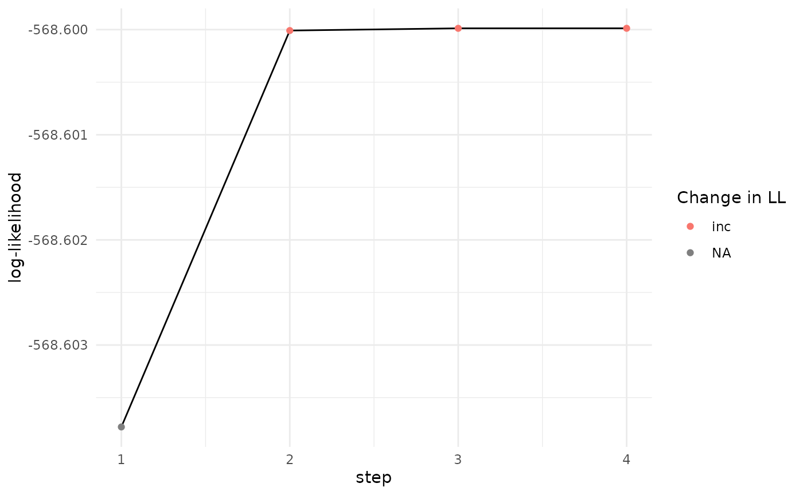
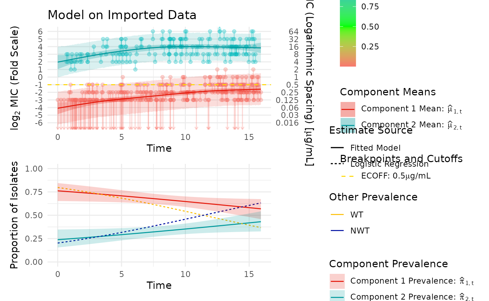

# Import and Fit Model

``` r

library(mic.sim)
library(survival)
library(patchwork)
library(magrittr)
library(dplyr)
#> 
#> Attaching package: 'dplyr'
#> The following objects are masked from 'package:stats':
#> 
#>     filter, lag
#> The following objects are masked from 'package:base':
#> 
#>     intersect, setdiff, setequal, union
```

``` r

set.seed(103)
mic_data = simulate_mics(`E[X|T,C]` = function(t, c) {
  case_when(c == "1" ~ -4 + (0.24 * t) - (0.0055 *
                                            t^2), c == "2" ~ 3 + 0.08 * t, TRUE ~ NaN)
}) %>% mutate(MIC = case_when(
  right_bound == Inf ~ paste0(">", 2^left_bound),
  left_bound == -Inf ~ paste0("<=", 2^right_bound),
  TRUE ~ paste0(2^right_bound)
)) %>% select(MIC, t)
```

``` r

imported_data = import_mics_with_metadata(data = mic_data, mic_column = "MIC", metadata_columns = "t")
head(imported_data)
#> # A tibble: 6 × 7
#>   obs_id left_bound right_bound mic_column     t low_con high_con
#>    <int>      <dbl>       <dbl> <chr>      <dbl>   <dbl>    <dbl>
#> 1      1         -3          -2 0.25        3.46      -3        6
#> 2      2       -Inf          -3 <=0.125     1.01      -3        6
#> 3      3          3           4 16          8.35      -3        6
#> 4      4         -2          -1 0.5         8.06      -3        6
#> 5      5         -3          -2 0.25        1.93      -3        6
#> 6      6       -Inf          -3 <=0.125     1.40      -3        6
```

``` r


model_fit = fit_EM(max_degree = 5, visible_data = imported_data, verbose = 0)
#> CV for degrees22; attempt1
#> CV for degrees33; attempt1
#> CV for degrees44; attempt1
#> CV for degrees55; attempt1
```

``` r

model_fit$cv_results
#> # A tibble: 4 × 4
#>   degree_1 degree_2 log_likelihood total_repeats
#>      <int>    <int>          <dbl>         <dbl>
#> 1        3        3          -573.             0
#> 2        2        2          -573.             0
#> 3        5        5          -595.             0
#> 4        4        4          -609.             0
```

``` r

plot_likelihood(model_fit$likelihood)
```



``` r

plot_fm(model_fit, title = "Model on Imported Data", add_log_reg = TRUE, ecoff = 0.5)
#> Scale for y is already present.
#> Adding another scale for y, which will replace the existing scale.
#> Scale for y is already present.
#> Adding another scale for y, which will replace the existing scale.
```


