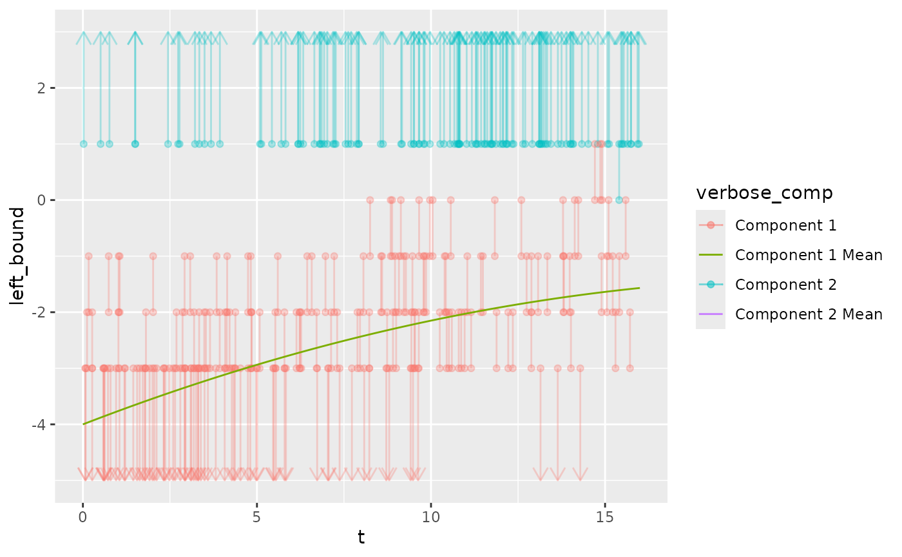
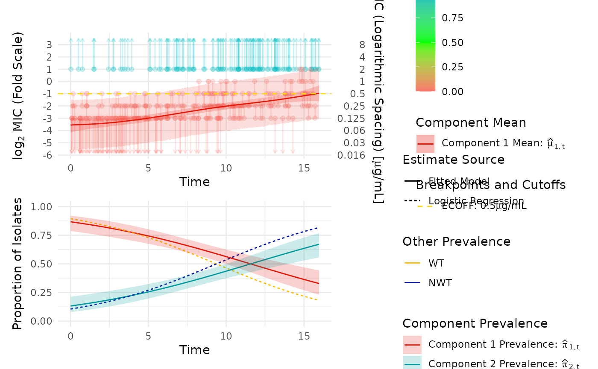
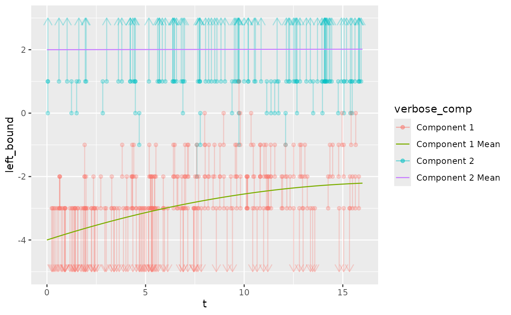
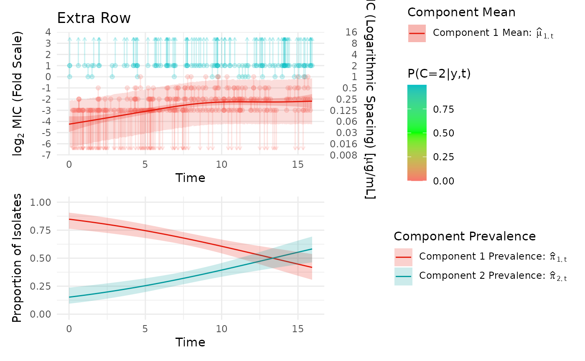
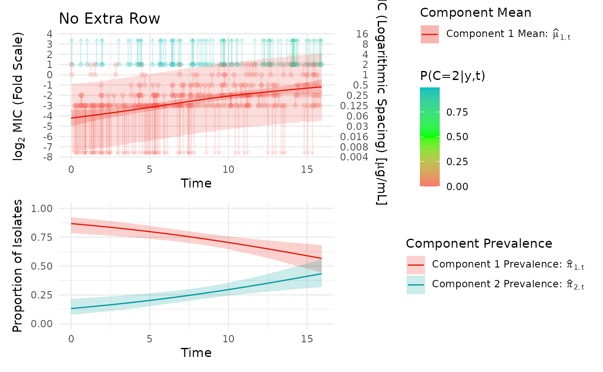

# Reduced Model

``` r

library(mgcv)
#> Loading required package: nlme
#> This is mgcv 1.9-4. For overview type '?mgcv'.
library(dplyr)
#> 
#> Attaching package: 'dplyr'
#> The following object is masked from 'package:nlme':
#> 
#>     collapse
#> The following objects are masked from 'package:stats':
#> 
#>     filter, lag
#> The following objects are masked from 'package:base':
#> 
#>     intersect, setdiff, setequal, union
library(ggplot2)
library(ggnewscale)
library(survival)
library(patchwork)
library(purrr)
library(data.table)
#> 
#> Attaching package: 'data.table'
#> The following object is masked from 'package:purrr':
#> 
#>     transpose
#> The following objects are masked from 'package:dplyr':
#> 
#>     between, first, last
#> The following object is masked from 'package:base':
#> 
#>     %notin%
library(ggnewscale)
library(mic.sim)
```

We simulate a data set with a heavily censored upper component.

``` r

set.seed(501)
n = 300
ncomp = 2
pi = function(t) {
  z <- 0.07 + 0.04 * t - 0.00045 * t^2
  tibble("1" = 1 - z, "2" = z)
}
`E[X|T,C]` = function(t, c)
{
  case_when(
    c == "1" ~ -4.0 + (0.24 * t) - (0.0055 * t^2),
    c == "2" ~ 3 + 0.001 * t,
    TRUE ~ NaN
  )
}
t_dist = function(n){runif(n, min = 0, max = 16)}
attr(t_dist, "min") = 0
attr(t_dist, "max") = 16
sd_vector = c("1" = 1, "2" = 1.05)
low_con = -3
high_con = 1
scale = "log"
example_data_reduced = simulate_mics(n = n, t_dist = t_dist, pi = pi, `E[X|T,C]` = `E[X|T,C]`, sd_vector = sd_vector, covariate_list = NULL, covariate_effect_vector = c(0), low_con = low_con, high_con = high_con, scale = "log") %>% suppressMessages()
```

The upper component barely includes any observations within the range of
tested concentrations. It will be difficult to estimate mu for the upper
component when we have very little information about the center of the
distribution or its width.

``` r

example_data_reduced %>% 
  mutate(verbose_comp = case_when(
    comp == 1 ~ "Component 1",
    TRUE ~ "Component 2"
  )) %>% 
  ggplot() +
  geom_segment(aes(x = t, xend = t, y = left_bound, yend = right_bound, color = verbose_comp), data = (. %>% filter(left_bound != -Inf & right_bound != Inf)), alpha = 0.3) +
  geom_segment(aes(x = t, xend = t, y = right_bound, yend = left_bound, color = verbose_comp), data = (. %>% filter(left_bound == -Inf) %>% mutate(left_bound = low_con - 2)), arrow = arrow(length = unit(0.03, "npc")), alpha = 0.3) +
  geom_segment(aes(x = t, xend = t, y = left_bound, yend = right_bound, color = verbose_comp), data = (. %>% filter(right_bound == Inf) %>% mutate(right_bound = high_con + 2)), arrow = arrow(length = unit(0.03, "npc")), alpha = 0.3) +
  geom_point(aes(x = t, y = left_bound, color = verbose_comp), data = . %>% filter(left_bound != -Inf), alpha = 0.3) +
  geom_point(aes(x = t, y = right_bound, color = verbose_comp), data = . %>% filter(right_bound != Inf), alpha = 0.3) +
  geom_function(fun = function(t){`E[X|T,C]`(t, c = "1")}, aes(color = "Component 1 Mean")) +
  geom_function(fun = function(t){`E[X|T,C]`(t, c = "2")}, aes(color = "Component 2 Mean")) +
  xlim(attr(t_dist, "min") ,attr(t_dist, "max")) +
  ylim(low_con - 2, high_con + 2) %>% suppressWarnings()
#> Warning in geom_function(fun = function(t) {: All aesthetics have length 1, but the data has 300 rows.
#> ℹ Please consider using `annotate()` or provide this layer with data containing
#>   a single row.
#> Warning in geom_function(fun = function(t) {: All aesthetics have length 1, but the data has 300 rows.
#> ℹ Please consider using `annotate()` or provide this layer with data containing
#>   a single row.
```

    #> Warning: Calling `case_when()` with size 1 LHS inputs and size >1 RHS inputs was
    #> deprecated in dplyr 1.2.0.
    #> ℹ This `case_when()` statement can result in subtle silent bugs and is very inefficient.
    #> 
    #>   Please use a series of if statements instead:
    #> 
    #>   ```
    #>   # Previously
    #>   case_when(scalar_lhs1 ~ rhs1, scalar_lhs2 ~ rhs2, .default = default)
    #> 
    #>   # Now
    #>   if (scalar_lhs1) {
    #>     rhs1
    #>   } else if (scalar_lhs2) {
    #>     rhs2
    #>   } else {
    #>     default
    #>   }
    #>   ```
    #> This warning is displayed once per session.
    #> Call `lifecycle::last_lifecycle_warnings()` to see where this warning was
    #> generated.

    #> Warning: Removed 100 rows containing missing values or values outside the scale range
    #> (`geom_function()`).
    #> `geom_function()`: Each group consists of only one observation.
    #> ℹ Do you need to adjust the group aesthetic?



We attempt to fit the full model to the heavily censored data set and by
looking at the cross validation results we find that none of the tested
degree sets are able to converge with any consistency, suggesting this
modeling approach is not appropriate for this data set.

``` r

out_full = fit_EM(
  max_degree = 3, visible_data = example_data_reduced, verbose = 1, max_it = 30, nfolds = 5
)
#> CV for degrees22; attempt1
#> fold 1
#> likelihood not found, moving to next repeat if available
#> CV for degrees22; attempt2
#> fold 1
#> likelihood not found, moving to next repeat if available
#> CV for degrees22; attempt3
#> fold 1
#> likelihood not found, moving to next repeat if available
#> CV for degrees22; attempt4
#> fold 1
#> likelihood not found, moving to next repeat if available
#> CV for degrees33; attempt1
#> fold 1
#> likelihood not found, moving to next repeat if available
#> CV for degrees33; attempt2
#> fold 1
#> likelihood not found, moving to next repeat if available
#> CV for degrees33; attempt3
#> fold 1
#> Warning in log(y[b2] - y[b1]): NaNs produced
#> likelihood not found, moving to next repeat if available
#> CV for degrees33; attempt4
#> fold 1
#> likelihood not found, moving to next repeat if available
```

``` r

out_full$cv_results
#> # A tibble: 2 × 4
#>   degree_1 degree_2 log_likelihood total_repeats
#>      <int>    <int>          <dbl>         <dbl>
#> 1        2        2            NaN            15
#> 2        3        3            NaN            15
```

To resolve this issue, we use the reduced model, which allows us to
specify a component to treat as “fixed”, which in this context means we
assume it lies entirely above the tested concentration range, so that
any observations within the tested range cannot belong to this
component. By making this assumption, we are able to fit the remaining
component and estimate the weights of the components over time.

Note that observations above or below the tested concentrations can
still be weighted as part of the remaining component that we are
estimating the mean and width of.

``` r

out_reduced = fit_EM(
  approach = "reduced", fixed_side = "RC", extra_row = FALSE, max_degree = 4, visible_data = example_data_reduced, verbose = 0, ecoff = 2
)
#> CV for degrees2; attempt1
#> CV for degrees3; attempt1
#> CV for degrees4; attempt1
out_reduced$cv_results
#> # A tibble: 3 × 3
#>   degree_1 log_likelihood total_repeats
#>      <int>          <dbl>         <dbl>
#> 1        3          -393.             0
#> 2        2          -400.             0
#> 3        4          -414.             0
```

``` r

plot_fm(out_reduced, ecoff = 0.5, add_log_reg = TRUE)
#> Scale for y is already present.
#> Adding another scale for y, which will replace the existing scale.
#> Scale for y is already present.
#> Adding another scale for y, which will replace the existing scale.
```



Next we simulate a data set similar to the last, except the upper
component has slightly more overlap with the range of tested
concentrations.

``` r

set.seed(502)
n = 300
ncomp = 2
pi = function(t) {
  z <- 0.07 + 0.04 * t - 0.00045 * t^2
  tibble("1" = 1 - z, "2" = z)
}
`E[X|T,C]` = function(t, c)
{
  case_when(
    c == "1" ~ -4.0 + (0.2 * t) - (0.0055 * t^2),
    c == "2" ~ 2 + 0.001 * t,
    TRUE ~ NaN
  )
}
t_dist = function(n){runif(n, min = 0, max = 16)}
attr(t_dist, "min") = 0
attr(t_dist, "max") = 16
sd_vector = c("1" = 1, "2" = 1.05)
low_con = -3
high_con = 1
scale = "log"
example_data_reduced_2 = simulate_mics(n = n, t_dist = t_dist, pi = pi, `E[X|T,C]` = `E[X|T,C]`, sd_vector = sd_vector, covariate_list = NULL, covariate_effect_vector = c(0), low_con = low_con, high_con = high_con, scale = "log") %>% suppressMessages()
```

``` r

example_data_reduced_2 %>% 
  mutate(verbose_comp = case_when(
    comp == 1 ~ "Component 1",
    TRUE ~ "Component 2"
  )) %>% 
  ggplot() +
  geom_segment(aes(x = t, xend = t, y = left_bound, yend = right_bound, color = verbose_comp), data = (. %>% filter(left_bound != -Inf & right_bound != Inf)), alpha = 0.3) +
  geom_segment(aes(x = t, xend = t, y = right_bound, yend = left_bound, color = verbose_comp), data = (. %>% filter(left_bound == -Inf) %>% mutate(left_bound = low_con - 2)), arrow = arrow(length = unit(0.03, "npc")), alpha = 0.3) +
  geom_segment(aes(x = t, xend = t, y = left_bound, yend = right_bound, color = verbose_comp), data = (. %>% filter(right_bound == Inf) %>% mutate(right_bound = high_con + 2)), arrow = arrow(length = unit(0.03, "npc")), alpha = 0.3) +
  geom_point(aes(x = t, y = left_bound, color = verbose_comp), data = . %>% filter(left_bound != -Inf), alpha = 0.3) +
  geom_point(aes(x = t, y = right_bound, color = verbose_comp), data = . %>% filter(right_bound != Inf), alpha = 0.3) +
  geom_function(fun = function(t){`E[X|T,C]`(t, c = "1")}, aes(color = "Component 1 Mean")) +
  geom_function(fun = function(t){`E[X|T,C]`(t, c = "2")}, aes(color = "Component 2 Mean")) +
  xlim(attr(t_dist, "min") ,attr(t_dist, "max")) +
  ylim(low_con - 2, high_con + 2) %>% suppressWarnings()
#> Warning in geom_function(fun = function(t) {: All aesthetics have length 1, but the data has 300 rows.
#> ℹ Please consider using `annotate()` or provide this layer with data containing
#>   a single row.
#> Warning in geom_function(fun = function(t) {: All aesthetics have length 1, but the data has 300 rows.
#> ℹ Please consider using `annotate()` or provide this layer with data containing
#>   a single row.
```



We can fit a reduced model this time, similar to the prior example,
except we can use the `extra_row = TRUE` option to slightly change the
assumption for the fixed side to be that the component lies entire above
the range of tested concentrations OR at the highest tested
concentration (in the plot, this looks like adding the top “row” of the
graph to the set of observations that can be at least partially weighted
as part of the fixed components). Note that extra_row = TRUE works
similarly when the lower component is the one assumed to be fixed, where
the set of observations that can be weighted as part of the fixed
component are those lower than the lowest tested concentration and those
between the lowest concentration and the second lowest.

``` r

out_reduced_ex = fit_EM(
  approach = "reduced", fixed_side = "RC", extra_row = TRUE, max_degree = 4, visible_data = example_data_reduced_2, verbose = 1
)
#> CV for degrees2; attempt1
#> fold 1
#> Stopped on combined LL and parameters
#> Stopped on combined LL and parameters
#> fold 2
#> Stopped on combined LL and parameters
#> Stopped on combined LL and parameters
#> fold 3
#> Stopped on combined LL and parameters
#> Stopped on combined LL and parameters
#> fold 4
#> Stopped on combined LL and parameters
#> Stopped on combined LL and parameters
#> fold 5
#> Stopped on combined LL and parameters
#> Stopped on combined LL and parameters
#> fold 6
#> Stopped on combined LL and parameters
#> Stopped on combined LL and parameters
#> fold 7
#> Stopped on combined LL and parameters
#> Stopped on combined LL and parameters
#> fold 8
#> Stopped on combined LL and parameters
#> Stopped on combined LL and parameters
#> fold 9
#> Stopped on combined LL and parameters
#> Stopped on combined LL and parameters
#> fold 10
#> Stopped on combined LL and parameters
#> Stopped on combined LL and parameters
#> CV for degrees3; attempt1
#> fold 1
#> Stopped on combined LL and parameters
#> Stopped on combined LL and parameters
#> fold 2
#> Stopped on combined LL and parameters
#> Stopped on combined LL and parameters
#> fold 3
#> Stopped on combined LL and parameters
#> Stopped on combined LL and parameters
#> fold 4
#> Stopped on combined LL and parameters
#> Stopped on combined LL and parameters
#> fold 5
#> Stopped on combined LL and parameters
#> Stopped on combined LL and parameters
#> fold 6
#> Stopped on combined LL and parameters
#> Stopped on combined LL and parameters
#> fold 7
#> Stopped on combined LL and parameters
#> Stopped on combined LL and parameters
#> fold 8
#> Stopped on combined LL and parameters
#> Stopped on combined LL and parameters
#> fold 9
#> Stopped on combined LL and parameters
#> Stopped on combined LL and parameters
#> fold 10
#> Stopped on combined LL and parameters
#> Stopped on combined LL and parameters
#> CV for degrees4; attempt1
#> fold 1
#> Stopped on combined LL and parameters
#> Stopped on combined LL and parameters
#> fold 2
#> Stopped on combined LL and parameters
#> Stopped on combined LL and parameters
#> fold 3
#> Stopped on combined LL and parameters
#> Stopped on combined LL and parameters
#> fold 4
#> Stopped on combined LL and parameters
#> Stopped on combined LL and parameters
#> fold 5
#> Stopped on combined LL and parameters
#> Stopped on combined LL and parameters
#> fold 6
#> Stopped on combined LL and parameters
#> Stopped on combined LL and parameters
#> fold 7
#> Stopped on combined LL and parameters
#> Stopped on combined LL and parameters
#> fold 8
#> Stopped on combined LL and parameters
#> Stopped on combined LL and parameters
#> fold 9
#> Stopped on combined LL and parameters
#> Stopped on combined LL and parameters
#> fold 10
#> Stopped on combined LL and parameters
#> Stopped on combined LL and parameters
#> Stopped on combined LL and parameters
#> Stopped on combined LL and parameters
```

``` r

plot_fm(out_reduced_ex, title = "Extra Row")
#> Scale for y is already present.
#> Adding another scale for y, which will replace the existing scale.
#> Scale for y is already present.
#> Adding another scale for y, which will replace the existing scale.
```



We can contrast this to the same model but fitted with extra_row =
FALSE.

``` r

out_reduced_no_ex = fit_EM(
  approach = "reduced", fixed_side = "RC", extra_row = FALSE, max_degree = 4, visible_data = example_data_reduced_2, verbose = 1
)
#> CV for degrees2; attempt1
#> fold 1
#> Stopped on combined LL and parameters
#> Stopped on combined LL and parameters
#> fold 2
#> Stopped on combined LL and parameters
#> Stopped on combined LL and parameters
#> fold 3
#> Stopped on combined LL and parameters
#> Stopped on combined LL and parameters
#> fold 4
#> Stopped on combined LL and parameters
#> Stopped on combined LL and parameters
#> fold 5
#> Stopped on combined LL and parameters
#> Stopped on combined LL and parameters
#> fold 6
#> Stopped on combined LL and parameters
#> Stopped on combined LL and parameters
#> fold 7
#> Stopped on combined LL and parameters
#> Stopped on combined LL and parameters
#> fold 8
#> Stopped on combined LL and parameters
#> Stopped on combined LL and parameters
#> fold 9
#> Stopped on combined LL and parameters
#> Stopped on combined LL and parameters
#> fold 10
#> Stopped on combined LL and parameters
#> Stopped on combined LL and parameters
#> CV for degrees3; attempt1
#> fold 1
#> Stopped on combined LL and parameters
#> Stopped on combined LL and parameters
#> fold 2
#> Stopped on combined LL and parameters
#> Stopped on combined LL and parameters
#> fold 3
#> Stopped on combined LL and parameters
#> Stopped on combined LL and parameters
#> fold 4
#> Stopped on combined LL and parameters
#> Stopped on combined LL and parameters
#> fold 5
#> Stopped on combined LL and parameters
#> Stopped on combined LL and parameters
#> fold 6
#> Stopped on combined LL and parameters
#> Stopped on combined LL and parameters
#> fold 7
#> Stopped on combined LL and parameters
#> Stopped on combined LL and parameters
#> fold 8
#> Stopped on combined LL and parameters
#> Stopped on combined LL and parameters
#> fold 9
#> Stopped on combined LL and parameters
#> Stopped on combined LL and parameters
#> fold 10
#> Stopped on combined LL and parameters
#> Stopped on combined LL and parameters
#> CV for degrees4; attempt1
#> fold 1
#> Stopped on combined LL and parameters
#> Stopped on combined LL and parameters
#> fold 2
#> Stopped on combined LL and parameters
#> Stopped on combined LL and parameters
#> fold 3
#> Stopped on combined LL and parameters
#> Stopped on combined LL and parameters
#> fold 4
#> Stopped on combined LL and parameters
#> Stopped on combined LL and parameters
#> fold 5
#> Stopped on combined LL and parameters
#> Stopped on combined LL and parameters
#> fold 6
#> Stopped on combined LL and parameters
#> Stopped on combined LL and parameters
#> fold 7
#> Stopped on combined LL and parameters
#> Stopped on combined LL and parameters
#> fold 8
#> Stopped on combined LL and parameters
#> Stopped on combined LL and parameters
#> fold 9
#> Stopped on combined LL and parameters
#> Stopped on combined LL and parameters
#> fold 10
#> Stopped on combined LL and parameters
#> Stopped on combined LL and parameters
#> Stopped on combined LL and parameters
#> Stopped on combined LL and parameters
```

``` r

plot_fm(out_reduced_no_ex, title = "No Extra Row")
#> Scale for y is already present.
#> Adding another scale for y, which will replace the existing scale.
#> Scale for y is already present.
#> Adding another scale for y, which will replace the existing scale.
```


